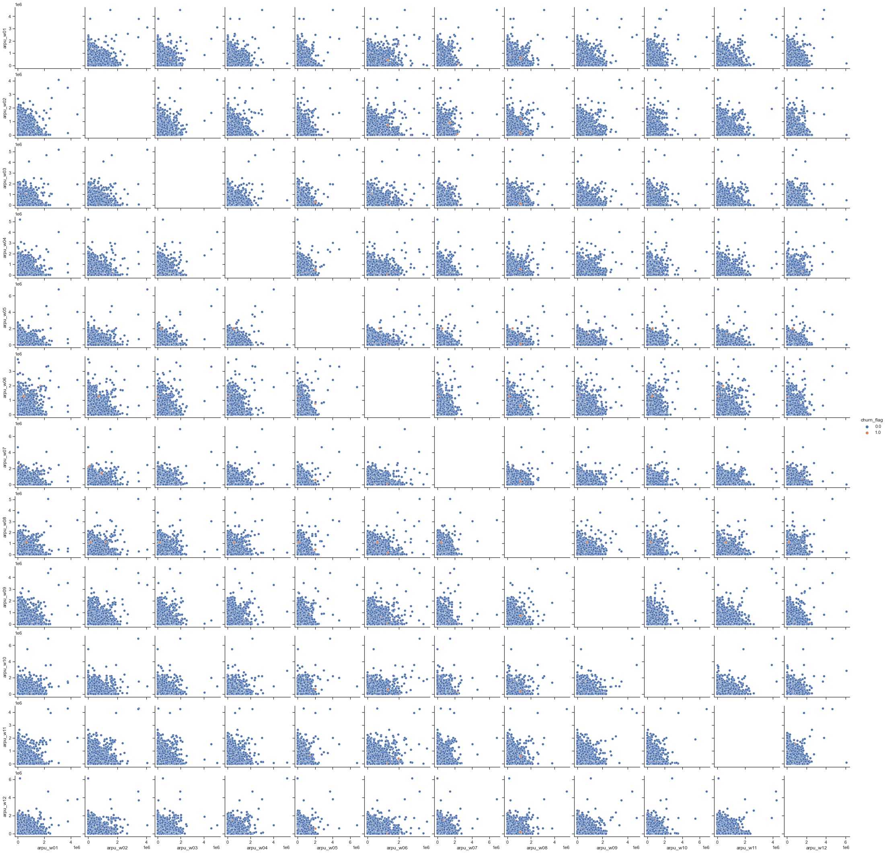

```python
# Load libraries
import numpy as np
import pandas as pd

import datetime as dt

import matplotlib.pyplot as plt
from matplotlib.gridspec import GridSpec
import seaborn as sns
sns.set(style="ticks")
%matplotlib inline

from scipy.stats import norm
from scipy import stats

import sklearn
from sklearn import metrics
from sklearn.metrics import classification_report
from sklearn.metrics import confusion_matrix
from sklearn.metrics import roc_curve, auc

pd.set_option('display.max_rows', None)
pd.set_option('display.max_columns', None)

import warnings
warnings.filterwarnings("ignore")
pd.set_option('display.max_colwidth', -1)
```


```python
data=pd.read_csv("Prepaid.csv")
#data
```


```python
telecom = data
telecom.head()
```


<div>
<style scoped>
    .dataframe tbody tr th:only-of-type {
        vertical-align: middle;
    }

    .dataframe tbody tr th {
        vertical-align: top;
    }

    .dataframe thead th {
        text-align: right;
    }
</style>
<table border="1" class="dataframe">
  <thead>
    <tr style="text-align: right;">
      <th></th>
      <th>accs_mthd_id</th>
      <th>sbrp_typ_id</th>
      <th>is_churn</th>
      <th>rgtrn_provnc_id_w01</th>
      <th>arpu_w01</th>
      <th>onnet_actl_dur_w01</th>
      <th>onnet_cl_cnt_w01</th>
      <th>offnet_actl_dur_w01</th>
      <th>offnet_cl_cnt_w01</th>
      <th>fix_line_voi_dur_w01</th>
      <th>mo_cl_actl_dur_w01</th>
      <th>mo_cl_cnt_w01</th>
      <th>intl_actl_dur_w01</th>
      <th>intl_cl_cnt_w01</th>
      <th>intrconnect_voi_dur_w01</th>
      <th>intrconnect_smscnt_w01</th>
      <th>intrconnect_cl_cnt_w01</th>
      <th>rfl_cnt_w01</th>
      <th>rfl_amt_w01</th>
      <th>data_pkg_actvn_cnt_w01</th>
      <th>data_pkg_rev_w01</th>
      <th>data_usg_cnt_w01</th>
      <th>intl_data_rev_w01</th>
      <th>pkg_data_usg_vol_w01</th>
      <th>data_usg2gvol_w01</th>
      <th>data_usg3g_vol_w01</th>
      <th>data_usg4g_vol_w01</th>
      <th>data_payg_rev_w01</th>
      <th>lcl_actl_dur_w01</th>
      <th>lcl_cl_cnt_w01</th>
      <th>lcl_data_rev_w01</th>
      <th>num_cl_week_dy_w01</th>
      <th>num_cl_week_end_w01</th>
      <th>num_fwd_cl_w01</th>
      <th>cl_fwd_dur_w01</th>
      <th>num_free_data_usg_evt_w01</th>
      <th>num_free_cl_w01</th>
      <th>mo_sms_cnt_w01</th>
      <th>age_on_net_weeks_w01</th>
      <th>daytim_dur_w01</th>
      <th>daytim_cnt_w01</th>
      <th>evenibg_dur_w01</th>
      <th>evening_cnt_w01</th>
      <th>night_dur_w01</th>
      <th>night_cnt_w01</th>
      <th>call_center_cnt_w01</th>
      <th>spl_cl_cnt_w01</th>
      <th>roma_voice_mo_w01</th>
      <th>roma_voice_mt_w01</th>
      <th>night_data_usg_w01</th>
      <th>rgtrn_provnc_id_w02</th>
      <th>arpu_w02</th>
      <th>onnet_actl_dur_w02</th>
      <th>onnet_cl_cnt_w02</th>
      <th>offnet_actl_dur_w02</th>
      <th>offnet_cl_cnt_w02</th>
      <th>fix_line_voi_dur_w02</th>
      <th>mo_cl_actl_dur_w02</th>
      <th>mo_cl_cnt_w02</th>
      <th>intl_actl_dur_w02</th>
      <th>intl_cl_cnt_w02</th>
      <th>intrconnect_voi_dur_w02</th>
      <th>intrconnect_smscnt_w02</th>
      <th>intrconnect_cl_cnt_w02</th>
      <th>rfl_cnt_w02</th>
      <th>rfl_amt_w02</th>
      <th>data_pkg_actvn_cnt_w02</th>
      <th>data_pkg_rev_w02</th>
      <th>data_usg_cnt_w02</th>
      <th>intl_data_rev_w02</th>
      <th>pkg_data_usg_vol_w02</th>
      <th>data_usg2gvol_w02</th>
      <th>data_usg3g_vol_w02</th>
      <th>data_usg4g_vol_w02</th>
      <th>data_payg_rev_w02</th>
      <th>lcl_actl_dur_w02</th>
      <th>lcl_cl_cnt_w02</th>
      <th>lcl_data_rev_w02</th>
      <th>num_cl_week_dy_w02</th>
      <th>num_cl_week_end_w02</th>
      <th>num_fwd_cl_w02</th>
      <th>cl_fwd_dur_w02</th>
      <th>num_free_data_usg_evt_w02</th>
      <th>num_free_cl_w02</th>
      <th>mo_sms_cnt_w02</th>
      <th>age_on_net_weeks_w02</th>
      <th>daytim_dur_w02</th>
      <th>daytim_cnt_w02</th>
      <th>evenibg_dur_w02</th>
      <th>evening_cnt_w02</th>
      <th>night_dur_w02</th>
      <th>night_cnt_w02</th>
      <th>call_center_cnt_w02</th>
      <th>spl_cl_cnt_w02</th>
      <th>roma_voice_mo_w02</th>
      <th>roma_voice_mt_w02</th>
      <th>night_data_usg_w02</th>
      <th>rgtrn_provnc_id_w03</th>
      <th>arpu_w03</th>
      <th>onnet_actl_dur_w03</th>
      <th>onnet_cl_cnt_w03</th>
      <th>offnet_actl_dur_w03</th>
      <th>offnet_cl_cnt_w03</th>
      <th>fix_line_voi_dur_w03</th>
      <th>mo_cl_actl_dur_w03</th>
      <th>mo_cl_cnt_w03</th>
      <th>intl_actl_dur_w03</th>
      <th>intl_cl_cnt_w03</th>
      <th>intrconnect_voi_dur_w03</th>
      <th>intrconnect_smscnt_w03</th>
      <th>intrconnect_cl_cnt_w03</th>
      <th>rfl_cnt_w03</th>
      <th>rfl_amt_w03</th>
      <th>data_pkg_actvn_cnt_w03</th>
      <th>data_pkg_rev_w03</th>
      <th>data_usg_cnt_w03</th>
      <th>intl_data_rev_w03</th>
      <th>pkg_data_usg_vol_w03</th>
      <th>data_usg2gvol_w03</th>
      <th>data_usg3g_vol_w03</th>
      <th>data_usg4g_vol_w03</th>
      <th>data_payg_rev_w03</th>
      <th>lcl_actl_dur_w03</th>
      <th>lcl_cl_cnt_w03</th>
      <th>lcl_data_rev_w03</th>
      <th>num_cl_week_dy_w03</th>
      <th>num_cl_week_end_w03</th>
      <th>num_fwd_cl_w03</th>
      <th>cl_fwd_dur_w03</th>
      <th>num_free_data_usg_evt_w03</th>
      <th>num_free_cl_w03</th>
      <th>mo_sms_cnt_w03</th>
      <th>age_on_net_weeks_w03</th>
      <th>daytim_dur_w03</th>
      <th>daytim_cnt_w03</th>
      <th>evenibg_dur_w03</th>
      <th>evening_cnt_w03</th>
      <th>night_dur_w03</th>
      <th>night_cnt_w03</th>
      <th>call_center_cnt_w03</th>
      <th>spl_cl_cnt_w03</th>
      <th>roma_voice_mo_w03</th>
      <th>roma_voice_mt_w03</th>
      <th>night_data_usg_w03</th>
      <th>rgtrn_provnc_id_w04</th>
      <th>arpu_w04</th>
      <th>onnet_actl_dur_w04</th>
      <th>onnet_cl_cnt_w04</th>
      <th>offnet_actl_dur_w04</th>
      <th>offnet_cl_cnt_w04</th>
      <th>fix_line_voi_dur_w04</th>
      <th>mo_cl_actl_dur_w04</th>
      <th>mo_cl_cnt_w04</th>
      <th>intl_actl_dur_w04</th>
      <th>intl_cl_cnt_w04</th>
      <th>intrconnect_voi_dur_w04</th>
      <th>intrconnect_smscnt_w04</th>
      <th>intrconnect_cl_cnt_w04</th>
      <th>rfl_cnt_w04</th>
      <th>rfl_amt_w04</th>
      <th>data_pkg_actvn_cnt_w04</th>
      <th>data_pkg_rev_w04</th>
      <th>data_usg_cnt_w04</th>
      <th>intl_data_rev_w04</th>
      <th>pkg_data_usg_vol_w04</th>
      <th>data_usg2gvol_w04</th>
      <th>data_usg3g_vol_w04</th>
      <th>data_usg4g_vol_w04</th>
      <th>data_payg_rev_w04</th>
      <th>lcl_actl_dur_w04</th>
      <th>lcl_cl_cnt_w04</th>
      <th>lcl_data_rev_w04</th>
      <th>num_cl_week_dy_w04</th>
      <th>num_cl_week_end_w04</th>
      <th>num_fwd_cl_w04</th>
      <th>cl_fwd_dur_w04</th>
      <th>num_free_data_usg_evt_w04</th>
      <th>num_free_cl_w04</th>
      <th>mo_sms_cnt_w04</th>
      <th>age_on_net_weeks_w04</th>
      <th>daytim_dur_w04</th>
      <th>daytim_cnt_w04</th>
      <th>evenibg_dur_w04</th>
      <th>evening_cnt_w04</th>
      <th>night_dur_w04</th>
      <th>night_cnt_w04</th>
      <th>call_center_cnt_w04</th>
      <th>spl_cl_cnt_w04</th>
      <th>roma_voice_mo_w04</th>
      <th>roma_voice_mt_w04</th>
      <th>night_data_usg_w04</th>
      <th>rgtrn_provnc_id_w05</th>
      <th>arpu_w05</th>
      <th>onnet_actl_dur_w05</th>
      <th>onnet_cl_cnt_w05</th>
      <th>offnet_actl_dur_w05</th>
      <th>offnet_cl_cnt_w05</th>
      <th>fix_line_voi_dur_w05</th>
      <th>mo_cl_actl_dur_w05</th>
      <th>mo_cl_cnt_w05</th>
      <th>intl_actl_dur_w05</th>
      <th>intl_cl_cnt_w05</th>
      <th>intrconnect_voi_dur_w05</th>
      <th>intrconnect_smscnt_w05</th>
      <th>intrconnect_cl_cnt_w05</th>
      <th>rfl_cnt_w05</th>
      <th>rfl_amt_w05</th>
      <th>data_pkg_actvn_cnt_w05</th>
      <th>data_pkg_rev_w05</th>
      <th>data_usg_cnt_w05</th>
      <th>intl_data_rev_w05</th>
      <th>pkg_data_usg_vol_w05</th>
      <th>data_usg2gvol_w05</th>
      <th>data_usg3g_vol_w05</th>
      <th>data_usg4g_vol_w05</th>
      <th>data_payg_rev_w05</th>
      <th>lcl_actl_dur_w05</th>
      <th>lcl_cl_cnt_w05</th>
      <th>lcl_data_rev_w05</th>
      <th>num_cl_week_dy_w05</th>
      <th>num_cl_week_end_w05</th>
      <th>num_fwd_cl_w05</th>
      <th>cl_fwd_dur_w05</th>
      <th>num_free_data_usg_evt_w05</th>
      <th>num_free_cl_w05</th>
      <th>mo_sms_cnt_w05</th>
      <th>age_on_net_weeks_w05</th>
      <th>daytim_dur_w05</th>
      <th>daytim_cnt_w05</th>
      <th>evenibg_dur_w05</th>
      <th>evening_cnt_w05</th>
      <th>night_dur_w05</th>
      <th>night_cnt_w05</th>
      <th>call_center_cnt_w05</th>
      <th>spl_cl_cnt_w05</th>
      <th>roma_voice_mo_w05</th>
      <th>roma_voice_mt_w05</th>
      <th>night_data_usg_w05</th>
      <th>rgtrn_provnc_id_w06</th>
      <th>arpu_w06</th>
      <th>onnet_actl_dur_w06</th>
      <th>onnet_cl_cnt_w06</th>
      <th>offnet_actl_dur_w06</th>
      <th>offnet_cl_cnt_w06</th>
      <th>fix_line_voi_dur_w06</th>
      <th>mo_cl_actl_dur_w06</th>
      <th>mo_cl_cnt_w06</th>
      <th>intl_actl_dur_w06</th>
      <th>intl_cl_cnt_w06</th>
      <th>intrconnect_voi_dur_w06</th>
      <th>intrconnect_smscnt_w06</th>
      <th>intrconnect_cl_cnt_w06</th>
      <th>rfl_cnt_w06</th>
      <th>rfl_amt_w06</th>
      <th>data_pkg_actvn_cnt_w06</th>
      <th>data_pkg_rev_w06</th>
      <th>data_usg_cnt_w06</th>
      <th>intl_data_rev_w06</th>
      <th>pkg_data_usg_vol_w06</th>
      <th>data_usg2gvol_w06</th>
      <th>data_usg3g_vol_w06</th>
      <th>data_usg4g_vol_w06</th>
      <th>data_payg_rev_w06</th>
      <th>lcl_actl_dur_w06</th>
      <th>lcl_cl_cnt_w06</th>
      <th>lcl_data_rev_w06</th>
      <th>num_cl_week_dy_w06</th>
      <th>num_cl_week_end_w06</th>
      <th>num_fwd_cl_w06</th>
      <th>cl_fwd_dur_w06</th>
      <th>num_free_data_usg_evt_w06</th>
      <th>num_free_cl_w06</th>
      <th>mo_sms_cnt_w06</th>
      <th>age_on_net_weeks_w06</th>
      <th>daytim_dur_w06</th>
      <th>daytim_cnt_w06</th>
      <th>evenibg_dur_w06</th>
      <th>evening_cnt_w06</th>
      <th>night_dur_w06</th>
      <th>night_cnt_w06</th>
      <th>call_center_cnt_w06</th>
      <th>spl_cl_cnt_w06</th>
      <th>roma_voice_mo_w06</th>
      <th>roma_voice_mt_w06</th>
      <th>night_data_usg_w06</th>
      <th>rgtrn_provnc_id_w07</th>
      <th>arpu_w07</th>
      <th>onnet_actl_dur_w07</th>
      <th>onnet_cl_cnt_w07</th>
      <th>offnet_actl_dur_w07</th>
      <th>offnet_cl_cnt_w07</th>
      <th>fix_line_voi_dur_w07</th>
      <th>mo_cl_actl_dur_w07</th>
      <th>mo_cl_cnt_w07</th>
      <th>intl_actl_dur_w07</th>
      <th>intl_cl_cnt_w07</th>
      <th>intrconnect_voi_dur_w07</th>
      <th>intrconnect_smscnt_w07</th>
      <th>intrconnect_cl_cnt_w07</th>
      <th>rfl_cnt_w07</th>
      <th>rfl_amt_w07</th>
      <th>data_pkg_actvn_cnt_w07</th>
      <th>data_pkg_rev_w07</th>
      <th>data_usg_cnt_w07</th>
      <th>intl_data_rev_w07</th>
      <th>pkg_data_usg_vol_w07</th>
      <th>data_usg2gvol_w07</th>
      <th>data_usg3g_vol_w07</th>
      <th>data_usg4g_vol_w07</th>
      <th>data_payg_rev_w07</th>
      <th>lcl_actl_dur_w07</th>
      <th>lcl_cl_cnt_w07</th>
      <th>lcl_data_rev_w07</th>
      <th>num_cl_week_dy_w07</th>
      <th>num_cl_week_end_w07</th>
      <th>num_fwd_cl_w07</th>
      <th>cl_fwd_dur_w07</th>
      <th>num_free_data_usg_evt_w07</th>
      <th>num_free_cl_w07</th>
      <th>mo_sms_cnt_w07</th>
      <th>age_on_net_weeks_w07</th>
      <th>daytim_dur_w07</th>
      <th>daytim_cnt_w07</th>
      <th>evenibg_dur_w07</th>
      <th>evening_cnt_w07</th>
      <th>night_dur_w07</th>
      <th>night_cnt_w07</th>
      <th>call_center_cnt_w07</th>
      <th>spl_cl_cnt_w07</th>
      <th>roma_voice_mo_w07</th>
      <th>roma_voice_mt_w07</th>
      <th>night_data_usg_w07</th>
      <th>rgtrn_provnc_id_w08</th>
      <th>arpu_w08</th>
      <th>onnet_actl_dur_w08</th>
      <th>onnet_cl_cnt_w08</th>
      <th>offnet_actl_dur_w08</th>
      <th>offnet_cl_cnt_w08</th>
      <th>fix_line_voi_dur_w08</th>
      <th>mo_cl_actl_dur_w08</th>
      <th>mo_cl_cnt_w08</th>
      <th>intl_actl_dur_w08</th>
      <th>intl_cl_cnt_w08</th>
      <th>intrconnect_voi_dur_w08</th>
      <th>intrconnect_smscnt_w08</th>
      <th>intrconnect_cl_cnt_w08</th>
      <th>rfl_cnt_w08</th>
      <th>rfl_amt_w08</th>
      <th>data_pkg_actvn_cnt_w08</th>
      <th>data_pkg_rev_w08</th>
      <th>data_usg_cnt_w08</th>
      <th>intl_data_rev_w08</th>
      <th>pkg_data_usg_vol_w08</th>
      <th>data_usg2gvol_w08</th>
      <th>data_usg3g_vol_w08</th>
      <th>data_usg4g_vol_w08</th>
      <th>data_payg_rev_w08</th>
      <th>lcl_actl_dur_w08</th>
      <th>lcl_cl_cnt_w08</th>
      <th>lcl_data_rev_w08</th>
      <th>num_cl_week_dy_w08</th>
      <th>num_cl_week_end_w08</th>
      <th>num_fwd_cl_w08</th>
      <th>cl_fwd_dur_w08</th>
      <th>num_free_data_usg_evt_w08</th>
      <th>num_free_cl_w08</th>
      <th>mo_sms_cnt_w08</th>
      <th>age_on_net_weeks_w08</th>
      <th>daytim_dur_w08</th>
      <th>daytim_cnt_w08</th>
      <th>evenibg_dur_w08</th>
      <th>evening_cnt_w08</th>
      <th>night_dur_w08</th>
      <th>night_cnt_w08</th>
      <th>call_center_cnt_w08</th>
      <th>spl_cl_cnt_w08</th>
      <th>roma_voice_mo_w08</th>
      <th>roma_voice_mt_w08</th>
      <th>night_data_usg_w08</th>
      <th>rgtrn_provnc_id_w09</th>
      <th>arpu_w09</th>
      <th>onnet_actl_dur_w09</th>
      <th>onnet_cl_cnt_w09</th>
      <th>offnet_actl_dur_w09</th>
      <th>offnet_cl_cnt_w09</th>
      <th>fix_line_voi_dur_w09</th>
      <th>mo_cl_actl_dur_w09</th>
      <th>mo_cl_cnt_w09</th>
      <th>intl_actl_dur_w09</th>
      <th>intl_cl_cnt_w09</th>
      <th>intrconnect_voi_dur_w09</th>
      <th>intrconnect_smscnt_w09</th>
      <th>intrconnect_cl_cnt_w09</th>
      <th>rfl_cnt_w09</th>
      <th>rfl_amt_w09</th>
      <th>data_pkg_actvn_cnt_w09</th>
      <th>data_pkg_rev_w09</th>
      <th>data_usg_cnt_w09</th>
      <th>intl_data_rev_w09</th>
      <th>pkg_data_usg_vol_w09</th>
      <th>data_usg2gvol_w09</th>
      <th>data_usg3g_vol_w09</th>
      <th>data_usg4g_vol_w09</th>
      <th>data_payg_rev_w09</th>
      <th>lcl_actl_dur_w09</th>
      <th>lcl_cl_cnt_w09</th>
      <th>lcl_data_rev_w09</th>
      <th>num_cl_week_dy_w09</th>
      <th>num_cl_week_end_w09</th>
      <th>num_fwd_cl_w09</th>
      <th>cl_fwd_dur_w09</th>
      <th>num_free_data_usg_evt_w09</th>
      <th>num_free_cl_w09</th>
      <th>mo_sms_cnt_w09</th>
      <th>age_on_net_weeks_w09</th>
      <th>daytim_dur_w09</th>
      <th>daytim_cnt_w09</th>
      <th>evenibg_dur_w09</th>
      <th>evening_cnt_w09</th>
      <th>night_dur_w09</th>
      <th>night_cnt_w09</th>
      <th>call_center_cnt_w09</th>
      <th>spl_cl_cnt_w09</th>
      <th>roma_voice_mo_w09</th>
      <th>roma_voice_mt_w09</th>
      <th>night_data_usg_w09</th>
      <th>rgtrn_provnc_id_w10</th>
      <th>arpu_w10</th>
      <th>onnet_actl_dur_w10</th>
      <th>onnet_cl_cnt_w10</th>
      <th>offnet_actl_dur_w10</th>
      <th>offnet_cl_cnt_w10</th>
      <th>fix_line_voi_dur_w10</th>
      <th>mo_cl_actl_dur_w10</th>
      <th>mo_cl_cnt_w10</th>
      <th>intl_actl_dur_w10</th>
      <th>intl_cl_cnt_w10</th>
      <th>intrconnect_voi_dur_w10</th>
      <th>intrconnect_smscnt_w10</th>
      <th>intrconnect_cl_cnt_w10</th>
      <th>rfl_cnt_w10</th>
      <th>rfl_amt_w10</th>
      <th>data_pkg_actvn_cnt_w10</th>
      <th>data_pkg_rev_w10</th>
      <th>data_usg_cnt_w10</th>
      <th>intl_data_rev_w10</th>
      <th>pkg_data_usg_vol_w10</th>
      <th>data_usg2gvol_w10</th>
      <th>data_usg3g_vol_w10</th>
      <th>data_usg4g_vol_w10</th>
      <th>data_payg_rev_w10</th>
      <th>lcl_actl_dur_w10</th>
      <th>lcl_cl_cnt_w10</th>
      <th>lcl_data_rev_w10</th>
      <th>num_cl_week_dy_w10</th>
      <th>num_cl_week_end_w10</th>
      <th>num_fwd_cl_w10</th>
      <th>cl_fwd_dur_w10</th>
      <th>num_free_data_usg_evt_w10</th>
      <th>num_free_cl_w10</th>
      <th>mo_sms_cnt_w10</th>
      <th>age_on_net_weeks_w10</th>
      <th>daytim_dur_w10</th>
      <th>daytim_cnt_w10</th>
      <th>evenibg_dur_w10</th>
      <th>evening_cnt_w10</th>
      <th>night_dur_w10</th>
      <th>night_cnt_w10</th>
      <th>call_center_cnt_w10</th>
      <th>spl_cl_cnt_w10</th>
      <th>roma_voice_mo_w10</th>
      <th>roma_voice_mt_w10</th>
      <th>night_data_usg_w10</th>
      <th>rgtrn_provnc_id_w11</th>
      <th>arpu_w11</th>
      <th>onnet_actl_dur_w11</th>
      <th>onnet_cl_cnt_w11</th>
      <th>offnet_actl_dur_w11</th>
      <th>offnet_cl_cnt_w11</th>
      <th>fix_line_voi_dur_w11</th>
      <th>mo_cl_actl_dur_w11</th>
      <th>mo_cl_cnt_w11</th>
      <th>intl_actl_dur_w11</th>
      <th>intl_cl_cnt_w11</th>
      <th>intrconnect_voi_dur_w11</th>
      <th>intrconnect_smscnt_w11</th>
      <th>intrconnect_cl_cnt_w11</th>
      <th>rfl_cnt_w11</th>
      <th>rfl_amt_w11</th>
      <th>data_pkg_actvn_cnt_w11</th>
      <th>data_pkg_rev_w11</th>
      <th>data_usg_cnt_w11</th>
      <th>intl_data_rev_w11</th>
      <th>pkg_data_usg_vol_w11</th>
      <th>data_usg2gvol_w11</th>
      <th>data_usg3g_vol_w11</th>
      <th>data_usg4g_vol_w11</th>
      <th>data_payg_rev_w11</th>
      <th>lcl_actl_dur_w11</th>
      <th>lcl_cl_cnt_w11</th>
      <th>lcl_data_rev_w11</th>
      <th>num_cl_week_dy_w11</th>
      <th>num_cl_week_end_w11</th>
      <th>num_fwd_cl_w11</th>
      <th>cl_fwd_dur_w11</th>
      <th>num_free_data_usg_evt_w11</th>
      <th>num_free_cl_w11</th>
      <th>mo_sms_cnt_w11</th>
      <th>age_on_net_weeks_w11</th>
      <th>daytim_dur_w11</th>
      <th>daytim_cnt_w11</th>
      <th>evenibg_dur_w11</th>
      <th>evening_cnt_w11</th>
      <th>night_dur_w11</th>
      <th>night_cnt_w11</th>
      <th>call_center_cnt_w11</th>
      <th>spl_cl_cnt_w11</th>
      <th>roma_voice_mo_w11</th>
      <th>roma_voice_mt_w11</th>
      <th>night_data_usg_w11</th>
      <th>rgtrn_provnc_id_w12</th>
      <th>arpu_w12</th>
      <th>onnet_actl_dur_w12</th>
      <th>onnet_cl_cnt_w12</th>
      <th>offnet_actl_dur_w12</th>
      <th>offnet_cl_cnt_w12</th>
      <th>fix_line_voi_dur_w12</th>
      <th>mo_cl_actl_dur_w12</th>
      <th>mo_cl_cnt_w12</th>
      <th>intl_actl_dur_w12</th>
      <th>intl_cl_cnt_w12</th>
      <th>intrconnect_voi_dur_w12</th>
      <th>intrconnect_smscnt_w12</th>
      <th>intrconnect_cl_cnt_w12</th>
      <th>rfl_cnt_w12</th>
      <th>rfl_amt_w12</th>
      <th>data_pkg_actvn_cnt_w12</th>
      <th>data_pkg_rev_w12</th>
      <th>data_usg_cnt_w12</th>
      <th>intl_data_rev_w12</th>
      <th>pkg_data_usg_vol_w12</th>
      <th>data_usg2gvol_w12</th>
      <th>data_usg3g_vol_w12</th>
      <th>data_usg4g_vol_w12</th>
      <th>data_payg_rev_w12</th>
      <th>lcl_actl_dur_w12</th>
      <th>lcl_cl_cnt_w12</th>
      <th>lcl_data_rev_w12</th>
      <th>num_cl_week_dy_w12</th>
      <th>num_cl_week_end_w12</th>
      <th>num_fwd_cl_w12</th>
      <th>cl_fwd_dur_w12</th>
      <th>num_free_data_usg_evt_w12</th>
      <th>num_free_cl_w12</th>
      <th>mo_sms_cnt_w12</th>
      <th>age_on_net_weeks_w12</th>
      <th>daytim_dur_w12</th>
      <th>daytim_cnt_w12</th>
      <th>evenibg_dur_w12</th>
      <th>evening_cnt_w12</th>
      <th>night_dur_w12</th>
      <th>night_cnt_w12</th>
      <th>call_center_cnt_w12</th>
      <th>spl_cl_cnt_w12</th>
      <th>roma_voice_mo_w12</th>
      <th>roma_voice_mt_w12</th>
      <th>night_data_usg_w12</th>
      <th>voice_intrnl_oprtr_mt_flg_w01</th>
      <th>voice_fix_to_mci_mt_flg_w01</th>
      <th>sms_intrnl_mt_flg_w01</th>
      <th>voice_intrnl_oprtr_mt_flg_w02</th>
      <th>voice_fix_to_mci_mt_flg_w02</th>
      <th>sms_intrnl_mt_flg_w02</th>
      <th>voice_intrnl_oprtr_mt_flg_w03</th>
      <th>voice_fix_to_mci_mt_flg_w03</th>
      <th>sms_intrnl_mt_flg_w03</th>
      <th>voice_intrnl_oprtr_mt_flg_w04</th>
      <th>voice_fix_to_mci_mt_flg_w04</th>
      <th>sms_intrnl_mt_flg_w04</th>
      <th>voice_intrnl_oprtr_mt_flg_w05</th>
      <th>voice_fix_to_mci_mt_flg_w05</th>
      <th>sms_intrnl_mt_flg_w05</th>
      <th>voice_intrnl_oprtr_mt_flg_w06</th>
      <th>voice_fix_to_mci_mt_flg_w06</th>
      <th>sms_intrnl_mt_flg_w06</th>
      <th>voice_intrnl_oprtr_mt_flg_w07</th>
      <th>voice_fix_to_mci_mt_flg_w07</th>
      <th>sms_intrnl_mt_flg_w07</th>
      <th>voice_intrnl_oprtr_mt_flg_w08</th>
      <th>voice_fix_to_mci_mt_flg_w08</th>
      <th>sms_intrnl_mt_flg_w08</th>
      <th>voice_intrnl_oprtr_mt_flg_w09</th>
      <th>voice_fix_to_mci_mt_flg_w09</th>
      <th>sms_intrnl_mt_flg_w09</th>
      <th>voice_intrnl_oprtr_mt_flg_w10</th>
      <th>voice_fix_to_mci_mt_flg_w10</th>
      <th>sms_intrnl_mt_flg_w10</th>
      <th>voice_intrnl_oprtr_mt_flg_w11</th>
      <th>voice_fix_to_mci_mt_flg_w11</th>
      <th>sms_intrnl_mt_flg_w11</th>
      <th>voice_intrnl_oprtr_mt_flg_w12</th>
      <th>voice_fix_to_mci_mt_flg_w12</th>
      <th>sms_intrnl_mt_flg_w12</th>
    </tr>
  </thead>
  <tbody>
    <tr>
      <th>0</th>
      <td>989157584045</td>
      <td>0</td>
      <td>0.0</td>
      <td>28</td>
      <td>NaN</td>
      <td>NaN</td>
      <td>NaN</td>
      <td>NaN</td>
      <td>NaN</td>
      <td>NaN</td>
      <td>NaN</td>
      <td>NaN</td>
      <td>NaN</td>
      <td>NaN</td>
      <td>0</td>
      <td>0</td>
      <td>0</td>
      <td>NaN</td>
      <td>NaN</td>
      <td>NaN</td>
      <td>0.0</td>
      <td>0</td>
      <td>NaN</td>
      <td>NaN</td>
      <td>0</td>
      <td>0.0</td>
      <td>0.000000e+00</td>
      <td>NaN</td>
      <td>NaN</td>
      <td>NaN</td>
      <td>NaN</td>
      <td>NaN</td>
      <td>NaN</td>
      <td>NaN</td>
      <td>NaN</td>
      <td>NaN</td>
      <td>NaN</td>
      <td>NaN</td>
      <td>335.0</td>
      <td>NaN</td>
      <td>NaN</td>
      <td>NaN</td>
      <td>NaN</td>
      <td>NaN</td>
      <td>NaN</td>
      <td>NaN</td>
      <td>NaN</td>
      <td>NaN</td>
      <td>NaN</td>
      <td>NaN</td>
      <td>28</td>
      <td>NaN</td>
      <td>NaN</td>
      <td>NaN</td>
      <td>NaN</td>
      <td>NaN</td>
      <td>NaN</td>
      <td>NaN</td>
      <td>NaN</td>
      <td>NaN</td>
      <td>NaN</td>
      <td>0</td>
      <td>0</td>
      <td>0</td>
      <td>NaN</td>
      <td>NaN</td>
      <td>NaN</td>
      <td>0.0</td>
      <td>0</td>
      <td>NaN</td>
      <td>NaN</td>
      <td>0</td>
      <td>0</td>
      <td>0.000000e+00</td>
      <td>NaN</td>
      <td>NaN</td>
      <td>NaN</td>
      <td>NaN</td>
      <td>NaN</td>
      <td>NaN</td>
      <td>NaN</td>
      <td>NaN</td>
      <td>NaN</td>
      <td>NaN</td>
      <td>NaN</td>
      <td>336.0</td>
      <td>NaN</td>
      <td>NaN</td>
      <td>NaN</td>
      <td>NaN</td>
      <td>NaN</td>
      <td>NaN</td>
      <td>NaN</td>
      <td>NaN</td>
      <td>NaN</td>
      <td>NaN</td>
      <td>NaN</td>
      <td>28</td>
      <td>157905.806</td>
      <td>131.0</td>
      <td>3.0</td>
      <td>178.0</td>
      <td>1.0</td>
      <td>54.0</td>
      <td>383.0</td>
      <td>11.0</td>
      <td>0.0</td>
      <td>0.0</td>
      <td>0</td>
      <td>0</td>
      <td>0</td>
      <td>3.0</td>
      <td>170000.0</td>
      <td>1.0</td>
      <td>109000.0</td>
      <td>46</td>
      <td>42107.136</td>
      <td>7.328572e+08</td>
      <td>20365135</td>
      <td>767291692.0</td>
      <td>3.813253e+07</td>
      <td>42274.233</td>
      <td>173.0</td>
      <td>5.0</td>
      <td>167.097</td>
      <td>3.0</td>
      <td>10.0</td>
      <td>0.0</td>
      <td>0.0</td>
      <td>1.0</td>
      <td>0.0</td>
      <td>3.0</td>
      <td>337.0</td>
      <td>NaN</td>
      <td>NaN</td>
      <td>NaN</td>
      <td>NaN</td>
      <td>NaN</td>
      <td>NaN</td>
      <td>NaN</td>
      <td>NaN</td>
      <td>NaN</td>
      <td>NaN</td>
      <td>NaN</td>
      <td>28.0</td>
      <td>12095.936</td>
      <td>31.0</td>
      <td>1.0</td>
      <td>238.0</td>
      <td>0.0</td>
      <td>156.0</td>
      <td>425.0</td>
      <td>9.0</td>
      <td>0.0</td>
      <td>0.0</td>
      <td>154.0</td>
      <td>1.0</td>
      <td>8.0</td>
      <td>NaN</td>
      <td>NaN</td>
      <td>NaN</td>
      <td>0.0</td>
      <td>134.0</td>
      <td>1.962</td>
      <td>1.001058e+10</td>
      <td>131237882.0</td>
      <td>4.367262e+09</td>
      <td>5.794489e+09</td>
      <td>1.962</td>
      <td>187.0</td>
      <td>7.0</td>
      <td>0.0</td>
      <td>13.0</td>
      <td>8.0</td>
      <td>0.0</td>
      <td>0.0</td>
      <td>1.0</td>
      <td>0.0</td>
      <td>15.0</td>
      <td>338.0</td>
      <td>NaN</td>
      <td>NaN</td>
      <td>NaN</td>
      <td>NaN</td>
      <td>NaN</td>
      <td>NaN</td>
      <td>NaN</td>
      <td>NaN</td>
      <td>NaN</td>
      <td>NaN</td>
      <td>NaN</td>
      <td>28.0</td>
      <td>18998.610</td>
      <td>141.0</td>
      <td>6.0</td>
      <td>64.0</td>
      <td>0.0</td>
      <td>44.0</td>
      <td>299.0</td>
      <td>11.0</td>
      <td>0.0</td>
      <td>0.0</td>
      <td>252.0</td>
      <td>3.0</td>
      <td>7.0</td>
      <td>1.0</td>
      <td>20000.0</td>
      <td>2.0</td>
      <td>11990.0</td>
      <td>10.0</td>
      <td>2125.500</td>
      <td>1.369355e+08</td>
      <td>0.0</td>
      <td>140266077.0</td>
      <td>0.000000e+00</td>
      <td>2125.500</td>
      <td>185.0</td>
      <td>8.0</td>
      <td>0.0</td>
      <td>9.0</td>
      <td>10.0</td>
      <td>0.0</td>
      <td>0.0</td>
      <td>0.0</td>
      <td>0.0</td>
      <td>0.0</td>
      <td>339.0</td>
      <td>NaN</td>
      <td>NaN</td>
      <td>NaN</td>
      <td>NaN</td>
      <td>NaN</td>
      <td>NaN</td>
      <td>NaN</td>
      <td>0.0</td>
      <td>NaN</td>
      <td>NaN</td>
      <td>NaN</td>
      <td>28.0</td>
      <td>50999.967</td>
      <td>57.0</td>
      <td>3.0</td>
      <td>47.0</td>
      <td>1.0</td>
      <td>0.0</td>
      <td>161.0</td>
      <td>13.0</td>
      <td>0.0</td>
      <td>0.0</td>
      <td>98.0</td>
      <td>0.0</td>
      <td>5.0</td>
      <td>1.0</td>
      <td>50000.0</td>
      <td>5.0</td>
      <td>31610.0</td>
      <td>32.0</td>
      <td>16251.246</td>
      <td>1.362274e+09</td>
      <td>24150.0</td>
      <td>264708537.0</td>
      <td>1.179605e+09</td>
      <td>16258.440</td>
      <td>57.0</td>
      <td>9.0</td>
      <td>7.194</td>
      <td>11.0</td>
      <td>13.0</td>
      <td>0.0</td>
      <td>0.0</td>
      <td>0.0</td>
      <td>0.0</td>
      <td>4.0</td>
      <td>340.0</td>
      <td>NaN</td>
      <td>NaN</td>
      <td>NaN</td>
      <td>NaN</td>
      <td>NaN</td>
      <td>NaN</td>
      <td>NaN</td>
      <td>NaN</td>
      <td>NaN</td>
      <td>NaN</td>
      <td>NaN</td>
      <td>28.0</td>
      <td>3598.308</td>
      <td>0.0</td>
      <td>0.0</td>
      <td>0.0</td>
      <td>0.0</td>
      <td>0.0</td>
      <td>0.0</td>
      <td>0.0</td>
      <td>0.0</td>
      <td>0.0</td>
      <td>72.0</td>
      <td>0.0</td>
      <td>3.0</td>
      <td>NaN</td>
      <td>NaN</td>
      <td>1.0</td>
      <td>3597.0</td>
      <td>9.0</td>
      <td>1.308</td>
      <td>131234406.0</td>
      <td>0.0</td>
      <td>137786525.0</td>
      <td>0.0</td>
      <td>1.308</td>
      <td>0.0</td>
      <td>3.0</td>
      <td>0.0</td>
      <td>2.0</td>
      <td>4.0</td>
      <td>0.0</td>
      <td>0.0</td>
      <td>1.0</td>
      <td>0.0</td>
      <td>0.0</td>
      <td>341.0</td>
      <td>NaN</td>
      <td>NaN</td>
      <td>NaN</td>
      <td>NaN</td>
      <td>NaN</td>
      <td>NaN</td>
      <td>NaN</td>
      <td>NaN</td>
      <td>NaN</td>
      <td>NaN</td>
      <td>NaN</td>
      <td>28.0</td>
      <td>120797.389</td>
      <td>156.0</td>
      <td>9.0</td>
      <td>506.0</td>
      <td>1.0</td>
      <td>172.0</td>
      <td>1143.0</td>
      <td>36.0</td>
      <td>0.0</td>
      <td>0.0</td>
      <td>36.0</td>
      <td>0.0</td>
      <td>2.0</td>
      <td>2.0</td>
      <td>150000.0</td>
      <td>1.0</td>
      <td>109000.0</td>
      <td>186.0</td>
      <td>0.000</td>
      <td>5.072353e+09</td>
      <td>1.153846e+09</td>
      <td>3.695680e+09</td>
      <td>4.015841e+08</td>
      <td>0.000</td>
      <td>328.0</td>
      <td>14.0</td>
      <td>0.0</td>
      <td>20.0</td>
      <td>21.0</td>
      <td>0.0</td>
      <td>0.0</td>
      <td>16.0</td>
      <td>0.0</td>
      <td>1.0</td>
      <td>342.0</td>
      <td>NaN</td>
      <td>NaN</td>
      <td>NaN</td>
      <td>NaN</td>
      <td>NaN</td>
      <td>NaN</td>
      <td>NaN</td>
      <td>NaN</td>
      <td>NaN</td>
      <td>NaN</td>
      <td>NaN</td>
      <td>28</td>
      <td>153198.495</td>
      <td>72.0</td>
      <td>3.0</td>
      <td>29.0</td>
      <td>0.0</td>
      <td>2422.0</td>
      <td>2523.0</td>
      <td>11.0</td>
      <td>0.0</td>
      <td>0.0</td>
      <td>19.0</td>
      <td>1</td>
      <td>1</td>
      <td>2.0</td>
      <td>120000.0</td>
      <td>1.0</td>
      <td>109000.0</td>
      <td>129</td>
      <td>2994.196</td>
      <td>9.071814e+09</td>
      <td>224223</td>
      <td>806014164.0</td>
      <td>8.567659e+09</td>
      <td>2994.196</td>
      <td>2494.0</td>
      <td>14.0</td>
      <td>0.0</td>
      <td>9.0</td>
      <td>8.0</td>
      <td>0.0</td>
      <td>0.0</td>
      <td>5.0</td>
      <td>0.0</td>
      <td>0.0</td>
      <td>343.0</td>
      <td>NaN</td>
      <td>NaN</td>
      <td>NaN</td>
      <td>NaN</td>
      <td>NaN</td>
      <td>NaN</td>
      <td>NaN</td>
      <td>NaN</td>
      <td>NaN</td>
      <td>NaN</td>
      <td>NaN</td>
      <td>28</td>
      <td>105740.999</td>
      <td>181.0</td>
      <td>9.0</td>
      <td>1563.0</td>
      <td>4.0</td>
      <td>4655.0</td>
      <td>6399.0</td>
      <td>34.0</td>
      <td>0.0</td>
      <td>0.0</td>
      <td>1127.0</td>
      <td>0</td>
      <td>7</td>
      <td>2.0</td>
      <td>120000.0</td>
      <td>NaN</td>
      <td>0.0</td>
      <td>113</td>
      <td>0.000</td>
      <td>7.340605e+09</td>
      <td>1824891400</td>
      <td>1.330951e+09</td>
      <td>4.622214e+09</td>
      <td>0.000</td>
      <td>4836.0</td>
      <td>18.0</td>
      <td>0.0</td>
      <td>35.0</td>
      <td>9.0</td>
      <td>0.0</td>
      <td>0.0</td>
      <td>3.0</td>
      <td>0.0</td>
      <td>5.0</td>
      <td>344.0</td>
      <td>NaN</td>
      <td>NaN</td>
      <td>NaN</td>
      <td>NaN</td>
      <td>NaN</td>
      <td>NaN</td>
      <td>NaN</td>
      <td>NaN</td>
      <td>NaN</td>
      <td>NaN</td>
      <td>NaN</td>
      <td>28</td>
      <td>156745.814</td>
      <td>75.0</td>
      <td>2.0</td>
      <td>1458.0</td>
      <td>0.0</td>
      <td>3920.0</td>
      <td>5453.0</td>
      <td>18.0</td>
      <td>0.0</td>
      <td>0.0</td>
      <td>53.0</td>
      <td>0</td>
      <td>2</td>
      <td>3.0</td>
      <td>150000.0</td>
      <td>6.0</td>
      <td>34498.5</td>
      <td>50</td>
      <td>31688.262</td>
      <td>795008216.0</td>
      <td>12072</td>
      <td>516110708.0</td>
      <td>351191058.0</td>
      <td>33191.808</td>
      <td>3920.0</td>
      <td>12.0</td>
      <td>1503.546</td>
      <td>26.0</td>
      <td>2.0</td>
      <td>0.0</td>
      <td>0.0</td>
      <td>3.0</td>
      <td>0.0</td>
      <td>0.0</td>
      <td>345.0</td>
      <td>NaN</td>
      <td>NaN</td>
      <td>NaN</td>
      <td>NaN</td>
      <td>NaN</td>
      <td>NaN</td>
      <td>NaN</td>
      <td>NaN</td>
      <td>NaN</td>
      <td>NaN</td>
      <td>NaN</td>
      <td>28</td>
      <td>97505.144</td>
      <td>94.0</td>
      <td>4.0</td>
      <td>1258.0</td>
      <td>44.0</td>
      <td>525.0</td>
      <td>1877.0</td>
      <td>16.0</td>
      <td>0.0</td>
      <td>0.0</td>
      <td>120.0</td>
      <td>37</td>
      <td>3</td>
      <td>1.0</td>
      <td>50000.0</td>
      <td>11.0</td>
      <td>46161.5</td>
      <td>82</td>
      <td>14729.388</td>
      <td>1.759922e+09</td>
      <td>88725034</td>
      <td>1.217678e+09</td>
      <td>5.858833e+08</td>
      <td>14729.715</td>
      <td>619.0</td>
      <td>22.0</td>
      <td>0.327</td>
      <td>26.0</td>
      <td>6.0</td>
      <td>0.0</td>
      <td>0.0</td>
      <td>18.0</td>
      <td>0.0</td>
      <td>44.0</td>
      <td>346.0</td>
      <td>NaN</td>
      <td>NaN</td>
      <td>NaN</td>
      <td>NaN</td>
      <td>NaN</td>
      <td>NaN</td>
      <td>NaN</td>
      <td>NaN</td>
      <td>NaN</td>
      <td>NaN</td>
      <td>NaN</td>
      <td>0</td>
      <td>0</td>
      <td>0</td>
      <td>0</td>
      <td>0</td>
      <td>0</td>
      <td>0</td>
      <td>1</td>
      <td>0</td>
      <td>0.0</td>
      <td>1.0</td>
      <td>0.0</td>
      <td>0.0</td>
      <td>0.0</td>
      <td>0.0</td>
      <td>0.0</td>
      <td>1.0</td>
      <td>0.0</td>
      <td>0.0</td>
      <td>1.0</td>
      <td>0.0</td>
      <td>0.0</td>
      <td>1.0</td>
      <td>0.0</td>
      <td>0</td>
      <td>0</td>
      <td>0</td>
      <td>0</td>
      <td>0</td>
      <td>0</td>
      <td>0</td>
      <td>1</td>
      <td>0</td>
      <td>0</td>
      <td>1</td>
      <td>0</td>
    </tr>
    <tr>
      <th>1</th>
      <td>989157584058</td>
      <td>0</td>
      <td>0.0</td>
      <td>28</td>
      <td>3.924</td>
      <td>15424.0</td>
      <td>67.0</td>
      <td>0.0</td>
      <td>0.0</td>
      <td>0.0</td>
      <td>15424.0</td>
      <td>67.0</td>
      <td>0.0</td>
      <td>0.0</td>
      <td>98</td>
      <td>0</td>
      <td>2</td>
      <td>NaN</td>
      <td>NaN</td>
      <td>NaN</td>
      <td>0.0</td>
      <td>3</td>
      <td>3.924</td>
      <td>0.000000e+00</td>
      <td>0</td>
      <td>0.0</td>
      <td>4.503000e+03</td>
      <td>3.924</td>
      <td>6415.0</td>
      <td>55.0</td>
      <td>0.0</td>
      <td>55.0</td>
      <td>48.0</td>
      <td>4.0</td>
      <td>534.0</td>
      <td>0.0</td>
      <td>0.0</td>
      <td>0.0</td>
      <td>332.0</td>
      <td>8560.0</td>
      <td>36.0</td>
      <td>6330.0</td>
      <td>29.0</td>
      <td>NaN</td>
      <td>0.0</td>
      <td>0.0</td>
      <td>0.0</td>
      <td>NaN</td>
      <td>NaN</td>
      <td>NaN</td>
      <td>28</td>
      <td>3.270</td>
      <td>4136.0</td>
      <td>41.0</td>
      <td>0.0</td>
      <td>0.0</td>
      <td>562.0</td>
      <td>4698.0</td>
      <td>43.0</td>
      <td>0.0</td>
      <td>0.0</td>
      <td>0</td>
      <td>0</td>
      <td>0</td>
      <td>NaN</td>
      <td>NaN</td>
      <td>NaN</td>
      <td>0.0</td>
      <td>5</td>
      <td>3.27</td>
      <td>0.000000e+00</td>
      <td>570</td>
      <td>546</td>
      <td>2.243000e+03</td>
      <td>3.27</td>
      <td>2968.0</td>
      <td>43.0</td>
      <td>0.0</td>
      <td>48.0</td>
      <td>20.0</td>
      <td>2.0</td>
      <td>18.0</td>
      <td>0.0</td>
      <td>0.0</td>
      <td>0.0</td>
      <td>333.0</td>
      <td>2826.0</td>
      <td>24.0</td>
      <td>1854.0</td>
      <td>18.0</td>
      <td>NaN</td>
      <td>0.0</td>
      <td>0.0</td>
      <td>0.0</td>
      <td>NaN</td>
      <td>NaN</td>
      <td>NaN</td>
      <td>28</td>
      <td>109260.359</td>
      <td>4256.0</td>
      <td>31.0</td>
      <td>2050.0</td>
      <td>17.0</td>
      <td>0.0</td>
      <td>6306.0</td>
      <td>51.0</td>
      <td>0.0</td>
      <td>0.0</td>
      <td>793</td>
      <td>15</td>
      <td>4</td>
      <td>1.0</td>
      <td>200000.0</td>
      <td>NaN</td>
      <td>0.0</td>
      <td>9</td>
      <td>12.493</td>
      <td>0.000000e+00</td>
      <td>13304</td>
      <td>0.0</td>
      <td>1.844000e+03</td>
      <td>12.493</td>
      <td>1450.0</td>
      <td>31.0</td>
      <td>0.000</td>
      <td>41.0</td>
      <td>34.0</td>
      <td>2.0</td>
      <td>6.0</td>
      <td>0.0</td>
      <td>0.0</td>
      <td>184.0</td>
      <td>334.0</td>
      <td>3446.0</td>
      <td>34.0</td>
      <td>2854.0</td>
      <td>16.0</td>
      <td>NaN</td>
      <td>0.0</td>
      <td>0.0</td>
      <td>0.0</td>
      <td>NaN</td>
      <td>NaN</td>
      <td>1152.0</td>
      <td>28.0</td>
      <td>290258.670</td>
      <td>6594.0</td>
      <td>34.0</td>
      <td>1301.0</td>
      <td>3.0</td>
      <td>0.0</td>
      <td>7895.0</td>
      <td>45.0</td>
      <td>0.0</td>
      <td>0.0</td>
      <td>13.0</td>
      <td>3.0</td>
      <td>1.0</td>
      <td>1.0</td>
      <td>200000.0</td>
      <td>NaN</td>
      <td>0.0</td>
      <td>3.0</td>
      <td>16.350</td>
      <td>0.000000e+00</td>
      <td>17778.0</td>
      <td>2.820000e+03</td>
      <td>3.186000e+03</td>
      <td>16.350</td>
      <td>4671.0</td>
      <td>38.0</td>
      <td>0.0</td>
      <td>65.0</td>
      <td>13.0</td>
      <td>2.0</td>
      <td>51.0</td>
      <td>0.0</td>
      <td>0.0</td>
      <td>200.0</td>
      <td>335.0</td>
      <td>3366.0</td>
      <td>28.0</td>
      <td>4478.0</td>
      <td>16.0</td>
      <td>NaN</td>
      <td>0.0</td>
      <td>0.0</td>
      <td>0.0</td>
      <td>NaN</td>
      <td>NaN</td>
      <td>NaN</td>
      <td>28.0</td>
      <td>16818.868</td>
      <td>6183.0</td>
      <td>40.0</td>
      <td>630.0</td>
      <td>0.0</td>
      <td>56.0</td>
      <td>7568.0</td>
      <td>59.0</td>
      <td>0.0</td>
      <td>0.0</td>
      <td>970.0</td>
      <td>0.0</td>
      <td>4.0</td>
      <td>1.0</td>
      <td>50000.0</td>
      <td>NaN</td>
      <td>0.0</td>
      <td>2.0</td>
      <td>1.962</td>
      <td>0.000000e+00</td>
      <td>0.0</td>
      <td>1183.0</td>
      <td>9.100000e+01</td>
      <td>1.962</td>
      <td>4229.0</td>
      <td>59.0</td>
      <td>0.0</td>
      <td>88.0</td>
      <td>16.0</td>
      <td>2.0</td>
      <td>1.0</td>
      <td>0.0</td>
      <td>0.0</td>
      <td>52.0</td>
      <td>336.0</td>
      <td>5762.0</td>
      <td>43.0</td>
      <td>1805.0</td>
      <td>15.0</td>
      <td>NaN</td>
      <td>0.0</td>
      <td>0.0</td>
      <td>0.0</td>
      <td>NaN</td>
      <td>NaN</td>
      <td>NaN</td>
      <td>28.0</td>
      <td>33717.300</td>
      <td>1199.0</td>
      <td>18.0</td>
      <td>1142.0</td>
      <td>3.0</td>
      <td>0.0</td>
      <td>2741.0</td>
      <td>39.0</td>
      <td>0.0</td>
      <td>0.0</td>
      <td>282.0</td>
      <td>3.0</td>
      <td>2.0</td>
      <td>NaN</td>
      <td>NaN</td>
      <td>NaN</td>
      <td>0.0</td>
      <td>2.0</td>
      <td>1.962</td>
      <td>0.000000e+00</td>
      <td>228.0</td>
      <td>0.0</td>
      <td>1.840000e+03</td>
      <td>1.962</td>
      <td>786.0</td>
      <td>24.0</td>
      <td>0.000</td>
      <td>57.0</td>
      <td>9.0</td>
      <td>5.0</td>
      <td>133.0</td>
      <td>0.0</td>
      <td>0.0</td>
      <td>120.0</td>
      <td>337.0</td>
      <td>1367.0</td>
      <td>20.0</td>
      <td>1241.0</td>
      <td>16.0</td>
      <td>NaN</td>
      <td>0.0</td>
      <td>0.0</td>
      <td>0.0</td>
      <td>NaN</td>
      <td>NaN</td>
      <td>NaN</td>
      <td>28.0</td>
      <td>1.375</td>
      <td>2042.0</td>
      <td>22.0</td>
      <td>0.0</td>
      <td>0.0</td>
      <td>72.0</td>
      <td>2447.0</td>
      <td>28.0</td>
      <td>0.0</td>
      <td>0.0</td>
      <td>170.0</td>
      <td>0.0</td>
      <td>4.0</td>
      <td>NaN</td>
      <td>NaN</td>
      <td>NaN</td>
      <td>0.0</td>
      <td>3.0</td>
      <td>1.375</td>
      <td>0.0</td>
      <td>660.0</td>
      <td>0.0</td>
      <td>412.0</td>
      <td>1.375</td>
      <td>1975.0</td>
      <td>45.0</td>
      <td>0.0</td>
      <td>48.0</td>
      <td>13.0</td>
      <td>2.0</td>
      <td>87.0</td>
      <td>0.0</td>
      <td>0.0</td>
      <td>0.0</td>
      <td>338.0</td>
      <td>1994.0</td>
      <td>20.0</td>
      <td>366.0</td>
      <td>7.0</td>
      <td>NaN</td>
      <td>0.0</td>
      <td>0.0</td>
      <td>0.0</td>
      <td>NaN</td>
      <td>NaN</td>
      <td>NaN</td>
      <td>28.0</td>
      <td>59365.908</td>
      <td>1935.0</td>
      <td>12.0</td>
      <td>870.0</td>
      <td>6.0</td>
      <td>0.0</td>
      <td>2908.0</td>
      <td>26.0</td>
      <td>0.0</td>
      <td>0.0</td>
      <td>399.0</td>
      <td>3.0</td>
      <td>2.0</td>
      <td>1.0</td>
      <td>200000.0</td>
      <td>NaN</td>
      <td>0.0</td>
      <td>3.0</td>
      <td>3.924</td>
      <td>0.000000e+00</td>
      <td>3.806000e+03</td>
      <td>0.000000e+00</td>
      <td>5.550000e+02</td>
      <td>3.924</td>
      <td>569.0</td>
      <td>23.0</td>
      <td>0.0</td>
      <td>22.0</td>
      <td>25.0</td>
      <td>8.0</td>
      <td>919.0</td>
      <td>0.0</td>
      <td>0.0</td>
      <td>106.0</td>
      <td>339.0</td>
      <td>1415.0</td>
      <td>13.0</td>
      <td>574.0</td>
      <td>9.0</td>
      <td>NaN</td>
      <td>0.0</td>
      <td>0.0</td>
      <td>0.0</td>
      <td>NaN</td>
      <td>NaN</td>
      <td>NaN</td>
      <td>28</td>
      <td>60323.043</td>
      <td>480.0</td>
      <td>11.0</td>
      <td>1765.0</td>
      <td>20.0</td>
      <td>0.0</td>
      <td>2256.0</td>
      <td>30.0</td>
      <td>0.0</td>
      <td>0.0</td>
      <td>203.0</td>
      <td>10</td>
      <td>6</td>
      <td>1.0</td>
      <td>100000.0</td>
      <td>NaN</td>
      <td>0.0</td>
      <td>4</td>
      <td>3.270</td>
      <td>0.000000e+00</td>
      <td>0</td>
      <td>0.0</td>
      <td>2.746000e+03</td>
      <td>3.270</td>
      <td>384.0</td>
      <td>24.0</td>
      <td>0.0</td>
      <td>46.0</td>
      <td>5.0</td>
      <td>0.0</td>
      <td>0.0</td>
      <td>0.0</td>
      <td>0.0</td>
      <td>187.0</td>
      <td>340.0</td>
      <td>1107.0</td>
      <td>18.0</td>
      <td>1138.0</td>
      <td>11.0</td>
      <td>11.0</td>
      <td>1.0</td>
      <td>0.0</td>
      <td>0.0</td>
      <td>NaN</td>
      <td>NaN</td>
      <td>NaN</td>
      <td>28</td>
      <td>50390.692</td>
      <td>44.0</td>
      <td>2.0</td>
      <td>1842.0</td>
      <td>4.0</td>
      <td>0.0</td>
      <td>1886.0</td>
      <td>12.0</td>
      <td>0.0</td>
      <td>0.0</td>
      <td>383.0</td>
      <td>3</td>
      <td>1</td>
      <td>NaN</td>
      <td>NaN</td>
      <td>NaN</td>
      <td>0.0</td>
      <td>4</td>
      <td>5.299</td>
      <td>0.000000e+00</td>
      <td>0</td>
      <td>1.790000e+03</td>
      <td>5.796000e+03</td>
      <td>5.299</td>
      <td>44.0</td>
      <td>9.0</td>
      <td>0.0</td>
      <td>20.0</td>
      <td>4.0</td>
      <td>0.0</td>
      <td>0.0</td>
      <td>0.0</td>
      <td>0.0</td>
      <td>156.0</td>
      <td>341.0</td>
      <td>1135.0</td>
      <td>8.0</td>
      <td>751.0</td>
      <td>4.0</td>
      <td>NaN</td>
      <td>0.0</td>
      <td>0.0</td>
      <td>0.0</td>
      <td>NaN</td>
      <td>NaN</td>
      <td>NaN</td>
      <td>28</td>
      <td>81864.042</td>
      <td>56.0</td>
      <td>2.0</td>
      <td>3226.0</td>
      <td>17.0</td>
      <td>0.0</td>
      <td>3282.0</td>
      <td>12.0</td>
      <td>0.0</td>
      <td>0.0</td>
      <td>349.0</td>
      <td>11</td>
      <td>4</td>
      <td>NaN</td>
      <td>NaN</td>
      <td>NaN</td>
      <td>0.0</td>
      <td>10</td>
      <td>17.658</td>
      <td>0.0</td>
      <td>11451</td>
      <td>4827.0</td>
      <td>6440.0</td>
      <td>17.658</td>
      <td>56.0</td>
      <td>9.0</td>
      <td>0.000</td>
      <td>23.0</td>
      <td>4.0</td>
      <td>2.0</td>
      <td>33.0</td>
      <td>0.0</td>
      <td>0.0</td>
      <td>225.0</td>
      <td>342.0</td>
      <td>2682.0</td>
      <td>7.0</td>
      <td>567.0</td>
      <td>4.0</td>
      <td>NaN</td>
      <td>0.0</td>
      <td>0.0</td>
      <td>0.0</td>
      <td>NaN</td>
      <td>NaN</td>
      <td>NaN</td>
      <td>28</td>
      <td>64840.943</td>
      <td>212.0</td>
      <td>1.0</td>
      <td>2943.0</td>
      <td>28.0</td>
      <td>0.0</td>
      <td>3155.0</td>
      <td>17.0</td>
      <td>0.0</td>
      <td>0.0</td>
      <td>421.0</td>
      <td>22</td>
      <td>7</td>
      <td>1.0</td>
      <td>100000.0</td>
      <td>NaN</td>
      <td>0.0</td>
      <td>6</td>
      <td>7.915</td>
      <td>0.000000e+00</td>
      <td>1230</td>
      <td>0.000000e+00</td>
      <td>9.670000e+03</td>
      <td>7.915</td>
      <td>0.0</td>
      <td>7.0</td>
      <td>0.000</td>
      <td>26.0</td>
      <td>13.0</td>
      <td>2.0</td>
      <td>212.0</td>
      <td>0.0</td>
      <td>0.0</td>
      <td>106.0</td>
      <td>343.0</td>
      <td>2334.0</td>
      <td>9.0</td>
      <td>609.0</td>
      <td>7.0</td>
      <td>NaN</td>
      <td>0.0</td>
      <td>0.0</td>
      <td>0.0</td>
      <td>NaN</td>
      <td>NaN</td>
      <td>193.0</td>
      <td>0</td>
      <td>0</td>
      <td>0</td>
      <td>0</td>
      <td>0</td>
      <td>0</td>
      <td>0</td>
      <td>0</td>
      <td>0</td>
      <td>0.0</td>
      <td>0.0</td>
      <td>0.0</td>
      <td>0.0</td>
      <td>0.0</td>
      <td>0.0</td>
      <td>0.0</td>
      <td>0.0</td>
      <td>0.0</td>
      <td>0.0</td>
      <td>0.0</td>
      <td>0.0</td>
      <td>0.0</td>
      <td>0.0</td>
      <td>0.0</td>
      <td>0</td>
      <td>0</td>
      <td>0</td>
      <td>0</td>
      <td>0</td>
      <td>0</td>
      <td>0</td>
      <td>0</td>
      <td>0</td>
      <td>0</td>
      <td>1</td>
      <td>0</td>
    </tr>
    <tr>
      <th>2</th>
      <td>989157584530</td>
      <td>0</td>
      <td>0.0</td>
      <td>28</td>
      <td>122792.838</td>
      <td>448.0</td>
      <td>11.0</td>
      <td>47.0</td>
      <td>2.0</td>
      <td>0.0</td>
      <td>495.0</td>
      <td>14.0</td>
      <td>0.0</td>
      <td>0.0</td>
      <td>128</td>
      <td>1</td>
      <td>3</td>
      <td>2.0</td>
      <td>150000.0</td>
      <td>1.0</td>
      <td>113360.0</td>
      <td>166</td>
      <td>0.000</td>
      <td>1.208120e+09</td>
      <td>758006</td>
      <td>183458872.0</td>
      <td>1.672497e+09</td>
      <td>0.000</td>
      <td>286.0</td>
      <td>11.0</td>
      <td>0.0</td>
      <td>13.0</td>
      <td>7.0</td>
      <td>0.0</td>
      <td>0.0</td>
      <td>50.0</td>
      <td>0.0</td>
      <td>8.0</td>
      <td>338.0</td>
      <td>285.0</td>
      <td>9.0</td>
      <td>210.0</td>
      <td>5.0</td>
      <td>NaN</td>
      <td>0.0</td>
      <td>0.0</td>
      <td>0.0</td>
      <td>NaN</td>
      <td>NaN</td>
      <td>20188021.0</td>
      <td>28</td>
      <td>138318.753</td>
      <td>844.0</td>
      <td>14.0</td>
      <td>0.0</td>
      <td>8.0</td>
      <td>145.0</td>
      <td>995.0</td>
      <td>16.0</td>
      <td>0.0</td>
      <td>0.0</td>
      <td>35</td>
      <td>1</td>
      <td>1</td>
      <td>1.0</td>
      <td>100000.0</td>
      <td>1.0</td>
      <td>113360.0</td>
      <td>100</td>
      <td>0.00</td>
      <td>9.917303e+08</td>
      <td>1069</td>
      <td>0</td>
      <td>1.164801e+09</td>
      <td>0.00</td>
      <td>963.0</td>
      <td>35.0</td>
      <td>0.0</td>
      <td>28.0</td>
      <td>10.0</td>
      <td>0.0</td>
      <td>0.0</td>
      <td>33.0</td>
      <td>0.0</td>
      <td>68.0</td>
      <td>339.0</td>
      <td>848.0</td>
      <td>11.0</td>
      <td>52.0</td>
      <td>3.0</td>
      <td>95.0</td>
      <td>2.0</td>
      <td>0.0</td>
      <td>0.0</td>
      <td>NaN</td>
      <td>NaN</td>
      <td>1586943.0</td>
      <td>28</td>
      <td>65.325</td>
      <td>4.0</td>
      <td>3.0</td>
      <td>0.0</td>
      <td>0.0</td>
      <td>0.0</td>
      <td>4.0</td>
      <td>3.0</td>
      <td>0.0</td>
      <td>0.0</td>
      <td>18</td>
      <td>3</td>
      <td>1</td>
      <td>NaN</td>
      <td>NaN</td>
      <td>NaN</td>
      <td>0.0</td>
      <td>76</td>
      <td>0.000</td>
      <td>2.831781e+08</td>
      <td>29860326</td>
      <td>0.0</td>
      <td>4.533230e+08</td>
      <td>0.000</td>
      <td>1.0</td>
      <td>27.0</td>
      <td>0.000</td>
      <td>24.0</td>
      <td>6.0</td>
      <td>0.0</td>
      <td>0.0</td>
      <td>21.0</td>
      <td>0.0</td>
      <td>0.0</td>
      <td>340.0</td>
      <td>NaN</td>
      <td>0.0</td>
      <td>4.0</td>
      <td>3.0</td>
      <td>NaN</td>
      <td>0.0</td>
      <td>0.0</td>
      <td>0.0</td>
      <td>NaN</td>
      <td>NaN</td>
      <td>3657106.0</td>
      <td>28.0</td>
      <td>113376.331</td>
      <td>1.0</td>
      <td>1.0</td>
      <td>0.0</td>
      <td>0.0</td>
      <td>0.0</td>
      <td>1.0</td>
      <td>1.0</td>
      <td>0.0</td>
      <td>0.0</td>
      <td>0.0</td>
      <td>0.0</td>
      <td>0.0</td>
      <td>2.0</td>
      <td>120000.0</td>
      <td>1.0</td>
      <td>113360.0</td>
      <td>40.0</td>
      <td>0.000</td>
      <td>3.829247e+08</td>
      <td>0.0</td>
      <td>7.997432e+06</td>
      <td>5.428975e+08</td>
      <td>0.000</td>
      <td>1.0</td>
      <td>21.0</td>
      <td>0.0</td>
      <td>10.0</td>
      <td>11.0</td>
      <td>0.0</td>
      <td>0.0</td>
      <td>17.0</td>
      <td>0.0</td>
      <td>0.0</td>
      <td>341.0</td>
      <td>1.0</td>
      <td>1.0</td>
      <td>NaN</td>
      <td>0.0</td>
      <td>NaN</td>
      <td>0.0</td>
      <td>0.0</td>
      <td>0.0</td>
      <td>NaN</td>
      <td>NaN</td>
      <td>NaN</td>
      <td>28.0</td>
      <td>155913.259</td>
      <td>162.0</td>
      <td>5.0</td>
      <td>0.0</td>
      <td>7.0</td>
      <td>0.0</td>
      <td>162.0</td>
      <td>5.0</td>
      <td>0.0</td>
      <td>0.0</td>
      <td>0.0</td>
      <td>2.0</td>
      <td>0.0</td>
      <td>3.0</td>
      <td>170000.0</td>
      <td>1.0</td>
      <td>151510.0</td>
      <td>109.0</td>
      <td>0.000</td>
      <td>1.099482e+09</td>
      <td>0.0</td>
      <td>0.0</td>
      <td>1.390282e+09</td>
      <td>0.000</td>
      <td>162.0</td>
      <td>13.0</td>
      <td>0.0</td>
      <td>6.0</td>
      <td>7.0</td>
      <td>0.0</td>
      <td>0.0</td>
      <td>43.0</td>
      <td>0.0</td>
      <td>14.0</td>
      <td>342.0</td>
      <td>160.0</td>
      <td>4.0</td>
      <td>2.0</td>
      <td>1.0</td>
      <td>NaN</td>
      <td>0.0</td>
      <td>0.0</td>
      <td>0.0</td>
      <td>NaN</td>
      <td>NaN</td>
      <td>12358064.0</td>
      <td>28.0</td>
      <td>8642.206</td>
      <td>275.0</td>
      <td>12.0</td>
      <td>21.0</td>
      <td>0.0</td>
      <td>2.0</td>
      <td>337.0</td>
      <td>16.0</td>
      <td>0.0</td>
      <td>0.0</td>
      <td>0.0</td>
      <td>0.0</td>
      <td>0.0</td>
      <td>NaN</td>
      <td>NaN</td>
      <td>NaN</td>
      <td>0.0</td>
      <td>86.0</td>
      <td>0.000</td>
      <td>2.159297e+09</td>
      <td>0.0</td>
      <td>26760320.0</td>
      <td>2.304058e+09</td>
      <td>0.000</td>
      <td>228.0</td>
      <td>30.0</td>
      <td>0.000</td>
      <td>25.0</td>
      <td>10.0</td>
      <td>0.0</td>
      <td>0.0</td>
      <td>13.0</td>
      <td>0.0</td>
      <td>25.0</td>
      <td>343.0</td>
      <td>244.0</td>
      <td>11.0</td>
      <td>93.0</td>
      <td>5.0</td>
      <td>NaN</td>
      <td>0.0</td>
      <td>0.0</td>
      <td>0.0</td>
      <td>NaN</td>
      <td>NaN</td>
      <td>498420291.0</td>
      <td>28.0</td>
      <td>2390.503</td>
      <td>131.0</td>
      <td>4.0</td>
      <td>0.0</td>
      <td>0.0</td>
      <td>0.0</td>
      <td>131.0</td>
      <td>4.0</td>
      <td>0.0</td>
      <td>0.0</td>
      <td>0.0</td>
      <td>0.0</td>
      <td>0.0</td>
      <td>NaN</td>
      <td>NaN</td>
      <td>NaN</td>
      <td>0.0</td>
      <td>1.0</td>
      <td>0.000</td>
      <td>0.0</td>
      <td>0.0</td>
      <td>1393.0</td>
      <td>0.0</td>
      <td>0.000</td>
      <td>131.0</td>
      <td>9.0</td>
      <td>0.0</td>
      <td>9.0</td>
      <td>0.0</td>
      <td>0.0</td>
      <td>0.0</td>
      <td>1.0</td>
      <td>0.0</td>
      <td>2.0</td>
      <td>344.0</td>
      <td>131.0</td>
      <td>4.0</td>
      <td>NaN</td>
      <td>0.0</td>
      <td>NaN</td>
      <td>0.0</td>
      <td>0.0</td>
      <td>0.0</td>
      <td>NaN</td>
      <td>NaN</td>
      <td>NaN</td>
      <td>28.0</td>
      <td>2722.243</td>
      <td>131.0</td>
      <td>3.0</td>
      <td>0.0</td>
      <td>0.0</td>
      <td>0.0</td>
      <td>159.0</td>
      <td>4.0</td>
      <td>0.0</td>
      <td>0.0</td>
      <td>0.0</td>
      <td>0.0</td>
      <td>0.0</td>
      <td>NaN</td>
      <td>NaN</td>
      <td>NaN</td>
      <td>0.0</td>
      <td>0.0</td>
      <td>0.000</td>
      <td>0.000000e+00</td>
      <td>0.000000e+00</td>
      <td>0.000000e+00</td>
      <td>0.000000e+00</td>
      <td>0.000</td>
      <td>91.0</td>
      <td>9.0</td>
      <td>0.0</td>
      <td>5.0</td>
      <td>6.0</td>
      <td>0.0</td>
      <td>0.0</td>
      <td>0.0</td>
      <td>0.0</td>
      <td>1.0</td>
      <td>345.0</td>
      <td>119.0</td>
      <td>3.0</td>
      <td>40.0</td>
      <td>1.0</td>
      <td>28.0</td>
      <td>1.0</td>
      <td>0.0</td>
      <td>0.0</td>
      <td>NaN</td>
      <td>NaN</td>
      <td>NaN</td>
      <td>28</td>
      <td>159514.415</td>
      <td>371.0</td>
      <td>11.0</td>
      <td>0.0</td>
      <td>0.0</td>
      <td>0.0</td>
      <td>444.0</td>
      <td>13.0</td>
      <td>0.0</td>
      <td>0.0</td>
      <td>0.0</td>
      <td>0</td>
      <td>0</td>
      <td>1.0</td>
      <td>200000.0</td>
      <td>1.0</td>
      <td>151510.0</td>
      <td>107</td>
      <td>0.000</td>
      <td>9.552689e+08</td>
      <td>0</td>
      <td>24122837.0</td>
      <td>1.075653e+09</td>
      <td>0.000</td>
      <td>346.0</td>
      <td>17.0</td>
      <td>0.0</td>
      <td>17.0</td>
      <td>3.0</td>
      <td>0.0</td>
      <td>0.0</td>
      <td>2.0</td>
      <td>0.0</td>
      <td>6.0</td>
      <td>346.0</td>
      <td>380.0</td>
      <td>10.0</td>
      <td>64.0</td>
      <td>3.0</td>
      <td>NaN</td>
      <td>0.0</td>
      <td>0.0</td>
      <td>0.0</td>
      <td>NaN</td>
      <td>NaN</td>
      <td>199934228.0</td>
      <td>28</td>
      <td>13773.217</td>
      <td>690.0</td>
      <td>20.0</td>
      <td>65.0</td>
      <td>0.0</td>
      <td>0.0</td>
      <td>779.0</td>
      <td>23.0</td>
      <td>0.0</td>
      <td>0.0</td>
      <td>34.0</td>
      <td>0</td>
      <td>2</td>
      <td>NaN</td>
      <td>NaN</td>
      <td>NaN</td>
      <td>0.0</td>
      <td>180</td>
      <td>0.000</td>
      <td>1.059803e+09</td>
      <td>0</td>
      <td>0.000000e+00</td>
      <td>1.225397e+09</td>
      <td>0.000</td>
      <td>545.0</td>
      <td>24.0</td>
      <td>0.0</td>
      <td>25.0</td>
      <td>11.0</td>
      <td>0.0</td>
      <td>0.0</td>
      <td>0.0</td>
      <td>0.0</td>
      <td>7.0</td>
      <td>347.0</td>
      <td>428.0</td>
      <td>13.0</td>
      <td>351.0</td>
      <td>10.0</td>
      <td>NaN</td>
      <td>0.0</td>
      <td>0.0</td>
      <td>0.0</td>
      <td>NaN</td>
      <td>NaN</td>
      <td>88307919.0</td>
      <td>28</td>
      <td>170268.620</td>
      <td>1041.0</td>
      <td>18.0</td>
      <td>0.0</td>
      <td>2.0</td>
      <td>0.0</td>
      <td>1041.0</td>
      <td>18.0</td>
      <td>0.0</td>
      <td>0.0</td>
      <td>88.0</td>
      <td>0</td>
      <td>3</td>
      <td>2.0</td>
      <td>150000.0</td>
      <td>1.0</td>
      <td>151510.0</td>
      <td>91</td>
      <td>0.000</td>
      <td>927833728.0</td>
      <td>41720548</td>
      <td>66323068.0</td>
      <td>890751256.0</td>
      <td>0.000</td>
      <td>916.0</td>
      <td>25.0</td>
      <td>0.000</td>
      <td>19.0</td>
      <td>13.0</td>
      <td>0.0</td>
      <td>0.0</td>
      <td>1.0</td>
      <td>0.0</td>
      <td>14.0</td>
      <td>348.0</td>
      <td>601.0</td>
      <td>14.0</td>
      <td>440.0</td>
      <td>4.0</td>
      <td>NaN</td>
      <td>0.0</td>
      <td>0.0</td>
      <td>0.0</td>
      <td>NaN</td>
      <td>NaN</td>
      <td>83746235.0</td>
      <td>28</td>
      <td>13410.128</td>
      <td>723.0</td>
      <td>18.0</td>
      <td>52.0</td>
      <td>2.0</td>
      <td>0.0</td>
      <td>775.0</td>
      <td>21.0</td>
      <td>0.0</td>
      <td>0.0</td>
      <td>7.0</td>
      <td>2</td>
      <td>1</td>
      <td>NaN</td>
      <td>NaN</td>
      <td>NaN</td>
      <td>0.0</td>
      <td>126</td>
      <td>0.000</td>
      <td>1.736557e+09</td>
      <td>21510963</td>
      <td>3.470212e+07</td>
      <td>1.858091e+09</td>
      <td>0.000</td>
      <td>651.0</td>
      <td>23.0</td>
      <td>0.000</td>
      <td>17.0</td>
      <td>13.0</td>
      <td>0.0</td>
      <td>0.0</td>
      <td>4.0</td>
      <td>0.0</td>
      <td>6.0</td>
      <td>349.0</td>
      <td>444.0</td>
      <td>15.0</td>
      <td>331.0</td>
      <td>6.0</td>
      <td>119.0</td>
      <td>2.0</td>
      <td>0.0</td>
      <td>0.0</td>
      <td>NaN</td>
      <td>NaN</td>
      <td>300621286.0</td>
      <td>0</td>
      <td>0</td>
      <td>0</td>
      <td>0</td>
      <td>0</td>
      <td>0</td>
      <td>0</td>
      <td>1</td>
      <td>0</td>
      <td>0.0</td>
      <td>0.0</td>
      <td>0.0</td>
      <td>0.0</td>
      <td>1.0</td>
      <td>0.0</td>
      <td>0.0</td>
      <td>1.0</td>
      <td>0.0</td>
      <td>0.0</td>
      <td>1.0</td>
      <td>0.0</td>
      <td>0.0</td>
      <td>0.0</td>
      <td>0.0</td>
      <td>0</td>
      <td>0</td>
      <td>0</td>
      <td>0</td>
      <td>1</td>
      <td>0</td>
      <td>0</td>
      <td>0</td>
      <td>0</td>
      <td>0</td>
      <td>0</td>
      <td>0</td>
    </tr>
    <tr>
      <th>3</th>
      <td>989157584579</td>
      <td>0</td>
      <td>0.0</td>
      <td>28</td>
      <td>12615.896</td>
      <td>446.0</td>
      <td>9.0</td>
      <td>0.0</td>
      <td>5.0</td>
      <td>0.0</td>
      <td>446.0</td>
      <td>9.0</td>
      <td>0.0</td>
      <td>0.0</td>
      <td>181</td>
      <td>1</td>
      <td>2</td>
      <td>3.0</td>
      <td>90000.0</td>
      <td>NaN</td>
      <td>0.0</td>
      <td>0</td>
      <td>0.000</td>
      <td>0.000000e+00</td>
      <td>0</td>
      <td>0.0</td>
      <td>0.000000e+00</td>
      <td>0.000</td>
      <td>421.0</td>
      <td>30.0</td>
      <td>0.0</td>
      <td>32.0</td>
      <td>1.0</td>
      <td>0.0</td>
      <td>0.0</td>
      <td>0.0</td>
      <td>0.0</td>
      <td>39.0</td>
      <td>335.0</td>
      <td>189.0</td>
      <td>6.0</td>
      <td>257.0</td>
      <td>3.0</td>
      <td>NaN</td>
      <td>0.0</td>
      <td>0.0</td>
      <td>0.0</td>
      <td>NaN</td>
      <td>NaN</td>
      <td>NaN</td>
      <td>28</td>
      <td>22745.624</td>
      <td>1362.0</td>
      <td>24.0</td>
      <td>0.0</td>
      <td>0.0</td>
      <td>0.0</td>
      <td>1362.0</td>
      <td>24.0</td>
      <td>0.0</td>
      <td>0.0</td>
      <td>0</td>
      <td>0</td>
      <td>0</td>
      <td>NaN</td>
      <td>NaN</td>
      <td>NaN</td>
      <td>0.0</td>
      <td>0</td>
      <td>0.00</td>
      <td>0.000000e+00</td>
      <td>0</td>
      <td>0</td>
      <td>0.000000e+00</td>
      <td>0.00</td>
      <td>1311.0</td>
      <td>54.0</td>
      <td>0.0</td>
      <td>38.0</td>
      <td>19.0</td>
      <td>0.0</td>
      <td>0.0</td>
      <td>0.0</td>
      <td>0.0</td>
      <td>4.0</td>
      <td>336.0</td>
      <td>936.0</td>
      <td>19.0</td>
      <td>351.0</td>
      <td>3.0</td>
      <td>159.0</td>
      <td>4.0</td>
      <td>0.0</td>
      <td>0.0</td>
      <td>NaN</td>
      <td>NaN</td>
      <td>NaN</td>
      <td>28</td>
      <td>8553.165</td>
      <td>262.0</td>
      <td>4.0</td>
      <td>0.0</td>
      <td>0.0</td>
      <td>0.0</td>
      <td>262.0</td>
      <td>4.0</td>
      <td>0.0</td>
      <td>0.0</td>
      <td>0</td>
      <td>3</td>
      <td>0</td>
      <td>NaN</td>
      <td>NaN</td>
      <td>NaN</td>
      <td>0.0</td>
      <td>0</td>
      <td>0.000</td>
      <td>0.000000e+00</td>
      <td>0</td>
      <td>0.0</td>
      <td>0.000000e+00</td>
      <td>0.000</td>
      <td>62.0</td>
      <td>14.0</td>
      <td>0.000</td>
      <td>9.0</td>
      <td>7.0</td>
      <td>0.0</td>
      <td>0.0</td>
      <td>0.0</td>
      <td>0.0</td>
      <td>8.0</td>
      <td>337.0</td>
      <td>66.0</td>
      <td>1.0</td>
      <td>196.0</td>
      <td>3.0</td>
      <td>NaN</td>
      <td>0.0</td>
      <td>0.0</td>
      <td>0.0</td>
      <td>NaN</td>
      <td>NaN</td>
      <td>NaN</td>
      <td>28.0</td>
      <td>5074.169</td>
      <td>142.0</td>
      <td>5.0</td>
      <td>0.0</td>
      <td>0.0</td>
      <td>0.0</td>
      <td>142.0</td>
      <td>5.0</td>
      <td>0.0</td>
      <td>0.0</td>
      <td>0.0</td>
      <td>0.0</td>
      <td>0.0</td>
      <td>1.0</td>
      <td>50000.0</td>
      <td>NaN</td>
      <td>0.0</td>
      <td>0.0</td>
      <td>0.000</td>
      <td>0.000000e+00</td>
      <td>0.0</td>
      <td>0.000000e+00</td>
      <td>0.000000e+00</td>
      <td>0.000</td>
      <td>130.0</td>
      <td>18.0</td>
      <td>0.0</td>
      <td>15.0</td>
      <td>4.0</td>
      <td>1.0</td>
      <td>0.0</td>
      <td>0.0</td>
      <td>0.0</td>
      <td>15.0</td>
      <td>338.0</td>
      <td>61.0</td>
      <td>3.0</td>
      <td>81.0</td>
      <td>2.0</td>
      <td>12.0</td>
      <td>1.0</td>
      <td>0.0</td>
      <td>0.0</td>
      <td>NaN</td>
      <td>NaN</td>
      <td>NaN</td>
      <td>28.0</td>
      <td>1324.498</td>
      <td>58.0</td>
      <td>2.0</td>
      <td>0.0</td>
      <td>0.0</td>
      <td>0.0</td>
      <td>58.0</td>
      <td>2.0</td>
      <td>0.0</td>
      <td>0.0</td>
      <td>0.0</td>
      <td>0.0</td>
      <td>0.0</td>
      <td>NaN</td>
      <td>NaN</td>
      <td>NaN</td>
      <td>0.0</td>
      <td>1.0</td>
      <td>0.654</td>
      <td>0.000000e+00</td>
      <td>641.0</td>
      <td>0.0</td>
      <td>0.000000e+00</td>
      <td>0.654</td>
      <td>58.0</td>
      <td>11.0</td>
      <td>0.0</td>
      <td>9.0</td>
      <td>2.0</td>
      <td>0.0</td>
      <td>0.0</td>
      <td>0.0</td>
      <td>0.0</td>
      <td>3.0</td>
      <td>339.0</td>
      <td>58.0</td>
      <td>2.0</td>
      <td>NaN</td>
      <td>0.0</td>
      <td>NaN</td>
      <td>0.0</td>
      <td>0.0</td>
      <td>0.0</td>
      <td>NaN</td>
      <td>NaN</td>
      <td>NaN</td>
      <td>28.0</td>
      <td>10611.926</td>
      <td>365.0</td>
      <td>14.0</td>
      <td>0.0</td>
      <td>0.0</td>
      <td>0.0</td>
      <td>365.0</td>
      <td>14.0</td>
      <td>0.0</td>
      <td>0.0</td>
      <td>0.0</td>
      <td>0.0</td>
      <td>0.0</td>
      <td>NaN</td>
      <td>NaN</td>
      <td>NaN</td>
      <td>0.0</td>
      <td>0.0</td>
      <td>0.000</td>
      <td>0.000000e+00</td>
      <td>0.0</td>
      <td>0.0</td>
      <td>0.000000e+00</td>
      <td>0.000</td>
      <td>314.0</td>
      <td>23.0</td>
      <td>0.000</td>
      <td>14.0</td>
      <td>11.0</td>
      <td>0.0</td>
      <td>0.0</td>
      <td>0.0</td>
      <td>0.0</td>
      <td>11.0</td>
      <td>340.0</td>
      <td>159.0</td>
      <td>8.0</td>
      <td>206.0</td>
      <td>6.0</td>
      <td>NaN</td>
      <td>0.0</td>
      <td>0.0</td>
      <td>0.0</td>
      <td>NaN</td>
      <td>NaN</td>
      <td>NaN</td>
      <td>28.0</td>
      <td>3954.208</td>
      <td>196.0</td>
      <td>3.0</td>
      <td>0.0</td>
      <td>0.0</td>
      <td>0.0</td>
      <td>196.0</td>
      <td>3.0</td>
      <td>0.0</td>
      <td>0.0</td>
      <td>0.0</td>
      <td>0.0</td>
      <td>0.0</td>
      <td>NaN</td>
      <td>NaN</td>
      <td>NaN</td>
      <td>0.0</td>
      <td>0.0</td>
      <td>0.000</td>
      <td>0.0</td>
      <td>0.0</td>
      <td>0.0</td>
      <td>0.0</td>
      <td>0.000</td>
      <td>156.0</td>
      <td>10.0</td>
      <td>0.0</td>
      <td>6.0</td>
      <td>5.0</td>
      <td>0.0</td>
      <td>0.0</td>
      <td>0.0</td>
      <td>0.0</td>
      <td>6.0</td>
      <td>341.0</td>
      <td>149.0</td>
      <td>2.0</td>
      <td>47.0</td>
      <td>1.0</td>
      <td>NaN</td>
      <td>0.0</td>
      <td>0.0</td>
      <td>0.0</td>
      <td>NaN</td>
      <td>NaN</td>
      <td>NaN</td>
      <td>28.0</td>
      <td>11895.355</td>
      <td>512.0</td>
      <td>13.0</td>
      <td>78.0</td>
      <td>2.0</td>
      <td>0.0</td>
      <td>590.0</td>
      <td>14.0</td>
      <td>0.0</td>
      <td>0.0</td>
      <td>0.0</td>
      <td>2.0</td>
      <td>0.0</td>
      <td>NaN</td>
      <td>NaN</td>
      <td>NaN</td>
      <td>0.0</td>
      <td>1.0</td>
      <td>0.067</td>
      <td>0.000000e+00</td>
      <td>0.000000e+00</td>
      <td>0.000000e+00</td>
      <td>4.000000e+01</td>
      <td>0.067</td>
      <td>435.0</td>
      <td>32.0</td>
      <td>0.0</td>
      <td>21.0</td>
      <td>15.0</td>
      <td>0.0</td>
      <td>0.0</td>
      <td>0.0</td>
      <td>0.0</td>
      <td>18.0</td>
      <td>342.0</td>
      <td>225.0</td>
      <td>7.0</td>
      <td>365.0</td>
      <td>7.0</td>
      <td>NaN</td>
      <td>0.0</td>
      <td>0.0</td>
      <td>0.0</td>
      <td>NaN</td>
      <td>NaN</td>
      <td>NaN</td>
      <td>28</td>
      <td>23910.299</td>
      <td>684.0</td>
      <td>13.0</td>
      <td>0.0</td>
      <td>0.0</td>
      <td>0.0</td>
      <td>684.0</td>
      <td>13.0</td>
      <td>0.0</td>
      <td>0.0</td>
      <td>0.0</td>
      <td>0</td>
      <td>0</td>
      <td>1.0</td>
      <td>100000.0</td>
      <td>NaN</td>
      <td>0.0</td>
      <td>1</td>
      <td>0.654</td>
      <td>0.000000e+00</td>
      <td>0</td>
      <td>0.0</td>
      <td>6.360000e+02</td>
      <td>0.654</td>
      <td>536.0</td>
      <td>27.0</td>
      <td>0.0</td>
      <td>20.0</td>
      <td>9.0</td>
      <td>0.0</td>
      <td>0.0</td>
      <td>0.0</td>
      <td>0.0</td>
      <td>98.0</td>
      <td>343.0</td>
      <td>281.0</td>
      <td>6.0</td>
      <td>403.0</td>
      <td>7.0</td>
      <td>NaN</td>
      <td>0.0</td>
      <td>0.0</td>
      <td>0.0</td>
      <td>NaN</td>
      <td>NaN</td>
      <td>NaN</td>
      <td>28</td>
      <td>7653.807</td>
      <td>107.0</td>
      <td>5.0</td>
      <td>0.0</td>
      <td>4.0</td>
      <td>0.0</td>
      <td>107.0</td>
      <td>5.0</td>
      <td>0.0</td>
      <td>0.0</td>
      <td>420.0</td>
      <td>3</td>
      <td>1</td>
      <td>NaN</td>
      <td>NaN</td>
      <td>NaN</td>
      <td>0.0</td>
      <td>0</td>
      <td>0.000</td>
      <td>0.000000e+00</td>
      <td>0</td>
      <td>0.000000e+00</td>
      <td>0.000000e+00</td>
      <td>0.000</td>
      <td>107.0</td>
      <td>16.0</td>
      <td>0.0</td>
      <td>13.0</td>
      <td>4.0</td>
      <td>0.0</td>
      <td>0.0</td>
      <td>0.0</td>
      <td>0.0</td>
      <td>21.0</td>
      <td>344.0</td>
      <td>100.0</td>
      <td>4.0</td>
      <td>7.0</td>
      <td>1.0</td>
      <td>NaN</td>
      <td>0.0</td>
      <td>0.0</td>
      <td>0.0</td>
      <td>NaN</td>
      <td>NaN</td>
      <td>NaN</td>
      <td>28</td>
      <td>33265.473</td>
      <td>1714.0</td>
      <td>10.0</td>
      <td>0.0</td>
      <td>0.0</td>
      <td>0.0</td>
      <td>1714.0</td>
      <td>10.0</td>
      <td>0.0</td>
      <td>0.0</td>
      <td>0.0</td>
      <td>0</td>
      <td>0</td>
      <td>NaN</td>
      <td>NaN</td>
      <td>NaN</td>
      <td>0.0</td>
      <td>1</td>
      <td>0.654</td>
      <td>0.0</td>
      <td>712</td>
      <td>0.0</td>
      <td>0.0</td>
      <td>0.654</td>
      <td>1714.0</td>
      <td>26.0</td>
      <td>0.000</td>
      <td>20.0</td>
      <td>6.0</td>
      <td>0.0</td>
      <td>0.0</td>
      <td>0.0</td>
      <td>0.0</td>
      <td>42.0</td>
      <td>345.0</td>
      <td>1512.0</td>
      <td>8.0</td>
      <td>202.0</td>
      <td>2.0</td>
      <td>9.0</td>
      <td>1.0</td>
      <td>0.0</td>
      <td>0.0</td>
      <td>NaN</td>
      <td>NaN</td>
      <td>NaN</td>
      <td>28</td>
      <td>9392.178</td>
      <td>298.0</td>
      <td>8.0</td>
      <td>0.0</td>
      <td>4.0</td>
      <td>0.0</td>
      <td>298.0</td>
      <td>8.0</td>
      <td>0.0</td>
      <td>0.0</td>
      <td>0.0</td>
      <td>4</td>
      <td>0</td>
      <td>NaN</td>
      <td>NaN</td>
      <td>NaN</td>
      <td>0.0</td>
      <td>0</td>
      <td>0.000</td>
      <td>0.000000e+00</td>
      <td>0</td>
      <td>0.000000e+00</td>
      <td>0.000000e+00</td>
      <td>0.000</td>
      <td>218.0</td>
      <td>32.0</td>
      <td>0.000</td>
      <td>15.0</td>
      <td>18.0</td>
      <td>0.0</td>
      <td>0.0</td>
      <td>0.0</td>
      <td>0.0</td>
      <td>10.0</td>
      <td>346.0</td>
      <td>227.0</td>
      <td>5.0</td>
      <td>71.0</td>
      <td>3.0</td>
      <td>NaN</td>
      <td>0.0</td>
      <td>0.0</td>
      <td>0.0</td>
      <td>NaN</td>
      <td>NaN</td>
      <td>NaN</td>
      <td>0</td>
      <td>0</td>
      <td>0</td>
      <td>0</td>
      <td>0</td>
      <td>0</td>
      <td>0</td>
      <td>0</td>
      <td>0</td>
      <td>0.0</td>
      <td>0.0</td>
      <td>0.0</td>
      <td>0.0</td>
      <td>0.0</td>
      <td>0.0</td>
      <td>0.0</td>
      <td>0.0</td>
      <td>0.0</td>
      <td>0.0</td>
      <td>0.0</td>
      <td>0.0</td>
      <td>0.0</td>
      <td>0.0</td>
      <td>0.0</td>
      <td>0</td>
      <td>0</td>
      <td>0</td>
      <td>0</td>
      <td>0</td>
      <td>0</td>
      <td>0</td>
      <td>0</td>
      <td>0</td>
      <td>0</td>
      <td>0</td>
      <td>0</td>
    </tr>
    <tr>
      <th>4</th>
      <td>989157584583</td>
      <td>0</td>
      <td>0.0</td>
      <td>28</td>
      <td>348102.048</td>
      <td>90.0</td>
      <td>2.0</td>
      <td>60.0</td>
      <td>4.0</td>
      <td>2093.0</td>
      <td>2243.0</td>
      <td>7.0</td>
      <td>0.0</td>
      <td>0.0</td>
      <td>35</td>
      <td>14</td>
      <td>1</td>
      <td>2.0</td>
      <td>300000.0</td>
      <td>1.0</td>
      <td>184210.0</td>
      <td>81</td>
      <td>0.000</td>
      <td>1.467685e+09</td>
      <td>0</td>
      <td>188786.0</td>
      <td>1.717325e+09</td>
      <td>0.000</td>
      <td>90.0</td>
      <td>2.0</td>
      <td>0.0</td>
      <td>8.0</td>
      <td>11.0</td>
      <td>0.0</td>
      <td>0.0</td>
      <td>22.0</td>
      <td>0.0</td>
      <td>14.0</td>
      <td>336.0</td>
      <td>98.0</td>
      <td>2.0</td>
      <td>2145.0</td>
      <td>5.0</td>
      <td>NaN</td>
      <td>0.0</td>
      <td>0.0</td>
      <td>0.0</td>
      <td>NaN</td>
      <td>NaN</td>
      <td>327079460.0</td>
      <td>28</td>
      <td>8827.096</td>
      <td>2484.0</td>
      <td>9.0</td>
      <td>167.0</td>
      <td>0.0</td>
      <td>11133.0</td>
      <td>13784.0</td>
      <td>32.0</td>
      <td>0.0</td>
      <td>0.0</td>
      <td>0</td>
      <td>1</td>
      <td>0</td>
      <td>NaN</td>
      <td>NaN</td>
      <td>NaN</td>
      <td>0.0</td>
      <td>75</td>
      <td>0.00</td>
      <td>1.291456e+09</td>
      <td>0</td>
      <td>28827257</td>
      <td>1.279286e+09</td>
      <td>0.00</td>
      <td>1132.0</td>
      <td>6.0</td>
      <td>0.0</td>
      <td>32.0</td>
      <td>18.0</td>
      <td>0.0</td>
      <td>0.0</td>
      <td>17.0</td>
      <td>0.0</td>
      <td>15.0</td>
      <td>337.0</td>
      <td>8689.0</td>
      <td>20.0</td>
      <td>5095.0</td>
      <td>12.0</td>
      <td>NaN</td>
      <td>0.0</td>
      <td>0.0</td>
      <td>8.0</td>
      <td>NaN</td>
      <td>NaN</td>
      <td>116216161.0</td>
      <td>28</td>
      <td>4142.820</td>
      <td>3372.0</td>
      <td>8.0</td>
      <td>0.0</td>
      <td>28.0</td>
      <td>9642.0</td>
      <td>13014.0</td>
      <td>14.0</td>
      <td>0.0</td>
      <td>0.0</td>
      <td>99</td>
      <td>18</td>
      <td>1</td>
      <td>NaN</td>
      <td>NaN</td>
      <td>NaN</td>
      <td>0.0</td>
      <td>72</td>
      <td>0.000</td>
      <td>1.554167e+09</td>
      <td>5148405</td>
      <td>60393405.0</td>
      <td>1.651369e+09</td>
      <td>0.000</td>
      <td>0.0</td>
      <td>0.0</td>
      <td>0.000</td>
      <td>24.0</td>
      <td>7.0</td>
      <td>0.0</td>
      <td>0.0</td>
      <td>21.0</td>
      <td>0.0</td>
      <td>33.0</td>
      <td>338.0</td>
      <td>5064.0</td>
      <td>5.0</td>
      <td>3413.0</td>
      <td>8.0</td>
      <td>4537.0</td>
      <td>1.0</td>
      <td>0.0</td>
      <td>0.0</td>
      <td>NaN</td>
      <td>NaN</td>
      <td>12596937.0</td>
      <td>28.0</td>
      <td>237129.860</td>
      <td>5192.0</td>
      <td>23.0</td>
      <td>0.0</td>
      <td>6.0</td>
      <td>6012.0</td>
      <td>11204.0</td>
      <td>33.0</td>
      <td>0.0</td>
      <td>0.0</td>
      <td>344.0</td>
      <td>4.0</td>
      <td>2.0</td>
      <td>NaN</td>
      <td>NaN</td>
      <td>1.0</td>
      <td>236000.0</td>
      <td>23.0</td>
      <td>0.000</td>
      <td>1.440109e+08</td>
      <td>0.0</td>
      <td>8.130230e+05</td>
      <td>1.505105e+08</td>
      <td>0.000</td>
      <td>431.0</td>
      <td>11.0</td>
      <td>0.0</td>
      <td>37.0</td>
      <td>20.0</td>
      <td>0.0</td>
      <td>0.0</td>
      <td>9.0</td>
      <td>0.0</td>
      <td>9.0</td>
      <td>339.0</td>
      <td>5811.0</td>
      <td>13.0</td>
      <td>3176.0</td>
      <td>17.0</td>
      <td>2217.0</td>
      <td>3.0</td>
      <td>0.0</td>
      <td>0.0</td>
      <td>NaN</td>
      <td>NaN</td>
      <td>NaN</td>
      <td>28.0</td>
      <td>5781.340</td>
      <td>2808.0</td>
      <td>26.0</td>
      <td>354.0</td>
      <td>0.0</td>
      <td>1220.0</td>
      <td>4382.0</td>
      <td>44.0</td>
      <td>0.0</td>
      <td>0.0</td>
      <td>308.0</td>
      <td>2.0</td>
      <td>3.0</td>
      <td>1.0</td>
      <td>50000.0</td>
      <td>NaN</td>
      <td>0.0</td>
      <td>141.0</td>
      <td>0.000</td>
      <td>8.372740e+08</td>
      <td>0.0</td>
      <td>159948046.0</td>
      <td>7.235836e+08</td>
      <td>0.000</td>
      <td>3858.0</td>
      <td>74.0</td>
      <td>0.0</td>
      <td>63.0</td>
      <td>22.0</td>
      <td>0.0</td>
      <td>0.0</td>
      <td>42.0</td>
      <td>0.0</td>
      <td>0.0</td>
      <td>340.0</td>
      <td>1855.0</td>
      <td>20.0</td>
      <td>2429.0</td>
      <td>22.0</td>
      <td>98.0</td>
      <td>2.0</td>
      <td>0.0</td>
      <td>0.0</td>
      <td>NaN</td>
      <td>NaN</td>
      <td>135478838.0</td>
      <td>28.0</td>
      <td>8529.012</td>
      <td>785.0</td>
      <td>13.0</td>
      <td>185.0</td>
      <td>0.0</td>
      <td>659.0</td>
      <td>1629.0</td>
      <td>18.0</td>
      <td>0.0</td>
      <td>0.0</td>
      <td>103.0</td>
      <td>0.0</td>
      <td>2.0</td>
      <td>NaN</td>
      <td>NaN</td>
      <td>NaN</td>
      <td>0.0</td>
      <td>124.0</td>
      <td>0.000</td>
      <td>1.266385e+09</td>
      <td>0.0</td>
      <td>922760840.0</td>
      <td>5.553026e+08</td>
      <td>0.000</td>
      <td>1423.0</td>
      <td>48.0</td>
      <td>0.000</td>
      <td>35.0</td>
      <td>19.0</td>
      <td>0.0</td>
      <td>0.0</td>
      <td>24.0</td>
      <td>0.0</td>
      <td>12.0</td>
      <td>341.0</td>
      <td>262.0</td>
      <td>6.0</td>
      <td>1367.0</td>
      <td>12.0</td>
      <td>NaN</td>
      <td>0.0</td>
      <td>0.0</td>
      <td>0.0</td>
      <td>NaN</td>
      <td>NaN</td>
      <td>280262996.0</td>
      <td>28.0</td>
      <td>8843.426</td>
      <td>176.0</td>
      <td>5.0</td>
      <td>85.0</td>
      <td>2.0</td>
      <td>219.0</td>
      <td>480.0</td>
      <td>10.0</td>
      <td>0.0</td>
      <td>0.0</td>
      <td>0.0</td>
      <td>4.0</td>
      <td>0.0</td>
      <td>NaN</td>
      <td>NaN</td>
      <td>NaN</td>
      <td>0.0</td>
      <td>165.0</td>
      <td>0.000</td>
      <td>874736470.0</td>
      <td>0.0</td>
      <td>847643971.0</td>
      <td>80560388.0</td>
      <td>0.000</td>
      <td>395.0</td>
      <td>32.0</td>
      <td>0.0</td>
      <td>19.0</td>
      <td>14.0</td>
      <td>0.0</td>
      <td>0.0</td>
      <td>21.0</td>
      <td>0.0</td>
      <td>8.0</td>
      <td>342.0</td>
      <td>258.0</td>
      <td>5.0</td>
      <td>216.0</td>
      <td>4.0</td>
      <td>6.0</td>
      <td>1.0</td>
      <td>0.0</td>
      <td>0.0</td>
      <td>NaN</td>
      <td>NaN</td>
      <td>118740564.0</td>
      <td>28.0</td>
      <td>43324.270</td>
      <td>51.0</td>
      <td>3.0</td>
      <td>0.0</td>
      <td>0.0</td>
      <td>2548.0</td>
      <td>2599.0</td>
      <td>8.0</td>
      <td>0.0</td>
      <td>0.0</td>
      <td>92.0</td>
      <td>0.0</td>
      <td>1.0</td>
      <td>NaN</td>
      <td>NaN</td>
      <td>NaN</td>
      <td>0.0</td>
      <td>80.0</td>
      <td>0.000</td>
      <td>1.705108e+09</td>
      <td>7.968759e+06</td>
      <td>3.205368e+07</td>
      <td>1.723346e+09</td>
      <td>0.000</td>
      <td>43.0</td>
      <td>14.0</td>
      <td>0.0</td>
      <td>26.0</td>
      <td>1.0</td>
      <td>0.0</td>
      <td>0.0</td>
      <td>12.0</td>
      <td>0.0</td>
      <td>7.0</td>
      <td>343.0</td>
      <td>2579.0</td>
      <td>6.0</td>
      <td>10.0</td>
      <td>1.0</td>
      <td>10.0</td>
      <td>1.0</td>
      <td>0.0</td>
      <td>1.0</td>
      <td>NaN</td>
      <td>NaN</td>
      <td>332865702.0</td>
      <td>28</td>
      <td>22932.372</td>
      <td>43.0</td>
      <td>1.0</td>
      <td>428.0</td>
      <td>4.0</td>
      <td>864.0</td>
      <td>1335.0</td>
      <td>5.0</td>
      <td>0.0</td>
      <td>0.0</td>
      <td>0.0</td>
      <td>11</td>
      <td>0</td>
      <td>NaN</td>
      <td>NaN</td>
      <td>NaN</td>
      <td>0.0</td>
      <td>20</td>
      <td>0.000</td>
      <td>2.625650e+08</td>
      <td>0</td>
      <td>14395960.0</td>
      <td>2.760201e+08</td>
      <td>0.000</td>
      <td>38.0</td>
      <td>1.0</td>
      <td>0.0</td>
      <td>11.0</td>
      <td>1.0</td>
      <td>0.0</td>
      <td>0.0</td>
      <td>4.0</td>
      <td>0.0</td>
      <td>9.0</td>
      <td>344.0</td>
      <td>1335.0</td>
      <td>5.0</td>
      <td>NaN</td>
      <td>0.0</td>
      <td>NaN</td>
      <td>0.0</td>
      <td>0.0</td>
      <td>0.0</td>
      <td>NaN</td>
      <td>NaN</td>
      <td>94444704.0</td>
      <td>28</td>
      <td>163163.240</td>
      <td>286.0</td>
      <td>3.0</td>
      <td>0.0</td>
      <td>0.0</td>
      <td>2709.0</td>
      <td>2995.0</td>
      <td>6.0</td>
      <td>0.0</td>
      <td>0.0</td>
      <td>0.0</td>
      <td>1</td>
      <td>0</td>
      <td>NaN</td>
      <td>NaN</td>
      <td>NaN</td>
      <td>0.0</td>
      <td>0</td>
      <td>0.000</td>
      <td>0.000000e+00</td>
      <td>0</td>
      <td>0.000000e+00</td>
      <td>0.000000e+00</td>
      <td>0.000</td>
      <td>0.0</td>
      <td>0.0</td>
      <td>0.0</td>
      <td>9.0</td>
      <td>1.0</td>
      <td>0.0</td>
      <td>0.0</td>
      <td>0.0</td>
      <td>0.0</td>
      <td>6.0</td>
      <td>345.0</td>
      <td>1277.0</td>
      <td>2.0</td>
      <td>1718.0</td>
      <td>4.0</td>
      <td>NaN</td>
      <td>0.0</td>
      <td>0.0</td>
      <td>0.0</td>
      <td>NaN</td>
      <td>NaN</td>
      <td>NaN</td>
      <td>28</td>
      <td>2008.640</td>
      <td>2876.0</td>
      <td>6.0</td>
      <td>0.0</td>
      <td>1.0</td>
      <td>10215.0</td>
      <td>13091.0</td>
      <td>12.0</td>
      <td>0.0</td>
      <td>0.0</td>
      <td>0.0</td>
      <td>0</td>
      <td>0</td>
      <td>NaN</td>
      <td>NaN</td>
      <td>NaN</td>
      <td>0.0</td>
      <td>0</td>
      <td>0.000</td>
      <td>0.0</td>
      <td>0</td>
      <td>0.0</td>
      <td>0.0</td>
      <td>0.000</td>
      <td>0.0</td>
      <td>0.0</td>
      <td>0.000</td>
      <td>20.0</td>
      <td>11.0</td>
      <td>0.0</td>
      <td>0.0</td>
      <td>0.0</td>
      <td>0.0</td>
      <td>16.0</td>
      <td>346.0</td>
      <td>NaN</td>
      <td>0.0</td>
      <td>9289.0</td>
      <td>9.0</td>
      <td>3802.0</td>
      <td>3.0</td>
      <td>0.0</td>
      <td>0.0</td>
      <td>NaN</td>
      <td>NaN</td>
      <td>NaN</td>
      <td>28</td>
      <td>3275.391</td>
      <td>2732.0</td>
      <td>17.0</td>
      <td>116.0</td>
      <td>0.0</td>
      <td>5523.0</td>
      <td>8371.0</td>
      <td>25.0</td>
      <td>0.0</td>
      <td>0.0</td>
      <td>386.0</td>
      <td>0</td>
      <td>1</td>
      <td>NaN</td>
      <td>NaN</td>
      <td>1.0</td>
      <td>0.0</td>
      <td>23</td>
      <td>0.000</td>
      <td>4.776868e+09</td>
      <td>0</td>
      <td>0.000000e+00</td>
      <td>4.783593e+09</td>
      <td>0.000</td>
      <td>780.0</td>
      <td>1.0</td>
      <td>0.000</td>
      <td>25.0</td>
      <td>12.0</td>
      <td>0.0</td>
      <td>0.0</td>
      <td>8.0</td>
      <td>0.0</td>
      <td>11.0</td>
      <td>347.0</td>
      <td>5060.0</td>
      <td>13.0</td>
      <td>878.0</td>
      <td>11.0</td>
      <td>2433.0</td>
      <td>1.0</td>
      <td>0.0</td>
      <td>0.0</td>
      <td>NaN</td>
      <td>NaN</td>
      <td>NaN</td>
      <td>0</td>
      <td>1</td>
      <td>0</td>
      <td>0</td>
      <td>1</td>
      <td>0</td>
      <td>0</td>
      <td>0</td>
      <td>0</td>
      <td>0.0</td>
      <td>1.0</td>
      <td>0.0</td>
      <td>0.0</td>
      <td>1.0</td>
      <td>0.0</td>
      <td>0.0</td>
      <td>1.0</td>
      <td>0.0</td>
      <td>0.0</td>
      <td>1.0</td>
      <td>0.0</td>
      <td>0.0</td>
      <td>1.0</td>
      <td>0.0</td>
      <td>0</td>
      <td>0</td>
      <td>0</td>
      <td>0</td>
      <td>0</td>
      <td>0</td>
      <td>0</td>
      <td>0</td>
      <td>0</td>
      <td>0</td>
      <td>1</td>
      <td>0</td>
    </tr>
  </tbody>
</table>
</div>


```python
telecom.info(verbose=True, null_counts=True)
```


```python
telecom.shape
```


    (125312, 603)


```python
telecom.describe()
```


<div>
<style scoped>
    .dataframe tbody tr th:only-of-type {
        vertical-align: middle;
    }

    .dataframe tbody tr th {
        vertical-align: top;
    }

    .dataframe thead th {
        text-align: right;
    }
</style>
<table border="1" class="dataframe">
  <thead>
    <tr style="text-align: right;">
      <th></th>
      <th>accs_mthd_id</th>
      <th>sbrp_typ_id</th>
      <th>is_churn</th>
      <th>rgtrn_provnc_id_w01</th>
      <th>arpu_w01</th>
      <th>onnet_actl_dur_w01</th>
      <th>onnet_cl_cnt_w01</th>
      <th>offnet_actl_dur_w01</th>
      <th>offnet_cl_cnt_w01</th>
      <th>fix_line_voi_dur_w01</th>
      <th>mo_cl_actl_dur_w01</th>
      <th>mo_cl_cnt_w01</th>
      <th>intl_actl_dur_w01</th>
      <th>intl_cl_cnt_w01</th>
      <th>intrconnect_voi_dur_w01</th>
      <th>intrconnect_smscnt_w01</th>
      <th>intrconnect_cl_cnt_w01</th>
      <th>rfl_cnt_w01</th>
      <th>rfl_amt_w01</th>
      <th>data_pkg_actvn_cnt_w01</th>
      <th>data_pkg_rev_w01</th>
      <th>data_usg_cnt_w01</th>
      <th>intl_data_rev_w01</th>
      <th>pkg_data_usg_vol_w01</th>
      <th>data_usg2gvol_w01</th>
      <th>data_usg3g_vol_w01</th>
      <th>data_usg4g_vol_w01</th>
      <th>data_payg_rev_w01</th>
      <th>lcl_actl_dur_w01</th>
      <th>lcl_cl_cnt_w01</th>
      <th>lcl_data_rev_w01</th>
      <th>num_cl_week_dy_w01</th>
      <th>num_cl_week_end_w01</th>
      <th>num_fwd_cl_w01</th>
      <th>cl_fwd_dur_w01</th>
      <th>num_free_data_usg_evt_w01</th>
      <th>num_free_cl_w01</th>
      <th>mo_sms_cnt_w01</th>
      <th>age_on_net_weeks_w01</th>
      <th>daytim_dur_w01</th>
      <th>daytim_cnt_w01</th>
      <th>evenibg_dur_w01</th>
      <th>evening_cnt_w01</th>
      <th>night_dur_w01</th>
      <th>night_cnt_w01</th>
      <th>call_center_cnt_w01</th>
      <th>spl_cl_cnt_w01</th>
      <th>roma_voice_mo_w01</th>
      <th>roma_voice_mt_w01</th>
      <th>night_data_usg_w01</th>
      <th>rgtrn_provnc_id_w02</th>
      <th>arpu_w02</th>
      <th>onnet_actl_dur_w02</th>
      <th>onnet_cl_cnt_w02</th>
      <th>offnet_actl_dur_w02</th>
      <th>offnet_cl_cnt_w02</th>
      <th>fix_line_voi_dur_w02</th>
      <th>mo_cl_actl_dur_w02</th>
      <th>mo_cl_cnt_w02</th>
      <th>intl_actl_dur_w02</th>
      <th>intl_cl_cnt_w02</th>
      <th>intrconnect_voi_dur_w02</th>
      <th>intrconnect_smscnt_w02</th>
      <th>intrconnect_cl_cnt_w02</th>
      <th>rfl_cnt_w02</th>
      <th>rfl_amt_w02</th>
      <th>data_pkg_actvn_cnt_w02</th>
      <th>data_pkg_rev_w02</th>
      <th>data_usg_cnt_w02</th>
      <th>intl_data_rev_w02</th>
      <th>pkg_data_usg_vol_w02</th>
      <th>data_usg2gvol_w02</th>
      <th>data_usg3g_vol_w02</th>
      <th>data_usg4g_vol_w02</th>
      <th>data_payg_rev_w02</th>
      <th>lcl_actl_dur_w02</th>
      <th>lcl_cl_cnt_w02</th>
      <th>lcl_data_rev_w02</th>
      <th>num_cl_week_dy_w02</th>
      <th>num_cl_week_end_w02</th>
      <th>num_fwd_cl_w02</th>
      <th>cl_fwd_dur_w02</th>
      <th>num_free_data_usg_evt_w02</th>
      <th>num_free_cl_w02</th>
      <th>mo_sms_cnt_w02</th>
      <th>age_on_net_weeks_w02</th>
      <th>daytim_dur_w02</th>
      <th>daytim_cnt_w02</th>
      <th>evenibg_dur_w02</th>
      <th>evening_cnt_w02</th>
      <th>night_dur_w02</th>
      <th>night_cnt_w02</th>
      <th>call_center_cnt_w02</th>
      <th>spl_cl_cnt_w02</th>
      <th>roma_voice_mo_w02</th>
      <th>roma_voice_mt_w02</th>
      <th>night_data_usg_w02</th>
      <th>rgtrn_provnc_id_w03</th>
      <th>arpu_w03</th>
      <th>onnet_actl_dur_w03</th>
      <th>onnet_cl_cnt_w03</th>
      <th>offnet_actl_dur_w03</th>
      <th>offnet_cl_cnt_w03</th>
      <th>fix_line_voi_dur_w03</th>
      <th>mo_cl_actl_dur_w03</th>
      <th>mo_cl_cnt_w03</th>
      <th>intl_actl_dur_w03</th>
      <th>intl_cl_cnt_w03</th>
      <th>intrconnect_voi_dur_w03</th>
      <th>intrconnect_smscnt_w03</th>
      <th>intrconnect_cl_cnt_w03</th>
      <th>rfl_cnt_w03</th>
      <th>rfl_amt_w03</th>
      <th>data_pkg_actvn_cnt_w03</th>
      <th>data_pkg_rev_w03</th>
      <th>data_usg_cnt_w03</th>
      <th>intl_data_rev_w03</th>
      <th>pkg_data_usg_vol_w03</th>
      <th>data_usg2gvol_w03</th>
      <th>data_usg3g_vol_w03</th>
      <th>data_usg4g_vol_w03</th>
      <th>data_payg_rev_w03</th>
      <th>lcl_actl_dur_w03</th>
      <th>lcl_cl_cnt_w03</th>
      <th>lcl_data_rev_w03</th>
      <th>num_cl_week_dy_w03</th>
      <th>num_cl_week_end_w03</th>
      <th>num_fwd_cl_w03</th>
      <th>cl_fwd_dur_w03</th>
      <th>num_free_data_usg_evt_w03</th>
      <th>num_free_cl_w03</th>
      <th>mo_sms_cnt_w03</th>
      <th>age_on_net_weeks_w03</th>
      <th>daytim_dur_w03</th>
      <th>daytim_cnt_w03</th>
      <th>evenibg_dur_w03</th>
      <th>evening_cnt_w03</th>
      <th>night_dur_w03</th>
      <th>night_cnt_w03</th>
      <th>call_center_cnt_w03</th>
      <th>spl_cl_cnt_w03</th>
      <th>roma_voice_mo_w03</th>
      <th>roma_voice_mt_w03</th>
      <th>night_data_usg_w03</th>
      <th>rgtrn_provnc_id_w04</th>
      <th>arpu_w04</th>
      <th>onnet_actl_dur_w04</th>
      <th>onnet_cl_cnt_w04</th>
      <th>offnet_actl_dur_w04</th>
      <th>offnet_cl_cnt_w04</th>
      <th>fix_line_voi_dur_w04</th>
      <th>mo_cl_actl_dur_w04</th>
      <th>mo_cl_cnt_w04</th>
      <th>intl_actl_dur_w04</th>
      <th>intl_cl_cnt_w04</th>
      <th>intrconnect_voi_dur_w04</th>
      <th>intrconnect_smscnt_w04</th>
      <th>intrconnect_cl_cnt_w04</th>
      <th>rfl_cnt_w04</th>
      <th>rfl_amt_w04</th>
      <th>data_pkg_actvn_cnt_w04</th>
      <th>data_pkg_rev_w04</th>
      <th>data_usg_cnt_w04</th>
      <th>intl_data_rev_w04</th>
      <th>pkg_data_usg_vol_w04</th>
      <th>data_usg2gvol_w04</th>
      <th>data_usg3g_vol_w04</th>
      <th>data_usg4g_vol_w04</th>
      <th>data_payg_rev_w04</th>
      <th>lcl_actl_dur_w04</th>
      <th>lcl_cl_cnt_w04</th>
      <th>lcl_data_rev_w04</th>
      <th>num_cl_week_dy_w04</th>
      <th>num_cl_week_end_w04</th>
      <th>num_fwd_cl_w04</th>
      <th>cl_fwd_dur_w04</th>
      <th>num_free_data_usg_evt_w04</th>
      <th>num_free_cl_w04</th>
      <th>mo_sms_cnt_w04</th>
      <th>age_on_net_weeks_w04</th>
      <th>daytim_dur_w04</th>
      <th>daytim_cnt_w04</th>
      <th>evenibg_dur_w04</th>
      <th>evening_cnt_w04</th>
      <th>night_dur_w04</th>
      <th>night_cnt_w04</th>
      <th>call_center_cnt_w04</th>
      <th>spl_cl_cnt_w04</th>
      <th>roma_voice_mo_w04</th>
      <th>roma_voice_mt_w04</th>
      <th>night_data_usg_w04</th>
      <th>rgtrn_provnc_id_w05</th>
      <th>arpu_w05</th>
      <th>onnet_actl_dur_w05</th>
      <th>onnet_cl_cnt_w05</th>
      <th>offnet_actl_dur_w05</th>
      <th>offnet_cl_cnt_w05</th>
      <th>fix_line_voi_dur_w05</th>
      <th>mo_cl_actl_dur_w05</th>
      <th>mo_cl_cnt_w05</th>
      <th>intl_actl_dur_w05</th>
      <th>intl_cl_cnt_w05</th>
      <th>intrconnect_voi_dur_w05</th>
      <th>intrconnect_smscnt_w05</th>
      <th>intrconnect_cl_cnt_w05</th>
      <th>rfl_cnt_w05</th>
      <th>rfl_amt_w05</th>
      <th>data_pkg_actvn_cnt_w05</th>
      <th>data_pkg_rev_w05</th>
      <th>data_usg_cnt_w05</th>
      <th>intl_data_rev_w05</th>
      <th>pkg_data_usg_vol_w05</th>
      <th>data_usg2gvol_w05</th>
      <th>data_usg3g_vol_w05</th>
      <th>data_usg4g_vol_w05</th>
      <th>data_payg_rev_w05</th>
      <th>lcl_actl_dur_w05</th>
      <th>lcl_cl_cnt_w05</th>
      <th>lcl_data_rev_w05</th>
      <th>num_cl_week_dy_w05</th>
      <th>num_cl_week_end_w05</th>
      <th>num_fwd_cl_w05</th>
      <th>cl_fwd_dur_w05</th>
      <th>num_free_data_usg_evt_w05</th>
      <th>num_free_cl_w05</th>
      <th>mo_sms_cnt_w05</th>
      <th>age_on_net_weeks_w05</th>
      <th>daytim_dur_w05</th>
      <th>daytim_cnt_w05</th>
      <th>evenibg_dur_w05</th>
      <th>evening_cnt_w05</th>
      <th>night_dur_w05</th>
      <th>night_cnt_w05</th>
      <th>call_center_cnt_w05</th>
      <th>spl_cl_cnt_w05</th>
      <th>roma_voice_mo_w05</th>
      <th>roma_voice_mt_w05</th>
      <th>night_data_usg_w05</th>
      <th>rgtrn_provnc_id_w06</th>
      <th>arpu_w06</th>
      <th>onnet_actl_dur_w06</th>
      <th>onnet_cl_cnt_w06</th>
      <th>offnet_actl_dur_w06</th>
      <th>offnet_cl_cnt_w06</th>
      <th>fix_line_voi_dur_w06</th>
      <th>mo_cl_actl_dur_w06</th>
      <th>mo_cl_cnt_w06</th>
      <th>intl_actl_dur_w06</th>
      <th>intl_cl_cnt_w06</th>
      <th>intrconnect_voi_dur_w06</th>
      <th>intrconnect_smscnt_w06</th>
      <th>intrconnect_cl_cnt_w06</th>
      <th>rfl_cnt_w06</th>
      <th>rfl_amt_w06</th>
      <th>data_pkg_actvn_cnt_w06</th>
      <th>data_pkg_rev_w06</th>
      <th>data_usg_cnt_w06</th>
      <th>intl_data_rev_w06</th>
      <th>pkg_data_usg_vol_w06</th>
      <th>data_usg2gvol_w06</th>
      <th>data_usg3g_vol_w06</th>
      <th>data_usg4g_vol_w06</th>
      <th>data_payg_rev_w06</th>
      <th>lcl_actl_dur_w06</th>
      <th>lcl_cl_cnt_w06</th>
      <th>lcl_data_rev_w06</th>
      <th>num_cl_week_dy_w06</th>
      <th>num_cl_week_end_w06</th>
      <th>num_fwd_cl_w06</th>
      <th>cl_fwd_dur_w06</th>
      <th>num_free_data_usg_evt_w06</th>
      <th>num_free_cl_w06</th>
      <th>mo_sms_cnt_w06</th>
      <th>age_on_net_weeks_w06</th>
      <th>daytim_dur_w06</th>
      <th>daytim_cnt_w06</th>
      <th>evenibg_dur_w06</th>
      <th>evening_cnt_w06</th>
      <th>night_dur_w06</th>
      <th>night_cnt_w06</th>
      <th>call_center_cnt_w06</th>
      <th>spl_cl_cnt_w06</th>
      <th>roma_voice_mo_w06</th>
      <th>roma_voice_mt_w06</th>
      <th>night_data_usg_w06</th>
      <th>rgtrn_provnc_id_w07</th>
      <th>arpu_w07</th>
      <th>onnet_actl_dur_w07</th>
      <th>onnet_cl_cnt_w07</th>
      <th>offnet_actl_dur_w07</th>
      <th>offnet_cl_cnt_w07</th>
      <th>fix_line_voi_dur_w07</th>
      <th>mo_cl_actl_dur_w07</th>
      <th>mo_cl_cnt_w07</th>
      <th>intl_actl_dur_w07</th>
      <th>intl_cl_cnt_w07</th>
      <th>intrconnect_voi_dur_w07</th>
      <th>intrconnect_smscnt_w07</th>
      <th>intrconnect_cl_cnt_w07</th>
      <th>rfl_cnt_w07</th>
      <th>rfl_amt_w07</th>
      <th>data_pkg_actvn_cnt_w07</th>
      <th>data_pkg_rev_w07</th>
      <th>data_usg_cnt_w07</th>
      <th>intl_data_rev_w07</th>
      <th>pkg_data_usg_vol_w07</th>
      <th>data_usg2gvol_w07</th>
      <th>data_usg3g_vol_w07</th>
      <th>data_usg4g_vol_w07</th>
      <th>data_payg_rev_w07</th>
      <th>lcl_actl_dur_w07</th>
      <th>lcl_cl_cnt_w07</th>
      <th>lcl_data_rev_w07</th>
      <th>num_cl_week_dy_w07</th>
      <th>num_cl_week_end_w07</th>
      <th>num_fwd_cl_w07</th>
      <th>cl_fwd_dur_w07</th>
      <th>num_free_data_usg_evt_w07</th>
      <th>num_free_cl_w07</th>
      <th>mo_sms_cnt_w07</th>
      <th>age_on_net_weeks_w07</th>
      <th>daytim_dur_w07</th>
      <th>daytim_cnt_w07</th>
      <th>evenibg_dur_w07</th>
      <th>evening_cnt_w07</th>
      <th>night_dur_w07</th>
      <th>night_cnt_w07</th>
      <th>call_center_cnt_w07</th>
      <th>spl_cl_cnt_w07</th>
      <th>roma_voice_mo_w07</th>
      <th>roma_voice_mt_w07</th>
      <th>night_data_usg_w07</th>
      <th>rgtrn_provnc_id_w08</th>
      <th>arpu_w08</th>
      <th>onnet_actl_dur_w08</th>
      <th>onnet_cl_cnt_w08</th>
      <th>offnet_actl_dur_w08</th>
      <th>offnet_cl_cnt_w08</th>
      <th>fix_line_voi_dur_w08</th>
      <th>mo_cl_actl_dur_w08</th>
      <th>mo_cl_cnt_w08</th>
      <th>intl_actl_dur_w08</th>
      <th>intl_cl_cnt_w08</th>
      <th>intrconnect_voi_dur_w08</th>
      <th>intrconnect_smscnt_w08</th>
      <th>intrconnect_cl_cnt_w08</th>
      <th>rfl_cnt_w08</th>
      <th>rfl_amt_w08</th>
      <th>data_pkg_actvn_cnt_w08</th>
      <th>data_pkg_rev_w08</th>
      <th>data_usg_cnt_w08</th>
      <th>intl_data_rev_w08</th>
      <th>pkg_data_usg_vol_w08</th>
      <th>data_usg2gvol_w08</th>
      <th>data_usg3g_vol_w08</th>
      <th>data_usg4g_vol_w08</th>
      <th>data_payg_rev_w08</th>
      <th>lcl_actl_dur_w08</th>
      <th>lcl_cl_cnt_w08</th>
      <th>lcl_data_rev_w08</th>
      <th>num_cl_week_dy_w08</th>
      <th>num_cl_week_end_w08</th>
      <th>num_fwd_cl_w08</th>
      <th>cl_fwd_dur_w08</th>
      <th>num_free_data_usg_evt_w08</th>
      <th>num_free_cl_w08</th>
      <th>mo_sms_cnt_w08</th>
      <th>age_on_net_weeks_w08</th>
      <th>daytim_dur_w08</th>
      <th>daytim_cnt_w08</th>
      <th>evenibg_dur_w08</th>
      <th>evening_cnt_w08</th>
      <th>night_dur_w08</th>
      <th>night_cnt_w08</th>
      <th>call_center_cnt_w08</th>
      <th>spl_cl_cnt_w08</th>
      <th>roma_voice_mo_w08</th>
      <th>roma_voice_mt_w08</th>
      <th>night_data_usg_w08</th>
      <th>rgtrn_provnc_id_w09</th>
      <th>arpu_w09</th>
      <th>onnet_actl_dur_w09</th>
      <th>onnet_cl_cnt_w09</th>
      <th>offnet_actl_dur_w09</th>
      <th>offnet_cl_cnt_w09</th>
      <th>fix_line_voi_dur_w09</th>
      <th>mo_cl_actl_dur_w09</th>
      <th>mo_cl_cnt_w09</th>
      <th>intl_actl_dur_w09</th>
      <th>intl_cl_cnt_w09</th>
      <th>intrconnect_voi_dur_w09</th>
      <th>intrconnect_smscnt_w09</th>
      <th>intrconnect_cl_cnt_w09</th>
      <th>rfl_cnt_w09</th>
      <th>rfl_amt_w09</th>
      <th>data_pkg_actvn_cnt_w09</th>
      <th>data_pkg_rev_w09</th>
      <th>data_usg_cnt_w09</th>
      <th>intl_data_rev_w09</th>
      <th>pkg_data_usg_vol_w09</th>
      <th>data_usg2gvol_w09</th>
      <th>data_usg3g_vol_w09</th>
      <th>data_usg4g_vol_w09</th>
      <th>data_payg_rev_w09</th>
      <th>lcl_actl_dur_w09</th>
      <th>lcl_cl_cnt_w09</th>
      <th>lcl_data_rev_w09</th>
      <th>num_cl_week_dy_w09</th>
      <th>num_cl_week_end_w09</th>
      <th>num_fwd_cl_w09</th>
      <th>cl_fwd_dur_w09</th>
      <th>num_free_data_usg_evt_w09</th>
      <th>num_free_cl_w09</th>
      <th>mo_sms_cnt_w09</th>
      <th>age_on_net_weeks_w09</th>
      <th>daytim_dur_w09</th>
      <th>daytim_cnt_w09</th>
      <th>evenibg_dur_w09</th>
      <th>evening_cnt_w09</th>
      <th>night_dur_w09</th>
      <th>night_cnt_w09</th>
      <th>call_center_cnt_w09</th>
      <th>spl_cl_cnt_w09</th>
      <th>roma_voice_mo_w09</th>
      <th>roma_voice_mt_w09</th>
      <th>night_data_usg_w09</th>
      <th>rgtrn_provnc_id_w10</th>
      <th>arpu_w10</th>
      <th>onnet_actl_dur_w10</th>
      <th>onnet_cl_cnt_w10</th>
      <th>offnet_actl_dur_w10</th>
      <th>offnet_cl_cnt_w10</th>
      <th>fix_line_voi_dur_w10</th>
      <th>mo_cl_actl_dur_w10</th>
      <th>mo_cl_cnt_w10</th>
      <th>intl_actl_dur_w10</th>
      <th>intl_cl_cnt_w10</th>
      <th>intrconnect_voi_dur_w10</th>
      <th>intrconnect_smscnt_w10</th>
      <th>intrconnect_cl_cnt_w10</th>
      <th>rfl_cnt_w10</th>
      <th>rfl_amt_w10</th>
      <th>data_pkg_actvn_cnt_w10</th>
      <th>data_pkg_rev_w10</th>
      <th>data_usg_cnt_w10</th>
      <th>intl_data_rev_w10</th>
      <th>pkg_data_usg_vol_w10</th>
      <th>data_usg2gvol_w10</th>
      <th>data_usg3g_vol_w10</th>
      <th>data_usg4g_vol_w10</th>
      <th>data_payg_rev_w10</th>
      <th>lcl_actl_dur_w10</th>
      <th>lcl_cl_cnt_w10</th>
      <th>lcl_data_rev_w10</th>
      <th>num_cl_week_dy_w10</th>
      <th>num_cl_week_end_w10</th>
      <th>num_fwd_cl_w10</th>
      <th>cl_fwd_dur_w10</th>
      <th>num_free_data_usg_evt_w10</th>
      <th>num_free_cl_w10</th>
      <th>mo_sms_cnt_w10</th>
      <th>age_on_net_weeks_w10</th>
      <th>daytim_dur_w10</th>
      <th>daytim_cnt_w10</th>
      <th>evenibg_dur_w10</th>
      <th>evening_cnt_w10</th>
      <th>night_dur_w10</th>
      <th>night_cnt_w10</th>
      <th>call_center_cnt_w10</th>
      <th>spl_cl_cnt_w10</th>
      <th>roma_voice_mo_w10</th>
      <th>roma_voice_mt_w10</th>
      <th>night_data_usg_w10</th>
      <th>rgtrn_provnc_id_w11</th>
      <th>arpu_w11</th>
      <th>onnet_actl_dur_w11</th>
      <th>onnet_cl_cnt_w11</th>
      <th>offnet_actl_dur_w11</th>
      <th>offnet_cl_cnt_w11</th>
      <th>fix_line_voi_dur_w11</th>
      <th>mo_cl_actl_dur_w11</th>
      <th>mo_cl_cnt_w11</th>
      <th>intl_actl_dur_w11</th>
      <th>intl_cl_cnt_w11</th>
      <th>intrconnect_voi_dur_w11</th>
      <th>intrconnect_smscnt_w11</th>
      <th>intrconnect_cl_cnt_w11</th>
      <th>rfl_cnt_w11</th>
      <th>rfl_amt_w11</th>
      <th>data_pkg_actvn_cnt_w11</th>
      <th>data_pkg_rev_w11</th>
      <th>data_usg_cnt_w11</th>
      <th>intl_data_rev_w11</th>
      <th>pkg_data_usg_vol_w11</th>
      <th>data_usg2gvol_w11</th>
      <th>data_usg3g_vol_w11</th>
      <th>data_usg4g_vol_w11</th>
      <th>data_payg_rev_w11</th>
      <th>lcl_actl_dur_w11</th>
      <th>lcl_cl_cnt_w11</th>
      <th>lcl_data_rev_w11</th>
      <th>num_cl_week_dy_w11</th>
      <th>num_cl_week_end_w11</th>
      <th>num_fwd_cl_w11</th>
      <th>cl_fwd_dur_w11</th>
      <th>num_free_data_usg_evt_w11</th>
      <th>num_free_cl_w11</th>
      <th>mo_sms_cnt_w11</th>
      <th>age_on_net_weeks_w11</th>
      <th>daytim_dur_w11</th>
      <th>daytim_cnt_w11</th>
      <th>evenibg_dur_w11</th>
      <th>evening_cnt_w11</th>
      <th>night_dur_w11</th>
      <th>night_cnt_w11</th>
      <th>call_center_cnt_w11</th>
      <th>spl_cl_cnt_w11</th>
      <th>roma_voice_mo_w11</th>
      <th>roma_voice_mt_w11</th>
      <th>night_data_usg_w11</th>
      <th>rgtrn_provnc_id_w12</th>
      <th>arpu_w12</th>
      <th>onnet_actl_dur_w12</th>
      <th>onnet_cl_cnt_w12</th>
      <th>offnet_actl_dur_w12</th>
      <th>offnet_cl_cnt_w12</th>
      <th>fix_line_voi_dur_w12</th>
      <th>mo_cl_actl_dur_w12</th>
      <th>mo_cl_cnt_w12</th>
      <th>intl_actl_dur_w12</th>
      <th>intl_cl_cnt_w12</th>
      <th>intrconnect_voi_dur_w12</th>
      <th>intrconnect_smscnt_w12</th>
      <th>intrconnect_cl_cnt_w12</th>
      <th>rfl_cnt_w12</th>
      <th>rfl_amt_w12</th>
      <th>data_pkg_actvn_cnt_w12</th>
      <th>data_pkg_rev_w12</th>
      <th>data_usg_cnt_w12</th>
      <th>intl_data_rev_w12</th>
      <th>pkg_data_usg_vol_w12</th>
      <th>data_usg2gvol_w12</th>
      <th>data_usg3g_vol_w12</th>
      <th>data_usg4g_vol_w12</th>
      <th>data_payg_rev_w12</th>
      <th>lcl_actl_dur_w12</th>
      <th>lcl_cl_cnt_w12</th>
      <th>lcl_data_rev_w12</th>
      <th>num_cl_week_dy_w12</th>
      <th>num_cl_week_end_w12</th>
      <th>num_fwd_cl_w12</th>
      <th>cl_fwd_dur_w12</th>
      <th>num_free_data_usg_evt_w12</th>
      <th>num_free_cl_w12</th>
      <th>mo_sms_cnt_w12</th>
      <th>age_on_net_weeks_w12</th>
      <th>daytim_dur_w12</th>
      <th>daytim_cnt_w12</th>
      <th>evenibg_dur_w12</th>
      <th>evening_cnt_w12</th>
      <th>night_dur_w12</th>
      <th>night_cnt_w12</th>
      <th>call_center_cnt_w12</th>
      <th>spl_cl_cnt_w12</th>
      <th>roma_voice_mo_w12</th>
      <th>roma_voice_mt_w12</th>
      <th>night_data_usg_w12</th>
      <th>voice_intrnl_oprtr_mt_flg_w01</th>
      <th>voice_fix_to_mci_mt_flg_w01</th>
      <th>sms_intrnl_mt_flg_w01</th>
      <th>voice_intrnl_oprtr_mt_flg_w02</th>
      <th>voice_fix_to_mci_mt_flg_w02</th>
      <th>sms_intrnl_mt_flg_w02</th>
      <th>voice_intrnl_oprtr_mt_flg_w03</th>
      <th>voice_fix_to_mci_mt_flg_w03</th>
      <th>sms_intrnl_mt_flg_w03</th>
      <th>voice_intrnl_oprtr_mt_flg_w04</th>
      <th>voice_fix_to_mci_mt_flg_w04</th>
      <th>sms_intrnl_mt_flg_w04</th>
      <th>voice_intrnl_oprtr_mt_flg_w05</th>
      <th>voice_fix_to_mci_mt_flg_w05</th>
      <th>sms_intrnl_mt_flg_w05</th>
      <th>voice_intrnl_oprtr_mt_flg_w06</th>
      <th>voice_fix_to_mci_mt_flg_w06</th>
      <th>sms_intrnl_mt_flg_w06</th>
      <th>voice_intrnl_oprtr_mt_flg_w07</th>
      <th>voice_fix_to_mci_mt_flg_w07</th>
      <th>sms_intrnl_mt_flg_w07</th>
      <th>voice_intrnl_oprtr_mt_flg_w08</th>
      <th>voice_fix_to_mci_mt_flg_w08</th>
      <th>sms_intrnl_mt_flg_w08</th>
      <th>voice_intrnl_oprtr_mt_flg_w09</th>
      <th>voice_fix_to_mci_mt_flg_w09</th>
      <th>sms_intrnl_mt_flg_w09</th>
      <th>voice_intrnl_oprtr_mt_flg_w10</th>
      <th>voice_fix_to_mci_mt_flg_w10</th>
      <th>sms_intrnl_mt_flg_w10</th>
      <th>voice_intrnl_oprtr_mt_flg_w11</th>
      <th>voice_fix_to_mci_mt_flg_w11</th>
      <th>sms_intrnl_mt_flg_w11</th>
      <th>voice_intrnl_oprtr_mt_flg_w12</th>
      <th>voice_fix_to_mci_mt_flg_w12</th>
      <th>sms_intrnl_mt_flg_w12</th>
    </tr>
  </thead>
  <tbody>
    <tr>
      <th>count</th>
      <td>1.253120e+05</td>
      <td>125312.0</td>
      <td>125307.000000</td>
      <td>125312.000000</td>
      <td>1.175080e+05</td>
      <td>116968.000000</td>
      <td>116968.000000</td>
      <td>116968.000000</td>
      <td>116968.000000</td>
      <td>116968.000000</td>
      <td>116968.000000</td>
      <td>116968.000000</td>
      <td>116968.000000</td>
      <td>116968.000000</td>
      <td>125312.000000</td>
      <td>125312.000000</td>
      <td>125312.000000</td>
      <td>54323.000000</td>
      <td>5.432300e+04</td>
      <td>29241.000000</td>
      <td>1.253120e+05</td>
      <td>125312.000000</td>
      <td>1.175080e+05</td>
      <td>1.169680e+05</td>
      <td>1.253120e+05</td>
      <td>1.253120e+05</td>
      <td>1.253120e+05</td>
      <td>1.175080e+05</td>
      <td>116968.000000</td>
      <td>116968.000000</td>
      <td>117508.000000</td>
      <td>116968.000000</td>
      <td>116968.000000</td>
      <td>116968.000000</td>
      <td>116968.000000</td>
      <td>116968.000000</td>
      <td>116968.000000</td>
      <td>116968.000000</td>
      <td>125311.000000</td>
      <td>95885.000000</td>
      <td>111579.000000</td>
      <td>92898.000000</td>
      <td>111579.000000</td>
      <td>35625.000000</td>
      <td>111579.000000</td>
      <td>111579.000000</td>
      <td>111209.000000</td>
      <td>4.000000</td>
      <td>29.000000</td>
      <td>5.062600e+04</td>
      <td>125312.000000</td>
      <td>1.176850e+05</td>
      <td>117418.000000</td>
      <td>117418.000000</td>
      <td>117418.000000</td>
      <td>117418.000000</td>
      <td>117418.000000</td>
      <td>117418.000000</td>
      <td>117418.000000</td>
      <td>117418.000000</td>
      <td>117418.000000</td>
      <td>125312.000000</td>
      <td>125312.000000</td>
      <td>125312.000000</td>
      <td>55546.000000</td>
      <td>5.554600e+04</td>
      <td>25113.000000</td>
      <td>1.253120e+05</td>
      <td>125312.000000</td>
      <td>1.176850e+05</td>
      <td>1.174180e+05</td>
      <td>1.253120e+05</td>
      <td>1.253120e+05</td>
      <td>1.253120e+05</td>
      <td>1.176850e+05</td>
      <td>117418.000000</td>
      <td>117418.000000</td>
      <td>1.176850e+05</td>
      <td>117418.000000</td>
      <td>117418.000000</td>
      <td>117418.000000</td>
      <td>117418.000000</td>
      <td>117418.000000</td>
      <td>117418.000000</td>
      <td>117418.000000</td>
      <td>125311.000000</td>
      <td>94837.000000</td>
      <td>108077.000000</td>
      <td>91939.000000</td>
      <td>108077.000000</td>
      <td>36092.000000</td>
      <td>108077.000000</td>
      <td>108077.000000</td>
      <td>110347.000000</td>
      <td>4.000000</td>
      <td>39.000000</td>
      <td>5.074900e+04</td>
      <td>125312.000000</td>
      <td>1.179140e+05</td>
      <td>117640.000000</td>
      <td>117640.000000</td>
      <td>117640.000000</td>
      <td>117640.000000</td>
      <td>117640.000000</td>
      <td>117640.000000</td>
      <td>117640.000000</td>
      <td>117640.000000</td>
      <td>117640.000000</td>
      <td>125312.000000</td>
      <td>125312.000000</td>
      <td>125312.000000</td>
      <td>54698.000000</td>
      <td>5.469800e+04</td>
      <td>24440.000000</td>
      <td>1.253120e+05</td>
      <td>125312.000000</td>
      <td>1.179140e+05</td>
      <td>1.176400e+05</td>
      <td>1.253120e+05</td>
      <td>1.253120e+05</td>
      <td>1.253120e+05</td>
      <td>1.179140e+05</td>
      <td>117640.000000</td>
      <td>117640.000000</td>
      <td>117914.000000</td>
      <td>117640.000000</td>
      <td>117640.000000</td>
      <td>117640.000000</td>
      <td>117640.000000</td>
      <td>117640.000000</td>
      <td>117640.000000</td>
      <td>117640.000000</td>
      <td>125311.000000</td>
      <td>90945.000000</td>
      <td>103044.000000</td>
      <td>89121.000000</td>
      <td>103044.000000</td>
      <td>36366.000000</td>
      <td>103044.000000</td>
      <td>103044.000000</td>
      <td>111209.000000</td>
      <td>5.000000</td>
      <td>29.000000</td>
      <td>4.987600e+04</td>
      <td>125311.000000</td>
      <td>1.179530e+05</td>
      <td>117672.000000</td>
      <td>117672.000000</td>
      <td>117672.000000</td>
      <td>117672.000000</td>
      <td>117672.000000</td>
      <td>117672.000000</td>
      <td>117672.000000</td>
      <td>117672.000000</td>
      <td>117672.000000</td>
      <td>125311.000000</td>
      <td>125311.000000</td>
      <td>125311.000000</td>
      <td>53578.000000</td>
      <td>5.357800e+04</td>
      <td>23904.000000</td>
      <td>1.253110e+05</td>
      <td>125311.000000</td>
      <td>1.179530e+05</td>
      <td>1.176720e+05</td>
      <td>1.253110e+05</td>
      <td>1.253110e+05</td>
      <td>1.253110e+05</td>
      <td>1.179530e+05</td>
      <td>117672.000000</td>
      <td>117672.000000</td>
      <td>117953.000000</td>
      <td>117672.000000</td>
      <td>117672.000000</td>
      <td>117672.000000</td>
      <td>117672.000000</td>
      <td>117672.000000</td>
      <td>117672.000000</td>
      <td>117672.000000</td>
      <td>125310.000000</td>
      <td>90291.000000</td>
      <td>103044.000000</td>
      <td>88673.000000</td>
      <td>103044.000000</td>
      <td>37029.000000</td>
      <td>103044.000000</td>
      <td>103044.000000</td>
      <td>110061.000000</td>
      <td>7.000000</td>
      <td>38.000000</td>
      <td>4.978500e+04</td>
      <td>125311.000000</td>
      <td>1.184210e+05</td>
      <td>118109.000000</td>
      <td>118109.000000</td>
      <td>118109.000000</td>
      <td>118109.000000</td>
      <td>118109.000000</td>
      <td>118109.000000</td>
      <td>118109.000000</td>
      <td>118109.000000</td>
      <td>118109.000000</td>
      <td>125311.000000</td>
      <td>125311.00000</td>
      <td>125311.000000</td>
      <td>55429.000000</td>
      <td>5.542900e+04</td>
      <td>24273.000000</td>
      <td>1.253110e+05</td>
      <td>125311.000000</td>
      <td>1.184210e+05</td>
      <td>1.181090e+05</td>
      <td>1.253110e+05</td>
      <td>1.253110e+05</td>
      <td>1.253110e+05</td>
      <td>1.184210e+05</td>
      <td>118109.000000</td>
      <td>118109.000000</td>
      <td>118421.000000</td>
      <td>118109.000000</td>
      <td>118109.000000</td>
      <td>118109.000000</td>
      <td>118109.000000</td>
      <td>118109.000000</td>
      <td>118109.000000</td>
      <td>118109.000000</td>
      <td>125310.000000</td>
      <td>87704.000000</td>
      <td>98576.000000</td>
      <td>86426.00000</td>
      <td>98576.000000</td>
      <td>38136.000000</td>
      <td>98576.000000</td>
      <td>98576.000000</td>
      <td>113403.000000</td>
      <td>0.0</td>
      <td>28.000000</td>
      <td>4.802100e+04</td>
      <td>125311.000000</td>
      <td>1.188780e+05</td>
      <td>118641.000000</td>
      <td>118641.000000</td>
      <td>118641.000000</td>
      <td>118641.000000</td>
      <td>118641.000000</td>
      <td>118641.000000</td>
      <td>118641.000000</td>
      <td>118641.000000</td>
      <td>118641.000000</td>
      <td>125311.000000</td>
      <td>125311.000000</td>
      <td>125311.000000</td>
      <td>56430.000000</td>
      <td>5.643000e+04</td>
      <td>26926.000000</td>
      <td>1.253110e+05</td>
      <td>125311.000000</td>
      <td>1.188780e+05</td>
      <td>1.186410e+05</td>
      <td>1.253110e+05</td>
      <td>1.253110e+05</td>
      <td>1.253110e+05</td>
      <td>1.188780e+05</td>
      <td>118641.000000</td>
      <td>118641.000000</td>
      <td>118878.000000</td>
      <td>118641.000000</td>
      <td>118641.000000</td>
      <td>118641.000000</td>
      <td>118641.000000</td>
      <td>118641.000000</td>
      <td>118641.000000</td>
      <td>118641.000000</td>
      <td>125310.000000</td>
      <td>87728.000000</td>
      <td>98576.000000</td>
      <td>86462.000000</td>
      <td>98576.000000</td>
      <td>39970.000000</td>
      <td>98576.000000</td>
      <td>98576.000000</td>
      <td>108434.000000</td>
      <td>0.0</td>
      <td>37.000000</td>
      <td>4.847500e+04</td>
      <td>125311.000000</td>
      <td>1.191550e+05</td>
      <td>118936.000000</td>
      <td>118936.000000</td>
      <td>118936.000000</td>
      <td>118936.000000</td>
      <td>118936.000000</td>
      <td>118936.000000</td>
      <td>118936.000000</td>
      <td>118936.000000</td>
      <td>118936.000000</td>
      <td>125311.000000</td>
      <td>125311.000000</td>
      <td>125311.000000</td>
      <td>56496.000000</td>
      <td>5.649600e+04</td>
      <td>23690.000000</td>
      <td>1.253110e+05</td>
      <td>125311.000000</td>
      <td>1.191550e+05</td>
      <td>1.189360e+05</td>
      <td>1.253110e+05</td>
      <td>1.253110e+05</td>
      <td>1.253110e+05</td>
      <td>1.191550e+05</td>
      <td>118936.000000</td>
      <td>118936.000000</td>
      <td>1.191550e+05</td>
      <td>118936.000000</td>
      <td>118936.000000</td>
      <td>118936.000000</td>
      <td>118936.000000</td>
      <td>118936.000000</td>
      <td>118936.000000</td>
      <td>118936.000000</td>
      <td>125310.000000</td>
      <td>87880.000000</td>
      <td>98576.000000</td>
      <td>86385.000000</td>
      <td>98576.000000</td>
      <td>36903.000000</td>
      <td>98576.000000</td>
      <td>98576.000000</td>
      <td>109007.000000</td>
      <td>3.000000</td>
      <td>36.000000</td>
      <td>4.715700e+04</td>
      <td>125311.000000</td>
      <td>1.198000e+05</td>
      <td>119594.000000</td>
      <td>119594.00000</td>
      <td>119594.000000</td>
      <td>119594.000000</td>
      <td>119594.000000</td>
      <td>119594.000000</td>
      <td>119594.000000</td>
      <td>119594.000000</td>
      <td>119594.000000</td>
      <td>125311.000000</td>
      <td>125311.000000</td>
      <td>125311.000000</td>
      <td>56180.000000</td>
      <td>5.618000e+04</td>
      <td>25499.000000</td>
      <td>1.253110e+05</td>
      <td>125311.000000</td>
      <td>1.198000e+05</td>
      <td>1.195940e+05</td>
      <td>1.253110e+05</td>
      <td>1.253110e+05</td>
      <td>1.253110e+05</td>
      <td>1.198000e+05</td>
      <td>119594.000000</td>
      <td>119594.000000</td>
      <td>119800.000000</td>
      <td>119594.000000</td>
      <td>119594.000000</td>
      <td>119594.000000</td>
      <td>119594.000000</td>
      <td>119594.000000</td>
      <td>119594.000000</td>
      <td>119594.000000</td>
      <td>125310.000000</td>
      <td>87896.000000</td>
      <td>98576.000000</td>
      <td>86661.000000</td>
      <td>98576.000000</td>
      <td>37146.000000</td>
      <td>98576.000000</td>
      <td>98576.000000</td>
      <td>108444.000000</td>
      <td>2.0000</td>
      <td>42.000000</td>
      <td>4.776000e+04</td>
      <td>125312.000000</td>
      <td>1.201480e+05</td>
      <td>119950.000000</td>
      <td>119950.000000</td>
      <td>119950.000000</td>
      <td>119950.000000</td>
      <td>119950.000000</td>
      <td>119950.000000</td>
      <td>119950.000000</td>
      <td>119950.000000</td>
      <td>119950.000000</td>
      <td>125312.000000</td>
      <td>125312.000000</td>
      <td>125312.000000</td>
      <td>56364.000000</td>
      <td>5.636400e+04</td>
      <td>25045.000000</td>
      <td>1.253120e+05</td>
      <td>125312.000000</td>
      <td>1.201480e+05</td>
      <td>1.199500e+05</td>
      <td>1.253120e+05</td>
      <td>1.253120e+05</td>
      <td>1.253120e+05</td>
      <td>1.201480e+05</td>
      <td>119950.000000</td>
      <td>119950.000000</td>
      <td>120148.000000</td>
      <td>119950.000000</td>
      <td>119950.000000</td>
      <td>119950.000000</td>
      <td>119950.000000</td>
      <td>119950.000000</td>
      <td>119950.000000</td>
      <td>119950.000000</td>
      <td>125311.000000</td>
      <td>93004.000000</td>
      <td>106357.000000</td>
      <td>91326.000000</td>
      <td>106357.000000</td>
      <td>37585.000000</td>
      <td>106357.000000</td>
      <td>106357.000000</td>
      <td>111209.000000</td>
      <td>6.000000</td>
      <td>31.000000</td>
      <td>4.928300e+04</td>
      <td>125312.000000</td>
      <td>1.210690e+05</td>
      <td>120838.000000</td>
      <td>120838.000000</td>
      <td>120838.000000</td>
      <td>120838.000000</td>
      <td>120838.000000</td>
      <td>120838.000000</td>
      <td>120838.000000</td>
      <td>120838.000000</td>
      <td>120838.000000</td>
      <td>125312.000000</td>
      <td>125312.000000</td>
      <td>125312.000000</td>
      <td>56598.000000</td>
      <td>5.659800e+04</td>
      <td>31093.000000</td>
      <td>1.253120e+05</td>
      <td>125312.000000</td>
      <td>1.210690e+05</td>
      <td>1.208380e+05</td>
      <td>1.253120e+05</td>
      <td>1.253120e+05</td>
      <td>1.253120e+05</td>
      <td>1.210690e+05</td>
      <td>120838.000000</td>
      <td>120838.000000</td>
      <td>1.210690e+05</td>
      <td>120838.000000</td>
      <td>120838.000000</td>
      <td>120838.000000</td>
      <td>120838.000000</td>
      <td>120838.000000</td>
      <td>120838.000000</td>
      <td>120838.000000</td>
      <td>125311.000000</td>
      <td>91833.000000</td>
      <td>104258.000000</td>
      <td>90254.000000</td>
      <td>104258.000000</td>
      <td>38305.000000</td>
      <td>104258.000000</td>
      <td>104258.000000</td>
      <td>110523.000000</td>
      <td>5.000000</td>
      <td>36.000000</td>
      <td>4.924800e+04</td>
      <td>125312.000000</td>
      <td>1.219420e+05</td>
      <td>121807.000000</td>
      <td>121807.000000</td>
      <td>121807.00000</td>
      <td>121807.000000</td>
      <td>121807.000000</td>
      <td>121807.000000</td>
      <td>121807.000000</td>
      <td>121807.000000</td>
      <td>121807.000000</td>
      <td>125312.000000</td>
      <td>125312.000000</td>
      <td>125312.000000</td>
      <td>58063.000000</td>
      <td>5.806300e+04</td>
      <td>24596.000000</td>
      <td>1.253120e+05</td>
      <td>125312.000000</td>
      <td>1.219420e+05</td>
      <td>1.218070e+05</td>
      <td>1.253120e+05</td>
      <td>1.253120e+05</td>
      <td>1.253120e+05</td>
      <td>1.219420e+05</td>
      <td>121807.000000</td>
      <td>121807.000000</td>
      <td>121942.000000</td>
      <td>121807.000000</td>
      <td>121807.000000</td>
      <td>121807.000000</td>
      <td>121807.000000</td>
      <td>121807.000000</td>
      <td>121807.000000</td>
      <td>121807.000000</td>
      <td>125311.000000</td>
      <td>90892.000000</td>
      <td>102561.000000</td>
      <td>89408.000000</td>
      <td>102561.000000</td>
      <td>37532.000000</td>
      <td>102561.000000</td>
      <td>102561.000000</td>
      <td>111209.000000</td>
      <td>10.000000</td>
      <td>31.000000</td>
      <td>4.857700e+04</td>
      <td>125312.000000</td>
      <td>1.252350e+05</td>
      <td>125070.000000</td>
      <td>125070.000000</td>
      <td>125070.000000</td>
      <td>125070.000000</td>
      <td>125070.000000</td>
      <td>125070.000000</td>
      <td>125070.000000</td>
      <td>125070.000000</td>
      <td>125070.000000</td>
      <td>125312.000000</td>
      <td>125312.000000</td>
      <td>125312.000000</td>
      <td>58993.000000</td>
      <td>5.899300e+04</td>
      <td>37820.000000</td>
      <td>1.253120e+05</td>
      <td>125312.000000</td>
      <td>1.252350e+05</td>
      <td>1.250700e+05</td>
      <td>1.253120e+05</td>
      <td>1.253120e+05</td>
      <td>1.253120e+05</td>
      <td>1.252350e+05</td>
      <td>125070.000000</td>
      <td>125070.000000</td>
      <td>125235.000000</td>
      <td>125070.000000</td>
      <td>125070.000000</td>
      <td>125070.000000</td>
      <td>125070.000000</td>
      <td>125070.000000</td>
      <td>125070.000000</td>
      <td>125070.000000</td>
      <td>125311.000000</td>
      <td>90435.000000</td>
      <td>102561.000000</td>
      <td>88745.000000</td>
      <td>102561.000000</td>
      <td>35352.000000</td>
      <td>102561.000000</td>
      <td>102561.000000</td>
      <td>111174.000000</td>
      <td>8.000000</td>
      <td>42.000000</td>
      <td>4.903900e+04</td>
      <td>125312.000000</td>
      <td>125312.000000</td>
      <td>125312.000000</td>
      <td>125312.000000</td>
      <td>125312.000000</td>
      <td>125312.000000</td>
      <td>125312.000000</td>
      <td>125312.000000</td>
      <td>125312.000000</td>
      <td>125311.000000</td>
      <td>125311.000000</td>
      <td>125311.000000</td>
      <td>125311.000000</td>
      <td>125311.000000</td>
      <td>125311.000000</td>
      <td>125311.000000</td>
      <td>125311.000000</td>
      <td>125311.000000</td>
      <td>125311.000000</td>
      <td>125311.000000</td>
      <td>125311.000000</td>
      <td>125311.000000</td>
      <td>125311.000000</td>
      <td>125311.000000</td>
      <td>125312.000000</td>
      <td>125312.000000</td>
      <td>125312.000000</td>
      <td>125312.000000</td>
      <td>125312.000000</td>
      <td>125312.000000</td>
      <td>125312.000000</td>
      <td>125312.000000</td>
      <td>125312.000000</td>
      <td>125312.000000</td>
      <td>125312.000000</td>
      <td>125312.000000</td>
    </tr>
    <tr>
      <th>mean</th>
      <td>9.893675e+11</td>
      <td>0.0</td>
      <td>0.022593</td>
      <td>485.205312</td>
      <td>8.355553e+04</td>
      <td>2451.021023</td>
      <td>24.063752</td>
      <td>374.772365</td>
      <td>4.548441</td>
      <td>204.099027</td>
      <td>3058.135533</td>
      <td>31.037027</td>
      <td>1.973557</td>
      <td>0.025793</td>
      <td>336.219069</td>
      <td>4.433183</td>
      <td>4.163153</td>
      <td>2.074094</td>
      <td>1.582186e+05</td>
      <td>3.128929</td>
      <td>3.631228e+04</td>
      <td>42.153848</td>
      <td>4.087889e+03</td>
      <td>1.581595e+09</td>
      <td>4.495467e+07</td>
      <td>4.529510e+08</td>
      <td>1.104740e+09</td>
      <td>4.376369e+03</td>
      <td>1577.415524</td>
      <td>33.771202</td>
      <td>288.479733</td>
      <td>45.538395</td>
      <td>16.428792</td>
      <td>0.165096</td>
      <td>5.992203</td>
      <td>4.992895</td>
      <td>0.221958</td>
      <td>19.359603</td>
      <td>353.996521</td>
      <td>2074.453731</td>
      <td>18.890392</td>
      <td>1541.919772</td>
      <td>12.666667</td>
      <td>449.035144</td>
      <td>1.060943</td>
      <td>0.024816</td>
      <td>0.092142</td>
      <td>26.500000</td>
      <td>69.448276</td>
      <td>1.030932e+09</td>
      <td>485.205312</td>
      <td>8.721276e+04</td>
      <td>2501.253011</td>
      <td>24.691223</td>
      <td>382.574563</td>
      <td>4.685508</td>
      <td>211.690405</td>
      <td>3143.547378</td>
      <td>31.992412</td>
      <td>1.740585</td>
      <td>0.024179</td>
      <td>340.381057</td>
      <td>4.580168</td>
      <td>4.217689</td>
      <td>2.072805</td>
      <td>1.601503e+05</td>
      <td>3.442759</td>
      <td>3.759901e+04</td>
      <td>41.611274</td>
      <td>4.696682e+03</td>
      <td>1.596535e+09</td>
      <td>4.902670e+07</td>
      <td>4.570999e+08</td>
      <td>1.102685e+09</td>
      <td>5.010430e+03</td>
      <td>1618.837836</td>
      <td>34.592899</td>
      <td>3.137480e+02</td>
      <td>47.234938</td>
      <td>16.385060</td>
      <td>0.179061</td>
      <td>6.491075</td>
      <td>4.054157</td>
      <td>0.314832</td>
      <td>19.746283</td>
      <td>354.996521</td>
      <td>2148.728893</td>
      <td>20.049742</td>
      <td>1576.446546</td>
      <td>13.290358</td>
      <td>436.565638</td>
      <td>1.126974</td>
      <td>0.026278</td>
      <td>0.132283</td>
      <td>137.000000</td>
      <td>75.333333</td>
      <td>1.028148e+09</td>
      <td>485.205312</td>
      <td>8.459722e+04</td>
      <td>2497.572909</td>
      <td>24.636110</td>
      <td>379.703222</td>
      <td>4.650833</td>
      <td>206.866984</td>
      <td>3147.668446</td>
      <td>31.986527</td>
      <td>1.786204</td>
      <td>0.023096</td>
      <td>340.040475</td>
      <td>4.564048</td>
      <td>4.214281</td>
      <td>2.059728</td>
      <td>1.577045e+05</td>
      <td>3.395295</td>
      <td>3.619067e+04</td>
      <td>40.734000</td>
      <td>4.438268e+03</td>
      <td>1.691070e+09</td>
      <td>4.967596e+07</td>
      <td>4.821443e+08</td>
      <td>1.164283e+09</td>
      <td>4.741826e+03</td>
      <td>1610.352661</td>
      <td>34.427329</td>
      <td>303.558249</td>
      <td>47.085617</td>
      <td>16.335804</td>
      <td>0.177329</td>
      <td>6.050680</td>
      <td>3.500757</td>
      <td>0.238635</td>
      <td>19.591312</td>
      <td>355.996521</td>
      <td>2180.846171</td>
      <td>20.254406</td>
      <td>1604.377363</td>
      <td>13.960240</td>
      <td>431.910383</td>
      <td>1.217169</td>
      <td>0.026396</td>
      <td>0.099848</td>
      <td>30.800000</td>
      <td>53.034483</td>
      <td>1.091880e+09</td>
      <td>485.209152</td>
      <td>8.327944e+04</td>
      <td>2364.935677</td>
      <td>23.371286</td>
      <td>358.438915</td>
      <td>4.739819</td>
      <td>185.010402</td>
      <td>2971.366136</td>
      <td>30.266104</td>
      <td>1.745666</td>
      <td>0.023413</td>
      <td>324.804287</td>
      <td>4.533473</td>
      <td>3.998731</td>
      <td>2.035350</td>
      <td>1.578972e+05</td>
      <td>3.513261</td>
      <td>3.687076e+04</td>
      <td>39.232980</td>
      <td>4.408004e+03</td>
      <td>1.765792e+09</td>
      <td>4.987785e+07</td>
      <td>4.956040e+08</td>
      <td>1.226657e+09</td>
      <td>4.705221e+03</td>
      <td>1510.305128</td>
      <td>32.390764</td>
      <td>297.217244</td>
      <td>43.491884</td>
      <td>16.476052</td>
      <td>0.168018</td>
      <td>5.685482</td>
      <td>3.131212</td>
      <td>0.224514</td>
      <td>19.480641</td>
      <td>356.998332</td>
      <td>2013.459248</td>
      <td>18.524077</td>
      <td>1523.611945</td>
      <td>13.420238</td>
      <td>428.902212</td>
      <td>1.234832</td>
      <td>0.022515</td>
      <td>0.084971</td>
      <td>88.142857</td>
      <td>40.447368</td>
      <td>1.150358e+09</td>
      <td>485.209152</td>
      <td>8.648080e+04</td>
      <td>2498.934112</td>
      <td>25.182171</td>
      <td>379.636912</td>
      <td>4.825238</td>
      <td>203.023013</td>
      <td>3147.269285</td>
      <td>32.650602</td>
      <td>2.012150</td>
      <td>0.025197</td>
      <td>342.295193</td>
      <td>4.67765</td>
      <td>4.321129</td>
      <td>2.076548</td>
      <td>1.593582e+05</td>
      <td>3.578379</td>
      <td>3.757530e+04</td>
      <td>38.346306</td>
      <td>4.495485e+03</td>
      <td>1.755799e+09</td>
      <td>5.019515e+07</td>
      <td>4.986562e+08</td>
      <td>1.216778e+09</td>
      <td>4.788296e+03</td>
      <td>1613.680922</td>
      <td>35.110762</td>
      <td>292.810784</td>
      <td>46.934188</td>
      <td>17.813825</td>
      <td>0.181620</td>
      <td>6.373926</td>
      <td>2.821309</td>
      <td>0.240778</td>
      <td>20.073999</td>
      <td>357.998332</td>
      <td>2177.198098</td>
      <td>20.638431</td>
      <td>1591.07846</td>
      <td>14.667870</td>
      <td>417.260620</td>
      <td>1.378855</td>
      <td>0.027360</td>
      <td>0.089733</td>
      <td>NaN</td>
      <td>44.142857</td>
      <td>1.156384e+09</td>
      <td>485.209152</td>
      <td>8.814835e+04</td>
      <td>2509.095405</td>
      <td>24.762510</td>
      <td>379.255965</td>
      <td>4.852724</td>
      <td>205.405138</td>
      <td>3159.412589</td>
      <td>32.146771</td>
      <td>2.043880</td>
      <td>0.025775</td>
      <td>342.707606</td>
      <td>4.756486</td>
      <td>4.246555</td>
      <td>2.089846</td>
      <td>1.645411e+05</td>
      <td>3.228664</td>
      <td>3.851518e+04</td>
      <td>38.063267</td>
      <td>4.862648e+03</td>
      <td>1.784855e+09</td>
      <td>5.140178e+07</td>
      <td>5.015534e+08</td>
      <td>1.255661e+09</td>
      <td>5.202107e+03</td>
      <td>1612.718714</td>
      <td>34.331386</td>
      <td>339.459597</td>
      <td>47.211790</td>
      <td>16.425376</td>
      <td>0.181017</td>
      <td>6.236588</td>
      <td>2.426269</td>
      <td>0.280013</td>
      <td>20.568421</td>
      <td>358.998332</td>
      <td>2166.019230</td>
      <td>20.160627</td>
      <td>1604.706634</td>
      <td>14.483312</td>
      <td>429.814911</td>
      <td>1.514882</td>
      <td>0.033142</td>
      <td>0.098668</td>
      <td>NaN</td>
      <td>80.756757</td>
      <td>1.164450e+09</td>
      <td>485.209152</td>
      <td>8.967757e+04</td>
      <td>2465.960105</td>
      <td>24.504734</td>
      <td>382.039038</td>
      <td>5.015504</td>
      <td>201.053810</td>
      <td>3111.307762</td>
      <td>31.881020</td>
      <td>2.098456</td>
      <td>0.028452</td>
      <td>348.038166</td>
      <td>4.974479</td>
      <td>4.296885</td>
      <td>2.043136</td>
      <td>1.638129e+05</td>
      <td>2.528704</td>
      <td>3.770722e+04</td>
      <td>36.730582</td>
      <td>6.736463e+03</td>
      <td>1.652635e+09</td>
      <td>4.880716e+07</td>
      <td>4.746188e+08</td>
      <td>1.169336e+09</td>
      <td>7.159985e+03</td>
      <td>1582.197400</td>
      <td>33.950301</td>
      <td>4.235220e+02</td>
      <td>46.713173</td>
      <td>16.391891</td>
      <td>0.172278</td>
      <td>6.207591</td>
      <td>1.988574</td>
      <td>0.304912</td>
      <td>20.548917</td>
      <td>359.998332</td>
      <td>2133.082704</td>
      <td>20.193536</td>
      <td>1598.387671</td>
      <td>14.353484</td>
      <td>410.903016</td>
      <td>1.301574</td>
      <td>0.107815</td>
      <td>0.115800</td>
      <td>112.000000</td>
      <td>86.944444</td>
      <td>1.160167e+09</td>
      <td>485.209152</td>
      <td>9.113296e+04</td>
      <td>2509.953459</td>
      <td>24.68164</td>
      <td>385.029132</td>
      <td>4.973912</td>
      <td>211.863655</td>
      <td>3171.399242</td>
      <td>32.151220</td>
      <td>1.888640</td>
      <td>0.029349</td>
      <td>348.036921</td>
      <td>4.972652</td>
      <td>4.318105</td>
      <td>2.061036</td>
      <td>1.613521e+05</td>
      <td>3.624730</td>
      <td>4.133333e+04</td>
      <td>40.006799</td>
      <td>5.023639e+03</td>
      <td>1.735914e+09</td>
      <td>5.570286e+07</td>
      <td>4.991774e+08</td>
      <td>1.211632e+09</td>
      <td>5.382088e+03</td>
      <td>1608.709835</td>
      <td>33.719861</td>
      <td>358.449252</td>
      <td>46.596343</td>
      <td>16.001631</td>
      <td>0.184784</td>
      <td>7.060956</td>
      <td>1.983469</td>
      <td>0.230806</td>
      <td>20.436293</td>
      <td>360.998332</td>
      <td>2156.776076</td>
      <td>20.156996</td>
      <td>1610.029852</td>
      <td>14.522186</td>
      <td>428.566171</td>
      <td>1.316923</td>
      <td>0.029835</td>
      <td>0.168852</td>
      <td>30.5000</td>
      <td>92.476190</td>
      <td>1.184781e+09</td>
      <td>485.205312</td>
      <td>9.004051e+04</td>
      <td>2520.726895</td>
      <td>24.471863</td>
      <td>381.733147</td>
      <td>4.940017</td>
      <td>210.279633</td>
      <td>3177.548345</td>
      <td>31.803785</td>
      <td>2.251171</td>
      <td>0.030521</td>
      <td>351.114233</td>
      <td>4.905508</td>
      <td>4.307074</td>
      <td>2.061493</td>
      <td>1.634243e+05</td>
      <td>3.830665</td>
      <td>4.118657e+04</td>
      <td>38.877083</td>
      <td>4.633700e+03</td>
      <td>1.812005e+09</td>
      <td>5.248257e+07</td>
      <td>5.170119e+08</td>
      <td>1.279347e+09</td>
      <td>4.956992e+03</td>
      <td>1614.620675</td>
      <td>33.801626</td>
      <td>323.291224</td>
      <td>46.912363</td>
      <td>15.839575</td>
      <td>0.175440</td>
      <td>6.317657</td>
      <td>1.982193</td>
      <td>0.231413</td>
      <td>20.241251</td>
      <td>361.995467</td>
      <td>2105.635650</td>
      <td>19.110458</td>
      <td>1574.760222</td>
      <td>13.594761</td>
      <td>426.234056</td>
      <td>1.209934</td>
      <td>0.022246</td>
      <td>0.093266</td>
      <td>118.833333</td>
      <td>57.580645</td>
      <td>1.224954e+09</td>
      <td>485.205312</td>
      <td>9.036581e+04</td>
      <td>2460.641230</td>
      <td>24.251370</td>
      <td>380.284182</td>
      <td>5.014557</td>
      <td>196.919711</td>
      <td>3106.400453</td>
      <td>31.476109</td>
      <td>2.896266</td>
      <td>0.037157</td>
      <td>350.002374</td>
      <td>5.099727</td>
      <td>4.308191</td>
      <td>2.052899</td>
      <td>1.655095e+05</td>
      <td>3.392661</td>
      <td>4.130668e+04</td>
      <td>38.806547</td>
      <td>4.759372e+03</td>
      <td>1.799319e+09</td>
      <td>5.620670e+07</td>
      <td>5.193285e+08</td>
      <td>1.271923e+09</td>
      <td>5.104977e+03</td>
      <td>1573.710323</td>
      <td>33.410268</td>
      <td>3.456048e+02</td>
      <td>46.319179</td>
      <td>15.777098</td>
      <td>0.181375</td>
      <td>6.330533</td>
      <td>1.957944</td>
      <td>0.235431</td>
      <td>20.704547</td>
      <td>362.995467</td>
      <td>2060.807705</td>
      <td>18.987473</td>
      <td>1565.993352</td>
      <td>13.872019</td>
      <td>424.247017</td>
      <td>1.256402</td>
      <td>0.022464</td>
      <td>0.091031</td>
      <td>154.800000</td>
      <td>98.444444</td>
      <td>1.167440e+09</td>
      <td>485.205312</td>
      <td>9.090804e+04</td>
      <td>2543.568276</td>
      <td>24.794741</td>
      <td>387.11822</td>
      <td>5.126085</td>
      <td>199.986216</td>
      <td>3205.776425</td>
      <td>32.220464</td>
      <td>2.039374</td>
      <td>0.028044</td>
      <td>362.568333</td>
      <td>5.269974</td>
      <td>4.422593</td>
      <td>2.039767</td>
      <td>1.636734e+05</td>
      <td>3.877419</td>
      <td>4.194652e+04</td>
      <td>38.531641</td>
      <td>4.912945e+03</td>
      <td>1.770300e+09</td>
      <td>5.533866e+07</td>
      <td>5.148771e+08</td>
      <td>1.264794e+09</td>
      <td>5.241325e+03</td>
      <td>1635.967169</td>
      <td>34.230520</td>
      <td>328.379786</td>
      <td>47.996117</td>
      <td>15.525659</td>
      <td>0.184907</td>
      <td>6.773470</td>
      <td>1.882930</td>
      <td>0.256373</td>
      <td>21.213600</td>
      <td>363.995467</td>
      <td>2145.210987</td>
      <td>19.777713</td>
      <td>1609.060095</td>
      <td>14.236513</td>
      <td>436.608148</td>
      <td>1.272511</td>
      <td>0.022250</td>
      <td>0.123353</td>
      <td>57.800000</td>
      <td>66.903226</td>
      <td>1.183204e+09</td>
      <td>485.205312</td>
      <td>9.051618e+04</td>
      <td>2565.462909</td>
      <td>24.329032</td>
      <td>388.110898</td>
      <td>4.790046</td>
      <td>204.901991</td>
      <td>3213.765140</td>
      <td>31.445103</td>
      <td>2.120517</td>
      <td>0.029064</td>
      <td>378.670137</td>
      <td>5.102089</td>
      <td>4.456477</td>
      <td>2.017680</td>
      <td>1.633063e+05</td>
      <td>3.127657</td>
      <td>4.294447e+04</td>
      <td>41.496249</td>
      <td>4.409872e+03</td>
      <td>1.894262e+09</td>
      <td>5.716859e+07</td>
      <td>5.505006e+08</td>
      <td>1.391615e+09</td>
      <td>4.719160e+03</td>
      <td>1635.056784</td>
      <td>33.211977</td>
      <td>309.288252</td>
      <td>46.306229</td>
      <td>15.728960</td>
      <td>0.183289</td>
      <td>6.826617</td>
      <td>2.030631</td>
      <td>0.245582</td>
      <td>19.833549</td>
      <td>364.995467</td>
      <td>2186.681528</td>
      <td>19.820624</td>
      <td>1641.666697</td>
      <td>13.775568</td>
      <td>451.095582</td>
      <td>1.179864</td>
      <td>0.026024</td>
      <td>0.092639</td>
      <td>90.750000</td>
      <td>73.095238</td>
      <td>1.251014e+09</td>
      <td>0.009895</td>
      <td>0.350685</td>
      <td>0.004804</td>
      <td>0.009432</td>
      <td>0.354172</td>
      <td>0.006496</td>
      <td>0.020182</td>
      <td>0.340917</td>
      <td>0.006751</td>
      <td>0.026135</td>
      <td>0.287828</td>
      <td>0.004980</td>
      <td>0.027236</td>
      <td>0.311274</td>
      <td>0.003679</td>
      <td>0.020860</td>
      <td>0.308640</td>
      <td>0.008060</td>
      <td>0.026255</td>
      <td>0.312846</td>
      <td>0.005387</td>
      <td>0.024675</td>
      <td>0.307451</td>
      <td>0.004860</td>
      <td>0.015274</td>
      <td>0.303371</td>
      <td>0.002586</td>
      <td>0.024595</td>
      <td>0.295614</td>
      <td>0.004780</td>
      <td>0.022169</td>
      <td>0.303283</td>
      <td>0.005594</td>
      <td>0.021227</td>
      <td>0.308239</td>
      <td>0.002354</td>
    </tr>
    <tr>
      <th>std</th>
      <td>3.419453e+08</td>
      <td>0.0</td>
      <td>0.148601</td>
      <td>1355.114838</td>
      <td>1.546738e+05</td>
      <td>4454.158948</td>
      <td>32.603555</td>
      <td>996.753177</td>
      <td>28.271135</td>
      <td>838.371511</td>
      <td>5027.929465</td>
      <td>39.136537</td>
      <td>50.759834</td>
      <td>0.508288</td>
      <td>923.507848</td>
      <td>27.839765</td>
      <td>9.340558</td>
      <td>1.977268</td>
      <td>1.876260e+05</td>
      <td>6.614223</td>
      <td>1.184270e+05</td>
      <td>85.013680</td>
      <td>2.191354e+04</td>
      <td>4.848598e+09</td>
      <td>1.989786e+08</td>
      <td>1.516920e+09</td>
      <td>4.346402e+09</td>
      <td>2.331434e+04</td>
      <td>3086.709228</td>
      <td>47.714034</td>
      <td>4199.037908</td>
      <td>54.437481</td>
      <td>20.215735</td>
      <td>2.293153</td>
      <td>101.744246</td>
      <td>25.813080</td>
      <td>2.275087</td>
      <td>68.298655</td>
      <td>226.742014</td>
      <td>3100.212450</td>
      <td>24.692346</td>
      <td>2302.816117</td>
      <td>15.715309</td>
      <td>1720.777680</td>
      <td>2.976531</td>
      <td>0.363762</td>
      <td>0.626080</td>
      <td>24.283053</td>
      <td>64.652691</td>
      <td>4.019755e+09</td>
      <td>1355.114838</td>
      <td>1.580850e+05</td>
      <td>4421.891305</td>
      <td>32.989513</td>
      <td>1020.845838</td>
      <td>27.595277</td>
      <td>851.542408</td>
      <td>5035.803648</td>
      <td>39.722609</td>
      <td>46.224864</td>
      <td>0.511669</td>
      <td>902.264385</td>
      <td>27.163041</td>
      <td>9.215626</td>
      <td>2.009679</td>
      <td>1.891908e+05</td>
      <td>6.982074</td>
      <td>1.207445e+05</td>
      <td>89.715544</td>
      <td>2.574061e+04</td>
      <td>4.968060e+09</td>
      <td>2.150727e+08</td>
      <td>1.361329e+09</td>
      <td>4.506562e+09</td>
      <td>2.765835e+04</td>
      <td>3096.354963</td>
      <td>48.237678</td>
      <td>6.111087e+03</td>
      <td>55.189842</td>
      <td>20.064897</td>
      <td>2.228619</td>
      <td>105.044787</td>
      <td>22.854639</td>
      <td>2.659495</td>
      <td>67.094708</td>
      <td>226.742014</td>
      <td>3125.932348</td>
      <td>25.276897</td>
      <td>2304.296839</td>
      <td>15.955292</td>
      <td>1608.959763</td>
      <td>3.287605</td>
      <td>0.385598</td>
      <td>0.780880</td>
      <td>194.458222</td>
      <td>91.248456</td>
      <td>4.062223e+09</td>
      <td>1355.114838</td>
      <td>1.555088e+05</td>
      <td>4477.912417</td>
      <td>33.108255</td>
      <td>1010.681834</td>
      <td>28.702122</td>
      <td>816.779934</td>
      <td>5099.017903</td>
      <td>39.929617</td>
      <td>54.116468</td>
      <td>0.498489</td>
      <td>910.867291</td>
      <td>28.265983</td>
      <td>9.246357</td>
      <td>1.942676</td>
      <td>1.881524e+05</td>
      <td>6.962844</td>
      <td>1.183053e+05</td>
      <td>82.296106</td>
      <td>2.484906e+04</td>
      <td>5.071143e+09</td>
      <td>2.144620e+08</td>
      <td>1.429645e+09</td>
      <td>4.586249e+09</td>
      <td>2.628186e+04</td>
      <td>3073.024914</td>
      <td>48.373011</td>
      <td>5003.244352</td>
      <td>55.776189</td>
      <td>20.124229</td>
      <td>2.352524</td>
      <td>95.926936</td>
      <td>20.297696</td>
      <td>2.287651</td>
      <td>68.336671</td>
      <td>226.742014</td>
      <td>3193.555609</td>
      <td>25.401533</td>
      <td>2314.318211</td>
      <td>16.374267</td>
      <td>1641.277071</td>
      <td>3.307232</td>
      <td>0.441421</td>
      <td>0.697332</td>
      <td>19.690099</td>
      <td>61.902275</td>
      <td>3.940084e+09</td>
      <td>1355.119563</td>
      <td>1.553568e+05</td>
      <td>4309.775695</td>
      <td>31.394172</td>
      <td>982.245558</td>
      <td>29.149559</td>
      <td>741.171251</td>
      <td>4873.408581</td>
      <td>37.700989</td>
      <td>46.303306</td>
      <td>0.435666</td>
      <td>947.309578</td>
      <td>28.596133</td>
      <td>8.909615</td>
      <td>1.920247</td>
      <td>1.871489e+05</td>
      <td>7.083558</td>
      <td>1.191360e+05</td>
      <td>77.445699</td>
      <td>2.491362e+04</td>
      <td>5.410403e+09</td>
      <td>2.152981e+08</td>
      <td>1.581113e+09</td>
      <td>4.870275e+09</td>
      <td>2.639456e+04</td>
      <td>2895.796757</td>
      <td>45.308209</td>
      <td>4583.979815</td>
      <td>50.970123</td>
      <td>20.201198</td>
      <td>2.370095</td>
      <td>90.710597</td>
      <td>15.843500</td>
      <td>2.425800</td>
      <td>68.668672</td>
      <td>226.742012</td>
      <td>3015.472587</td>
      <td>23.211239</td>
      <td>2207.203420</td>
      <td>15.862108</td>
      <td>1633.614828</td>
      <td>3.314460</td>
      <td>0.385355</td>
      <td>0.594048</td>
      <td>87.683956</td>
      <td>39.332057</td>
      <td>4.500363e+09</td>
      <td>1355.119563</td>
      <td>1.555790e+05</td>
      <td>4479.522434</td>
      <td>34.033617</td>
      <td>1002.654286</td>
      <td>30.488907</td>
      <td>821.165702</td>
      <td>5090.661210</td>
      <td>40.971374</td>
      <td>64.311611</td>
      <td>0.498610</td>
      <td>914.527124</td>
      <td>29.94327</td>
      <td>9.562297</td>
      <td>1.984025</td>
      <td>1.875243e+05</td>
      <td>7.160761</td>
      <td>1.175101e+05</td>
      <td>74.222787</td>
      <td>2.444709e+04</td>
      <td>5.307925e+09</td>
      <td>2.180453e+08</td>
      <td>1.537954e+09</td>
      <td>4.785474e+09</td>
      <td>2.596994e+04</td>
      <td>3073.109689</td>
      <td>50.020438</td>
      <td>4684.198350</td>
      <td>55.679580</td>
      <td>23.168813</td>
      <td>2.736839</td>
      <td>112.970668</td>
      <td>14.147630</td>
      <td>2.618963</td>
      <td>70.545629</td>
      <td>226.742012</td>
      <td>3197.688763</td>
      <td>25.866707</td>
      <td>2261.94680</td>
      <td>17.015543</td>
      <td>1578.916454</td>
      <td>3.518327</td>
      <td>0.442793</td>
      <td>0.612136</td>
      <td>NaN</td>
      <td>53.606740</td>
      <td>4.406507e+09</td>
      <td>1355.119563</td>
      <td>1.612357e+05</td>
      <td>4479.738547</td>
      <td>33.021565</td>
      <td>991.675188</td>
      <td>31.088257</td>
      <td>834.963414</td>
      <td>5094.724381</td>
      <td>39.822486</td>
      <td>48.677743</td>
      <td>0.511921</td>
      <td>893.636291</td>
      <td>30.033132</td>
      <td>9.317982</td>
      <td>2.050534</td>
      <td>1.975331e+05</td>
      <td>6.379887</td>
      <td>1.230632e+05</td>
      <td>75.508107</td>
      <td>2.741637e+04</td>
      <td>5.771038e+09</td>
      <td>2.297271e+08</td>
      <td>1.537330e+09</td>
      <td>5.279018e+09</td>
      <td>2.903395e+04</td>
      <td>3086.931027</td>
      <td>47.942195</td>
      <td>5230.695028</td>
      <td>55.612032</td>
      <td>19.956860</td>
      <td>2.893972</td>
      <td>115.087461</td>
      <td>12.841868</td>
      <td>2.562165</td>
      <td>82.856722</td>
      <td>226.742012</td>
      <td>3165.130473</td>
      <td>25.040006</td>
      <td>2271.901980</td>
      <td>16.520086</td>
      <td>1607.805342</td>
      <td>3.711799</td>
      <td>0.453406</td>
      <td>0.675250</td>
      <td>NaN</td>
      <td>150.275932</td>
      <td>4.891938e+09</td>
      <td>1355.119563</td>
      <td>1.650375e+05</td>
      <td>4320.429794</td>
      <td>32.457145</td>
      <td>986.725229</td>
      <td>32.862243</td>
      <td>766.289176</td>
      <td>4910.060160</td>
      <td>39.272242</td>
      <td>50.244183</td>
      <td>0.557183</td>
      <td>904.169950</td>
      <td>32.294280</td>
      <td>9.364298</td>
      <td>1.857504</td>
      <td>1.953386e+05</td>
      <td>4.200297</td>
      <td>1.212040e+05</td>
      <td>76.360918</td>
      <td>3.618489e+04</td>
      <td>5.903919e+09</td>
      <td>2.138695e+08</td>
      <td>1.544152e+09</td>
      <td>5.423514e+09</td>
      <td>3.832324e+04</td>
      <td>3004.850115</td>
      <td>47.248154</td>
      <td>7.286333e+03</td>
      <td>54.788608</td>
      <td>19.893750</td>
      <td>2.586716</td>
      <td>110.192636</td>
      <td>11.586937</td>
      <td>2.470107</td>
      <td>73.521902</td>
      <td>226.742012</td>
      <td>3050.436739</td>
      <td>24.921969</td>
      <td>2221.796593</td>
      <td>16.317707</td>
      <td>1443.002176</td>
      <td>3.394272</td>
      <td>1.040417</td>
      <td>0.705498</td>
      <td>86.278618</td>
      <td>82.373347</td>
      <td>5.027423e+09</td>
      <td>1355.119563</td>
      <td>1.607810e+05</td>
      <td>4519.817335</td>
      <td>32.64118</td>
      <td>1014.921900</td>
      <td>31.001243</td>
      <td>820.185241</td>
      <td>5129.177337</td>
      <td>39.340729</td>
      <td>37.811297</td>
      <td>0.569657</td>
      <td>900.380975</td>
      <td>29.786119</td>
      <td>9.330327</td>
      <td>2.006805</td>
      <td>1.845245e+05</td>
      <td>7.254417</td>
      <td>1.249462e+05</td>
      <td>85.476443</td>
      <td>2.905242e+04</td>
      <td>5.470137e+09</td>
      <td>2.321239e+08</td>
      <td>1.556556e+09</td>
      <td>4.914121e+09</td>
      <td>3.098755e+04</td>
      <td>3122.937612</td>
      <td>46.770436</td>
      <td>5675.650798</td>
      <td>54.053241</td>
      <td>19.523371</td>
      <td>2.632569</td>
      <td>123.977316</td>
      <td>13.051740</td>
      <td>2.205459</td>
      <td>70.462072</td>
      <td>226.742012</td>
      <td>3128.164752</td>
      <td>24.767491</td>
      <td>2283.421018</td>
      <td>16.415224</td>
      <td>1685.158244</td>
      <td>3.470448</td>
      <td>0.554266</td>
      <td>0.913547</td>
      <td>41.7193</td>
      <td>137.417689</td>
      <td>4.523704e+09</td>
      <td>1355.114838</td>
      <td>1.614312e+05</td>
      <td>4479.991175</td>
      <td>32.429287</td>
      <td>1045.508481</td>
      <td>31.824474</td>
      <td>842.986666</td>
      <td>5090.271323</td>
      <td>39.170963</td>
      <td>53.574913</td>
      <td>0.558936</td>
      <td>929.754345</td>
      <td>30.942544</td>
      <td>9.374909</td>
      <td>1.913355</td>
      <td>1.911594e+05</td>
      <td>7.682177</td>
      <td>1.250619e+05</td>
      <td>86.208290</td>
      <td>2.579599e+04</td>
      <td>6.009983e+09</td>
      <td>2.275709e+08</td>
      <td>1.704818e+09</td>
      <td>5.458889e+09</td>
      <td>2.768435e+04</td>
      <td>3090.191692</td>
      <td>47.069907</td>
      <td>4856.014943</td>
      <td>55.069387</td>
      <td>19.246239</td>
      <td>2.470795</td>
      <td>117.723457</td>
      <td>13.187159</td>
      <td>2.337558</td>
      <td>70.544985</td>
      <td>226.743375</td>
      <td>3109.948149</td>
      <td>24.352804</td>
      <td>2265.067871</td>
      <td>16.037298</td>
      <td>1572.048744</td>
      <td>3.365938</td>
      <td>0.352740</td>
      <td>0.636477</td>
      <td>107.054036</td>
      <td>78.728129</td>
      <td>4.538673e+09</td>
      <td>1355.114838</td>
      <td>1.649544e+05</td>
      <td>4356.455422</td>
      <td>31.810572</td>
      <td>1032.009547</td>
      <td>30.326951</td>
      <td>801.614179</td>
      <td>4956.525144</td>
      <td>38.244298</td>
      <td>55.748690</td>
      <td>0.604780</td>
      <td>925.526582</td>
      <td>30.392931</td>
      <td>9.218964</td>
      <td>1.906843</td>
      <td>1.992790e+05</td>
      <td>6.915632</td>
      <td>1.263032e+05</td>
      <td>89.268852</td>
      <td>2.771121e+04</td>
      <td>5.659508e+09</td>
      <td>2.385643e+08</td>
      <td>1.607996e+09</td>
      <td>5.156750e+09</td>
      <td>3.252575e+04</td>
      <td>2987.016089</td>
      <td>46.086162</td>
      <td>9.378525e+03</td>
      <td>53.234275</td>
      <td>19.236812</td>
      <td>2.871570</td>
      <td>122.590472</td>
      <td>12.000618</td>
      <td>2.335753</td>
      <td>72.437006</td>
      <td>226.743375</td>
      <td>2971.983375</td>
      <td>23.269352</td>
      <td>2245.267009</td>
      <td>16.063131</td>
      <td>1623.844521</td>
      <td>3.207599</td>
      <td>0.371715</td>
      <td>0.614462</td>
      <td>197.563154</td>
      <td>139.654153</td>
      <td>4.454132e+09</td>
      <td>1355.114838</td>
      <td>1.619585e+05</td>
      <td>4470.902108</td>
      <td>32.492393</td>
      <td>1025.66036</td>
      <td>29.602644</td>
      <td>820.995880</td>
      <td>5083.417765</td>
      <td>39.172253</td>
      <td>51.990795</td>
      <td>0.511547</td>
      <td>959.125851</td>
      <td>29.478455</td>
      <td>9.417574</td>
      <td>1.904859</td>
      <td>1.904913e+05</td>
      <td>7.669631</td>
      <td>1.275845e+05</td>
      <td>87.243008</td>
      <td>2.698322e+04</td>
      <td>5.946545e+09</td>
      <td>2.347601e+08</td>
      <td>1.670702e+09</td>
      <td>5.463207e+09</td>
      <td>2.880125e+04</td>
      <td>3044.746052</td>
      <td>47.513504</td>
      <td>4961.027575</td>
      <td>55.816596</td>
      <td>19.028865</td>
      <td>2.583655</td>
      <td>140.119432</td>
      <td>13.314126</td>
      <td>2.370218</td>
      <td>71.457252</td>
      <td>226.743375</td>
      <td>3098.564787</td>
      <td>24.321795</td>
      <td>2249.169945</td>
      <td>16.228846</td>
      <td>1615.672289</td>
      <td>3.333221</td>
      <td>0.329622</td>
      <td>0.778135</td>
      <td>66.594628</td>
      <td>84.130991</td>
      <td>4.827095e+09</td>
      <td>1355.114838</td>
      <td>1.634016e+05</td>
      <td>4587.648758</td>
      <td>32.465797</td>
      <td>1034.549789</td>
      <td>29.072513</td>
      <td>838.747770</td>
      <td>5197.062864</td>
      <td>38.991130</td>
      <td>46.322470</td>
      <td>0.509144</td>
      <td>1013.075312</td>
      <td>29.565463</td>
      <td>9.609177</td>
      <td>1.848746</td>
      <td>1.912225e+05</td>
      <td>6.643824</td>
      <td>1.290519e+05</td>
      <td>92.372191</td>
      <td>2.508405e+04</td>
      <td>6.690508e+09</td>
      <td>2.507501e+08</td>
      <td>1.773291e+09</td>
      <td>6.290499e+09</td>
      <td>2.717688e+04</td>
      <td>3115.699765</td>
      <td>47.020416</td>
      <td>5136.918996</td>
      <td>54.960615</td>
      <td>19.381713</td>
      <td>2.430938</td>
      <td>119.876881</td>
      <td>13.720770</td>
      <td>2.652625</td>
      <td>67.873721</td>
      <td>226.743375</td>
      <td>3172.200086</td>
      <td>24.798279</td>
      <td>2362.030558</td>
      <td>16.015311</td>
      <td>1665.390600</td>
      <td>3.269116</td>
      <td>0.378816</td>
      <td>0.658444</td>
      <td>121.150143</td>
      <td>157.066680</td>
      <td>5.922248e+09</td>
      <td>0.098982</td>
      <td>0.477186</td>
      <td>0.069145</td>
      <td>0.096662</td>
      <td>0.478264</td>
      <td>0.080335</td>
      <td>0.140622</td>
      <td>0.474019</td>
      <td>0.081888</td>
      <td>0.159537</td>
      <td>0.452752</td>
      <td>0.070391</td>
      <td>0.162772</td>
      <td>0.463016</td>
      <td>0.060542</td>
      <td>0.142916</td>
      <td>0.461934</td>
      <td>0.089415</td>
      <td>0.159892</td>
      <td>0.463654</td>
      <td>0.073196</td>
      <td>0.155132</td>
      <td>0.461440</td>
      <td>0.069544</td>
      <td>0.122641</td>
      <td>0.459716</td>
      <td>0.050783</td>
      <td>0.154887</td>
      <td>0.456320</td>
      <td>0.068973</td>
      <td>0.147232</td>
      <td>0.459678</td>
      <td>0.074584</td>
      <td>0.144141</td>
      <td>0.461768</td>
      <td>0.048462</td>
    </tr>
    <tr>
      <th>min</th>
      <td>9.890363e+11</td>
      <td>0.0</td>
      <td>0.000000</td>
      <td>-1.000000</td>
      <td>-5.021600e+02</td>
      <td>0.000000</td>
      <td>0.000000</td>
      <td>0.000000</td>
      <td>0.000000</td>
      <td>0.000000</td>
      <td>0.000000</td>
      <td>0.000000</td>
      <td>0.000000</td>
      <td>0.000000</td>
      <td>0.000000</td>
      <td>0.000000</td>
      <td>0.000000</td>
      <td>1.000000</td>
      <td>5.000000e+03</td>
      <td>1.000000</td>
      <td>0.000000e+00</td>
      <td>0.000000</td>
      <td>0.000000e+00</td>
      <td>0.000000e+00</td>
      <td>0.000000e+00</td>
      <td>0.000000e+00</td>
      <td>0.000000e+00</td>
      <td>0.000000e+00</td>
      <td>0.000000</td>
      <td>0.000000</td>
      <td>0.000000</td>
      <td>0.000000</td>
      <td>0.000000</td>
      <td>0.000000</td>
      <td>0.000000</td>
      <td>0.000000</td>
      <td>0.000000</td>
      <td>-32.000000</td>
      <td>0.000000</td>
      <td>1.000000</td>
      <td>0.000000</td>
      <td>1.000000</td>
      <td>0.000000</td>
      <td>1.000000</td>
      <td>0.000000</td>
      <td>0.000000</td>
      <td>0.000000</td>
      <td>7.000000</td>
      <td>4.000000</td>
      <td>0.000000e+00</td>
      <td>-1.000000</td>
      <td>-2.753976e+04</td>
      <td>0.000000</td>
      <td>0.000000</td>
      <td>0.000000</td>
      <td>0.000000</td>
      <td>0.000000</td>
      <td>0.000000</td>
      <td>0.000000</td>
      <td>0.000000</td>
      <td>0.000000</td>
      <td>0.000000</td>
      <td>0.000000</td>
      <td>0.000000</td>
      <td>1.000000</td>
      <td>1.000000e+04</td>
      <td>1.000000</td>
      <td>0.000000e+00</td>
      <td>0.000000</td>
      <td>0.000000e+00</td>
      <td>0.000000e+00</td>
      <td>0.000000e+00</td>
      <td>0.000000e+00</td>
      <td>0.000000e+00</td>
      <td>0.000000e+00</td>
      <td>0.000000</td>
      <td>0.000000</td>
      <td>0.000000e+00</td>
      <td>0.000000</td>
      <td>0.000000</td>
      <td>0.000000</td>
      <td>0.000000</td>
      <td>0.000000</td>
      <td>0.000000</td>
      <td>-8.000000</td>
      <td>1.000000</td>
      <td>1.000000</td>
      <td>0.000000</td>
      <td>1.000000</td>
      <td>0.000000</td>
      <td>1.000000</td>
      <td>0.000000</td>
      <td>0.000000</td>
      <td>0.000000</td>
      <td>16.000000</td>
      <td>6.000000</td>
      <td>0.000000e+00</td>
      <td>-1.000000</td>
      <td>-2.510800e+02</td>
      <td>0.000000</td>
      <td>0.000000</td>
      <td>0.000000</td>
      <td>0.000000</td>
      <td>0.000000</td>
      <td>0.000000</td>
      <td>0.000000</td>
      <td>0.000000</td>
      <td>0.000000</td>
      <td>0.000000</td>
      <td>0.000000</td>
      <td>0.000000</td>
      <td>1.000000</td>
      <td>1.000000e+04</td>
      <td>1.000000</td>
      <td>0.000000e+00</td>
      <td>0.000000</td>
      <td>0.000000e+00</td>
      <td>0.000000e+00</td>
      <td>0.000000e+00</td>
      <td>0.000000e+00</td>
      <td>0.000000e+00</td>
      <td>0.000000e+00</td>
      <td>0.000000</td>
      <td>0.000000</td>
      <td>0.000000</td>
      <td>0.000000</td>
      <td>0.000000</td>
      <td>0.000000</td>
      <td>0.000000</td>
      <td>0.000000</td>
      <td>0.000000</td>
      <td>-37.000000</td>
      <td>2.000000</td>
      <td>1.000000</td>
      <td>0.000000</td>
      <td>1.000000</td>
      <td>0.000000</td>
      <td>1.000000</td>
      <td>0.000000</td>
      <td>0.000000</td>
      <td>0.000000</td>
      <td>12.000000</td>
      <td>1.000000</td>
      <td>0.000000e+00</td>
      <td>-1.000000</td>
      <td>-5.004890e+02</td>
      <td>0.000000</td>
      <td>0.000000</td>
      <td>0.000000</td>
      <td>0.000000</td>
      <td>0.000000</td>
      <td>0.000000</td>
      <td>0.000000</td>
      <td>0.000000</td>
      <td>0.000000</td>
      <td>0.000000</td>
      <td>0.000000</td>
      <td>0.000000</td>
      <td>1.000000</td>
      <td>1.000000e+04</td>
      <td>1.000000</td>
      <td>0.000000e+00</td>
      <td>0.000000</td>
      <td>0.000000e+00</td>
      <td>0.000000e+00</td>
      <td>0.000000e+00</td>
      <td>0.000000e+00</td>
      <td>0.000000e+00</td>
      <td>0.000000e+00</td>
      <td>0.000000</td>
      <td>0.000000</td>
      <td>0.000000</td>
      <td>0.000000</td>
      <td>0.000000</td>
      <td>0.000000</td>
      <td>0.000000</td>
      <td>0.000000</td>
      <td>0.000000</td>
      <td>-91.000000</td>
      <td>3.000000</td>
      <td>1.000000</td>
      <td>0.000000</td>
      <td>1.000000</td>
      <td>0.000000</td>
      <td>1.000000</td>
      <td>0.000000</td>
      <td>0.000000</td>
      <td>0.000000</td>
      <td>9.000000</td>
      <td>4.000000</td>
      <td>0.000000e+00</td>
      <td>-1.000000</td>
      <td>-3.315809e+03</td>
      <td>0.000000</td>
      <td>0.000000</td>
      <td>0.000000</td>
      <td>0.000000</td>
      <td>0.000000</td>
      <td>0.000000</td>
      <td>0.000000</td>
      <td>0.000000</td>
      <td>0.000000</td>
      <td>0.000000</td>
      <td>0.00000</td>
      <td>0.000000</td>
      <td>1.000000</td>
      <td>1.000000e+04</td>
      <td>1.000000</td>
      <td>0.000000e+00</td>
      <td>0.000000</td>
      <td>0.000000e+00</td>
      <td>0.000000e+00</td>
      <td>0.000000e+00</td>
      <td>0.000000e+00</td>
      <td>0.000000e+00</td>
      <td>0.000000e+00</td>
      <td>0.000000</td>
      <td>0.000000</td>
      <td>0.000000</td>
      <td>0.000000</td>
      <td>0.000000</td>
      <td>0.000000</td>
      <td>0.000000</td>
      <td>0.000000</td>
      <td>0.000000</td>
      <td>-6.000000</td>
      <td>4.000000</td>
      <td>1.000000</td>
      <td>0.000000</td>
      <td>1.00000</td>
      <td>0.000000</td>
      <td>1.000000</td>
      <td>0.000000</td>
      <td>0.000000</td>
      <td>0.000000</td>
      <td>NaN</td>
      <td>5.000000</td>
      <td>0.000000e+00</td>
      <td>-1.000000</td>
      <td>-1.476088e+03</td>
      <td>0.000000</td>
      <td>0.000000</td>
      <td>0.000000</td>
      <td>0.000000</td>
      <td>0.000000</td>
      <td>0.000000</td>
      <td>0.000000</td>
      <td>0.000000</td>
      <td>0.000000</td>
      <td>0.000000</td>
      <td>0.000000</td>
      <td>0.000000</td>
      <td>1.000000</td>
      <td>1.000000e+04</td>
      <td>1.000000</td>
      <td>0.000000e+00</td>
      <td>0.000000</td>
      <td>0.000000e+00</td>
      <td>0.000000e+00</td>
      <td>0.000000e+00</td>
      <td>0.000000e+00</td>
      <td>0.000000e+00</td>
      <td>0.000000e+00</td>
      <td>0.000000</td>
      <td>0.000000</td>
      <td>0.000000</td>
      <td>0.000000</td>
      <td>0.000000</td>
      <td>0.000000</td>
      <td>0.000000</td>
      <td>0.000000</td>
      <td>0.000000</td>
      <td>-34.000000</td>
      <td>5.000000</td>
      <td>1.000000</td>
      <td>0.000000</td>
      <td>1.000000</td>
      <td>0.000000</td>
      <td>1.000000</td>
      <td>0.000000</td>
      <td>0.000000</td>
      <td>0.000000</td>
      <td>NaN</td>
      <td>2.000000</td>
      <td>0.000000e+00</td>
      <td>-1.000000</td>
      <td>-8.997160e+03</td>
      <td>0.000000</td>
      <td>0.000000</td>
      <td>0.000000</td>
      <td>0.000000</td>
      <td>0.000000</td>
      <td>0.000000</td>
      <td>0.000000</td>
      <td>0.000000</td>
      <td>0.000000</td>
      <td>0.000000</td>
      <td>0.000000</td>
      <td>0.000000</td>
      <td>1.000000</td>
      <td>1.000000e+04</td>
      <td>1.000000</td>
      <td>0.000000e+00</td>
      <td>0.000000</td>
      <td>0.000000e+00</td>
      <td>0.000000e+00</td>
      <td>0.000000e+00</td>
      <td>0.000000e+00</td>
      <td>0.000000e+00</td>
      <td>0.000000e+00</td>
      <td>0.000000</td>
      <td>0.000000</td>
      <td>0.000000e+00</td>
      <td>0.000000</td>
      <td>0.000000</td>
      <td>0.000000</td>
      <td>0.000000</td>
      <td>0.000000</td>
      <td>0.000000</td>
      <td>-36.000000</td>
      <td>6.000000</td>
      <td>1.000000</td>
      <td>0.000000</td>
      <td>1.000000</td>
      <td>0.000000</td>
      <td>1.000000</td>
      <td>0.000000</td>
      <td>0.000000</td>
      <td>0.000000</td>
      <td>22.000000</td>
      <td>4.000000</td>
      <td>0.000000e+00</td>
      <td>-1.000000</td>
      <td>-1.875850e+03</td>
      <td>0.000000</td>
      <td>0.00000</td>
      <td>0.000000</td>
      <td>0.000000</td>
      <td>0.000000</td>
      <td>0.000000</td>
      <td>0.000000</td>
      <td>0.000000</td>
      <td>0.000000</td>
      <td>0.000000</td>
      <td>0.000000</td>
      <td>0.000000</td>
      <td>1.000000</td>
      <td>0.000000e+00</td>
      <td>1.000000</td>
      <td>0.000000e+00</td>
      <td>0.000000</td>
      <td>0.000000e+00</td>
      <td>0.000000e+00</td>
      <td>0.000000e+00</td>
      <td>0.000000e+00</td>
      <td>0.000000e+00</td>
      <td>0.000000e+00</td>
      <td>0.000000</td>
      <td>0.000000</td>
      <td>0.000000</td>
      <td>0.000000</td>
      <td>0.000000</td>
      <td>0.000000</td>
      <td>0.000000</td>
      <td>0.000000</td>
      <td>0.000000</td>
      <td>-17.000000</td>
      <td>7.000000</td>
      <td>1.000000</td>
      <td>0.000000</td>
      <td>1.000000</td>
      <td>0.000000</td>
      <td>1.000000</td>
      <td>0.000000</td>
      <td>0.000000</td>
      <td>0.000000</td>
      <td>1.0000</td>
      <td>5.000000</td>
      <td>0.000000e+00</td>
      <td>-1.000000</td>
      <td>-2.451582e+03</td>
      <td>0.000000</td>
      <td>0.000000</td>
      <td>0.000000</td>
      <td>0.000000</td>
      <td>0.000000</td>
      <td>0.000000</td>
      <td>0.000000</td>
      <td>0.000000</td>
      <td>0.000000</td>
      <td>0.000000</td>
      <td>0.000000</td>
      <td>0.000000</td>
      <td>1.000000</td>
      <td>1.000000e+04</td>
      <td>1.000000</td>
      <td>0.000000e+00</td>
      <td>0.000000</td>
      <td>0.000000e+00</td>
      <td>0.000000e+00</td>
      <td>0.000000e+00</td>
      <td>0.000000e+00</td>
      <td>0.000000e+00</td>
      <td>0.000000e+00</td>
      <td>0.000000</td>
      <td>0.000000</td>
      <td>0.000000</td>
      <td>0.000000</td>
      <td>0.000000</td>
      <td>0.000000</td>
      <td>0.000000</td>
      <td>0.000000</td>
      <td>0.000000</td>
      <td>-25.000000</td>
      <td>3.000000</td>
      <td>1.000000</td>
      <td>0.000000</td>
      <td>1.000000</td>
      <td>0.000000</td>
      <td>1.000000</td>
      <td>0.000000</td>
      <td>0.000000</td>
      <td>0.000000</td>
      <td>33.000000</td>
      <td>5.000000</td>
      <td>0.000000e+00</td>
      <td>-1.000000</td>
      <td>-1.391892e+04</td>
      <td>0.000000</td>
      <td>0.000000</td>
      <td>0.000000</td>
      <td>0.000000</td>
      <td>0.000000</td>
      <td>0.000000</td>
      <td>0.000000</td>
      <td>0.000000</td>
      <td>0.000000</td>
      <td>0.000000</td>
      <td>0.000000</td>
      <td>0.000000</td>
      <td>1.000000</td>
      <td>1.000000e+04</td>
      <td>1.000000</td>
      <td>0.000000e+00</td>
      <td>0.000000</td>
      <td>0.000000e+00</td>
      <td>0.000000e+00</td>
      <td>0.000000e+00</td>
      <td>0.000000e+00</td>
      <td>0.000000e+00</td>
      <td>0.000000e+00</td>
      <td>0.000000</td>
      <td>0.000000</td>
      <td>0.000000e+00</td>
      <td>0.000000</td>
      <td>0.000000</td>
      <td>0.000000</td>
      <td>0.000000</td>
      <td>0.000000</td>
      <td>0.000000</td>
      <td>-74.000000</td>
      <td>4.000000</td>
      <td>1.000000</td>
      <td>0.000000</td>
      <td>1.000000</td>
      <td>0.000000</td>
      <td>1.000000</td>
      <td>0.000000</td>
      <td>0.000000</td>
      <td>0.000000</td>
      <td>4.000000</td>
      <td>2.000000</td>
      <td>0.000000e+00</td>
      <td>-1.000000</td>
      <td>-1.268884e+04</td>
      <td>0.000000</td>
      <td>0.000000</td>
      <td>0.00000</td>
      <td>0.000000</td>
      <td>0.000000</td>
      <td>0.000000</td>
      <td>0.000000</td>
      <td>0.000000</td>
      <td>0.000000</td>
      <td>0.000000</td>
      <td>0.000000</td>
      <td>0.000000</td>
      <td>1.000000</td>
      <td>1.000000e+04</td>
      <td>1.000000</td>
      <td>0.000000e+00</td>
      <td>0.000000</td>
      <td>0.000000e+00</td>
      <td>0.000000e+00</td>
      <td>0.000000e+00</td>
      <td>0.000000e+00</td>
      <td>0.000000e+00</td>
      <td>0.000000e+00</td>
      <td>0.000000</td>
      <td>0.000000</td>
      <td>0.000000</td>
      <td>0.000000</td>
      <td>0.000000</td>
      <td>0.000000</td>
      <td>0.000000</td>
      <td>0.000000</td>
      <td>0.000000</td>
      <td>-74.000000</td>
      <td>5.000000</td>
      <td>1.000000</td>
      <td>0.000000</td>
      <td>1.000000</td>
      <td>0.000000</td>
      <td>1.000000</td>
      <td>0.000000</td>
      <td>0.000000</td>
      <td>0.000000</td>
      <td>1.000000</td>
      <td>4.000000</td>
      <td>0.000000e+00</td>
      <td>-1.000000</td>
      <td>-1.038894e+04</td>
      <td>0.000000</td>
      <td>0.000000</td>
      <td>0.000000</td>
      <td>0.000000</td>
      <td>0.000000</td>
      <td>0.000000</td>
      <td>0.000000</td>
      <td>0.000000</td>
      <td>0.000000</td>
      <td>0.000000</td>
      <td>0.000000</td>
      <td>0.000000</td>
      <td>1.000000</td>
      <td>1.000000e+04</td>
      <td>1.000000</td>
      <td>0.000000e+00</td>
      <td>0.000000</td>
      <td>0.000000e+00</td>
      <td>0.000000e+00</td>
      <td>0.000000e+00</td>
      <td>0.000000e+00</td>
      <td>0.000000e+00</td>
      <td>0.000000e+00</td>
      <td>0.000000</td>
      <td>0.000000</td>
      <td>0.000000</td>
      <td>0.000000</td>
      <td>0.000000</td>
      <td>0.000000</td>
      <td>0.000000</td>
      <td>0.000000</td>
      <td>0.000000</td>
      <td>-77.000000</td>
      <td>6.000000</td>
      <td>1.000000</td>
      <td>0.000000</td>
      <td>1.000000</td>
      <td>0.000000</td>
      <td>1.000000</td>
      <td>0.000000</td>
      <td>0.000000</td>
      <td>0.000000</td>
      <td>2.000000</td>
      <td>1.000000</td>
      <td>0.000000e+00</td>
      <td>0.000000</td>
      <td>0.000000</td>
      <td>0.000000</td>
      <td>0.000000</td>
      <td>0.000000</td>
      <td>0.000000</td>
      <td>0.000000</td>
      <td>0.000000</td>
      <td>0.000000</td>
      <td>0.000000</td>
      <td>0.000000</td>
      <td>0.000000</td>
      <td>0.000000</td>
      <td>0.000000</td>
      <td>0.000000</td>
      <td>0.000000</td>
      <td>0.000000</td>
      <td>0.000000</td>
      <td>0.000000</td>
      <td>0.000000</td>
      <td>0.000000</td>
      <td>0.000000</td>
      <td>0.000000</td>
      <td>0.000000</td>
      <td>0.000000</td>
      <td>0.000000</td>
      <td>0.000000</td>
      <td>0.000000</td>
      <td>0.000000</td>
      <td>0.000000</td>
      <td>0.000000</td>
      <td>0.000000</td>
      <td>0.000000</td>
      <td>0.000000</td>
      <td>0.000000</td>
      <td>0.000000</td>
    </tr>
    <tr>
      <th>25%</th>
      <td>9.891458e+11</td>
      <td>0.0</td>
      <td>0.000000</td>
      <td>6.000000</td>
      <td>4.189439e+03</td>
      <td>112.000000</td>
      <td>2.000000</td>
      <td>0.000000</td>
      <td>0.000000</td>
      <td>0.000000</td>
      <td>215.000000</td>
      <td>4.000000</td>
      <td>0.000000</td>
      <td>0.000000</td>
      <td>0.000000</td>
      <td>0.000000</td>
      <td>0.000000</td>
      <td>1.000000</td>
      <td>5.000000e+04</td>
      <td>1.000000</td>
      <td>0.000000e+00</td>
      <td>0.000000</td>
      <td>0.000000e+00</td>
      <td>0.000000e+00</td>
      <td>0.000000e+00</td>
      <td>0.000000e+00</td>
      <td>0.000000e+00</td>
      <td>0.000000e+00</td>
      <td>31.000000</td>
      <td>3.000000</td>
      <td>0.000000</td>
      <td>9.000000</td>
      <td>3.000000</td>
      <td>0.000000</td>
      <td>0.000000</td>
      <td>0.000000</td>
      <td>0.000000</td>
      <td>0.000000</td>
      <td>158.000000</td>
      <td>328.000000</td>
      <td>3.000000</td>
      <td>246.000000</td>
      <td>2.000000</td>
      <td>30.000000</td>
      <td>0.000000</td>
      <td>0.000000</td>
      <td>0.000000</td>
      <td>15.250000</td>
      <td>31.000000</td>
      <td>4.543882e+07</td>
      <td>6.000000</td>
      <td>4.799329e+03</td>
      <td>132.000000</td>
      <td>3.000000</td>
      <td>0.000000</td>
      <td>0.000000</td>
      <td>0.000000</td>
      <td>247.000000</td>
      <td>5.000000</td>
      <td>0.000000</td>
      <td>0.000000</td>
      <td>0.000000</td>
      <td>0.000000</td>
      <td>0.000000</td>
      <td>1.000000</td>
      <td>5.000000e+04</td>
      <td>1.000000</td>
      <td>0.000000e+00</td>
      <td>0.000000</td>
      <td>0.000000e+00</td>
      <td>0.000000e+00</td>
      <td>0.000000e+00</td>
      <td>0.000000e+00</td>
      <td>0.000000e+00</td>
      <td>0.000000e+00</td>
      <td>38.000000</td>
      <td>3.000000</td>
      <td>0.000000e+00</td>
      <td>10.000000</td>
      <td>3.000000</td>
      <td>0.000000</td>
      <td>0.000000</td>
      <td>0.000000</td>
      <td>0.000000</td>
      <td>0.000000</td>
      <td>159.000000</td>
      <td>361.000000</td>
      <td>3.000000</td>
      <td>264.000000</td>
      <td>2.000000</td>
      <td>30.000000</td>
      <td>0.000000</td>
      <td>0.000000</td>
      <td>0.000000</td>
      <td>32.500000</td>
      <td>27.500000</td>
      <td>4.903995e+07</td>
      <td>6.000000</td>
      <td>4.474823e+03</td>
      <td>130.000000</td>
      <td>3.000000</td>
      <td>0.000000</td>
      <td>0.000000</td>
      <td>0.000000</td>
      <td>248.000000</td>
      <td>5.000000</td>
      <td>0.000000</td>
      <td>0.000000</td>
      <td>0.000000</td>
      <td>0.000000</td>
      <td>0.000000</td>
      <td>1.000000</td>
      <td>5.000000e+04</td>
      <td>1.000000</td>
      <td>0.000000e+00</td>
      <td>0.000000</td>
      <td>0.000000e+00</td>
      <td>0.000000e+00</td>
      <td>0.000000e+00</td>
      <td>0.000000e+00</td>
      <td>0.000000e+00</td>
      <td>0.000000e+00</td>
      <td>38.000000</td>
      <td>3.000000</td>
      <td>0.000000</td>
      <td>10.000000</td>
      <td>3.000000</td>
      <td>0.000000</td>
      <td>0.000000</td>
      <td>0.000000</td>
      <td>0.000000</td>
      <td>0.000000</td>
      <td>160.000000</td>
      <td>367.000000</td>
      <td>4.000000</td>
      <td>281.000000</td>
      <td>3.000000</td>
      <td>31.000000</td>
      <td>0.000000</td>
      <td>0.000000</td>
      <td>0.000000</td>
      <td>13.000000</td>
      <td>13.000000</td>
      <td>6.036351e+07</td>
      <td>6.000000</td>
      <td>4.164525e+03</td>
      <td>123.000000</td>
      <td>3.000000</td>
      <td>0.000000</td>
      <td>0.000000</td>
      <td>0.000000</td>
      <td>232.000000</td>
      <td>4.000000</td>
      <td>0.000000</td>
      <td>0.000000</td>
      <td>0.000000</td>
      <td>0.000000</td>
      <td>0.000000</td>
      <td>1.000000</td>
      <td>5.000000e+04</td>
      <td>1.000000</td>
      <td>0.000000e+00</td>
      <td>0.000000</td>
      <td>0.000000e+00</td>
      <td>0.000000e+00</td>
      <td>0.000000e+00</td>
      <td>0.000000e+00</td>
      <td>0.000000e+00</td>
      <td>0.000000e+00</td>
      <td>34.000000</td>
      <td>3.000000</td>
      <td>0.000000</td>
      <td>9.000000</td>
      <td>3.000000</td>
      <td>0.000000</td>
      <td>0.000000</td>
      <td>0.000000</td>
      <td>0.000000</td>
      <td>0.000000</td>
      <td>161.000000</td>
      <td>346.000000</td>
      <td>3.000000</td>
      <td>268.000000</td>
      <td>2.000000</td>
      <td>31.000000</td>
      <td>0.000000</td>
      <td>0.000000</td>
      <td>0.000000</td>
      <td>22.500000</td>
      <td>14.500000</td>
      <td>6.594132e+07</td>
      <td>6.000000</td>
      <td>4.673953e+03</td>
      <td>138.000000</td>
      <td>3.000000</td>
      <td>0.000000</td>
      <td>0.000000</td>
      <td>0.000000</td>
      <td>258.000000</td>
      <td>5.000000</td>
      <td>0.000000</td>
      <td>0.000000</td>
      <td>0.000000</td>
      <td>0.00000</td>
      <td>0.000000</td>
      <td>1.000000</td>
      <td>5.000000e+04</td>
      <td>1.000000</td>
      <td>0.000000e+00</td>
      <td>0.000000</td>
      <td>0.000000e+00</td>
      <td>0.000000e+00</td>
      <td>0.000000e+00</td>
      <td>0.000000e+00</td>
      <td>0.000000e+00</td>
      <td>0.000000e+00</td>
      <td>41.000000</td>
      <td>3.000000</td>
      <td>0.000000</td>
      <td>10.000000</td>
      <td>3.000000</td>
      <td>0.000000</td>
      <td>0.000000</td>
      <td>0.000000</td>
      <td>0.000000</td>
      <td>0.000000</td>
      <td>162.000000</td>
      <td>384.000000</td>
      <td>4.000000</td>
      <td>292.00000</td>
      <td>3.000000</td>
      <td>31.000000</td>
      <td>0.000000</td>
      <td>0.000000</td>
      <td>0.000000</td>
      <td>NaN</td>
      <td>13.250000</td>
      <td>6.907713e+07</td>
      <td>6.000000</td>
      <td>4.786330e+03</td>
      <td>139.000000</td>
      <td>3.000000</td>
      <td>0.000000</td>
      <td>0.000000</td>
      <td>0.000000</td>
      <td>257.000000</td>
      <td>5.000000</td>
      <td>0.000000</td>
      <td>0.000000</td>
      <td>0.000000</td>
      <td>0.000000</td>
      <td>0.000000</td>
      <td>1.000000</td>
      <td>5.000000e+04</td>
      <td>1.000000</td>
      <td>0.000000e+00</td>
      <td>0.000000</td>
      <td>0.000000e+00</td>
      <td>0.000000e+00</td>
      <td>0.000000e+00</td>
      <td>0.000000e+00</td>
      <td>0.000000e+00</td>
      <td>0.000000e+00</td>
      <td>40.000000</td>
      <td>3.000000</td>
      <td>0.000000</td>
      <td>10.000000</td>
      <td>3.000000</td>
      <td>0.000000</td>
      <td>0.000000</td>
      <td>0.000000</td>
      <td>0.000000</td>
      <td>0.000000</td>
      <td>163.000000</td>
      <td>380.000000</td>
      <td>4.000000</td>
      <td>300.000000</td>
      <td>3.000000</td>
      <td>34.000000</td>
      <td>0.000000</td>
      <td>0.000000</td>
      <td>0.000000</td>
      <td>NaN</td>
      <td>15.000000</td>
      <td>6.596998e+07</td>
      <td>6.000000</td>
      <td>4.736127e+03</td>
      <td>141.000000</td>
      <td>3.000000</td>
      <td>0.000000</td>
      <td>0.000000</td>
      <td>0.000000</td>
      <td>266.000000</td>
      <td>5.000000</td>
      <td>0.000000</td>
      <td>0.000000</td>
      <td>0.000000</td>
      <td>0.000000</td>
      <td>0.000000</td>
      <td>1.000000</td>
      <td>5.000000e+04</td>
      <td>1.000000</td>
      <td>0.000000e+00</td>
      <td>0.000000</td>
      <td>0.000000e+00</td>
      <td>0.000000e+00</td>
      <td>0.000000e+00</td>
      <td>0.000000e+00</td>
      <td>0.000000e+00</td>
      <td>0.000000e+00</td>
      <td>39.000000</td>
      <td>3.000000</td>
      <td>0.000000e+00</td>
      <td>10.000000</td>
      <td>3.000000</td>
      <td>0.000000</td>
      <td>0.000000</td>
      <td>0.000000</td>
      <td>0.000000</td>
      <td>0.000000</td>
      <td>164.000000</td>
      <td>385.000000</td>
      <td>4.000000</td>
      <td>300.000000</td>
      <td>3.000000</td>
      <td>32.000000</td>
      <td>0.000000</td>
      <td>0.000000</td>
      <td>0.000000</td>
      <td>71.000000</td>
      <td>28.000000</td>
      <td>5.707744e+07</td>
      <td>6.000000</td>
      <td>5.441295e+03</td>
      <td>148.000000</td>
      <td>3.00000</td>
      <td>0.000000</td>
      <td>0.000000</td>
      <td>0.000000</td>
      <td>277.000000</td>
      <td>5.000000</td>
      <td>0.000000</td>
      <td>0.000000</td>
      <td>0.000000</td>
      <td>0.000000</td>
      <td>0.000000</td>
      <td>1.000000</td>
      <td>5.000000e+04</td>
      <td>1.000000</td>
      <td>0.000000e+00</td>
      <td>0.000000</td>
      <td>0.000000e+00</td>
      <td>0.000000e+00</td>
      <td>0.000000e+00</td>
      <td>0.000000e+00</td>
      <td>0.000000e+00</td>
      <td>0.000000e+00</td>
      <td>45.000000</td>
      <td>3.000000</td>
      <td>0.000000</td>
      <td>10.000000</td>
      <td>3.000000</td>
      <td>0.000000</td>
      <td>0.000000</td>
      <td>0.000000</td>
      <td>0.000000</td>
      <td>0.000000</td>
      <td>165.000000</td>
      <td>384.000000</td>
      <td>4.000000</td>
      <td>300.000000</td>
      <td>3.000000</td>
      <td>32.000000</td>
      <td>0.000000</td>
      <td>0.000000</td>
      <td>0.000000</td>
      <td>15.7500</td>
      <td>15.000000</td>
      <td>6.146736e+07</td>
      <td>6.000000</td>
      <td>4.997430e+03</td>
      <td>144.000000</td>
      <td>3.000000</td>
      <td>0.000000</td>
      <td>0.000000</td>
      <td>0.000000</td>
      <td>268.000000</td>
      <td>5.000000</td>
      <td>0.000000</td>
      <td>0.000000</td>
      <td>0.000000</td>
      <td>0.000000</td>
      <td>0.000000</td>
      <td>1.000000</td>
      <td>5.000000e+04</td>
      <td>1.000000</td>
      <td>0.000000e+00</td>
      <td>0.000000</td>
      <td>0.000000e+00</td>
      <td>0.000000e+00</td>
      <td>0.000000e+00</td>
      <td>0.000000e+00</td>
      <td>0.000000e+00</td>
      <td>0.000000e+00</td>
      <td>42.000000</td>
      <td>3.000000</td>
      <td>0.000000</td>
      <td>10.000000</td>
      <td>3.000000</td>
      <td>0.000000</td>
      <td>0.000000</td>
      <td>0.000000</td>
      <td>0.000000</td>
      <td>0.000000</td>
      <td>166.000000</td>
      <td>348.000000</td>
      <td>3.000000</td>
      <td>275.000000</td>
      <td>2.000000</td>
      <td>31.000000</td>
      <td>0.000000</td>
      <td>0.000000</td>
      <td>0.000000</td>
      <td>39.750000</td>
      <td>16.500000</td>
      <td>6.403085e+07</td>
      <td>6.000000</td>
      <td>5.032087e+03</td>
      <td>144.000000</td>
      <td>3.000000</td>
      <td>0.000000</td>
      <td>0.000000</td>
      <td>0.000000</td>
      <td>270.000000</td>
      <td>5.000000</td>
      <td>0.000000</td>
      <td>0.000000</td>
      <td>0.000000</td>
      <td>0.000000</td>
      <td>0.000000</td>
      <td>1.000000</td>
      <td>5.000000e+04</td>
      <td>1.000000</td>
      <td>0.000000e+00</td>
      <td>0.000000</td>
      <td>0.000000e+00</td>
      <td>0.000000e+00</td>
      <td>0.000000e+00</td>
      <td>0.000000e+00</td>
      <td>0.000000e+00</td>
      <td>0.000000e+00</td>
      <td>43.000000</td>
      <td>3.000000</td>
      <td>0.000000e+00</td>
      <td>10.000000</td>
      <td>3.000000</td>
      <td>0.000000</td>
      <td>0.000000</td>
      <td>0.000000</td>
      <td>0.000000</td>
      <td>0.000000</td>
      <td>167.000000</td>
      <td>364.000000</td>
      <td>3.000000</td>
      <td>284.000000</td>
      <td>3.000000</td>
      <td>31.000000</td>
      <td>0.000000</td>
      <td>0.000000</td>
      <td>0.000000</td>
      <td>24.000000</td>
      <td>26.000000</td>
      <td>6.052842e+07</td>
      <td>6.000000</td>
      <td>5.387081e+03</td>
      <td>159.000000</td>
      <td>3.000000</td>
      <td>0.00000</td>
      <td>0.000000</td>
      <td>0.000000</td>
      <td>292.500000</td>
      <td>5.000000</td>
      <td>0.000000</td>
      <td>0.000000</td>
      <td>0.000000</td>
      <td>0.000000</td>
      <td>0.000000</td>
      <td>1.000000</td>
      <td>5.000000e+04</td>
      <td>1.000000</td>
      <td>0.000000e+00</td>
      <td>0.000000</td>
      <td>0.000000e+00</td>
      <td>0.000000e+00</td>
      <td>0.000000e+00</td>
      <td>0.000000e+00</td>
      <td>0.000000e+00</td>
      <td>0.000000e+00</td>
      <td>50.000000</td>
      <td>3.000000</td>
      <td>0.000000</td>
      <td>10.000000</td>
      <td>3.000000</td>
      <td>0.000000</td>
      <td>0.000000</td>
      <td>0.000000</td>
      <td>0.000000</td>
      <td>0.000000</td>
      <td>168.000000</td>
      <td>379.000000</td>
      <td>4.000000</td>
      <td>300.000000</td>
      <td>3.000000</td>
      <td>32.000000</td>
      <td>0.000000</td>
      <td>0.000000</td>
      <td>0.000000</td>
      <td>11.000000</td>
      <td>16.000000</td>
      <td>5.761008e+07</td>
      <td>6.000000</td>
      <td>5.041455e+03</td>
      <td>146.000000</td>
      <td>3.000000</td>
      <td>0.000000</td>
      <td>0.000000</td>
      <td>0.000000</td>
      <td>270.000000</td>
      <td>5.000000</td>
      <td>0.000000</td>
      <td>0.000000</td>
      <td>0.000000</td>
      <td>0.000000</td>
      <td>0.000000</td>
      <td>1.000000</td>
      <td>5.000000e+04</td>
      <td>1.000000</td>
      <td>0.000000e+00</td>
      <td>0.000000</td>
      <td>0.000000e+00</td>
      <td>0.000000e+00</td>
      <td>0.000000e+00</td>
      <td>0.000000e+00</td>
      <td>0.000000e+00</td>
      <td>0.000000e+00</td>
      <td>44.000000</td>
      <td>3.000000</td>
      <td>0.000000</td>
      <td>9.000000</td>
      <td>3.000000</td>
      <td>0.000000</td>
      <td>0.000000</td>
      <td>0.000000</td>
      <td>0.000000</td>
      <td>0.000000</td>
      <td>169.000000</td>
      <td>376.000000</td>
      <td>4.000000</td>
      <td>294.000000</td>
      <td>3.000000</td>
      <td>30.000000</td>
      <td>0.000000</td>
      <td>0.000000</td>
      <td>0.000000</td>
      <td>5.500000</td>
      <td>12.000000</td>
      <td>5.757447e+07</td>
      <td>0.000000</td>
      <td>0.000000</td>
      <td>0.000000</td>
      <td>0.000000</td>
      <td>0.000000</td>
      <td>0.000000</td>
      <td>0.000000</td>
      <td>0.000000</td>
      <td>0.000000</td>
      <td>0.000000</td>
      <td>0.000000</td>
      <td>0.000000</td>
      <td>0.000000</td>
      <td>0.000000</td>
      <td>0.000000</td>
      <td>0.000000</td>
      <td>0.000000</td>
      <td>0.000000</td>
      <td>0.000000</td>
      <td>0.000000</td>
      <td>0.000000</td>
      <td>0.000000</td>
      <td>0.000000</td>
      <td>0.000000</td>
      <td>0.000000</td>
      <td>0.000000</td>
      <td>0.000000</td>
      <td>0.000000</td>
      <td>0.000000</td>
      <td>0.000000</td>
      <td>0.000000</td>
      <td>0.000000</td>
      <td>0.000000</td>
      <td>0.000000</td>
      <td>0.000000</td>
      <td>0.000000</td>
    </tr>
    <tr>
      <th>50%</th>
      <td>9.891758e+11</td>
      <td>0.0</td>
      <td>0.000000</td>
      <td>15.000000</td>
      <td>2.457369e+04</td>
      <td>875.000000</td>
      <td>13.000000</td>
      <td>34.000000</td>
      <td>0.000000</td>
      <td>0.000000</td>
      <td>1281.000000</td>
      <td>18.000000</td>
      <td>0.000000</td>
      <td>0.000000</td>
      <td>28.000000</td>
      <td>0.000000</td>
      <td>1.000000</td>
      <td>1.000000</td>
      <td>1.000000e+05</td>
      <td>1.000000</td>
      <td>0.000000e+00</td>
      <td>1.000000</td>
      <td>0.000000e+00</td>
      <td>0.000000e+00</td>
      <td>0.000000e+00</td>
      <td>0.000000e+00</td>
      <td>0.000000e+00</td>
      <td>0.000000e+00</td>
      <td>491.000000</td>
      <td>17.000000</td>
      <td>0.000000</td>
      <td>29.000000</td>
      <td>10.000000</td>
      <td>0.000000</td>
      <td>0.000000</td>
      <td>0.000000</td>
      <td>0.000000</td>
      <td>2.000000</td>
      <td>318.000000</td>
      <td>989.000000</td>
      <td>11.000000</td>
      <td>744.000000</td>
      <td>7.000000</td>
      <td>83.000000</td>
      <td>0.000000</td>
      <td>0.000000</td>
      <td>0.000000</td>
      <td>18.500000</td>
      <td>60.000000</td>
      <td>3.368474e+08</td>
      <td>15.000000</td>
      <td>2.649250e+04</td>
      <td>941.500000</td>
      <td>13.000000</td>
      <td>38.000000</td>
      <td>0.000000</td>
      <td>0.000000</td>
      <td>1366.000000</td>
      <td>19.000000</td>
      <td>0.000000</td>
      <td>0.000000</td>
      <td>31.000000</td>
      <td>0.000000</td>
      <td>1.000000</td>
      <td>1.000000</td>
      <td>1.000000e+05</td>
      <td>1.000000</td>
      <td>0.000000e+00</td>
      <td>1.000000</td>
      <td>0.000000e+00</td>
      <td>0.000000e+00</td>
      <td>0.000000e+00</td>
      <td>0.000000e+00</td>
      <td>0.000000e+00</td>
      <td>0.000000e+00</td>
      <td>525.000000</td>
      <td>17.000000</td>
      <td>0.000000e+00</td>
      <td>30.000000</td>
      <td>10.000000</td>
      <td>0.000000</td>
      <td>0.000000</td>
      <td>0.000000</td>
      <td>0.000000</td>
      <td>2.000000</td>
      <td>319.000000</td>
      <td>1061.000000</td>
      <td>12.000000</td>
      <td>790.000000</td>
      <td>8.000000</td>
      <td>84.000000</td>
      <td>0.000000</td>
      <td>0.000000</td>
      <td>0.000000</td>
      <td>52.500000</td>
      <td>58.000000</td>
      <td>3.464138e+08</td>
      <td>15.000000</td>
      <td>2.526624e+04</td>
      <td>917.000000</td>
      <td>13.000000</td>
      <td>36.000000</td>
      <td>0.000000</td>
      <td>0.000000</td>
      <td>1350.000000</td>
      <td>19.000000</td>
      <td>0.000000</td>
      <td>0.000000</td>
      <td>30.000000</td>
      <td>0.000000</td>
      <td>1.000000</td>
      <td>1.000000</td>
      <td>1.000000e+05</td>
      <td>1.000000</td>
      <td>0.000000e+00</td>
      <td>1.000000</td>
      <td>0.000000e+00</td>
      <td>0.000000e+00</td>
      <td>0.000000e+00</td>
      <td>0.000000e+00</td>
      <td>0.000000e+00</td>
      <td>0.000000e+00</td>
      <td>517.000000</td>
      <td>17.000000</td>
      <td>0.000000</td>
      <td>30.000000</td>
      <td>10.000000</td>
      <td>0.000000</td>
      <td>0.000000</td>
      <td>0.000000</td>
      <td>0.000000</td>
      <td>2.000000</td>
      <td>320.000000</td>
      <td>1080.000000</td>
      <td>12.000000</td>
      <td>815.000000</td>
      <td>9.000000</td>
      <td>85.000000</td>
      <td>0.000000</td>
      <td>0.000000</td>
      <td>0.000000</td>
      <td>34.000000</td>
      <td>35.000000</td>
      <td>3.932748e+08</td>
      <td>15.000000</td>
      <td>2.407506e+04</td>
      <td>873.500000</td>
      <td>13.000000</td>
      <td>32.000000</td>
      <td>0.000000</td>
      <td>0.000000</td>
      <td>1283.000000</td>
      <td>18.000000</td>
      <td>0.000000</td>
      <td>0.000000</td>
      <td>26.000000</td>
      <td>0.000000</td>
      <td>1.000000</td>
      <td>1.000000</td>
      <td>1.000000e+05</td>
      <td>1.000000</td>
      <td>0.000000e+00</td>
      <td>1.000000</td>
      <td>0.000000e+00</td>
      <td>0.000000e+00</td>
      <td>0.000000e+00</td>
      <td>0.000000e+00</td>
      <td>0.000000e+00</td>
      <td>0.000000e+00</td>
      <td>485.000000</td>
      <td>16.000000</td>
      <td>0.000000</td>
      <td>28.000000</td>
      <td>10.000000</td>
      <td>0.000000</td>
      <td>0.000000</td>
      <td>0.000000</td>
      <td>0.000000</td>
      <td>2.000000</td>
      <td>321.000000</td>
      <td>1005.000000</td>
      <td>11.000000</td>
      <td>775.000000</td>
      <td>8.000000</td>
      <td>85.000000</td>
      <td>0.000000</td>
      <td>0.000000</td>
      <td>0.000000</td>
      <td>39.000000</td>
      <td>30.500000</td>
      <td>4.179868e+08</td>
      <td>15.000000</td>
      <td>2.634266e+04</td>
      <td>938.000000</td>
      <td>14.000000</td>
      <td>37.000000</td>
      <td>0.000000</td>
      <td>0.000000</td>
      <td>1380.000000</td>
      <td>19.000000</td>
      <td>0.000000</td>
      <td>0.000000</td>
      <td>32.000000</td>
      <td>0.00000</td>
      <td>1.000000</td>
      <td>1.000000</td>
      <td>1.000000e+05</td>
      <td>1.000000</td>
      <td>0.000000e+00</td>
      <td>1.000000</td>
      <td>0.000000e+00</td>
      <td>0.000000e+00</td>
      <td>0.000000e+00</td>
      <td>0.000000e+00</td>
      <td>0.000000e+00</td>
      <td>0.000000e+00</td>
      <td>527.000000</td>
      <td>18.000000</td>
      <td>0.000000</td>
      <td>30.000000</td>
      <td>11.000000</td>
      <td>0.000000</td>
      <td>0.000000</td>
      <td>0.000000</td>
      <td>0.000000</td>
      <td>2.000000</td>
      <td>322.000000</td>
      <td>1091.000000</td>
      <td>12.500000</td>
      <td>829.00000</td>
      <td>9.000000</td>
      <td>88.000000</td>
      <td>0.000000</td>
      <td>0.000000</td>
      <td>0.000000</td>
      <td>NaN</td>
      <td>26.500000</td>
      <td>4.214484e+08</td>
      <td>15.000000</td>
      <td>2.656460e+04</td>
      <td>940.000000</td>
      <td>13.000000</td>
      <td>38.000000</td>
      <td>0.000000</td>
      <td>0.000000</td>
      <td>1394.000000</td>
      <td>19.000000</td>
      <td>0.000000</td>
      <td>0.000000</td>
      <td>33.000000</td>
      <td>0.000000</td>
      <td>1.000000</td>
      <td>1.000000</td>
      <td>1.000000e+05</td>
      <td>1.000000</td>
      <td>0.000000e+00</td>
      <td>1.000000</td>
      <td>0.000000e+00</td>
      <td>0.000000e+00</td>
      <td>0.000000e+00</td>
      <td>0.000000e+00</td>
      <td>0.000000e+00</td>
      <td>0.000000e+00</td>
      <td>528.000000</td>
      <td>17.000000</td>
      <td>0.000000</td>
      <td>30.000000</td>
      <td>10.000000</td>
      <td>0.000000</td>
      <td>0.000000</td>
      <td>0.000000</td>
      <td>0.000000</td>
      <td>2.000000</td>
      <td>323.000000</td>
      <td>1097.000000</td>
      <td>12.000000</td>
      <td>841.000000</td>
      <td>9.000000</td>
      <td>95.000000</td>
      <td>0.000000</td>
      <td>0.000000</td>
      <td>0.000000</td>
      <td>NaN</td>
      <td>35.000000</td>
      <td>4.079303e+08</td>
      <td>15.000000</td>
      <td>2.678361e+04</td>
      <td>952.000000</td>
      <td>13.000000</td>
      <td>38.000000</td>
      <td>0.000000</td>
      <td>0.000000</td>
      <td>1408.000000</td>
      <td>19.000000</td>
      <td>0.000000</td>
      <td>0.000000</td>
      <td>35.000000</td>
      <td>0.000000</td>
      <td>1.000000</td>
      <td>1.000000</td>
      <td>1.000000e+05</td>
      <td>1.000000</td>
      <td>0.000000e+00</td>
      <td>1.000000</td>
      <td>0.000000e+00</td>
      <td>0.000000e+00</td>
      <td>0.000000e+00</td>
      <td>0.000000e+00</td>
      <td>0.000000e+00</td>
      <td>0.000000e+00</td>
      <td>531.000000</td>
      <td>17.000000</td>
      <td>0.000000e+00</td>
      <td>30.000000</td>
      <td>10.000000</td>
      <td>0.000000</td>
      <td>0.000000</td>
      <td>0.000000</td>
      <td>0.000000</td>
      <td>2.000000</td>
      <td>324.000000</td>
      <td>1106.000000</td>
      <td>12.000000</td>
      <td>849.000000</td>
      <td>9.000000</td>
      <td>86.000000</td>
      <td>0.000000</td>
      <td>0.000000</td>
      <td>0.000000</td>
      <td>120.000000</td>
      <td>55.000000</td>
      <td>3.922473e+08</td>
      <td>15.000000</td>
      <td>2.806901e+04</td>
      <td>957.000000</td>
      <td>14.00000</td>
      <td>41.000000</td>
      <td>0.000000</td>
      <td>0.000000</td>
      <td>1418.500000</td>
      <td>20.000000</td>
      <td>0.000000</td>
      <td>0.000000</td>
      <td>37.000000</td>
      <td>0.000000</td>
      <td>1.000000</td>
      <td>1.000000</td>
      <td>1.000000e+05</td>
      <td>1.000000</td>
      <td>0.000000e+00</td>
      <td>1.000000</td>
      <td>0.000000e+00</td>
      <td>0.000000e+00</td>
      <td>0.000000e+00</td>
      <td>0.000000e+00</td>
      <td>0.000000e+00</td>
      <td>0.000000e+00</td>
      <td>535.000000</td>
      <td>17.000000</td>
      <td>0.000000</td>
      <td>30.000000</td>
      <td>10.000000</td>
      <td>0.000000</td>
      <td>0.000000</td>
      <td>0.000000</td>
      <td>0.000000</td>
      <td>2.000000</td>
      <td>325.000000</td>
      <td>1100.000000</td>
      <td>12.000000</td>
      <td>847.000000</td>
      <td>10.000000</td>
      <td>87.000000</td>
      <td>0.000000</td>
      <td>0.000000</td>
      <td>0.000000</td>
      <td>30.5000</td>
      <td>47.500000</td>
      <td>4.126309e+08</td>
      <td>15.000000</td>
      <td>2.704746e+04</td>
      <td>949.000000</td>
      <td>13.000000</td>
      <td>38.000000</td>
      <td>0.000000</td>
      <td>0.000000</td>
      <td>1401.500000</td>
      <td>19.000000</td>
      <td>0.000000</td>
      <td>0.000000</td>
      <td>37.000000</td>
      <td>0.000000</td>
      <td>1.000000</td>
      <td>1.000000</td>
      <td>1.000000e+05</td>
      <td>1.000000</td>
      <td>0.000000e+00</td>
      <td>1.000000</td>
      <td>0.000000e+00</td>
      <td>0.000000e+00</td>
      <td>0.000000e+00</td>
      <td>0.000000e+00</td>
      <td>0.000000e+00</td>
      <td>0.000000e+00</td>
      <td>525.000000</td>
      <td>17.000000</td>
      <td>0.000000</td>
      <td>30.000000</td>
      <td>10.000000</td>
      <td>0.000000</td>
      <td>0.000000</td>
      <td>0.000000</td>
      <td>0.000000</td>
      <td>2.000000</td>
      <td>326.000000</td>
      <td>1037.000000</td>
      <td>11.000000</td>
      <td>805.000000</td>
      <td>9.000000</td>
      <td>85.000000</td>
      <td>0.000000</td>
      <td>0.000000</td>
      <td>0.000000</td>
      <td>90.500000</td>
      <td>26.000000</td>
      <td>4.214223e+08</td>
      <td>15.000000</td>
      <td>2.711024e+04</td>
      <td>948.000000</td>
      <td>13.000000</td>
      <td>40.000000</td>
      <td>0.000000</td>
      <td>0.000000</td>
      <td>1398.000000</td>
      <td>19.000000</td>
      <td>0.000000</td>
      <td>0.000000</td>
      <td>40.000000</td>
      <td>0.000000</td>
      <td>1.000000</td>
      <td>1.000000</td>
      <td>1.000000e+05</td>
      <td>1.000000</td>
      <td>0.000000e+00</td>
      <td>2.000000</td>
      <td>0.000000e+00</td>
      <td>0.000000e+00</td>
      <td>0.000000e+00</td>
      <td>0.000000e+00</td>
      <td>0.000000e+00</td>
      <td>0.000000e+00</td>
      <td>529.000000</td>
      <td>17.000000</td>
      <td>0.000000e+00</td>
      <td>30.000000</td>
      <td>10.000000</td>
      <td>0.000000</td>
      <td>0.000000</td>
      <td>0.000000</td>
      <td>0.000000</td>
      <td>2.000000</td>
      <td>327.000000</td>
      <td>1057.000000</td>
      <td>12.000000</td>
      <td>815.000000</td>
      <td>9.000000</td>
      <td>85.000000</td>
      <td>0.000000</td>
      <td>0.000000</td>
      <td>0.000000</td>
      <td>60.000000</td>
      <td>49.500000</td>
      <td>4.066141e+08</td>
      <td>15.000000</td>
      <td>2.756397e+04</td>
      <td>973.000000</td>
      <td>14.000000</td>
      <td>43.00000</td>
      <td>0.000000</td>
      <td>0.000000</td>
      <td>1434.000000</td>
      <td>20.000000</td>
      <td>0.000000</td>
      <td>0.000000</td>
      <td>44.000000</td>
      <td>0.000000</td>
      <td>1.000000</td>
      <td>1.000000</td>
      <td>1.000000e+05</td>
      <td>1.000000</td>
      <td>0.000000e+00</td>
      <td>2.000000</td>
      <td>0.000000e+00</td>
      <td>0.000000e+00</td>
      <td>0.000000e+00</td>
      <td>0.000000e+00</td>
      <td>0.000000e+00</td>
      <td>0.000000e+00</td>
      <td>546.000000</td>
      <td>17.000000</td>
      <td>0.000000</td>
      <td>31.000000</td>
      <td>10.000000</td>
      <td>0.000000</td>
      <td>0.000000</td>
      <td>0.000000</td>
      <td>0.000000</td>
      <td>2.000000</td>
      <td>328.000000</td>
      <td>1089.000000</td>
      <td>12.000000</td>
      <td>845.000000</td>
      <td>9.000000</td>
      <td>87.000000</td>
      <td>0.000000</td>
      <td>0.000000</td>
      <td>0.000000</td>
      <td>23.500000</td>
      <td>41.000000</td>
      <td>3.893015e+08</td>
      <td>15.000000</td>
      <td>2.676728e+04</td>
      <td>952.000000</td>
      <td>13.000000</td>
      <td>39.000000</td>
      <td>0.000000</td>
      <td>0.000000</td>
      <td>1394.000000</td>
      <td>19.000000</td>
      <td>0.000000</td>
      <td>0.000000</td>
      <td>45.000000</td>
      <td>0.000000</td>
      <td>1.000000</td>
      <td>1.000000</td>
      <td>1.000000e+05</td>
      <td>1.000000</td>
      <td>0.000000e+00</td>
      <td>4.000000</td>
      <td>0.000000e+00</td>
      <td>0.000000e+00</td>
      <td>0.000000e+00</td>
      <td>0.000000e+00</td>
      <td>0.000000e+00</td>
      <td>0.000000e+00</td>
      <td>520.000000</td>
      <td>16.000000</td>
      <td>0.000000</td>
      <td>30.000000</td>
      <td>10.000000</td>
      <td>0.000000</td>
      <td>0.000000</td>
      <td>0.000000</td>
      <td>0.000000</td>
      <td>2.000000</td>
      <td>329.000000</td>
      <td>1095.000000</td>
      <td>12.000000</td>
      <td>845.000000</td>
      <td>9.000000</td>
      <td>85.000000</td>
      <td>0.000000</td>
      <td>0.000000</td>
      <td>0.000000</td>
      <td>32.500000</td>
      <td>26.500000</td>
      <td>4.124846e+08</td>
      <td>0.000000</td>
      <td>0.000000</td>
      <td>0.000000</td>
      <td>0.000000</td>
      <td>0.000000</td>
      <td>0.000000</td>
      <td>0.000000</td>
      <td>0.000000</td>
      <td>0.000000</td>
      <td>0.000000</td>
      <td>0.000000</td>
      <td>0.000000</td>
      <td>0.000000</td>
      <td>0.000000</td>
      <td>0.000000</td>
      <td>0.000000</td>
      <td>0.000000</td>
      <td>0.000000</td>
      <td>0.000000</td>
      <td>0.000000</td>
      <td>0.000000</td>
      <td>0.000000</td>
      <td>0.000000</td>
      <td>0.000000</td>
      <td>0.000000</td>
      <td>0.000000</td>
      <td>0.000000</td>
      <td>0.000000</td>
      <td>0.000000</td>
      <td>0.000000</td>
      <td>0.000000</td>
      <td>0.000000</td>
      <td>0.000000</td>
      <td>0.000000</td>
      <td>0.000000</td>
      <td>0.000000</td>
    </tr>
    <tr>
      <th>75%</th>
      <td>9.899028e+11</td>
      <td>0.0</td>
      <td>0.000000</td>
      <td>26.000000</td>
      <td>8.188025e+04</td>
      <td>2780.000000</td>
      <td>33.000000</td>
      <td>341.000000</td>
      <td>1.000000</td>
      <td>94.000000</td>
      <td>3684.000000</td>
      <td>43.000000</td>
      <td>0.000000</td>
      <td>0.000000</td>
      <td>305.000000</td>
      <td>1.000000</td>
      <td>4.000000</td>
      <td>2.000000</td>
      <td>2.000000e+05</td>
      <td>2.000000</td>
      <td>0.000000e+00</td>
      <td>61.000000</td>
      <td>0.000000e+00</td>
      <td>1.557418e+09</td>
      <td>4.229925e+04</td>
      <td>2.335842e+08</td>
      <td>3.803536e+08</td>
      <td>0.000000e+00</td>
      <td>1747.000000</td>
      <td>46.000000</td>
      <td>0.000000</td>
      <td>63.000000</td>
      <td>23.000000</td>
      <td>0.000000</td>
      <td>0.000000</td>
      <td>1.000000</td>
      <td>0.000000</td>
      <td>12.000000</td>
      <td>574.000000</td>
      <td>2501.000000</td>
      <td>26.000000</td>
      <td>1864.000000</td>
      <td>18.000000</td>
      <td>271.000000</td>
      <td>1.000000</td>
      <td>0.000000</td>
      <td>0.000000</td>
      <td>29.750000</td>
      <td>72.000000</td>
      <td>1.040172e+09</td>
      <td>26.000000</td>
      <td>8.755599e+04</td>
      <td>2875.000000</td>
      <td>34.000000</td>
      <td>350.000000</td>
      <td>1.000000</td>
      <td>106.000000</td>
      <td>3823.000000</td>
      <td>45.000000</td>
      <td>0.000000</td>
      <td>0.000000</td>
      <td>315.000000</td>
      <td>2.000000</td>
      <td>5.000000</td>
      <td>2.000000</td>
      <td>2.000000e+05</td>
      <td>2.000000</td>
      <td>0.000000e+00</td>
      <td>63.000000</td>
      <td>0.000000e+00</td>
      <td>1.557948e+09</td>
      <td>1.530058e+05</td>
      <td>2.385528e+08</td>
      <td>3.576725e+08</td>
      <td>0.000000e+00</td>
      <td>1821.000000</td>
      <td>47.000000</td>
      <td>0.000000e+00</td>
      <td>65.000000</td>
      <td>23.000000</td>
      <td>0.000000</td>
      <td>0.000000</td>
      <td>0.000000</td>
      <td>0.000000</td>
      <td>13.000000</td>
      <td>575.000000</td>
      <td>2629.000000</td>
      <td>27.000000</td>
      <td>1929.000000</td>
      <td>19.000000</td>
      <td>274.000000</td>
      <td>1.000000</td>
      <td>0.000000</td>
      <td>0.000000</td>
      <td>157.000000</td>
      <td>74.000000</td>
      <td>1.068765e+09</td>
      <td>26.000000</td>
      <td>8.349599e+04</td>
      <td>2892.000000</td>
      <td>34.000000</td>
      <td>344.000000</td>
      <td>1.000000</td>
      <td>101.000000</td>
      <td>3856.000000</td>
      <td>45.000000</td>
      <td>0.000000</td>
      <td>0.000000</td>
      <td>309.000000</td>
      <td>2.000000</td>
      <td>4.000000</td>
      <td>2.000000</td>
      <td>2.000000e+05</td>
      <td>2.000000</td>
      <td>0.000000e+00</td>
      <td>62.000000</td>
      <td>0.000000e+00</td>
      <td>1.741565e+09</td>
      <td>1.351048e+05</td>
      <td>2.563627e+08</td>
      <td>4.339280e+08</td>
      <td>0.000000e+00</td>
      <td>1812.000000</td>
      <td>47.000000</td>
      <td>0.000000</td>
      <td>65.000000</td>
      <td>23.000000</td>
      <td>0.000000</td>
      <td>0.000000</td>
      <td>0.000000</td>
      <td>0.000000</td>
      <td>13.000000</td>
      <td>576.000000</td>
      <td>2670.000000</td>
      <td>27.000000</td>
      <td>1972.000000</td>
      <td>20.000000</td>
      <td>272.000000</td>
      <td>1.000000</td>
      <td>0.000000</td>
      <td>0.000000</td>
      <td>35.000000</td>
      <td>60.000000</td>
      <td>1.175967e+09</td>
      <td>26.000000</td>
      <td>7.975765e+04</td>
      <td>2722.000000</td>
      <td>32.000000</td>
      <td>323.000000</td>
      <td>1.000000</td>
      <td>86.000000</td>
      <td>3604.000000</td>
      <td>42.000000</td>
      <td>0.000000</td>
      <td>0.000000</td>
      <td>288.000000</td>
      <td>1.000000</td>
      <td>4.000000</td>
      <td>2.000000</td>
      <td>2.000000e+05</td>
      <td>2.000000</td>
      <td>0.000000e+00</td>
      <td>60.000000</td>
      <td>0.000000e+00</td>
      <td>1.818730e+09</td>
      <td>1.245185e+05</td>
      <td>2.587280e+08</td>
      <td>4.849394e+08</td>
      <td>0.000000e+00</td>
      <td>1697.000000</td>
      <td>44.000000</td>
      <td>0.000000</td>
      <td>60.000000</td>
      <td>23.000000</td>
      <td>0.000000</td>
      <td>0.000000</td>
      <td>0.000000</td>
      <td>0.000000</td>
      <td>12.000000</td>
      <td>577.000000</td>
      <td>2439.500000</td>
      <td>25.000000</td>
      <td>1871.000000</td>
      <td>19.000000</td>
      <td>269.000000</td>
      <td>1.000000</td>
      <td>0.000000</td>
      <td>0.000000</td>
      <td>148.000000</td>
      <td>51.500000</td>
      <td>1.231607e+09</td>
      <td>26.000000</td>
      <td>8.821107e+04</td>
      <td>2890.000000</td>
      <td>34.000000</td>
      <td>347.000000</td>
      <td>1.000000</td>
      <td>98.000000</td>
      <td>3856.000000</td>
      <td>45.000000</td>
      <td>0.000000</td>
      <td>0.000000</td>
      <td>313.000000</td>
      <td>2.00000</td>
      <td>5.000000</td>
      <td>2.000000</td>
      <td>2.000000e+05</td>
      <td>2.000000</td>
      <td>0.000000e+00</td>
      <td>58.000000</td>
      <td>0.000000e+00</td>
      <td>1.797400e+09</td>
      <td>6.575600e+04</td>
      <td>2.632413e+08</td>
      <td>4.874341e+08</td>
      <td>0.000000e+00</td>
      <td>1828.000000</td>
      <td>47.000000</td>
      <td>0.000000</td>
      <td>64.000000</td>
      <td>24.000000</td>
      <td>0.000000</td>
      <td>0.000000</td>
      <td>0.000000</td>
      <td>0.000000</td>
      <td>13.000000</td>
      <td>578.000000</td>
      <td>2659.000000</td>
      <td>28.000000</td>
      <td>1974.00000</td>
      <td>20.000000</td>
      <td>274.000000</td>
      <td>1.000000</td>
      <td>0.000000</td>
      <td>0.000000</td>
      <td>NaN</td>
      <td>55.250000</td>
      <td>1.222486e+09</td>
      <td>26.000000</td>
      <td>8.888159e+04</td>
      <td>2914.000000</td>
      <td>34.000000</td>
      <td>351.000000</td>
      <td>1.000000</td>
      <td>102.000000</td>
      <td>3887.000000</td>
      <td>45.000000</td>
      <td>0.000000</td>
      <td>0.000000</td>
      <td>317.000000</td>
      <td>2.000000</td>
      <td>5.000000</td>
      <td>2.000000</td>
      <td>2.000000e+05</td>
      <td>2.000000</td>
      <td>0.000000e+00</td>
      <td>58.000000</td>
      <td>0.000000e+00</td>
      <td>1.824978e+09</td>
      <td>8.760750e+04</td>
      <td>2.703129e+08</td>
      <td>5.461707e+08</td>
      <td>0.000000e+00</td>
      <td>1835.000000</td>
      <td>47.000000</td>
      <td>0.000000</td>
      <td>65.000000</td>
      <td>23.000000</td>
      <td>0.000000</td>
      <td>0.000000</td>
      <td>0.000000</td>
      <td>0.000000</td>
      <td>13.000000</td>
      <td>579.000000</td>
      <td>2635.000000</td>
      <td>27.000000</td>
      <td>1986.000000</td>
      <td>20.000000</td>
      <td>292.000000</td>
      <td>2.000000</td>
      <td>0.000000</td>
      <td>0.000000</td>
      <td>NaN</td>
      <td>60.000000</td>
      <td>1.211834e+09</td>
      <td>26.000000</td>
      <td>9.050734e+04</td>
      <td>2919.000000</td>
      <td>34.000000</td>
      <td>352.000000</td>
      <td>1.000000</td>
      <td>104.000000</td>
      <td>3864.000000</td>
      <td>45.000000</td>
      <td>0.000000</td>
      <td>0.000000</td>
      <td>324.000000</td>
      <td>2.000000</td>
      <td>5.000000</td>
      <td>2.000000</td>
      <td>2.000000e+05</td>
      <td>2.000000</td>
      <td>0.000000e+00</td>
      <td>54.000000</td>
      <td>0.000000e+00</td>
      <td>1.562487e+09</td>
      <td>5.013650e+04</td>
      <td>2.153466e+08</td>
      <td>3.936199e+08</td>
      <td>0.000000e+00</td>
      <td>1825.000000</td>
      <td>46.000000</td>
      <td>0.000000e+00</td>
      <td>64.000000</td>
      <td>23.000000</td>
      <td>0.000000</td>
      <td>0.000000</td>
      <td>0.000000</td>
      <td>0.000000</td>
      <td>13.000000</td>
      <td>580.000000</td>
      <td>2632.000000</td>
      <td>27.000000</td>
      <td>1996.000000</td>
      <td>20.000000</td>
      <td>273.000000</td>
      <td>1.000000</td>
      <td>0.000000</td>
      <td>0.000000</td>
      <td>157.000000</td>
      <td>109.250000</td>
      <td>1.209211e+09</td>
      <td>26.000000</td>
      <td>9.569402e+04</td>
      <td>2913.000000</td>
      <td>34.00000</td>
      <td>357.000000</td>
      <td>1.000000</td>
      <td>110.000000</td>
      <td>3888.000000</td>
      <td>45.000000</td>
      <td>0.000000</td>
      <td>0.000000</td>
      <td>327.000000</td>
      <td>2.000000</td>
      <td>5.000000</td>
      <td>2.000000</td>
      <td>2.000000e+05</td>
      <td>3.000000</td>
      <td>0.000000e+00</td>
      <td>61.000000</td>
      <td>0.000000e+00</td>
      <td>1.697101e+09</td>
      <td>3.579740e+05</td>
      <td>2.635843e+08</td>
      <td>4.695679e+08</td>
      <td>0.000000e+00</td>
      <td>1839.000000</td>
      <td>46.000000</td>
      <td>0.000000</td>
      <td>64.000000</td>
      <td>22.000000</td>
      <td>0.000000</td>
      <td>0.000000</td>
      <td>0.000000</td>
      <td>0.000000</td>
      <td>14.000000</td>
      <td>581.000000</td>
      <td>2637.250000</td>
      <td>27.000000</td>
      <td>1981.000000</td>
      <td>20.000000</td>
      <td>275.000000</td>
      <td>1.000000</td>
      <td>0.000000</td>
      <td>0.000000</td>
      <td>45.2500</td>
      <td>89.000000</td>
      <td>1.248876e+09</td>
      <td>26.000000</td>
      <td>9.343959e+04</td>
      <td>2928.000000</td>
      <td>34.000000</td>
      <td>345.000000</td>
      <td>1.000000</td>
      <td>102.000000</td>
      <td>3889.750000</td>
      <td>45.000000</td>
      <td>0.000000</td>
      <td>0.000000</td>
      <td>324.000000</td>
      <td>2.000000</td>
      <td>5.000000</td>
      <td>2.000000</td>
      <td>2.000000e+05</td>
      <td>3.000000</td>
      <td>0.000000e+00</td>
      <td>59.000000</td>
      <td>0.000000e+00</td>
      <td>1.759711e+09</td>
      <td>6.631625e+04</td>
      <td>2.615525e+08</td>
      <td>4.994078e+08</td>
      <td>0.000000e+00</td>
      <td>1845.750000</td>
      <td>46.000000</td>
      <td>0.000000</td>
      <td>65.000000</td>
      <td>22.000000</td>
      <td>0.000000</td>
      <td>0.000000</td>
      <td>0.000000</td>
      <td>0.000000</td>
      <td>13.000000</td>
      <td>582.000000</td>
      <td>2570.000000</td>
      <td>26.000000</td>
      <td>1934.000000</td>
      <td>19.000000</td>
      <td>267.000000</td>
      <td>1.000000</td>
      <td>0.000000</td>
      <td>0.000000</td>
      <td>145.750000</td>
      <td>52.500000</td>
      <td>1.270828e+09</td>
      <td>26.000000</td>
      <td>9.243888e+04</td>
      <td>2873.750000</td>
      <td>33.000000</td>
      <td>346.000000</td>
      <td>1.000000</td>
      <td>92.000000</td>
      <td>3840.000000</td>
      <td>44.000000</td>
      <td>0.000000</td>
      <td>0.000000</td>
      <td>331.000000</td>
      <td>2.000000</td>
      <td>5.000000</td>
      <td>2.000000</td>
      <td>2.000000e+05</td>
      <td>2.000000</td>
      <td>0.000000e+00</td>
      <td>58.000000</td>
      <td>0.000000e+00</td>
      <td>1.799832e+09</td>
      <td>2.151552e+05</td>
      <td>3.000289e+08</td>
      <td>5.960919e+08</td>
      <td>0.000000e+00</td>
      <td>1815.000000</td>
      <td>46.000000</td>
      <td>0.000000e+00</td>
      <td>64.000000</td>
      <td>22.000000</td>
      <td>0.000000</td>
      <td>0.000000</td>
      <td>0.000000</td>
      <td>0.000000</td>
      <td>13.000000</td>
      <td>583.000000</td>
      <td>2533.000000</td>
      <td>26.000000</td>
      <td>1932.750000</td>
      <td>19.000000</td>
      <td>266.000000</td>
      <td>1.000000</td>
      <td>0.000000</td>
      <td>0.000000</td>
      <td>208.000000</td>
      <td>72.750000</td>
      <td>1.230972e+09</td>
      <td>26.000000</td>
      <td>9.410510e+04</td>
      <td>2966.000000</td>
      <td>34.000000</td>
      <td>358.00000</td>
      <td>1.000000</td>
      <td>94.000000</td>
      <td>3964.000000</td>
      <td>45.000000</td>
      <td>0.000000</td>
      <td>0.000000</td>
      <td>344.000000</td>
      <td>2.000000</td>
      <td>5.000000</td>
      <td>2.000000</td>
      <td>2.000000e+05</td>
      <td>3.000000</td>
      <td>0.000000e+00</td>
      <td>58.000000</td>
      <td>0.000000e+00</td>
      <td>1.687342e+09</td>
      <td>2.445122e+05</td>
      <td>2.794383e+08</td>
      <td>5.222379e+08</td>
      <td>0.000000e+00</td>
      <td>1869.000000</td>
      <td>47.000000</td>
      <td>0.000000</td>
      <td>66.000000</td>
      <td>22.000000</td>
      <td>0.000000</td>
      <td>0.000000</td>
      <td>0.000000</td>
      <td>0.000000</td>
      <td>14.000000</td>
      <td>584.000000</td>
      <td>2627.000000</td>
      <td>27.000000</td>
      <td>1993.000000</td>
      <td>20.000000</td>
      <td>281.000000</td>
      <td>1.000000</td>
      <td>0.000000</td>
      <td>0.000000</td>
      <td>93.750000</td>
      <td>70.500000</td>
      <td>1.195817e+09</td>
      <td>26.000000</td>
      <td>9.455952e+04</td>
      <td>2960.000000</td>
      <td>33.000000</td>
      <td>354.000000</td>
      <td>1.000000</td>
      <td>87.000000</td>
      <td>3932.000000</td>
      <td>44.000000</td>
      <td>0.000000</td>
      <td>0.000000</td>
      <td>354.000000</td>
      <td>2.000000</td>
      <td>5.000000</td>
      <td>2.000000</td>
      <td>2.000000e+05</td>
      <td>2.000000</td>
      <td>0.000000e+00</td>
      <td>62.000000</td>
      <td>0.000000e+00</td>
      <td>1.872161e+09</td>
      <td>2.434440e+05</td>
      <td>3.235178e+08</td>
      <td>6.897509e+08</td>
      <td>0.000000e+00</td>
      <td>1838.000000</td>
      <td>45.000000</td>
      <td>0.000000</td>
      <td>64.000000</td>
      <td>22.000000</td>
      <td>0.000000</td>
      <td>0.000000</td>
      <td>0.000000</td>
      <td>0.000000</td>
      <td>13.000000</td>
      <td>585.000000</td>
      <td>2690.000000</td>
      <td>27.000000</td>
      <td>2012.000000</td>
      <td>19.000000</td>
      <td>276.000000</td>
      <td>1.000000</td>
      <td>0.000000</td>
      <td>0.000000</td>
      <td>130.250000</td>
      <td>55.250000</td>
      <td>1.268004e+09</td>
      <td>0.000000</td>
      <td>1.000000</td>
      <td>0.000000</td>
      <td>0.000000</td>
      <td>1.000000</td>
      <td>0.000000</td>
      <td>0.000000</td>
      <td>1.000000</td>
      <td>0.000000</td>
      <td>0.000000</td>
      <td>1.000000</td>
      <td>0.000000</td>
      <td>0.000000</td>
      <td>1.000000</td>
      <td>0.000000</td>
      <td>0.000000</td>
      <td>1.000000</td>
      <td>0.000000</td>
      <td>0.000000</td>
      <td>1.000000</td>
      <td>0.000000</td>
      <td>0.000000</td>
      <td>1.000000</td>
      <td>0.000000</td>
      <td>0.000000</td>
      <td>1.000000</td>
      <td>0.000000</td>
      <td>0.000000</td>
      <td>1.000000</td>
      <td>0.000000</td>
      <td>0.000000</td>
      <td>1.000000</td>
      <td>0.000000</td>
      <td>0.000000</td>
      <td>1.000000</td>
      <td>0.000000</td>
    </tr>
    <tr>
      <th>max</th>
      <td>9.899459e+11</td>
      <td>0.0</td>
      <td>1.000000</td>
      <td>4380.000000</td>
      <td>4.507694e+06</td>
      <td>116480.000000</td>
      <td>703.000000</td>
      <td>69899.000000</td>
      <td>1859.000000</td>
      <td>63699.000000</td>
      <td>117119.000000</td>
      <td>766.000000</td>
      <td>7175.000000</td>
      <td>102.000000</td>
      <td>57041.000000</td>
      <td>2068.000000</td>
      <td>503.000000</td>
      <td>60.000000</td>
      <td>5.000000e+06</td>
      <td>170.000000</td>
      <td>2.136400e+06</td>
      <td>5653.000000</td>
      <td>1.629724e+06</td>
      <td>3.475300e+11</td>
      <td>9.268802e+09</td>
      <td>1.959980e+11</td>
      <td>3.475620e+11</td>
      <td>1.828893e+06</td>
      <td>91654.000000</td>
      <td>1105.000000</td>
      <td>503508.496000</td>
      <td>1405.000000</td>
      <td>693.000000</td>
      <td>164.000000</td>
      <td>12120.000000</td>
      <td>5647.000000</td>
      <td>159.000000</td>
      <td>2527.000000</td>
      <td>730.000000</td>
      <td>66356.000000</td>
      <td>620.000000</td>
      <td>57144.000000</td>
      <td>326.000000</td>
      <td>64800.000000</td>
      <td>163.000000</td>
      <td>31.000000</td>
      <td>49.000000</td>
      <td>62.000000</td>
      <td>292.000000</td>
      <td>2.527250e+11</td>
      <td>4380.000000</td>
      <td>4.058443e+06</td>
      <td>108492.000000</td>
      <td>824.000000</td>
      <td>53334.000000</td>
      <td>1563.000000</td>
      <td>79448.000000</td>
      <td>110908.000000</td>
      <td>858.000000</td>
      <td>9485.000000</td>
      <td>116.000000</td>
      <td>50685.000000</td>
      <td>2052.000000</td>
      <td>428.000000</td>
      <td>85.000000</td>
      <td>3.770000e+06</td>
      <td>136.000000</td>
      <td>1.950010e+06</td>
      <td>12501.000000</td>
      <td>2.069470e+06</td>
      <td>5.103900e+11</td>
      <td>1.402033e+10</td>
      <td>5.856053e+10</td>
      <td>5.103900e+11</td>
      <td>2.494302e+06</td>
      <td>107605.000000</td>
      <td>985.000000</td>
      <td>1.316378e+06</td>
      <td>1562.000000</td>
      <td>606.000000</td>
      <td>174.000000</td>
      <td>11007.000000</td>
      <td>4523.000000</td>
      <td>171.000000</td>
      <td>2636.000000</td>
      <td>731.000000</td>
      <td>72126.000000</td>
      <td>754.000000</td>
      <td>55845.000000</td>
      <td>334.000000</td>
      <td>64113.000000</td>
      <td>335.000000</td>
      <td>34.000000</td>
      <td>51.000000</td>
      <td>427.000000</td>
      <td>422.000000</td>
      <td>3.328410e+11</td>
      <td>4380.000000</td>
      <td>5.168658e+06</td>
      <td>199836.000000</td>
      <td>630.000000</td>
      <td>54129.000000</td>
      <td>1851.000000</td>
      <td>44326.000000</td>
      <td>199836.000000</td>
      <td>697.000000</td>
      <td>12206.000000</td>
      <td>98.000000</td>
      <td>61659.000000</td>
      <td>2442.000000</td>
      <td>438.000000</td>
      <td>50.000000</td>
      <td>5.700000e+06</td>
      <td>123.000000</td>
      <td>2.471030e+06</td>
      <td>6784.000000</td>
      <td>1.596166e+06</td>
      <td>3.906970e+11</td>
      <td>1.797790e+10</td>
      <td>1.095130e+11</td>
      <td>3.902130e+11</td>
      <td>1.619089e+06</td>
      <td>85732.000000</td>
      <td>1056.000000</td>
      <td>646669.968000</td>
      <td>2037.000000</td>
      <td>718.000000</td>
      <td>198.000000</td>
      <td>12932.000000</td>
      <td>4404.000000</td>
      <td>133.000000</td>
      <td>2396.000000</td>
      <td>732.000000</td>
      <td>155732.000000</td>
      <td>664.000000</td>
      <td>52659.000000</td>
      <td>309.000000</td>
      <td>75577.000000</td>
      <td>166.000000</td>
      <td>57.000000</td>
      <td>79.000000</td>
      <td>60.000000</td>
      <td>252.000000</td>
      <td>2.560330e+11</td>
      <td>4380.000000</td>
      <td>5.185408e+06</td>
      <td>163945.000000</td>
      <td>618.000000</td>
      <td>59719.000000</td>
      <td>1667.000000</td>
      <td>44934.000000</td>
      <td>163945.000000</td>
      <td>858.000000</td>
      <td>9641.000000</td>
      <td>67.000000</td>
      <td>69221.000000</td>
      <td>2274.000000</td>
      <td>482.000000</td>
      <td>65.000000</td>
      <td>5.500000e+06</td>
      <td>107.000000</td>
      <td>2.088000e+06</td>
      <td>7461.000000</td>
      <td>1.495047e+06</td>
      <td>6.661730e+11</td>
      <td>1.713777e+10</td>
      <td>1.792300e+11</td>
      <td>6.645720e+11</td>
      <td>1.559956e+06</td>
      <td>91494.000000</td>
      <td>1165.000000</td>
      <td>411378.426000</td>
      <td>1703.000000</td>
      <td>749.000000</td>
      <td>223.000000</td>
      <td>7225.000000</td>
      <td>2083.000000</td>
      <td>414.000000</td>
      <td>2758.000000</td>
      <td>733.000000</td>
      <td>149711.000000</td>
      <td>652.000000</td>
      <td>52834.000000</td>
      <td>306.000000</td>
      <td>88007.000000</td>
      <td>252.000000</td>
      <td>40.000000</td>
      <td>40.000000</td>
      <td>228.000000</td>
      <td>183.000000</td>
      <td>5.173600e+11</td>
      <td>4380.000000</td>
      <td>6.776679e+06</td>
      <td>176735.000000</td>
      <td>571.000000</td>
      <td>48663.000000</td>
      <td>1949.000000</td>
      <td>43064.000000</td>
      <td>176735.000000</td>
      <td>654.000000</td>
      <td>16105.000000</td>
      <td>77.000000</td>
      <td>44725.000000</td>
      <td>2470.00000</td>
      <td>549.000000</td>
      <td>64.000000</td>
      <td>7.040000e+06</td>
      <td>119.000000</td>
      <td>2.292000e+06</td>
      <td>5509.000000</td>
      <td>2.866225e+06</td>
      <td>5.433730e+11</td>
      <td>1.338247e+10</td>
      <td>9.107163e+10</td>
      <td>5.413390e+11</td>
      <td>3.072366e+06</td>
      <td>97085.000000</td>
      <td>1162.000000</td>
      <td>459055.680000</td>
      <td>1603.000000</td>
      <td>688.000000</td>
      <td>284.000000</td>
      <td>14825.000000</td>
      <td>1838.000000</td>
      <td>327.000000</td>
      <td>2742.000000</td>
      <td>734.000000</td>
      <td>147467.000000</td>
      <td>619.000000</td>
      <td>66916.00000</td>
      <td>289.000000</td>
      <td>70390.000000</td>
      <td>197.000000</td>
      <td>62.000000</td>
      <td>55.000000</td>
      <td>NaN</td>
      <td>257.000000</td>
      <td>4.469450e+11</td>
      <td>4380.000000</td>
      <td>3.808239e+06</td>
      <td>190051.000000</td>
      <td>579.000000</td>
      <td>50618.000000</td>
      <td>1911.000000</td>
      <td>87877.000000</td>
      <td>190163.000000</td>
      <td>759.000000</td>
      <td>5960.000000</td>
      <td>97.000000</td>
      <td>33809.000000</td>
      <td>2037.000000</td>
      <td>491.000000</td>
      <td>89.000000</td>
      <td>5.100000e+06</td>
      <td>123.000000</td>
      <td>2.414000e+06</td>
      <td>7115.000000</td>
      <td>2.407452e+06</td>
      <td>5.093930e+11</td>
      <td>1.768489e+10</td>
      <td>1.137520e+11</td>
      <td>5.093940e+11</td>
      <td>2.569597e+06</td>
      <td>181989.000000</td>
      <td>1051.000000</td>
      <td>553289.014000</td>
      <td>1590.000000</td>
      <td>590.000000</td>
      <td>467.000000</td>
      <td>16517.000000</td>
      <td>1789.000000</td>
      <td>254.000000</td>
      <td>14506.000000</td>
      <td>735.000000</td>
      <td>98503.000000</td>
      <td>737.000000</td>
      <td>73596.000000</td>
      <td>285.000000</td>
      <td>84662.000000</td>
      <td>182.000000</td>
      <td>54.000000</td>
      <td>66.000000</td>
      <td>NaN</td>
      <td>860.000000</td>
      <td>4.474770e+11</td>
      <td>4380.000000</td>
      <td>6.880605e+06</td>
      <td>224417.000000</td>
      <td>662.000000</td>
      <td>47361.000000</td>
      <td>1950.000000</td>
      <td>35068.000000</td>
      <td>224417.000000</td>
      <td>901.000000</td>
      <td>6035.000000</td>
      <td>80.000000</td>
      <td>39058.000000</td>
      <td>2847.000000</td>
      <td>485.000000</td>
      <td>63.000000</td>
      <td>6.000000e+06</td>
      <td>82.000000</td>
      <td>2.308620e+06</td>
      <td>8156.000000</td>
      <td>1.573349e+06</td>
      <td>7.233480e+11</td>
      <td>1.097493e+10</td>
      <td>9.927714e+10</td>
      <td>7.194310e+11</td>
      <td>1.734536e+06</td>
      <td>219117.000000</td>
      <td>928.000000</td>
      <td>1.143959e+06</td>
      <td>1642.000000</td>
      <td>729.000000</td>
      <td>431.000000</td>
      <td>15752.000000</td>
      <td>1634.000000</td>
      <td>191.000000</td>
      <td>5447.000000</td>
      <td>736.000000</td>
      <td>135921.000000</td>
      <td>867.000000</td>
      <td>65181.000000</td>
      <td>351.000000</td>
      <td>77749.000000</td>
      <td>151.000000</td>
      <td>78.000000</td>
      <td>39.000000</td>
      <td>194.000000</td>
      <td>346.000000</td>
      <td>3.947000e+11</td>
      <td>4380.000000</td>
      <td>5.043384e+06</td>
      <td>244002.000000</td>
      <td>686.00000</td>
      <td>58272.000000</td>
      <td>2370.000000</td>
      <td>61801.000000</td>
      <td>244426.000000</td>
      <td>776.000000</td>
      <td>3641.000000</td>
      <td>105.000000</td>
      <td>44677.000000</td>
      <td>1771.000000</td>
      <td>468.000000</td>
      <td>94.000000</td>
      <td>4.400000e+06</td>
      <td>161.000000</td>
      <td>2.104000e+06</td>
      <td>10358.000000</td>
      <td>4.194256e+06</td>
      <td>5.089050e+11</td>
      <td>9.014070e+09</td>
      <td>1.660540e+11</td>
      <td>5.025810e+11</td>
      <td>4.454267e+06</td>
      <td>236390.000000</td>
      <td>977.000000</td>
      <td>973482.706000</td>
      <td>1627.000000</td>
      <td>726.000000</td>
      <td>421.000000</td>
      <td>13432.000000</td>
      <td>2202.000000</td>
      <td>160.000000</td>
      <td>3032.000000</td>
      <td>737.000000</td>
      <td>154612.000000</td>
      <td>609.000000</td>
      <td>63232.000000</td>
      <td>310.000000</td>
      <td>97497.000000</td>
      <td>197.000000</td>
      <td>108.000000</td>
      <td>75.000000</td>
      <td>60.0000</td>
      <td>722.000000</td>
      <td>3.618080e+11</td>
      <td>4380.000000</td>
      <td>4.716946e+06</td>
      <td>158721.000000</td>
      <td>901.000000</td>
      <td>59738.000000</td>
      <td>2198.000000</td>
      <td>51992.000000</td>
      <td>158915.000000</td>
      <td>1023.000000</td>
      <td>7880.000000</td>
      <td>54.000000</td>
      <td>45641.000000</td>
      <td>1834.000000</td>
      <td>492.000000</td>
      <td>45.000000</td>
      <td>4.900000e+06</td>
      <td>159.000000</td>
      <td>2.656000e+06</td>
      <td>11869.000000</td>
      <td>2.991450e+06</td>
      <td>6.528990e+11</td>
      <td>1.043431e+10</td>
      <td>1.355230e+11</td>
      <td>6.556870e+11</td>
      <td>3.509227e+06</td>
      <td>143147.000000</td>
      <td>1036.000000</td>
      <td>517777.359000</td>
      <td>1785.000000</td>
      <td>693.000000</td>
      <td>266.000000</td>
      <td>18828.000000</td>
      <td>2647.000000</td>
      <td>153.000000</td>
      <td>2571.000000</td>
      <td>738.000000</td>
      <td>130747.000000</td>
      <td>818.000000</td>
      <td>58977.000000</td>
      <td>314.000000</td>
      <td>64723.000000</td>
      <td>358.000000</td>
      <td>37.000000</td>
      <td>56.000000</td>
      <td>312.000000</td>
      <td>340.000000</td>
      <td>3.911390e+11</td>
      <td>4380.000000</td>
      <td>6.802332e+06</td>
      <td>206792.000000</td>
      <td>720.000000</td>
      <td>78770.000000</td>
      <td>1761.000000</td>
      <td>52937.000000</td>
      <td>208314.000000</td>
      <td>732.000000</td>
      <td>7508.000000</td>
      <td>85.000000</td>
      <td>53637.000000</td>
      <td>1742.000000</td>
      <td>498.000000</td>
      <td>66.000000</td>
      <td>7.000000e+06</td>
      <td>144.000000</td>
      <td>2.278610e+06</td>
      <td>13136.000000</td>
      <td>3.310883e+06</td>
      <td>7.073570e+11</td>
      <td>1.058957e+10</td>
      <td>1.221890e+11</td>
      <td>7.087860e+11</td>
      <td>6.188796e+06</td>
      <td>190582.000000</td>
      <td>1046.000000</td>
      <td>2.877913e+06</td>
      <td>1668.000000</td>
      <td>646.000000</td>
      <td>521.000000</td>
      <td>19594.000000</td>
      <td>1590.000000</td>
      <td>148.000000</td>
      <td>2728.000000</td>
      <td>739.000000</td>
      <td>103342.000000</td>
      <td>633.000000</td>
      <td>69202.000000</td>
      <td>279.000000</td>
      <td>78125.000000</td>
      <td>200.000000</td>
      <td>46.000000</td>
      <td>42.000000</td>
      <td>478.000000</td>
      <td>540.000000</td>
      <td>4.442430e+11</td>
      <td>4380.000000</td>
      <td>4.282286e+06</td>
      <td>149957.000000</td>
      <td>718.000000</td>
      <td>61037.00000</td>
      <td>2061.000000</td>
      <td>69443.000000</td>
      <td>150074.000000</td>
      <td>859.000000</td>
      <td>7993.000000</td>
      <td>62.000000</td>
      <td>71334.000000</td>
      <td>1878.000000</td>
      <td>535.000000</td>
      <td>48.000000</td>
      <td>4.200000e+06</td>
      <td>158.000000</td>
      <td>2.152504e+06</td>
      <td>13194.000000</td>
      <td>2.992240e+06</td>
      <td>6.403450e+11</td>
      <td>1.152394e+10</td>
      <td>1.440780e+11</td>
      <td>6.424000e+11</td>
      <td>3.483276e+06</td>
      <td>84258.000000</td>
      <td>1022.000000</td>
      <td>541531.293000</td>
      <td>1761.000000</td>
      <td>759.000000</td>
      <td>384.000000</td>
      <td>28163.000000</td>
      <td>2082.000000</td>
      <td>137.000000</td>
      <td>2895.000000</td>
      <td>740.000000</td>
      <td>79159.000000</td>
      <td>758.000000</td>
      <td>51152.000000</td>
      <td>296.000000</td>
      <td>73885.000000</td>
      <td>164.000000</td>
      <td>28.000000</td>
      <td>38.000000</td>
      <td>180.000000</td>
      <td>342.000000</td>
      <td>3.845120e+11</td>
      <td>4380.000000</td>
      <td>6.106091e+06</td>
      <td>158509.000000</td>
      <td>801.000000</td>
      <td>75114.000000</td>
      <td>2353.000000</td>
      <td>49272.000000</td>
      <td>159614.000000</td>
      <td>849.000000</td>
      <td>5619.000000</td>
      <td>71.000000</td>
      <td>59061.000000</td>
      <td>2129.000000</td>
      <td>519.000000</td>
      <td>53.000000</td>
      <td>6.700000e+06</td>
      <td>150.000000</td>
      <td>2.210520e+06</td>
      <td>16025.000000</td>
      <td>3.206008e+06</td>
      <td>9.778070e+11</td>
      <td>1.658736e+10</td>
      <td>2.035670e+11</td>
      <td>9.778090e+11</td>
      <td>4.017306e+06</td>
      <td>98385.000000</td>
      <td>940.000000</td>
      <td>811297.137000</td>
      <td>1782.000000</td>
      <td>640.000000</td>
      <td>236.000000</td>
      <td>16885.000000</td>
      <td>2503.000000</td>
      <td>402.000000</td>
      <td>2354.000000</td>
      <td>741.000000</td>
      <td>71425.000000</td>
      <td>795.000000</td>
      <td>59859.000000</td>
      <td>259.000000</td>
      <td>77360.000000</td>
      <td>153.000000</td>
      <td>41.000000</td>
      <td>63.000000</td>
      <td>318.000000</td>
      <td>915.000000</td>
      <td>7.730610e+11</td>
      <td>1.000000</td>
      <td>1.000000</td>
      <td>1.000000</td>
      <td>1.000000</td>
      <td>1.000000</td>
      <td>1.000000</td>
      <td>1.000000</td>
      <td>1.000000</td>
      <td>1.000000</td>
      <td>1.000000</td>
      <td>1.000000</td>
      <td>1.000000</td>
      <td>1.000000</td>
      <td>1.000000</td>
      <td>1.000000</td>
      <td>1.000000</td>
      <td>1.000000</td>
      <td>1.000000</td>
      <td>1.000000</td>
      <td>1.000000</td>
      <td>1.000000</td>
      <td>1.000000</td>
      <td>1.000000</td>
      <td>1.000000</td>
      <td>1.000000</td>
      <td>1.000000</td>
      <td>1.000000</td>
      <td>1.000000</td>
      <td>1.000000</td>
      <td>1.000000</td>
      <td>1.000000</td>
      <td>1.000000</td>
      <td>1.000000</td>
      <td>1.000000</td>
      <td>1.000000</td>
      <td>1.000000</td>
    </tr>
  </tbody>
</table>
</div>


```python
highvalue = telecom
```


```python
highvalue= highvalue.rename(columns={"is_churn" : "churn_flag"})
```


```python
highvalue['churn_flag'].value_counts()
```


    0.0    122476
    1.0    2831  
    Name: churn_flag, dtype: int64


```python
highvalue['churn_flag'].value_counts()* 100/highvalue.shape[0]
```


    0.0    97.736849
    1.0    2.259161 
    Name: churn_flag, dtype: float64


```python
highvalue.shape
```


    (125312, 603)


```python
highvalue.isna().sum().sort_values(ascending=False)
```


```python
round((highvalue.isna().sum()*100/highvalue.shape[0]),2).sort_values(ascending=False)
```


```python
unique_stats = pd.DataFrame(highvalue.nunique()).reset_index().rename(columns = {'index': 'feature', 0: 'nunique'})
print(unique_stats[unique_stats['nunique'] == 1])
```

           feature  nunique
    1  sbrp_typ_id  1      


```python
print('%d features with a single unique value.\n' % len(unique_stats[unique_stats['nunique'] == 1]))
```


```python
highvalue.shape
```


    (125312, 603)


```python
highvalue = highvalue.drop(columns = list(unique_stats[unique_stats['nunique'] == 1]['feature']))
highvalue.head()
```


<div>
<style scoped>
    .dataframe tbody tr th:only-of-type {
        vertical-align: middle;
    }

    .dataframe tbody tr th {
        vertical-align: top;
    }

    .dataframe thead th {
        text-align: right;
    }
</style>
<table border="1" class="dataframe">
  <thead>
    <tr style="text-align: right;">
      <th></th>
      <th>accs_mthd_id</th>
      <th>churn_flag</th>
      <th>rgtrn_provnc_id_w01</th>
      <th>arpu_w01</th>
      <th>onnet_actl_dur_w01</th>
      <th>onnet_cl_cnt_w01</th>
      <th>offnet_actl_dur_w01</th>
      <th>offnet_cl_cnt_w01</th>
      <th>fix_line_voi_dur_w01</th>
      <th>mo_cl_actl_dur_w01</th>
      <th>mo_cl_cnt_w01</th>
      <th>intl_actl_dur_w01</th>
      <th>intl_cl_cnt_w01</th>
      <th>intrconnect_voi_dur_w01</th>
      <th>intrconnect_smscnt_w01</th>
      <th>intrconnect_cl_cnt_w01</th>
      <th>rfl_cnt_w01</th>
      <th>rfl_amt_w01</th>
      <th>data_pkg_actvn_cnt_w01</th>
      <th>data_pkg_rev_w01</th>
      <th>data_usg_cnt_w01</th>
      <th>intl_data_rev_w01</th>
      <th>pkg_data_usg_vol_w01</th>
      <th>data_usg2gvol_w01</th>
      <th>data_usg3g_vol_w01</th>
      <th>data_usg4g_vol_w01</th>
      <th>data_payg_rev_w01</th>
      <th>lcl_actl_dur_w01</th>
      <th>lcl_cl_cnt_w01</th>
      <th>lcl_data_rev_w01</th>
      <th>num_cl_week_dy_w01</th>
      <th>num_cl_week_end_w01</th>
      <th>num_fwd_cl_w01</th>
      <th>cl_fwd_dur_w01</th>
      <th>num_free_data_usg_evt_w01</th>
      <th>num_free_cl_w01</th>
      <th>mo_sms_cnt_w01</th>
      <th>age_on_net_weeks_w01</th>
      <th>daytim_dur_w01</th>
      <th>daytim_cnt_w01</th>
      <th>evenibg_dur_w01</th>
      <th>evening_cnt_w01</th>
      <th>night_dur_w01</th>
      <th>night_cnt_w01</th>
      <th>call_center_cnt_w01</th>
      <th>spl_cl_cnt_w01</th>
      <th>roma_voice_mo_w01</th>
      <th>roma_voice_mt_w01</th>
      <th>night_data_usg_w01</th>
      <th>rgtrn_provnc_id_w02</th>
      <th>arpu_w02</th>
      <th>onnet_actl_dur_w02</th>
      <th>onnet_cl_cnt_w02</th>
      <th>offnet_actl_dur_w02</th>
      <th>offnet_cl_cnt_w02</th>
      <th>fix_line_voi_dur_w02</th>
      <th>mo_cl_actl_dur_w02</th>
      <th>mo_cl_cnt_w02</th>
      <th>intl_actl_dur_w02</th>
      <th>intl_cl_cnt_w02</th>
      <th>intrconnect_voi_dur_w02</th>
      <th>intrconnect_smscnt_w02</th>
      <th>intrconnect_cl_cnt_w02</th>
      <th>rfl_cnt_w02</th>
      <th>rfl_amt_w02</th>
      <th>data_pkg_actvn_cnt_w02</th>
      <th>data_pkg_rev_w02</th>
      <th>data_usg_cnt_w02</th>
      <th>intl_data_rev_w02</th>
      <th>pkg_data_usg_vol_w02</th>
      <th>data_usg2gvol_w02</th>
      <th>data_usg3g_vol_w02</th>
      <th>data_usg4g_vol_w02</th>
      <th>data_payg_rev_w02</th>
      <th>lcl_actl_dur_w02</th>
      <th>lcl_cl_cnt_w02</th>
      <th>lcl_data_rev_w02</th>
      <th>num_cl_week_dy_w02</th>
      <th>num_cl_week_end_w02</th>
      <th>num_fwd_cl_w02</th>
      <th>cl_fwd_dur_w02</th>
      <th>num_free_data_usg_evt_w02</th>
      <th>num_free_cl_w02</th>
      <th>mo_sms_cnt_w02</th>
      <th>age_on_net_weeks_w02</th>
      <th>daytim_dur_w02</th>
      <th>daytim_cnt_w02</th>
      <th>evenibg_dur_w02</th>
      <th>evening_cnt_w02</th>
      <th>night_dur_w02</th>
      <th>night_cnt_w02</th>
      <th>call_center_cnt_w02</th>
      <th>spl_cl_cnt_w02</th>
      <th>roma_voice_mo_w02</th>
      <th>roma_voice_mt_w02</th>
      <th>night_data_usg_w02</th>
      <th>rgtrn_provnc_id_w03</th>
      <th>arpu_w03</th>
      <th>onnet_actl_dur_w03</th>
      <th>onnet_cl_cnt_w03</th>
      <th>offnet_actl_dur_w03</th>
      <th>offnet_cl_cnt_w03</th>
      <th>fix_line_voi_dur_w03</th>
      <th>mo_cl_actl_dur_w03</th>
      <th>mo_cl_cnt_w03</th>
      <th>intl_actl_dur_w03</th>
      <th>intl_cl_cnt_w03</th>
      <th>intrconnect_voi_dur_w03</th>
      <th>intrconnect_smscnt_w03</th>
      <th>intrconnect_cl_cnt_w03</th>
      <th>rfl_cnt_w03</th>
      <th>rfl_amt_w03</th>
      <th>data_pkg_actvn_cnt_w03</th>
      <th>data_pkg_rev_w03</th>
      <th>data_usg_cnt_w03</th>
      <th>intl_data_rev_w03</th>
      <th>pkg_data_usg_vol_w03</th>
      <th>data_usg2gvol_w03</th>
      <th>data_usg3g_vol_w03</th>
      <th>data_usg4g_vol_w03</th>
      <th>data_payg_rev_w03</th>
      <th>lcl_actl_dur_w03</th>
      <th>lcl_cl_cnt_w03</th>
      <th>lcl_data_rev_w03</th>
      <th>num_cl_week_dy_w03</th>
      <th>num_cl_week_end_w03</th>
      <th>num_fwd_cl_w03</th>
      <th>cl_fwd_dur_w03</th>
      <th>num_free_data_usg_evt_w03</th>
      <th>num_free_cl_w03</th>
      <th>mo_sms_cnt_w03</th>
      <th>age_on_net_weeks_w03</th>
      <th>daytim_dur_w03</th>
      <th>daytim_cnt_w03</th>
      <th>evenibg_dur_w03</th>
      <th>evening_cnt_w03</th>
      <th>night_dur_w03</th>
      <th>night_cnt_w03</th>
      <th>call_center_cnt_w03</th>
      <th>spl_cl_cnt_w03</th>
      <th>roma_voice_mo_w03</th>
      <th>roma_voice_mt_w03</th>
      <th>night_data_usg_w03</th>
      <th>rgtrn_provnc_id_w04</th>
      <th>arpu_w04</th>
      <th>onnet_actl_dur_w04</th>
      <th>onnet_cl_cnt_w04</th>
      <th>offnet_actl_dur_w04</th>
      <th>offnet_cl_cnt_w04</th>
      <th>fix_line_voi_dur_w04</th>
      <th>mo_cl_actl_dur_w04</th>
      <th>mo_cl_cnt_w04</th>
      <th>intl_actl_dur_w04</th>
      <th>intl_cl_cnt_w04</th>
      <th>intrconnect_voi_dur_w04</th>
      <th>intrconnect_smscnt_w04</th>
      <th>intrconnect_cl_cnt_w04</th>
      <th>rfl_cnt_w04</th>
      <th>rfl_amt_w04</th>
      <th>data_pkg_actvn_cnt_w04</th>
      <th>data_pkg_rev_w04</th>
      <th>data_usg_cnt_w04</th>
      <th>intl_data_rev_w04</th>
      <th>pkg_data_usg_vol_w04</th>
      <th>data_usg2gvol_w04</th>
      <th>data_usg3g_vol_w04</th>
      <th>data_usg4g_vol_w04</th>
      <th>data_payg_rev_w04</th>
      <th>lcl_actl_dur_w04</th>
      <th>lcl_cl_cnt_w04</th>
      <th>lcl_data_rev_w04</th>
      <th>num_cl_week_dy_w04</th>
      <th>num_cl_week_end_w04</th>
      <th>num_fwd_cl_w04</th>
      <th>cl_fwd_dur_w04</th>
      <th>num_free_data_usg_evt_w04</th>
      <th>num_free_cl_w04</th>
      <th>mo_sms_cnt_w04</th>
      <th>age_on_net_weeks_w04</th>
      <th>daytim_dur_w04</th>
      <th>daytim_cnt_w04</th>
      <th>evenibg_dur_w04</th>
      <th>evening_cnt_w04</th>
      <th>night_dur_w04</th>
      <th>night_cnt_w04</th>
      <th>call_center_cnt_w04</th>
      <th>spl_cl_cnt_w04</th>
      <th>roma_voice_mo_w04</th>
      <th>roma_voice_mt_w04</th>
      <th>night_data_usg_w04</th>
      <th>rgtrn_provnc_id_w05</th>
      <th>arpu_w05</th>
      <th>onnet_actl_dur_w05</th>
      <th>onnet_cl_cnt_w05</th>
      <th>offnet_actl_dur_w05</th>
      <th>offnet_cl_cnt_w05</th>
      <th>fix_line_voi_dur_w05</th>
      <th>mo_cl_actl_dur_w05</th>
      <th>mo_cl_cnt_w05</th>
      <th>intl_actl_dur_w05</th>
      <th>intl_cl_cnt_w05</th>
      <th>intrconnect_voi_dur_w05</th>
      <th>intrconnect_smscnt_w05</th>
      <th>intrconnect_cl_cnt_w05</th>
      <th>rfl_cnt_w05</th>
      <th>rfl_amt_w05</th>
      <th>data_pkg_actvn_cnt_w05</th>
      <th>data_pkg_rev_w05</th>
      <th>data_usg_cnt_w05</th>
      <th>intl_data_rev_w05</th>
      <th>pkg_data_usg_vol_w05</th>
      <th>data_usg2gvol_w05</th>
      <th>data_usg3g_vol_w05</th>
      <th>data_usg4g_vol_w05</th>
      <th>data_payg_rev_w05</th>
      <th>lcl_actl_dur_w05</th>
      <th>lcl_cl_cnt_w05</th>
      <th>lcl_data_rev_w05</th>
      <th>num_cl_week_dy_w05</th>
      <th>num_cl_week_end_w05</th>
      <th>num_fwd_cl_w05</th>
      <th>cl_fwd_dur_w05</th>
      <th>num_free_data_usg_evt_w05</th>
      <th>num_free_cl_w05</th>
      <th>mo_sms_cnt_w05</th>
      <th>age_on_net_weeks_w05</th>
      <th>daytim_dur_w05</th>
      <th>daytim_cnt_w05</th>
      <th>evenibg_dur_w05</th>
      <th>evening_cnt_w05</th>
      <th>night_dur_w05</th>
      <th>night_cnt_w05</th>
      <th>call_center_cnt_w05</th>
      <th>spl_cl_cnt_w05</th>
      <th>roma_voice_mo_w05</th>
      <th>roma_voice_mt_w05</th>
      <th>night_data_usg_w05</th>
      <th>rgtrn_provnc_id_w06</th>
      <th>arpu_w06</th>
      <th>onnet_actl_dur_w06</th>
      <th>onnet_cl_cnt_w06</th>
      <th>offnet_actl_dur_w06</th>
      <th>offnet_cl_cnt_w06</th>
      <th>fix_line_voi_dur_w06</th>
      <th>mo_cl_actl_dur_w06</th>
      <th>mo_cl_cnt_w06</th>
      <th>intl_actl_dur_w06</th>
      <th>intl_cl_cnt_w06</th>
      <th>intrconnect_voi_dur_w06</th>
      <th>intrconnect_smscnt_w06</th>
      <th>intrconnect_cl_cnt_w06</th>
      <th>rfl_cnt_w06</th>
      <th>rfl_amt_w06</th>
      <th>data_pkg_actvn_cnt_w06</th>
      <th>data_pkg_rev_w06</th>
      <th>data_usg_cnt_w06</th>
      <th>intl_data_rev_w06</th>
      <th>pkg_data_usg_vol_w06</th>
      <th>data_usg2gvol_w06</th>
      <th>data_usg3g_vol_w06</th>
      <th>data_usg4g_vol_w06</th>
      <th>data_payg_rev_w06</th>
      <th>lcl_actl_dur_w06</th>
      <th>lcl_cl_cnt_w06</th>
      <th>lcl_data_rev_w06</th>
      <th>num_cl_week_dy_w06</th>
      <th>num_cl_week_end_w06</th>
      <th>num_fwd_cl_w06</th>
      <th>cl_fwd_dur_w06</th>
      <th>num_free_data_usg_evt_w06</th>
      <th>num_free_cl_w06</th>
      <th>mo_sms_cnt_w06</th>
      <th>age_on_net_weeks_w06</th>
      <th>daytim_dur_w06</th>
      <th>daytim_cnt_w06</th>
      <th>evenibg_dur_w06</th>
      <th>evening_cnt_w06</th>
      <th>night_dur_w06</th>
      <th>night_cnt_w06</th>
      <th>call_center_cnt_w06</th>
      <th>spl_cl_cnt_w06</th>
      <th>roma_voice_mo_w06</th>
      <th>roma_voice_mt_w06</th>
      <th>night_data_usg_w06</th>
      <th>rgtrn_provnc_id_w07</th>
      <th>arpu_w07</th>
      <th>onnet_actl_dur_w07</th>
      <th>onnet_cl_cnt_w07</th>
      <th>offnet_actl_dur_w07</th>
      <th>offnet_cl_cnt_w07</th>
      <th>fix_line_voi_dur_w07</th>
      <th>mo_cl_actl_dur_w07</th>
      <th>mo_cl_cnt_w07</th>
      <th>intl_actl_dur_w07</th>
      <th>intl_cl_cnt_w07</th>
      <th>intrconnect_voi_dur_w07</th>
      <th>intrconnect_smscnt_w07</th>
      <th>intrconnect_cl_cnt_w07</th>
      <th>rfl_cnt_w07</th>
      <th>rfl_amt_w07</th>
      <th>data_pkg_actvn_cnt_w07</th>
      <th>data_pkg_rev_w07</th>
      <th>data_usg_cnt_w07</th>
      <th>intl_data_rev_w07</th>
      <th>pkg_data_usg_vol_w07</th>
      <th>data_usg2gvol_w07</th>
      <th>data_usg3g_vol_w07</th>
      <th>data_usg4g_vol_w07</th>
      <th>data_payg_rev_w07</th>
      <th>lcl_actl_dur_w07</th>
      <th>lcl_cl_cnt_w07</th>
      <th>lcl_data_rev_w07</th>
      <th>num_cl_week_dy_w07</th>
      <th>num_cl_week_end_w07</th>
      <th>num_fwd_cl_w07</th>
      <th>cl_fwd_dur_w07</th>
      <th>num_free_data_usg_evt_w07</th>
      <th>num_free_cl_w07</th>
      <th>mo_sms_cnt_w07</th>
      <th>age_on_net_weeks_w07</th>
      <th>daytim_dur_w07</th>
      <th>daytim_cnt_w07</th>
      <th>evenibg_dur_w07</th>
      <th>evening_cnt_w07</th>
      <th>night_dur_w07</th>
      <th>night_cnt_w07</th>
      <th>call_center_cnt_w07</th>
      <th>spl_cl_cnt_w07</th>
      <th>roma_voice_mo_w07</th>
      <th>roma_voice_mt_w07</th>
      <th>night_data_usg_w07</th>
      <th>rgtrn_provnc_id_w08</th>
      <th>arpu_w08</th>
      <th>onnet_actl_dur_w08</th>
      <th>onnet_cl_cnt_w08</th>
      <th>offnet_actl_dur_w08</th>
      <th>offnet_cl_cnt_w08</th>
      <th>fix_line_voi_dur_w08</th>
      <th>mo_cl_actl_dur_w08</th>
      <th>mo_cl_cnt_w08</th>
      <th>intl_actl_dur_w08</th>
      <th>intl_cl_cnt_w08</th>
      <th>intrconnect_voi_dur_w08</th>
      <th>intrconnect_smscnt_w08</th>
      <th>intrconnect_cl_cnt_w08</th>
      <th>rfl_cnt_w08</th>
      <th>rfl_amt_w08</th>
      <th>data_pkg_actvn_cnt_w08</th>
      <th>data_pkg_rev_w08</th>
      <th>data_usg_cnt_w08</th>
      <th>intl_data_rev_w08</th>
      <th>pkg_data_usg_vol_w08</th>
      <th>data_usg2gvol_w08</th>
      <th>data_usg3g_vol_w08</th>
      <th>data_usg4g_vol_w08</th>
      <th>data_payg_rev_w08</th>
      <th>lcl_actl_dur_w08</th>
      <th>lcl_cl_cnt_w08</th>
      <th>lcl_data_rev_w08</th>
      <th>num_cl_week_dy_w08</th>
      <th>num_cl_week_end_w08</th>
      <th>num_fwd_cl_w08</th>
      <th>cl_fwd_dur_w08</th>
      <th>num_free_data_usg_evt_w08</th>
      <th>num_free_cl_w08</th>
      <th>mo_sms_cnt_w08</th>
      <th>age_on_net_weeks_w08</th>
      <th>daytim_dur_w08</th>
      <th>daytim_cnt_w08</th>
      <th>evenibg_dur_w08</th>
      <th>evening_cnt_w08</th>
      <th>night_dur_w08</th>
      <th>night_cnt_w08</th>
      <th>call_center_cnt_w08</th>
      <th>spl_cl_cnt_w08</th>
      <th>roma_voice_mo_w08</th>
      <th>roma_voice_mt_w08</th>
      <th>night_data_usg_w08</th>
      <th>rgtrn_provnc_id_w09</th>
      <th>arpu_w09</th>
      <th>onnet_actl_dur_w09</th>
      <th>onnet_cl_cnt_w09</th>
      <th>offnet_actl_dur_w09</th>
      <th>offnet_cl_cnt_w09</th>
      <th>fix_line_voi_dur_w09</th>
      <th>mo_cl_actl_dur_w09</th>
      <th>mo_cl_cnt_w09</th>
      <th>intl_actl_dur_w09</th>
      <th>intl_cl_cnt_w09</th>
      <th>intrconnect_voi_dur_w09</th>
      <th>intrconnect_smscnt_w09</th>
      <th>intrconnect_cl_cnt_w09</th>
      <th>rfl_cnt_w09</th>
      <th>rfl_amt_w09</th>
      <th>data_pkg_actvn_cnt_w09</th>
      <th>data_pkg_rev_w09</th>
      <th>data_usg_cnt_w09</th>
      <th>intl_data_rev_w09</th>
      <th>pkg_data_usg_vol_w09</th>
      <th>data_usg2gvol_w09</th>
      <th>data_usg3g_vol_w09</th>
      <th>data_usg4g_vol_w09</th>
      <th>data_payg_rev_w09</th>
      <th>lcl_actl_dur_w09</th>
      <th>lcl_cl_cnt_w09</th>
      <th>lcl_data_rev_w09</th>
      <th>num_cl_week_dy_w09</th>
      <th>num_cl_week_end_w09</th>
      <th>num_fwd_cl_w09</th>
      <th>cl_fwd_dur_w09</th>
      <th>num_free_data_usg_evt_w09</th>
      <th>num_free_cl_w09</th>
      <th>mo_sms_cnt_w09</th>
      <th>age_on_net_weeks_w09</th>
      <th>daytim_dur_w09</th>
      <th>daytim_cnt_w09</th>
      <th>evenibg_dur_w09</th>
      <th>evening_cnt_w09</th>
      <th>night_dur_w09</th>
      <th>night_cnt_w09</th>
      <th>call_center_cnt_w09</th>
      <th>spl_cl_cnt_w09</th>
      <th>roma_voice_mo_w09</th>
      <th>roma_voice_mt_w09</th>
      <th>night_data_usg_w09</th>
      <th>rgtrn_provnc_id_w10</th>
      <th>arpu_w10</th>
      <th>onnet_actl_dur_w10</th>
      <th>onnet_cl_cnt_w10</th>
      <th>offnet_actl_dur_w10</th>
      <th>offnet_cl_cnt_w10</th>
      <th>fix_line_voi_dur_w10</th>
      <th>mo_cl_actl_dur_w10</th>
      <th>mo_cl_cnt_w10</th>
      <th>intl_actl_dur_w10</th>
      <th>intl_cl_cnt_w10</th>
      <th>intrconnect_voi_dur_w10</th>
      <th>intrconnect_smscnt_w10</th>
      <th>intrconnect_cl_cnt_w10</th>
      <th>rfl_cnt_w10</th>
      <th>rfl_amt_w10</th>
      <th>data_pkg_actvn_cnt_w10</th>
      <th>data_pkg_rev_w10</th>
      <th>data_usg_cnt_w10</th>
      <th>intl_data_rev_w10</th>
      <th>pkg_data_usg_vol_w10</th>
      <th>data_usg2gvol_w10</th>
      <th>data_usg3g_vol_w10</th>
      <th>data_usg4g_vol_w10</th>
      <th>data_payg_rev_w10</th>
      <th>lcl_actl_dur_w10</th>
      <th>lcl_cl_cnt_w10</th>
      <th>lcl_data_rev_w10</th>
      <th>num_cl_week_dy_w10</th>
      <th>num_cl_week_end_w10</th>
      <th>num_fwd_cl_w10</th>
      <th>cl_fwd_dur_w10</th>
      <th>num_free_data_usg_evt_w10</th>
      <th>num_free_cl_w10</th>
      <th>mo_sms_cnt_w10</th>
      <th>age_on_net_weeks_w10</th>
      <th>daytim_dur_w10</th>
      <th>daytim_cnt_w10</th>
      <th>evenibg_dur_w10</th>
      <th>evening_cnt_w10</th>
      <th>night_dur_w10</th>
      <th>night_cnt_w10</th>
      <th>call_center_cnt_w10</th>
      <th>spl_cl_cnt_w10</th>
      <th>roma_voice_mo_w10</th>
      <th>roma_voice_mt_w10</th>
      <th>night_data_usg_w10</th>
      <th>rgtrn_provnc_id_w11</th>
      <th>arpu_w11</th>
      <th>onnet_actl_dur_w11</th>
      <th>onnet_cl_cnt_w11</th>
      <th>offnet_actl_dur_w11</th>
      <th>offnet_cl_cnt_w11</th>
      <th>fix_line_voi_dur_w11</th>
      <th>mo_cl_actl_dur_w11</th>
      <th>mo_cl_cnt_w11</th>
      <th>intl_actl_dur_w11</th>
      <th>intl_cl_cnt_w11</th>
      <th>intrconnect_voi_dur_w11</th>
      <th>intrconnect_smscnt_w11</th>
      <th>intrconnect_cl_cnt_w11</th>
      <th>rfl_cnt_w11</th>
      <th>rfl_amt_w11</th>
      <th>data_pkg_actvn_cnt_w11</th>
      <th>data_pkg_rev_w11</th>
      <th>data_usg_cnt_w11</th>
      <th>intl_data_rev_w11</th>
      <th>pkg_data_usg_vol_w11</th>
      <th>data_usg2gvol_w11</th>
      <th>data_usg3g_vol_w11</th>
      <th>data_usg4g_vol_w11</th>
      <th>data_payg_rev_w11</th>
      <th>lcl_actl_dur_w11</th>
      <th>lcl_cl_cnt_w11</th>
      <th>lcl_data_rev_w11</th>
      <th>num_cl_week_dy_w11</th>
      <th>num_cl_week_end_w11</th>
      <th>num_fwd_cl_w11</th>
      <th>cl_fwd_dur_w11</th>
      <th>num_free_data_usg_evt_w11</th>
      <th>num_free_cl_w11</th>
      <th>mo_sms_cnt_w11</th>
      <th>age_on_net_weeks_w11</th>
      <th>daytim_dur_w11</th>
      <th>daytim_cnt_w11</th>
      <th>evenibg_dur_w11</th>
      <th>evening_cnt_w11</th>
      <th>night_dur_w11</th>
      <th>night_cnt_w11</th>
      <th>call_center_cnt_w11</th>
      <th>spl_cl_cnt_w11</th>
      <th>roma_voice_mo_w11</th>
      <th>roma_voice_mt_w11</th>
      <th>night_data_usg_w11</th>
      <th>rgtrn_provnc_id_w12</th>
      <th>arpu_w12</th>
      <th>onnet_actl_dur_w12</th>
      <th>onnet_cl_cnt_w12</th>
      <th>offnet_actl_dur_w12</th>
      <th>offnet_cl_cnt_w12</th>
      <th>fix_line_voi_dur_w12</th>
      <th>mo_cl_actl_dur_w12</th>
      <th>mo_cl_cnt_w12</th>
      <th>intl_actl_dur_w12</th>
      <th>intl_cl_cnt_w12</th>
      <th>intrconnect_voi_dur_w12</th>
      <th>intrconnect_smscnt_w12</th>
      <th>intrconnect_cl_cnt_w12</th>
      <th>rfl_cnt_w12</th>
      <th>rfl_amt_w12</th>
      <th>data_pkg_actvn_cnt_w12</th>
      <th>data_pkg_rev_w12</th>
      <th>data_usg_cnt_w12</th>
      <th>intl_data_rev_w12</th>
      <th>pkg_data_usg_vol_w12</th>
      <th>data_usg2gvol_w12</th>
      <th>data_usg3g_vol_w12</th>
      <th>data_usg4g_vol_w12</th>
      <th>data_payg_rev_w12</th>
      <th>lcl_actl_dur_w12</th>
      <th>lcl_cl_cnt_w12</th>
      <th>lcl_data_rev_w12</th>
      <th>num_cl_week_dy_w12</th>
      <th>num_cl_week_end_w12</th>
      <th>num_fwd_cl_w12</th>
      <th>cl_fwd_dur_w12</th>
      <th>num_free_data_usg_evt_w12</th>
      <th>num_free_cl_w12</th>
      <th>mo_sms_cnt_w12</th>
      <th>age_on_net_weeks_w12</th>
      <th>daytim_dur_w12</th>
      <th>daytim_cnt_w12</th>
      <th>evenibg_dur_w12</th>
      <th>evening_cnt_w12</th>
      <th>night_dur_w12</th>
      <th>night_cnt_w12</th>
      <th>call_center_cnt_w12</th>
      <th>spl_cl_cnt_w12</th>
      <th>roma_voice_mo_w12</th>
      <th>roma_voice_mt_w12</th>
      <th>night_data_usg_w12</th>
      <th>voice_intrnl_oprtr_mt_flg_w01</th>
      <th>voice_fix_to_mci_mt_flg_w01</th>
      <th>sms_intrnl_mt_flg_w01</th>
      <th>voice_intrnl_oprtr_mt_flg_w02</th>
      <th>voice_fix_to_mci_mt_flg_w02</th>
      <th>sms_intrnl_mt_flg_w02</th>
      <th>voice_intrnl_oprtr_mt_flg_w03</th>
      <th>voice_fix_to_mci_mt_flg_w03</th>
      <th>sms_intrnl_mt_flg_w03</th>
      <th>voice_intrnl_oprtr_mt_flg_w04</th>
      <th>voice_fix_to_mci_mt_flg_w04</th>
      <th>sms_intrnl_mt_flg_w04</th>
      <th>voice_intrnl_oprtr_mt_flg_w05</th>
      <th>voice_fix_to_mci_mt_flg_w05</th>
      <th>sms_intrnl_mt_flg_w05</th>
      <th>voice_intrnl_oprtr_mt_flg_w06</th>
      <th>voice_fix_to_mci_mt_flg_w06</th>
      <th>sms_intrnl_mt_flg_w06</th>
      <th>voice_intrnl_oprtr_mt_flg_w07</th>
      <th>voice_fix_to_mci_mt_flg_w07</th>
      <th>sms_intrnl_mt_flg_w07</th>
      <th>voice_intrnl_oprtr_mt_flg_w08</th>
      <th>voice_fix_to_mci_mt_flg_w08</th>
      <th>sms_intrnl_mt_flg_w08</th>
      <th>voice_intrnl_oprtr_mt_flg_w09</th>
      <th>voice_fix_to_mci_mt_flg_w09</th>
      <th>sms_intrnl_mt_flg_w09</th>
      <th>voice_intrnl_oprtr_mt_flg_w10</th>
      <th>voice_fix_to_mci_mt_flg_w10</th>
      <th>sms_intrnl_mt_flg_w10</th>
      <th>voice_intrnl_oprtr_mt_flg_w11</th>
      <th>voice_fix_to_mci_mt_flg_w11</th>
      <th>sms_intrnl_mt_flg_w11</th>
      <th>voice_intrnl_oprtr_mt_flg_w12</th>
      <th>voice_fix_to_mci_mt_flg_w12</th>
      <th>sms_intrnl_mt_flg_w12</th>
    </tr>
  </thead>
  <tbody>
    <tr>
      <th>0</th>
      <td>989157584045</td>
      <td>0.0</td>
      <td>28</td>
      <td>NaN</td>
      <td>NaN</td>
      <td>NaN</td>
      <td>NaN</td>
      <td>NaN</td>
      <td>NaN</td>
      <td>NaN</td>
      <td>NaN</td>
      <td>NaN</td>
      <td>NaN</td>
      <td>0</td>
      <td>0</td>
      <td>0</td>
      <td>NaN</td>
      <td>NaN</td>
      <td>NaN</td>
      <td>0.0</td>
      <td>0</td>
      <td>NaN</td>
      <td>NaN</td>
      <td>0</td>
      <td>0.0</td>
      <td>0.000000e+00</td>
      <td>NaN</td>
      <td>NaN</td>
      <td>NaN</td>
      <td>NaN</td>
      <td>NaN</td>
      <td>NaN</td>
      <td>NaN</td>
      <td>NaN</td>
      <td>NaN</td>
      <td>NaN</td>
      <td>NaN</td>
      <td>335.0</td>
      <td>NaN</td>
      <td>NaN</td>
      <td>NaN</td>
      <td>NaN</td>
      <td>NaN</td>
      <td>NaN</td>
      <td>NaN</td>
      <td>NaN</td>
      <td>NaN</td>
      <td>NaN</td>
      <td>NaN</td>
      <td>28</td>
      <td>NaN</td>
      <td>NaN</td>
      <td>NaN</td>
      <td>NaN</td>
      <td>NaN</td>
      <td>NaN</td>
      <td>NaN</td>
      <td>NaN</td>
      <td>NaN</td>
      <td>NaN</td>
      <td>0</td>
      <td>0</td>
      <td>0</td>
      <td>NaN</td>
      <td>NaN</td>
      <td>NaN</td>
      <td>0.0</td>
      <td>0</td>
      <td>NaN</td>
      <td>NaN</td>
      <td>0</td>
      <td>0</td>
      <td>0.000000e+00</td>
      <td>NaN</td>
      <td>NaN</td>
      <td>NaN</td>
      <td>NaN</td>
      <td>NaN</td>
      <td>NaN</td>
      <td>NaN</td>
      <td>NaN</td>
      <td>NaN</td>
      <td>NaN</td>
      <td>NaN</td>
      <td>336.0</td>
      <td>NaN</td>
      <td>NaN</td>
      <td>NaN</td>
      <td>NaN</td>
      <td>NaN</td>
      <td>NaN</td>
      <td>NaN</td>
      <td>NaN</td>
      <td>NaN</td>
      <td>NaN</td>
      <td>NaN</td>
      <td>28</td>
      <td>157905.806</td>
      <td>131.0</td>
      <td>3.0</td>
      <td>178.0</td>
      <td>1.0</td>
      <td>54.0</td>
      <td>383.0</td>
      <td>11.0</td>
      <td>0.0</td>
      <td>0.0</td>
      <td>0</td>
      <td>0</td>
      <td>0</td>
      <td>3.0</td>
      <td>170000.0</td>
      <td>1.0</td>
      <td>109000.0</td>
      <td>46</td>
      <td>42107.136</td>
      <td>7.328572e+08</td>
      <td>20365135</td>
      <td>767291692.0</td>
      <td>3.813253e+07</td>
      <td>42274.233</td>
      <td>173.0</td>
      <td>5.0</td>
      <td>167.097</td>
      <td>3.0</td>
      <td>10.0</td>
      <td>0.0</td>
      <td>0.0</td>
      <td>1.0</td>
      <td>0.0</td>
      <td>3.0</td>
      <td>337.0</td>
      <td>NaN</td>
      <td>NaN</td>
      <td>NaN</td>
      <td>NaN</td>
      <td>NaN</td>
      <td>NaN</td>
      <td>NaN</td>
      <td>NaN</td>
      <td>NaN</td>
      <td>NaN</td>
      <td>NaN</td>
      <td>28.0</td>
      <td>12095.936</td>
      <td>31.0</td>
      <td>1.0</td>
      <td>238.0</td>
      <td>0.0</td>
      <td>156.0</td>
      <td>425.0</td>
      <td>9.0</td>
      <td>0.0</td>
      <td>0.0</td>
      <td>154.0</td>
      <td>1.0</td>
      <td>8.0</td>
      <td>NaN</td>
      <td>NaN</td>
      <td>NaN</td>
      <td>0.0</td>
      <td>134.0</td>
      <td>1.962</td>
      <td>1.001058e+10</td>
      <td>131237882.0</td>
      <td>4.367262e+09</td>
      <td>5.794489e+09</td>
      <td>1.962</td>
      <td>187.0</td>
      <td>7.0</td>
      <td>0.0</td>
      <td>13.0</td>
      <td>8.0</td>
      <td>0.0</td>
      <td>0.0</td>
      <td>1.0</td>
      <td>0.0</td>
      <td>15.0</td>
      <td>338.0</td>
      <td>NaN</td>
      <td>NaN</td>
      <td>NaN</td>
      <td>NaN</td>
      <td>NaN</td>
      <td>NaN</td>
      <td>NaN</td>
      <td>NaN</td>
      <td>NaN</td>
      <td>NaN</td>
      <td>NaN</td>
      <td>28.0</td>
      <td>18998.610</td>
      <td>141.0</td>
      <td>6.0</td>
      <td>64.0</td>
      <td>0.0</td>
      <td>44.0</td>
      <td>299.0</td>
      <td>11.0</td>
      <td>0.0</td>
      <td>0.0</td>
      <td>252.0</td>
      <td>3.0</td>
      <td>7.0</td>
      <td>1.0</td>
      <td>20000.0</td>
      <td>2.0</td>
      <td>11990.0</td>
      <td>10.0</td>
      <td>2125.500</td>
      <td>1.369355e+08</td>
      <td>0.0</td>
      <td>140266077.0</td>
      <td>0.000000e+00</td>
      <td>2125.500</td>
      <td>185.0</td>
      <td>8.0</td>
      <td>0.0</td>
      <td>9.0</td>
      <td>10.0</td>
      <td>0.0</td>
      <td>0.0</td>
      <td>0.0</td>
      <td>0.0</td>
      <td>0.0</td>
      <td>339.0</td>
      <td>NaN</td>
      <td>NaN</td>
      <td>NaN</td>
      <td>NaN</td>
      <td>NaN</td>
      <td>NaN</td>
      <td>NaN</td>
      <td>0.0</td>
      <td>NaN</td>
      <td>NaN</td>
      <td>NaN</td>
      <td>28.0</td>
      <td>50999.967</td>
      <td>57.0</td>
      <td>3.0</td>
      <td>47.0</td>
      <td>1.0</td>
      <td>0.0</td>
      <td>161.0</td>
      <td>13.0</td>
      <td>0.0</td>
      <td>0.0</td>
      <td>98.0</td>
      <td>0.0</td>
      <td>5.0</td>
      <td>1.0</td>
      <td>50000.0</td>
      <td>5.0</td>
      <td>31610.0</td>
      <td>32.0</td>
      <td>16251.246</td>
      <td>1.362274e+09</td>
      <td>24150.0</td>
      <td>264708537.0</td>
      <td>1.179605e+09</td>
      <td>16258.440</td>
      <td>57.0</td>
      <td>9.0</td>
      <td>7.194</td>
      <td>11.0</td>
      <td>13.0</td>
      <td>0.0</td>
      <td>0.0</td>
      <td>0.0</td>
      <td>0.0</td>
      <td>4.0</td>
      <td>340.0</td>
      <td>NaN</td>
      <td>NaN</td>
      <td>NaN</td>
      <td>NaN</td>
      <td>NaN</td>
      <td>NaN</td>
      <td>NaN</td>
      <td>NaN</td>
      <td>NaN</td>
      <td>NaN</td>
      <td>NaN</td>
      <td>28.0</td>
      <td>3598.308</td>
      <td>0.0</td>
      <td>0.0</td>
      <td>0.0</td>
      <td>0.0</td>
      <td>0.0</td>
      <td>0.0</td>
      <td>0.0</td>
      <td>0.0</td>
      <td>0.0</td>
      <td>72.0</td>
      <td>0.0</td>
      <td>3.0</td>
      <td>NaN</td>
      <td>NaN</td>
      <td>1.0</td>
      <td>3597.0</td>
      <td>9.0</td>
      <td>1.308</td>
      <td>131234406.0</td>
      <td>0.0</td>
      <td>137786525.0</td>
      <td>0.0</td>
      <td>1.308</td>
      <td>0.0</td>
      <td>3.0</td>
      <td>0.0</td>
      <td>2.0</td>
      <td>4.0</td>
      <td>0.0</td>
      <td>0.0</td>
      <td>1.0</td>
      <td>0.0</td>
      <td>0.0</td>
      <td>341.0</td>
      <td>NaN</td>
      <td>NaN</td>
      <td>NaN</td>
      <td>NaN</td>
      <td>NaN</td>
      <td>NaN</td>
      <td>NaN</td>
      <td>NaN</td>
      <td>NaN</td>
      <td>NaN</td>
      <td>NaN</td>
      <td>28.0</td>
      <td>120797.389</td>
      <td>156.0</td>
      <td>9.0</td>
      <td>506.0</td>
      <td>1.0</td>
      <td>172.0</td>
      <td>1143.0</td>
      <td>36.0</td>
      <td>0.0</td>
      <td>0.0</td>
      <td>36.0</td>
      <td>0.0</td>
      <td>2.0</td>
      <td>2.0</td>
      <td>150000.0</td>
      <td>1.0</td>
      <td>109000.0</td>
      <td>186.0</td>
      <td>0.000</td>
      <td>5.072353e+09</td>
      <td>1.153846e+09</td>
      <td>3.695680e+09</td>
      <td>4.015841e+08</td>
      <td>0.000</td>
      <td>328.0</td>
      <td>14.0</td>
      <td>0.0</td>
      <td>20.0</td>
      <td>21.0</td>
      <td>0.0</td>
      <td>0.0</td>
      <td>16.0</td>
      <td>0.0</td>
      <td>1.0</td>
      <td>342.0</td>
      <td>NaN</td>
      <td>NaN</td>
      <td>NaN</td>
      <td>NaN</td>
      <td>NaN</td>
      <td>NaN</td>
      <td>NaN</td>
      <td>NaN</td>
      <td>NaN</td>
      <td>NaN</td>
      <td>NaN</td>
      <td>28</td>
      <td>153198.495</td>
      <td>72.0</td>
      <td>3.0</td>
      <td>29.0</td>
      <td>0.0</td>
      <td>2422.0</td>
      <td>2523.0</td>
      <td>11.0</td>
      <td>0.0</td>
      <td>0.0</td>
      <td>19.0</td>
      <td>1</td>
      <td>1</td>
      <td>2.0</td>
      <td>120000.0</td>
      <td>1.0</td>
      <td>109000.0</td>
      <td>129</td>
      <td>2994.196</td>
      <td>9.071814e+09</td>
      <td>224223</td>
      <td>806014164.0</td>
      <td>8.567659e+09</td>
      <td>2994.196</td>
      <td>2494.0</td>
      <td>14.0</td>
      <td>0.0</td>
      <td>9.0</td>
      <td>8.0</td>
      <td>0.0</td>
      <td>0.0</td>
      <td>5.0</td>
      <td>0.0</td>
      <td>0.0</td>
      <td>343.0</td>
      <td>NaN</td>
      <td>NaN</td>
      <td>NaN</td>
      <td>NaN</td>
      <td>NaN</td>
      <td>NaN</td>
      <td>NaN</td>
      <td>NaN</td>
      <td>NaN</td>
      <td>NaN</td>
      <td>NaN</td>
      <td>28</td>
      <td>105740.999</td>
      <td>181.0</td>
      <td>9.0</td>
      <td>1563.0</td>
      <td>4.0</td>
      <td>4655.0</td>
      <td>6399.0</td>
      <td>34.0</td>
      <td>0.0</td>
      <td>0.0</td>
      <td>1127.0</td>
      <td>0</td>
      <td>7</td>
      <td>2.0</td>
      <td>120000.0</td>
      <td>NaN</td>
      <td>0.0</td>
      <td>113</td>
      <td>0.000</td>
      <td>7.340605e+09</td>
      <td>1824891400</td>
      <td>1.330951e+09</td>
      <td>4.622214e+09</td>
      <td>0.000</td>
      <td>4836.0</td>
      <td>18.0</td>
      <td>0.0</td>
      <td>35.0</td>
      <td>9.0</td>
      <td>0.0</td>
      <td>0.0</td>
      <td>3.0</td>
      <td>0.0</td>
      <td>5.0</td>
      <td>344.0</td>
      <td>NaN</td>
      <td>NaN</td>
      <td>NaN</td>
      <td>NaN</td>
      <td>NaN</td>
      <td>NaN</td>
      <td>NaN</td>
      <td>NaN</td>
      <td>NaN</td>
      <td>NaN</td>
      <td>NaN</td>
      <td>28</td>
      <td>156745.814</td>
      <td>75.0</td>
      <td>2.0</td>
      <td>1458.0</td>
      <td>0.0</td>
      <td>3920.0</td>
      <td>5453.0</td>
      <td>18.0</td>
      <td>0.0</td>
      <td>0.0</td>
      <td>53.0</td>
      <td>0</td>
      <td>2</td>
      <td>3.0</td>
      <td>150000.0</td>
      <td>6.0</td>
      <td>34498.5</td>
      <td>50</td>
      <td>31688.262</td>
      <td>795008216.0</td>
      <td>12072</td>
      <td>516110708.0</td>
      <td>351191058.0</td>
      <td>33191.808</td>
      <td>3920.0</td>
      <td>12.0</td>
      <td>1503.546</td>
      <td>26.0</td>
      <td>2.0</td>
      <td>0.0</td>
      <td>0.0</td>
      <td>3.0</td>
      <td>0.0</td>
      <td>0.0</td>
      <td>345.0</td>
      <td>NaN</td>
      <td>NaN</td>
      <td>NaN</td>
      <td>NaN</td>
      <td>NaN</td>
      <td>NaN</td>
      <td>NaN</td>
      <td>NaN</td>
      <td>NaN</td>
      <td>NaN</td>
      <td>NaN</td>
      <td>28</td>
      <td>97505.144</td>
      <td>94.0</td>
      <td>4.0</td>
      <td>1258.0</td>
      <td>44.0</td>
      <td>525.0</td>
      <td>1877.0</td>
      <td>16.0</td>
      <td>0.0</td>
      <td>0.0</td>
      <td>120.0</td>
      <td>37</td>
      <td>3</td>
      <td>1.0</td>
      <td>50000.0</td>
      <td>11.0</td>
      <td>46161.5</td>
      <td>82</td>
      <td>14729.388</td>
      <td>1.759922e+09</td>
      <td>88725034</td>
      <td>1.217678e+09</td>
      <td>5.858833e+08</td>
      <td>14729.715</td>
      <td>619.0</td>
      <td>22.0</td>
      <td>0.327</td>
      <td>26.0</td>
      <td>6.0</td>
      <td>0.0</td>
      <td>0.0</td>
      <td>18.0</td>
      <td>0.0</td>
      <td>44.0</td>
      <td>346.0</td>
      <td>NaN</td>
      <td>NaN</td>
      <td>NaN</td>
      <td>NaN</td>
      <td>NaN</td>
      <td>NaN</td>
      <td>NaN</td>
      <td>NaN</td>
      <td>NaN</td>
      <td>NaN</td>
      <td>NaN</td>
      <td>0</td>
      <td>0</td>
      <td>0</td>
      <td>0</td>
      <td>0</td>
      <td>0</td>
      <td>0</td>
      <td>1</td>
      <td>0</td>
      <td>0.0</td>
      <td>1.0</td>
      <td>0.0</td>
      <td>0.0</td>
      <td>0.0</td>
      <td>0.0</td>
      <td>0.0</td>
      <td>1.0</td>
      <td>0.0</td>
      <td>0.0</td>
      <td>1.0</td>
      <td>0.0</td>
      <td>0.0</td>
      <td>1.0</td>
      <td>0.0</td>
      <td>0</td>
      <td>0</td>
      <td>0</td>
      <td>0</td>
      <td>0</td>
      <td>0</td>
      <td>0</td>
      <td>1</td>
      <td>0</td>
      <td>0</td>
      <td>1</td>
      <td>0</td>
    </tr>
    <tr>
      <th>1</th>
      <td>989157584058</td>
      <td>0.0</td>
      <td>28</td>
      <td>3.924</td>
      <td>15424.0</td>
      <td>67.0</td>
      <td>0.0</td>
      <td>0.0</td>
      <td>0.0</td>
      <td>15424.0</td>
      <td>67.0</td>
      <td>0.0</td>
      <td>0.0</td>
      <td>98</td>
      <td>0</td>
      <td>2</td>
      <td>NaN</td>
      <td>NaN</td>
      <td>NaN</td>
      <td>0.0</td>
      <td>3</td>
      <td>3.924</td>
      <td>0.000000e+00</td>
      <td>0</td>
      <td>0.0</td>
      <td>4.503000e+03</td>
      <td>3.924</td>
      <td>6415.0</td>
      <td>55.0</td>
      <td>0.0</td>
      <td>55.0</td>
      <td>48.0</td>
      <td>4.0</td>
      <td>534.0</td>
      <td>0.0</td>
      <td>0.0</td>
      <td>0.0</td>
      <td>332.0</td>
      <td>8560.0</td>
      <td>36.0</td>
      <td>6330.0</td>
      <td>29.0</td>
      <td>NaN</td>
      <td>0.0</td>
      <td>0.0</td>
      <td>0.0</td>
      <td>NaN</td>
      <td>NaN</td>
      <td>NaN</td>
      <td>28</td>
      <td>3.270</td>
      <td>4136.0</td>
      <td>41.0</td>
      <td>0.0</td>
      <td>0.0</td>
      <td>562.0</td>
      <td>4698.0</td>
      <td>43.0</td>
      <td>0.0</td>
      <td>0.0</td>
      <td>0</td>
      <td>0</td>
      <td>0</td>
      <td>NaN</td>
      <td>NaN</td>
      <td>NaN</td>
      <td>0.0</td>
      <td>5</td>
      <td>3.27</td>
      <td>0.000000e+00</td>
      <td>570</td>
      <td>546</td>
      <td>2.243000e+03</td>
      <td>3.27</td>
      <td>2968.0</td>
      <td>43.0</td>
      <td>0.0</td>
      <td>48.0</td>
      <td>20.0</td>
      <td>2.0</td>
      <td>18.0</td>
      <td>0.0</td>
      <td>0.0</td>
      <td>0.0</td>
      <td>333.0</td>
      <td>2826.0</td>
      <td>24.0</td>
      <td>1854.0</td>
      <td>18.0</td>
      <td>NaN</td>
      <td>0.0</td>
      <td>0.0</td>
      <td>0.0</td>
      <td>NaN</td>
      <td>NaN</td>
      <td>NaN</td>
      <td>28</td>
      <td>109260.359</td>
      <td>4256.0</td>
      <td>31.0</td>
      <td>2050.0</td>
      <td>17.0</td>
      <td>0.0</td>
      <td>6306.0</td>
      <td>51.0</td>
      <td>0.0</td>
      <td>0.0</td>
      <td>793</td>
      <td>15</td>
      <td>4</td>
      <td>1.0</td>
      <td>200000.0</td>
      <td>NaN</td>
      <td>0.0</td>
      <td>9</td>
      <td>12.493</td>
      <td>0.000000e+00</td>
      <td>13304</td>
      <td>0.0</td>
      <td>1.844000e+03</td>
      <td>12.493</td>
      <td>1450.0</td>
      <td>31.0</td>
      <td>0.000</td>
      <td>41.0</td>
      <td>34.0</td>
      <td>2.0</td>
      <td>6.0</td>
      <td>0.0</td>
      <td>0.0</td>
      <td>184.0</td>
      <td>334.0</td>
      <td>3446.0</td>
      <td>34.0</td>
      <td>2854.0</td>
      <td>16.0</td>
      <td>NaN</td>
      <td>0.0</td>
      <td>0.0</td>
      <td>0.0</td>
      <td>NaN</td>
      <td>NaN</td>
      <td>1152.0</td>
      <td>28.0</td>
      <td>290258.670</td>
      <td>6594.0</td>
      <td>34.0</td>
      <td>1301.0</td>
      <td>3.0</td>
      <td>0.0</td>
      <td>7895.0</td>
      <td>45.0</td>
      <td>0.0</td>
      <td>0.0</td>
      <td>13.0</td>
      <td>3.0</td>
      <td>1.0</td>
      <td>1.0</td>
      <td>200000.0</td>
      <td>NaN</td>
      <td>0.0</td>
      <td>3.0</td>
      <td>16.350</td>
      <td>0.000000e+00</td>
      <td>17778.0</td>
      <td>2.820000e+03</td>
      <td>3.186000e+03</td>
      <td>16.350</td>
      <td>4671.0</td>
      <td>38.0</td>
      <td>0.0</td>
      <td>65.0</td>
      <td>13.0</td>
      <td>2.0</td>
      <td>51.0</td>
      <td>0.0</td>
      <td>0.0</td>
      <td>200.0</td>
      <td>335.0</td>
      <td>3366.0</td>
      <td>28.0</td>
      <td>4478.0</td>
      <td>16.0</td>
      <td>NaN</td>
      <td>0.0</td>
      <td>0.0</td>
      <td>0.0</td>
      <td>NaN</td>
      <td>NaN</td>
      <td>NaN</td>
      <td>28.0</td>
      <td>16818.868</td>
      <td>6183.0</td>
      <td>40.0</td>
      <td>630.0</td>
      <td>0.0</td>
      <td>56.0</td>
      <td>7568.0</td>
      <td>59.0</td>
      <td>0.0</td>
      <td>0.0</td>
      <td>970.0</td>
      <td>0.0</td>
      <td>4.0</td>
      <td>1.0</td>
      <td>50000.0</td>
      <td>NaN</td>
      <td>0.0</td>
      <td>2.0</td>
      <td>1.962</td>
      <td>0.000000e+00</td>
      <td>0.0</td>
      <td>1183.0</td>
      <td>9.100000e+01</td>
      <td>1.962</td>
      <td>4229.0</td>
      <td>59.0</td>
      <td>0.0</td>
      <td>88.0</td>
      <td>16.0</td>
      <td>2.0</td>
      <td>1.0</td>
      <td>0.0</td>
      <td>0.0</td>
      <td>52.0</td>
      <td>336.0</td>
      <td>5762.0</td>
      <td>43.0</td>
      <td>1805.0</td>
      <td>15.0</td>
      <td>NaN</td>
      <td>0.0</td>
      <td>0.0</td>
      <td>0.0</td>
      <td>NaN</td>
      <td>NaN</td>
      <td>NaN</td>
      <td>28.0</td>
      <td>33717.300</td>
      <td>1199.0</td>
      <td>18.0</td>
      <td>1142.0</td>
      <td>3.0</td>
      <td>0.0</td>
      <td>2741.0</td>
      <td>39.0</td>
      <td>0.0</td>
      <td>0.0</td>
      <td>282.0</td>
      <td>3.0</td>
      <td>2.0</td>
      <td>NaN</td>
      <td>NaN</td>
      <td>NaN</td>
      <td>0.0</td>
      <td>2.0</td>
      <td>1.962</td>
      <td>0.000000e+00</td>
      <td>228.0</td>
      <td>0.0</td>
      <td>1.840000e+03</td>
      <td>1.962</td>
      <td>786.0</td>
      <td>24.0</td>
      <td>0.000</td>
      <td>57.0</td>
      <td>9.0</td>
      <td>5.0</td>
      <td>133.0</td>
      <td>0.0</td>
      <td>0.0</td>
      <td>120.0</td>
      <td>337.0</td>
      <td>1367.0</td>
      <td>20.0</td>
      <td>1241.0</td>
      <td>16.0</td>
      <td>NaN</td>
      <td>0.0</td>
      <td>0.0</td>
      <td>0.0</td>
      <td>NaN</td>
      <td>NaN</td>
      <td>NaN</td>
      <td>28.0</td>
      <td>1.375</td>
      <td>2042.0</td>
      <td>22.0</td>
      <td>0.0</td>
      <td>0.0</td>
      <td>72.0</td>
      <td>2447.0</td>
      <td>28.0</td>
      <td>0.0</td>
      <td>0.0</td>
      <td>170.0</td>
      <td>0.0</td>
      <td>4.0</td>
      <td>NaN</td>
      <td>NaN</td>
      <td>NaN</td>
      <td>0.0</td>
      <td>3.0</td>
      <td>1.375</td>
      <td>0.0</td>
      <td>660.0</td>
      <td>0.0</td>
      <td>412.0</td>
      <td>1.375</td>
      <td>1975.0</td>
      <td>45.0</td>
      <td>0.0</td>
      <td>48.0</td>
      <td>13.0</td>
      <td>2.0</td>
      <td>87.0</td>
      <td>0.0</td>
      <td>0.0</td>
      <td>0.0</td>
      <td>338.0</td>
      <td>1994.0</td>
      <td>20.0</td>
      <td>366.0</td>
      <td>7.0</td>
      <td>NaN</td>
      <td>0.0</td>
      <td>0.0</td>
      <td>0.0</td>
      <td>NaN</td>
      <td>NaN</td>
      <td>NaN</td>
      <td>28.0</td>
      <td>59365.908</td>
      <td>1935.0</td>
      <td>12.0</td>
      <td>870.0</td>
      <td>6.0</td>
      <td>0.0</td>
      <td>2908.0</td>
      <td>26.0</td>
      <td>0.0</td>
      <td>0.0</td>
      <td>399.0</td>
      <td>3.0</td>
      <td>2.0</td>
      <td>1.0</td>
      <td>200000.0</td>
      <td>NaN</td>
      <td>0.0</td>
      <td>3.0</td>
      <td>3.924</td>
      <td>0.000000e+00</td>
      <td>3.806000e+03</td>
      <td>0.000000e+00</td>
      <td>5.550000e+02</td>
      <td>3.924</td>
      <td>569.0</td>
      <td>23.0</td>
      <td>0.0</td>
      <td>22.0</td>
      <td>25.0</td>
      <td>8.0</td>
      <td>919.0</td>
      <td>0.0</td>
      <td>0.0</td>
      <td>106.0</td>
      <td>339.0</td>
      <td>1415.0</td>
      <td>13.0</td>
      <td>574.0</td>
      <td>9.0</td>
      <td>NaN</td>
      <td>0.0</td>
      <td>0.0</td>
      <td>0.0</td>
      <td>NaN</td>
      <td>NaN</td>
      <td>NaN</td>
      <td>28</td>
      <td>60323.043</td>
      <td>480.0</td>
      <td>11.0</td>
      <td>1765.0</td>
      <td>20.0</td>
      <td>0.0</td>
      <td>2256.0</td>
      <td>30.0</td>
      <td>0.0</td>
      <td>0.0</td>
      <td>203.0</td>
      <td>10</td>
      <td>6</td>
      <td>1.0</td>
      <td>100000.0</td>
      <td>NaN</td>
      <td>0.0</td>
      <td>4</td>
      <td>3.270</td>
      <td>0.000000e+00</td>
      <td>0</td>
      <td>0.0</td>
      <td>2.746000e+03</td>
      <td>3.270</td>
      <td>384.0</td>
      <td>24.0</td>
      <td>0.0</td>
      <td>46.0</td>
      <td>5.0</td>
      <td>0.0</td>
      <td>0.0</td>
      <td>0.0</td>
      <td>0.0</td>
      <td>187.0</td>
      <td>340.0</td>
      <td>1107.0</td>
      <td>18.0</td>
      <td>1138.0</td>
      <td>11.0</td>
      <td>11.0</td>
      <td>1.0</td>
      <td>0.0</td>
      <td>0.0</td>
      <td>NaN</td>
      <td>NaN</td>
      <td>NaN</td>
      <td>28</td>
      <td>50390.692</td>
      <td>44.0</td>
      <td>2.0</td>
      <td>1842.0</td>
      <td>4.0</td>
      <td>0.0</td>
      <td>1886.0</td>
      <td>12.0</td>
      <td>0.0</td>
      <td>0.0</td>
      <td>383.0</td>
      <td>3</td>
      <td>1</td>
      <td>NaN</td>
      <td>NaN</td>
      <td>NaN</td>
      <td>0.0</td>
      <td>4</td>
      <td>5.299</td>
      <td>0.000000e+00</td>
      <td>0</td>
      <td>1.790000e+03</td>
      <td>5.796000e+03</td>
      <td>5.299</td>
      <td>44.0</td>
      <td>9.0</td>
      <td>0.0</td>
      <td>20.0</td>
      <td>4.0</td>
      <td>0.0</td>
      <td>0.0</td>
      <td>0.0</td>
      <td>0.0</td>
      <td>156.0</td>
      <td>341.0</td>
      <td>1135.0</td>
      <td>8.0</td>
      <td>751.0</td>
      <td>4.0</td>
      <td>NaN</td>
      <td>0.0</td>
      <td>0.0</td>
      <td>0.0</td>
      <td>NaN</td>
      <td>NaN</td>
      <td>NaN</td>
      <td>28</td>
      <td>81864.042</td>
      <td>56.0</td>
      <td>2.0</td>
      <td>3226.0</td>
      <td>17.0</td>
      <td>0.0</td>
      <td>3282.0</td>
      <td>12.0</td>
      <td>0.0</td>
      <td>0.0</td>
      <td>349.0</td>
      <td>11</td>
      <td>4</td>
      <td>NaN</td>
      <td>NaN</td>
      <td>NaN</td>
      <td>0.0</td>
      <td>10</td>
      <td>17.658</td>
      <td>0.0</td>
      <td>11451</td>
      <td>4827.0</td>
      <td>6440.0</td>
      <td>17.658</td>
      <td>56.0</td>
      <td>9.0</td>
      <td>0.000</td>
      <td>23.0</td>
      <td>4.0</td>
      <td>2.0</td>
      <td>33.0</td>
      <td>0.0</td>
      <td>0.0</td>
      <td>225.0</td>
      <td>342.0</td>
      <td>2682.0</td>
      <td>7.0</td>
      <td>567.0</td>
      <td>4.0</td>
      <td>NaN</td>
      <td>0.0</td>
      <td>0.0</td>
      <td>0.0</td>
      <td>NaN</td>
      <td>NaN</td>
      <td>NaN</td>
      <td>28</td>
      <td>64840.943</td>
      <td>212.0</td>
      <td>1.0</td>
      <td>2943.0</td>
      <td>28.0</td>
      <td>0.0</td>
      <td>3155.0</td>
      <td>17.0</td>
      <td>0.0</td>
      <td>0.0</td>
      <td>421.0</td>
      <td>22</td>
      <td>7</td>
      <td>1.0</td>
      <td>100000.0</td>
      <td>NaN</td>
      <td>0.0</td>
      <td>6</td>
      <td>7.915</td>
      <td>0.000000e+00</td>
      <td>1230</td>
      <td>0.000000e+00</td>
      <td>9.670000e+03</td>
      <td>7.915</td>
      <td>0.0</td>
      <td>7.0</td>
      <td>0.000</td>
      <td>26.0</td>
      <td>13.0</td>
      <td>2.0</td>
      <td>212.0</td>
      <td>0.0</td>
      <td>0.0</td>
      <td>106.0</td>
      <td>343.0</td>
      <td>2334.0</td>
      <td>9.0</td>
      <td>609.0</td>
      <td>7.0</td>
      <td>NaN</td>
      <td>0.0</td>
      <td>0.0</td>
      <td>0.0</td>
      <td>NaN</td>
      <td>NaN</td>
      <td>193.0</td>
      <td>0</td>
      <td>0</td>
      <td>0</td>
      <td>0</td>
      <td>0</td>
      <td>0</td>
      <td>0</td>
      <td>0</td>
      <td>0</td>
      <td>0.0</td>
      <td>0.0</td>
      <td>0.0</td>
      <td>0.0</td>
      <td>0.0</td>
      <td>0.0</td>
      <td>0.0</td>
      <td>0.0</td>
      <td>0.0</td>
      <td>0.0</td>
      <td>0.0</td>
      <td>0.0</td>
      <td>0.0</td>
      <td>0.0</td>
      <td>0.0</td>
      <td>0</td>
      <td>0</td>
      <td>0</td>
      <td>0</td>
      <td>0</td>
      <td>0</td>
      <td>0</td>
      <td>0</td>
      <td>0</td>
      <td>0</td>
      <td>1</td>
      <td>0</td>
    </tr>
    <tr>
      <th>2</th>
      <td>989157584530</td>
      <td>0.0</td>
      <td>28</td>
      <td>122792.838</td>
      <td>448.0</td>
      <td>11.0</td>
      <td>47.0</td>
      <td>2.0</td>
      <td>0.0</td>
      <td>495.0</td>
      <td>14.0</td>
      <td>0.0</td>
      <td>0.0</td>
      <td>128</td>
      <td>1</td>
      <td>3</td>
      <td>2.0</td>
      <td>150000.0</td>
      <td>1.0</td>
      <td>113360.0</td>
      <td>166</td>
      <td>0.000</td>
      <td>1.208120e+09</td>
      <td>758006</td>
      <td>183458872.0</td>
      <td>1.672497e+09</td>
      <td>0.000</td>
      <td>286.0</td>
      <td>11.0</td>
      <td>0.0</td>
      <td>13.0</td>
      <td>7.0</td>
      <td>0.0</td>
      <td>0.0</td>
      <td>50.0</td>
      <td>0.0</td>
      <td>8.0</td>
      <td>338.0</td>
      <td>285.0</td>
      <td>9.0</td>
      <td>210.0</td>
      <td>5.0</td>
      <td>NaN</td>
      <td>0.0</td>
      <td>0.0</td>
      <td>0.0</td>
      <td>NaN</td>
      <td>NaN</td>
      <td>20188021.0</td>
      <td>28</td>
      <td>138318.753</td>
      <td>844.0</td>
      <td>14.0</td>
      <td>0.0</td>
      <td>8.0</td>
      <td>145.0</td>
      <td>995.0</td>
      <td>16.0</td>
      <td>0.0</td>
      <td>0.0</td>
      <td>35</td>
      <td>1</td>
      <td>1</td>
      <td>1.0</td>
      <td>100000.0</td>
      <td>1.0</td>
      <td>113360.0</td>
      <td>100</td>
      <td>0.00</td>
      <td>9.917303e+08</td>
      <td>1069</td>
      <td>0</td>
      <td>1.164801e+09</td>
      <td>0.00</td>
      <td>963.0</td>
      <td>35.0</td>
      <td>0.0</td>
      <td>28.0</td>
      <td>10.0</td>
      <td>0.0</td>
      <td>0.0</td>
      <td>33.0</td>
      <td>0.0</td>
      <td>68.0</td>
      <td>339.0</td>
      <td>848.0</td>
      <td>11.0</td>
      <td>52.0</td>
      <td>3.0</td>
      <td>95.0</td>
      <td>2.0</td>
      <td>0.0</td>
      <td>0.0</td>
      <td>NaN</td>
      <td>NaN</td>
      <td>1586943.0</td>
      <td>28</td>
      <td>65.325</td>
      <td>4.0</td>
      <td>3.0</td>
      <td>0.0</td>
      <td>0.0</td>
      <td>0.0</td>
      <td>4.0</td>
      <td>3.0</td>
      <td>0.0</td>
      <td>0.0</td>
      <td>18</td>
      <td>3</td>
      <td>1</td>
      <td>NaN</td>
      <td>NaN</td>
      <td>NaN</td>
      <td>0.0</td>
      <td>76</td>
      <td>0.000</td>
      <td>2.831781e+08</td>
      <td>29860326</td>
      <td>0.0</td>
      <td>4.533230e+08</td>
      <td>0.000</td>
      <td>1.0</td>
      <td>27.0</td>
      <td>0.000</td>
      <td>24.0</td>
      <td>6.0</td>
      <td>0.0</td>
      <td>0.0</td>
      <td>21.0</td>
      <td>0.0</td>
      <td>0.0</td>
      <td>340.0</td>
      <td>NaN</td>
      <td>0.0</td>
      <td>4.0</td>
      <td>3.0</td>
      <td>NaN</td>
      <td>0.0</td>
      <td>0.0</td>
      <td>0.0</td>
      <td>NaN</td>
      <td>NaN</td>
      <td>3657106.0</td>
      <td>28.0</td>
      <td>113376.331</td>
      <td>1.0</td>
      <td>1.0</td>
      <td>0.0</td>
      <td>0.0</td>
      <td>0.0</td>
      <td>1.0</td>
      <td>1.0</td>
      <td>0.0</td>
      <td>0.0</td>
      <td>0.0</td>
      <td>0.0</td>
      <td>0.0</td>
      <td>2.0</td>
      <td>120000.0</td>
      <td>1.0</td>
      <td>113360.0</td>
      <td>40.0</td>
      <td>0.000</td>
      <td>3.829247e+08</td>
      <td>0.0</td>
      <td>7.997432e+06</td>
      <td>5.428975e+08</td>
      <td>0.000</td>
      <td>1.0</td>
      <td>21.0</td>
      <td>0.0</td>
      <td>10.0</td>
      <td>11.0</td>
      <td>0.0</td>
      <td>0.0</td>
      <td>17.0</td>
      <td>0.0</td>
      <td>0.0</td>
      <td>341.0</td>
      <td>1.0</td>
      <td>1.0</td>
      <td>NaN</td>
      <td>0.0</td>
      <td>NaN</td>
      <td>0.0</td>
      <td>0.0</td>
      <td>0.0</td>
      <td>NaN</td>
      <td>NaN</td>
      <td>NaN</td>
      <td>28.0</td>
      <td>155913.259</td>
      <td>162.0</td>
      <td>5.0</td>
      <td>0.0</td>
      <td>7.0</td>
      <td>0.0</td>
      <td>162.0</td>
      <td>5.0</td>
      <td>0.0</td>
      <td>0.0</td>
      <td>0.0</td>
      <td>2.0</td>
      <td>0.0</td>
      <td>3.0</td>
      <td>170000.0</td>
      <td>1.0</td>
      <td>151510.0</td>
      <td>109.0</td>
      <td>0.000</td>
      <td>1.099482e+09</td>
      <td>0.0</td>
      <td>0.0</td>
      <td>1.390282e+09</td>
      <td>0.000</td>
      <td>162.0</td>
      <td>13.0</td>
      <td>0.0</td>
      <td>6.0</td>
      <td>7.0</td>
      <td>0.0</td>
      <td>0.0</td>
      <td>43.0</td>
      <td>0.0</td>
      <td>14.0</td>
      <td>342.0</td>
      <td>160.0</td>
      <td>4.0</td>
      <td>2.0</td>
      <td>1.0</td>
      <td>NaN</td>
      <td>0.0</td>
      <td>0.0</td>
      <td>0.0</td>
      <td>NaN</td>
      <td>NaN</td>
      <td>12358064.0</td>
      <td>28.0</td>
      <td>8642.206</td>
      <td>275.0</td>
      <td>12.0</td>
      <td>21.0</td>
      <td>0.0</td>
      <td>2.0</td>
      <td>337.0</td>
      <td>16.0</td>
      <td>0.0</td>
      <td>0.0</td>
      <td>0.0</td>
      <td>0.0</td>
      <td>0.0</td>
      <td>NaN</td>
      <td>NaN</td>
      <td>NaN</td>
      <td>0.0</td>
      <td>86.0</td>
      <td>0.000</td>
      <td>2.159297e+09</td>
      <td>0.0</td>
      <td>26760320.0</td>
      <td>2.304058e+09</td>
      <td>0.000</td>
      <td>228.0</td>
      <td>30.0</td>
      <td>0.000</td>
      <td>25.0</td>
      <td>10.0</td>
      <td>0.0</td>
      <td>0.0</td>
      <td>13.0</td>
      <td>0.0</td>
      <td>25.0</td>
      <td>343.0</td>
      <td>244.0</td>
      <td>11.0</td>
      <td>93.0</td>
      <td>5.0</td>
      <td>NaN</td>
      <td>0.0</td>
      <td>0.0</td>
      <td>0.0</td>
      <td>NaN</td>
      <td>NaN</td>
      <td>498420291.0</td>
      <td>28.0</td>
      <td>2390.503</td>
      <td>131.0</td>
      <td>4.0</td>
      <td>0.0</td>
      <td>0.0</td>
      <td>0.0</td>
      <td>131.0</td>
      <td>4.0</td>
      <td>0.0</td>
      <td>0.0</td>
      <td>0.0</td>
      <td>0.0</td>
      <td>0.0</td>
      <td>NaN</td>
      <td>NaN</td>
      <td>NaN</td>
      <td>0.0</td>
      <td>1.0</td>
      <td>0.000</td>
      <td>0.0</td>
      <td>0.0</td>
      <td>1393.0</td>
      <td>0.0</td>
      <td>0.000</td>
      <td>131.0</td>
      <td>9.0</td>
      <td>0.0</td>
      <td>9.0</td>
      <td>0.0</td>
      <td>0.0</td>
      <td>0.0</td>
      <td>1.0</td>
      <td>0.0</td>
      <td>2.0</td>
      <td>344.0</td>
      <td>131.0</td>
      <td>4.0</td>
      <td>NaN</td>
      <td>0.0</td>
      <td>NaN</td>
      <td>0.0</td>
      <td>0.0</td>
      <td>0.0</td>
      <td>NaN</td>
      <td>NaN</td>
      <td>NaN</td>
      <td>28.0</td>
      <td>2722.243</td>
      <td>131.0</td>
      <td>3.0</td>
      <td>0.0</td>
      <td>0.0</td>
      <td>0.0</td>
      <td>159.0</td>
      <td>4.0</td>
      <td>0.0</td>
      <td>0.0</td>
      <td>0.0</td>
      <td>0.0</td>
      <td>0.0</td>
      <td>NaN</td>
      <td>NaN</td>
      <td>NaN</td>
      <td>0.0</td>
      <td>0.0</td>
      <td>0.000</td>
      <td>0.000000e+00</td>
      <td>0.000000e+00</td>
      <td>0.000000e+00</td>
      <td>0.000000e+00</td>
      <td>0.000</td>
      <td>91.0</td>
      <td>9.0</td>
      <td>0.0</td>
      <td>5.0</td>
      <td>6.0</td>
      <td>0.0</td>
      <td>0.0</td>
      <td>0.0</td>
      <td>0.0</td>
      <td>1.0</td>
      <td>345.0</td>
      <td>119.0</td>
      <td>3.0</td>
      <td>40.0</td>
      <td>1.0</td>
      <td>28.0</td>
      <td>1.0</td>
      <td>0.0</td>
      <td>0.0</td>
      <td>NaN</td>
      <td>NaN</td>
      <td>NaN</td>
      <td>28</td>
      <td>159514.415</td>
      <td>371.0</td>
      <td>11.0</td>
      <td>0.0</td>
      <td>0.0</td>
      <td>0.0</td>
      <td>444.0</td>
      <td>13.0</td>
      <td>0.0</td>
      <td>0.0</td>
      <td>0.0</td>
      <td>0</td>
      <td>0</td>
      <td>1.0</td>
      <td>200000.0</td>
      <td>1.0</td>
      <td>151510.0</td>
      <td>107</td>
      <td>0.000</td>
      <td>9.552689e+08</td>
      <td>0</td>
      <td>24122837.0</td>
      <td>1.075653e+09</td>
      <td>0.000</td>
      <td>346.0</td>
      <td>17.0</td>
      <td>0.0</td>
      <td>17.0</td>
      <td>3.0</td>
      <td>0.0</td>
      <td>0.0</td>
      <td>2.0</td>
      <td>0.0</td>
      <td>6.0</td>
      <td>346.0</td>
      <td>380.0</td>
      <td>10.0</td>
      <td>64.0</td>
      <td>3.0</td>
      <td>NaN</td>
      <td>0.0</td>
      <td>0.0</td>
      <td>0.0</td>
      <td>NaN</td>
      <td>NaN</td>
      <td>199934228.0</td>
      <td>28</td>
      <td>13773.217</td>
      <td>690.0</td>
      <td>20.0</td>
      <td>65.0</td>
      <td>0.0</td>
      <td>0.0</td>
      <td>779.0</td>
      <td>23.0</td>
      <td>0.0</td>
      <td>0.0</td>
      <td>34.0</td>
      <td>0</td>
      <td>2</td>
      <td>NaN</td>
      <td>NaN</td>
      <td>NaN</td>
      <td>0.0</td>
      <td>180</td>
      <td>0.000</td>
      <td>1.059803e+09</td>
      <td>0</td>
      <td>0.000000e+00</td>
      <td>1.225397e+09</td>
      <td>0.000</td>
      <td>545.0</td>
      <td>24.0</td>
      <td>0.0</td>
      <td>25.0</td>
      <td>11.0</td>
      <td>0.0</td>
      <td>0.0</td>
      <td>0.0</td>
      <td>0.0</td>
      <td>7.0</td>
      <td>347.0</td>
      <td>428.0</td>
      <td>13.0</td>
      <td>351.0</td>
      <td>10.0</td>
      <td>NaN</td>
      <td>0.0</td>
      <td>0.0</td>
      <td>0.0</td>
      <td>NaN</td>
      <td>NaN</td>
      <td>88307919.0</td>
      <td>28</td>
      <td>170268.620</td>
      <td>1041.0</td>
      <td>18.0</td>
      <td>0.0</td>
      <td>2.0</td>
      <td>0.0</td>
      <td>1041.0</td>
      <td>18.0</td>
      <td>0.0</td>
      <td>0.0</td>
      <td>88.0</td>
      <td>0</td>
      <td>3</td>
      <td>2.0</td>
      <td>150000.0</td>
      <td>1.0</td>
      <td>151510.0</td>
      <td>91</td>
      <td>0.000</td>
      <td>927833728.0</td>
      <td>41720548</td>
      <td>66323068.0</td>
      <td>890751256.0</td>
      <td>0.000</td>
      <td>916.0</td>
      <td>25.0</td>
      <td>0.000</td>
      <td>19.0</td>
      <td>13.0</td>
      <td>0.0</td>
      <td>0.0</td>
      <td>1.0</td>
      <td>0.0</td>
      <td>14.0</td>
      <td>348.0</td>
      <td>601.0</td>
      <td>14.0</td>
      <td>440.0</td>
      <td>4.0</td>
      <td>NaN</td>
      <td>0.0</td>
      <td>0.0</td>
      <td>0.0</td>
      <td>NaN</td>
      <td>NaN</td>
      <td>83746235.0</td>
      <td>28</td>
      <td>13410.128</td>
      <td>723.0</td>
      <td>18.0</td>
      <td>52.0</td>
      <td>2.0</td>
      <td>0.0</td>
      <td>775.0</td>
      <td>21.0</td>
      <td>0.0</td>
      <td>0.0</td>
      <td>7.0</td>
      <td>2</td>
      <td>1</td>
      <td>NaN</td>
      <td>NaN</td>
      <td>NaN</td>
      <td>0.0</td>
      <td>126</td>
      <td>0.000</td>
      <td>1.736557e+09</td>
      <td>21510963</td>
      <td>3.470212e+07</td>
      <td>1.858091e+09</td>
      <td>0.000</td>
      <td>651.0</td>
      <td>23.0</td>
      <td>0.000</td>
      <td>17.0</td>
      <td>13.0</td>
      <td>0.0</td>
      <td>0.0</td>
      <td>4.0</td>
      <td>0.0</td>
      <td>6.0</td>
      <td>349.0</td>
      <td>444.0</td>
      <td>15.0</td>
      <td>331.0</td>
      <td>6.0</td>
      <td>119.0</td>
      <td>2.0</td>
      <td>0.0</td>
      <td>0.0</td>
      <td>NaN</td>
      <td>NaN</td>
      <td>300621286.0</td>
      <td>0</td>
      <td>0</td>
      <td>0</td>
      <td>0</td>
      <td>0</td>
      <td>0</td>
      <td>0</td>
      <td>1</td>
      <td>0</td>
      <td>0.0</td>
      <td>0.0</td>
      <td>0.0</td>
      <td>0.0</td>
      <td>1.0</td>
      <td>0.0</td>
      <td>0.0</td>
      <td>1.0</td>
      <td>0.0</td>
      <td>0.0</td>
      <td>1.0</td>
      <td>0.0</td>
      <td>0.0</td>
      <td>0.0</td>
      <td>0.0</td>
      <td>0</td>
      <td>0</td>
      <td>0</td>
      <td>0</td>
      <td>1</td>
      <td>0</td>
      <td>0</td>
      <td>0</td>
      <td>0</td>
      <td>0</td>
      <td>0</td>
      <td>0</td>
    </tr>
    <tr>
      <th>3</th>
      <td>989157584579</td>
      <td>0.0</td>
      <td>28</td>
      <td>12615.896</td>
      <td>446.0</td>
      <td>9.0</td>
      <td>0.0</td>
      <td>5.0</td>
      <td>0.0</td>
      <td>446.0</td>
      <td>9.0</td>
      <td>0.0</td>
      <td>0.0</td>
      <td>181</td>
      <td>1</td>
      <td>2</td>
      <td>3.0</td>
      <td>90000.0</td>
      <td>NaN</td>
      <td>0.0</td>
      <td>0</td>
      <td>0.000</td>
      <td>0.000000e+00</td>
      <td>0</td>
      <td>0.0</td>
      <td>0.000000e+00</td>
      <td>0.000</td>
      <td>421.0</td>
      <td>30.0</td>
      <td>0.0</td>
      <td>32.0</td>
      <td>1.0</td>
      <td>0.0</td>
      <td>0.0</td>
      <td>0.0</td>
      <td>0.0</td>
      <td>39.0</td>
      <td>335.0</td>
      <td>189.0</td>
      <td>6.0</td>
      <td>257.0</td>
      <td>3.0</td>
      <td>NaN</td>
      <td>0.0</td>
      <td>0.0</td>
      <td>0.0</td>
      <td>NaN</td>
      <td>NaN</td>
      <td>NaN</td>
      <td>28</td>
      <td>22745.624</td>
      <td>1362.0</td>
      <td>24.0</td>
      <td>0.0</td>
      <td>0.0</td>
      <td>0.0</td>
      <td>1362.0</td>
      <td>24.0</td>
      <td>0.0</td>
      <td>0.0</td>
      <td>0</td>
      <td>0</td>
      <td>0</td>
      <td>NaN</td>
      <td>NaN</td>
      <td>NaN</td>
      <td>0.0</td>
      <td>0</td>
      <td>0.00</td>
      <td>0.000000e+00</td>
      <td>0</td>
      <td>0</td>
      <td>0.000000e+00</td>
      <td>0.00</td>
      <td>1311.0</td>
      <td>54.0</td>
      <td>0.0</td>
      <td>38.0</td>
      <td>19.0</td>
      <td>0.0</td>
      <td>0.0</td>
      <td>0.0</td>
      <td>0.0</td>
      <td>4.0</td>
      <td>336.0</td>
      <td>936.0</td>
      <td>19.0</td>
      <td>351.0</td>
      <td>3.0</td>
      <td>159.0</td>
      <td>4.0</td>
      <td>0.0</td>
      <td>0.0</td>
      <td>NaN</td>
      <td>NaN</td>
      <td>NaN</td>
      <td>28</td>
      <td>8553.165</td>
      <td>262.0</td>
      <td>4.0</td>
      <td>0.0</td>
      <td>0.0</td>
      <td>0.0</td>
      <td>262.0</td>
      <td>4.0</td>
      <td>0.0</td>
      <td>0.0</td>
      <td>0</td>
      <td>3</td>
      <td>0</td>
      <td>NaN</td>
      <td>NaN</td>
      <td>NaN</td>
      <td>0.0</td>
      <td>0</td>
      <td>0.000</td>
      <td>0.000000e+00</td>
      <td>0</td>
      <td>0.0</td>
      <td>0.000000e+00</td>
      <td>0.000</td>
      <td>62.0</td>
      <td>14.0</td>
      <td>0.000</td>
      <td>9.0</td>
      <td>7.0</td>
      <td>0.0</td>
      <td>0.0</td>
      <td>0.0</td>
      <td>0.0</td>
      <td>8.0</td>
      <td>337.0</td>
      <td>66.0</td>
      <td>1.0</td>
      <td>196.0</td>
      <td>3.0</td>
      <td>NaN</td>
      <td>0.0</td>
      <td>0.0</td>
      <td>0.0</td>
      <td>NaN</td>
      <td>NaN</td>
      <td>NaN</td>
      <td>28.0</td>
      <td>5074.169</td>
      <td>142.0</td>
      <td>5.0</td>
      <td>0.0</td>
      <td>0.0</td>
      <td>0.0</td>
      <td>142.0</td>
      <td>5.0</td>
      <td>0.0</td>
      <td>0.0</td>
      <td>0.0</td>
      <td>0.0</td>
      <td>0.0</td>
      <td>1.0</td>
      <td>50000.0</td>
      <td>NaN</td>
      <td>0.0</td>
      <td>0.0</td>
      <td>0.000</td>
      <td>0.000000e+00</td>
      <td>0.0</td>
      <td>0.000000e+00</td>
      <td>0.000000e+00</td>
      <td>0.000</td>
      <td>130.0</td>
      <td>18.0</td>
      <td>0.0</td>
      <td>15.0</td>
      <td>4.0</td>
      <td>1.0</td>
      <td>0.0</td>
      <td>0.0</td>
      <td>0.0</td>
      <td>15.0</td>
      <td>338.0</td>
      <td>61.0</td>
      <td>3.0</td>
      <td>81.0</td>
      <td>2.0</td>
      <td>12.0</td>
      <td>1.0</td>
      <td>0.0</td>
      <td>0.0</td>
      <td>NaN</td>
      <td>NaN</td>
      <td>NaN</td>
      <td>28.0</td>
      <td>1324.498</td>
      <td>58.0</td>
      <td>2.0</td>
      <td>0.0</td>
      <td>0.0</td>
      <td>0.0</td>
      <td>58.0</td>
      <td>2.0</td>
      <td>0.0</td>
      <td>0.0</td>
      <td>0.0</td>
      <td>0.0</td>
      <td>0.0</td>
      <td>NaN</td>
      <td>NaN</td>
      <td>NaN</td>
      <td>0.0</td>
      <td>1.0</td>
      <td>0.654</td>
      <td>0.000000e+00</td>
      <td>641.0</td>
      <td>0.0</td>
      <td>0.000000e+00</td>
      <td>0.654</td>
      <td>58.0</td>
      <td>11.0</td>
      <td>0.0</td>
      <td>9.0</td>
      <td>2.0</td>
      <td>0.0</td>
      <td>0.0</td>
      <td>0.0</td>
      <td>0.0</td>
      <td>3.0</td>
      <td>339.0</td>
      <td>58.0</td>
      <td>2.0</td>
      <td>NaN</td>
      <td>0.0</td>
      <td>NaN</td>
      <td>0.0</td>
      <td>0.0</td>
      <td>0.0</td>
      <td>NaN</td>
      <td>NaN</td>
      <td>NaN</td>
      <td>28.0</td>
      <td>10611.926</td>
      <td>365.0</td>
      <td>14.0</td>
      <td>0.0</td>
      <td>0.0</td>
      <td>0.0</td>
      <td>365.0</td>
      <td>14.0</td>
      <td>0.0</td>
      <td>0.0</td>
      <td>0.0</td>
      <td>0.0</td>
      <td>0.0</td>
      <td>NaN</td>
      <td>NaN</td>
      <td>NaN</td>
      <td>0.0</td>
      <td>0.0</td>
      <td>0.000</td>
      <td>0.000000e+00</td>
      <td>0.0</td>
      <td>0.0</td>
      <td>0.000000e+00</td>
      <td>0.000</td>
      <td>314.0</td>
      <td>23.0</td>
      <td>0.000</td>
      <td>14.0</td>
      <td>11.0</td>
      <td>0.0</td>
      <td>0.0</td>
      <td>0.0</td>
      <td>0.0</td>
      <td>11.0</td>
      <td>340.0</td>
      <td>159.0</td>
      <td>8.0</td>
      <td>206.0</td>
      <td>6.0</td>
      <td>NaN</td>
      <td>0.0</td>
      <td>0.0</td>
      <td>0.0</td>
      <td>NaN</td>
      <td>NaN</td>
      <td>NaN</td>
      <td>28.0</td>
      <td>3954.208</td>
      <td>196.0</td>
      <td>3.0</td>
      <td>0.0</td>
      <td>0.0</td>
      <td>0.0</td>
      <td>196.0</td>
      <td>3.0</td>
      <td>0.0</td>
      <td>0.0</td>
      <td>0.0</td>
      <td>0.0</td>
      <td>0.0</td>
      <td>NaN</td>
      <td>NaN</td>
      <td>NaN</td>
      <td>0.0</td>
      <td>0.0</td>
      <td>0.000</td>
      <td>0.0</td>
      <td>0.0</td>
      <td>0.0</td>
      <td>0.0</td>
      <td>0.000</td>
      <td>156.0</td>
      <td>10.0</td>
      <td>0.0</td>
      <td>6.0</td>
      <td>5.0</td>
      <td>0.0</td>
      <td>0.0</td>
      <td>0.0</td>
      <td>0.0</td>
      <td>6.0</td>
      <td>341.0</td>
      <td>149.0</td>
      <td>2.0</td>
      <td>47.0</td>
      <td>1.0</td>
      <td>NaN</td>
      <td>0.0</td>
      <td>0.0</td>
      <td>0.0</td>
      <td>NaN</td>
      <td>NaN</td>
      <td>NaN</td>
      <td>28.0</td>
      <td>11895.355</td>
      <td>512.0</td>
      <td>13.0</td>
      <td>78.0</td>
      <td>2.0</td>
      <td>0.0</td>
      <td>590.0</td>
      <td>14.0</td>
      <td>0.0</td>
      <td>0.0</td>
      <td>0.0</td>
      <td>2.0</td>
      <td>0.0</td>
      <td>NaN</td>
      <td>NaN</td>
      <td>NaN</td>
      <td>0.0</td>
      <td>1.0</td>
      <td>0.067</td>
      <td>0.000000e+00</td>
      <td>0.000000e+00</td>
      <td>0.000000e+00</td>
      <td>4.000000e+01</td>
      <td>0.067</td>
      <td>435.0</td>
      <td>32.0</td>
      <td>0.0</td>
      <td>21.0</td>
      <td>15.0</td>
      <td>0.0</td>
      <td>0.0</td>
      <td>0.0</td>
      <td>0.0</td>
      <td>18.0</td>
      <td>342.0</td>
      <td>225.0</td>
      <td>7.0</td>
      <td>365.0</td>
      <td>7.0</td>
      <td>NaN</td>
      <td>0.0</td>
      <td>0.0</td>
      <td>0.0</td>
      <td>NaN</td>
      <td>NaN</td>
      <td>NaN</td>
      <td>28</td>
      <td>23910.299</td>
      <td>684.0</td>
      <td>13.0</td>
      <td>0.0</td>
      <td>0.0</td>
      <td>0.0</td>
      <td>684.0</td>
      <td>13.0</td>
      <td>0.0</td>
      <td>0.0</td>
      <td>0.0</td>
      <td>0</td>
      <td>0</td>
      <td>1.0</td>
      <td>100000.0</td>
      <td>NaN</td>
      <td>0.0</td>
      <td>1</td>
      <td>0.654</td>
      <td>0.000000e+00</td>
      <td>0</td>
      <td>0.0</td>
      <td>6.360000e+02</td>
      <td>0.654</td>
      <td>536.0</td>
      <td>27.0</td>
      <td>0.0</td>
      <td>20.0</td>
      <td>9.0</td>
      <td>0.0</td>
      <td>0.0</td>
      <td>0.0</td>
      <td>0.0</td>
      <td>98.0</td>
      <td>343.0</td>
      <td>281.0</td>
      <td>6.0</td>
      <td>403.0</td>
      <td>7.0</td>
      <td>NaN</td>
      <td>0.0</td>
      <td>0.0</td>
      <td>0.0</td>
      <td>NaN</td>
      <td>NaN</td>
      <td>NaN</td>
      <td>28</td>
      <td>7653.807</td>
      <td>107.0</td>
      <td>5.0</td>
      <td>0.0</td>
      <td>4.0</td>
      <td>0.0</td>
      <td>107.0</td>
      <td>5.0</td>
      <td>0.0</td>
      <td>0.0</td>
      <td>420.0</td>
      <td>3</td>
      <td>1</td>
      <td>NaN</td>
      <td>NaN</td>
      <td>NaN</td>
      <td>0.0</td>
      <td>0</td>
      <td>0.000</td>
      <td>0.000000e+00</td>
      <td>0</td>
      <td>0.000000e+00</td>
      <td>0.000000e+00</td>
      <td>0.000</td>
      <td>107.0</td>
      <td>16.0</td>
      <td>0.0</td>
      <td>13.0</td>
      <td>4.0</td>
      <td>0.0</td>
      <td>0.0</td>
      <td>0.0</td>
      <td>0.0</td>
      <td>21.0</td>
      <td>344.0</td>
      <td>100.0</td>
      <td>4.0</td>
      <td>7.0</td>
      <td>1.0</td>
      <td>NaN</td>
      <td>0.0</td>
      <td>0.0</td>
      <td>0.0</td>
      <td>NaN</td>
      <td>NaN</td>
      <td>NaN</td>
      <td>28</td>
      <td>33265.473</td>
      <td>1714.0</td>
      <td>10.0</td>
      <td>0.0</td>
      <td>0.0</td>
      <td>0.0</td>
      <td>1714.0</td>
      <td>10.0</td>
      <td>0.0</td>
      <td>0.0</td>
      <td>0.0</td>
      <td>0</td>
      <td>0</td>
      <td>NaN</td>
      <td>NaN</td>
      <td>NaN</td>
      <td>0.0</td>
      <td>1</td>
      <td>0.654</td>
      <td>0.0</td>
      <td>712</td>
      <td>0.0</td>
      <td>0.0</td>
      <td>0.654</td>
      <td>1714.0</td>
      <td>26.0</td>
      <td>0.000</td>
      <td>20.0</td>
      <td>6.0</td>
      <td>0.0</td>
      <td>0.0</td>
      <td>0.0</td>
      <td>0.0</td>
      <td>42.0</td>
      <td>345.0</td>
      <td>1512.0</td>
      <td>8.0</td>
      <td>202.0</td>
      <td>2.0</td>
      <td>9.0</td>
      <td>1.0</td>
      <td>0.0</td>
      <td>0.0</td>
      <td>NaN</td>
      <td>NaN</td>
      <td>NaN</td>
      <td>28</td>
      <td>9392.178</td>
      <td>298.0</td>
      <td>8.0</td>
      <td>0.0</td>
      <td>4.0</td>
      <td>0.0</td>
      <td>298.0</td>
      <td>8.0</td>
      <td>0.0</td>
      <td>0.0</td>
      <td>0.0</td>
      <td>4</td>
      <td>0</td>
      <td>NaN</td>
      <td>NaN</td>
      <td>NaN</td>
      <td>0.0</td>
      <td>0</td>
      <td>0.000</td>
      <td>0.000000e+00</td>
      <td>0</td>
      <td>0.000000e+00</td>
      <td>0.000000e+00</td>
      <td>0.000</td>
      <td>218.0</td>
      <td>32.0</td>
      <td>0.000</td>
      <td>15.0</td>
      <td>18.0</td>
      <td>0.0</td>
      <td>0.0</td>
      <td>0.0</td>
      <td>0.0</td>
      <td>10.0</td>
      <td>346.0</td>
      <td>227.0</td>
      <td>5.0</td>
      <td>71.0</td>
      <td>3.0</td>
      <td>NaN</td>
      <td>0.0</td>
      <td>0.0</td>
      <td>0.0</td>
      <td>NaN</td>
      <td>NaN</td>
      <td>NaN</td>
      <td>0</td>
      <td>0</td>
      <td>0</td>
      <td>0</td>
      <td>0</td>
      <td>0</td>
      <td>0</td>
      <td>0</td>
      <td>0</td>
      <td>0.0</td>
      <td>0.0</td>
      <td>0.0</td>
      <td>0.0</td>
      <td>0.0</td>
      <td>0.0</td>
      <td>0.0</td>
      <td>0.0</td>
      <td>0.0</td>
      <td>0.0</td>
      <td>0.0</td>
      <td>0.0</td>
      <td>0.0</td>
      <td>0.0</td>
      <td>0.0</td>
      <td>0</td>
      <td>0</td>
      <td>0</td>
      <td>0</td>
      <td>0</td>
      <td>0</td>
      <td>0</td>
      <td>0</td>
      <td>0</td>
      <td>0</td>
      <td>0</td>
      <td>0</td>
    </tr>
    <tr>
      <th>4</th>
      <td>989157584583</td>
      <td>0.0</td>
      <td>28</td>
      <td>348102.048</td>
      <td>90.0</td>
      <td>2.0</td>
      <td>60.0</td>
      <td>4.0</td>
      <td>2093.0</td>
      <td>2243.0</td>
      <td>7.0</td>
      <td>0.0</td>
      <td>0.0</td>
      <td>35</td>
      <td>14</td>
      <td>1</td>
      <td>2.0</td>
      <td>300000.0</td>
      <td>1.0</td>
      <td>184210.0</td>
      <td>81</td>
      <td>0.000</td>
      <td>1.467685e+09</td>
      <td>0</td>
      <td>188786.0</td>
      <td>1.717325e+09</td>
      <td>0.000</td>
      <td>90.0</td>
      <td>2.0</td>
      <td>0.0</td>
      <td>8.0</td>
      <td>11.0</td>
      <td>0.0</td>
      <td>0.0</td>
      <td>22.0</td>
      <td>0.0</td>
      <td>14.0</td>
      <td>336.0</td>
      <td>98.0</td>
      <td>2.0</td>
      <td>2145.0</td>
      <td>5.0</td>
      <td>NaN</td>
      <td>0.0</td>
      <td>0.0</td>
      <td>0.0</td>
      <td>NaN</td>
      <td>NaN</td>
      <td>327079460.0</td>
      <td>28</td>
      <td>8827.096</td>
      <td>2484.0</td>
      <td>9.0</td>
      <td>167.0</td>
      <td>0.0</td>
      <td>11133.0</td>
      <td>13784.0</td>
      <td>32.0</td>
      <td>0.0</td>
      <td>0.0</td>
      <td>0</td>
      <td>1</td>
      <td>0</td>
      <td>NaN</td>
      <td>NaN</td>
      <td>NaN</td>
      <td>0.0</td>
      <td>75</td>
      <td>0.00</td>
      <td>1.291456e+09</td>
      <td>0</td>
      <td>28827257</td>
      <td>1.279286e+09</td>
      <td>0.00</td>
      <td>1132.0</td>
      <td>6.0</td>
      <td>0.0</td>
      <td>32.0</td>
      <td>18.0</td>
      <td>0.0</td>
      <td>0.0</td>
      <td>17.0</td>
      <td>0.0</td>
      <td>15.0</td>
      <td>337.0</td>
      <td>8689.0</td>
      <td>20.0</td>
      <td>5095.0</td>
      <td>12.0</td>
      <td>NaN</td>
      <td>0.0</td>
      <td>0.0</td>
      <td>8.0</td>
      <td>NaN</td>
      <td>NaN</td>
      <td>116216161.0</td>
      <td>28</td>
      <td>4142.820</td>
      <td>3372.0</td>
      <td>8.0</td>
      <td>0.0</td>
      <td>28.0</td>
      <td>9642.0</td>
      <td>13014.0</td>
      <td>14.0</td>
      <td>0.0</td>
      <td>0.0</td>
      <td>99</td>
      <td>18</td>
      <td>1</td>
      <td>NaN</td>
      <td>NaN</td>
      <td>NaN</td>
      <td>0.0</td>
      <td>72</td>
      <td>0.000</td>
      <td>1.554167e+09</td>
      <td>5148405</td>
      <td>60393405.0</td>
      <td>1.651369e+09</td>
      <td>0.000</td>
      <td>0.0</td>
      <td>0.0</td>
      <td>0.000</td>
      <td>24.0</td>
      <td>7.0</td>
      <td>0.0</td>
      <td>0.0</td>
      <td>21.0</td>
      <td>0.0</td>
      <td>33.0</td>
      <td>338.0</td>
      <td>5064.0</td>
      <td>5.0</td>
      <td>3413.0</td>
      <td>8.0</td>
      <td>4537.0</td>
      <td>1.0</td>
      <td>0.0</td>
      <td>0.0</td>
      <td>NaN</td>
      <td>NaN</td>
      <td>12596937.0</td>
      <td>28.0</td>
      <td>237129.860</td>
      <td>5192.0</td>
      <td>23.0</td>
      <td>0.0</td>
      <td>6.0</td>
      <td>6012.0</td>
      <td>11204.0</td>
      <td>33.0</td>
      <td>0.0</td>
      <td>0.0</td>
      <td>344.0</td>
      <td>4.0</td>
      <td>2.0</td>
      <td>NaN</td>
      <td>NaN</td>
      <td>1.0</td>
      <td>236000.0</td>
      <td>23.0</td>
      <td>0.000</td>
      <td>1.440109e+08</td>
      <td>0.0</td>
      <td>8.130230e+05</td>
      <td>1.505105e+08</td>
      <td>0.000</td>
      <td>431.0</td>
      <td>11.0</td>
      <td>0.0</td>
      <td>37.0</td>
      <td>20.0</td>
      <td>0.0</td>
      <td>0.0</td>
      <td>9.0</td>
      <td>0.0</td>
      <td>9.0</td>
      <td>339.0</td>
      <td>5811.0</td>
      <td>13.0</td>
      <td>3176.0</td>
      <td>17.0</td>
      <td>2217.0</td>
      <td>3.0</td>
      <td>0.0</td>
      <td>0.0</td>
      <td>NaN</td>
      <td>NaN</td>
      <td>NaN</td>
      <td>28.0</td>
      <td>5781.340</td>
      <td>2808.0</td>
      <td>26.0</td>
      <td>354.0</td>
      <td>0.0</td>
      <td>1220.0</td>
      <td>4382.0</td>
      <td>44.0</td>
      <td>0.0</td>
      <td>0.0</td>
      <td>308.0</td>
      <td>2.0</td>
      <td>3.0</td>
      <td>1.0</td>
      <td>50000.0</td>
      <td>NaN</td>
      <td>0.0</td>
      <td>141.0</td>
      <td>0.000</td>
      <td>8.372740e+08</td>
      <td>0.0</td>
      <td>159948046.0</td>
      <td>7.235836e+08</td>
      <td>0.000</td>
      <td>3858.0</td>
      <td>74.0</td>
      <td>0.0</td>
      <td>63.0</td>
      <td>22.0</td>
      <td>0.0</td>
      <td>0.0</td>
      <td>42.0</td>
      <td>0.0</td>
      <td>0.0</td>
      <td>340.0</td>
      <td>1855.0</td>
      <td>20.0</td>
      <td>2429.0</td>
      <td>22.0</td>
      <td>98.0</td>
      <td>2.0</td>
      <td>0.0</td>
      <td>0.0</td>
      <td>NaN</td>
      <td>NaN</td>
      <td>135478838.0</td>
      <td>28.0</td>
      <td>8529.012</td>
      <td>785.0</td>
      <td>13.0</td>
      <td>185.0</td>
      <td>0.0</td>
      <td>659.0</td>
      <td>1629.0</td>
      <td>18.0</td>
      <td>0.0</td>
      <td>0.0</td>
      <td>103.0</td>
      <td>0.0</td>
      <td>2.0</td>
      <td>NaN</td>
      <td>NaN</td>
      <td>NaN</td>
      <td>0.0</td>
      <td>124.0</td>
      <td>0.000</td>
      <td>1.266385e+09</td>
      <td>0.0</td>
      <td>922760840.0</td>
      <td>5.553026e+08</td>
      <td>0.000</td>
      <td>1423.0</td>
      <td>48.0</td>
      <td>0.000</td>
      <td>35.0</td>
      <td>19.0</td>
      <td>0.0</td>
      <td>0.0</td>
      <td>24.0</td>
      <td>0.0</td>
      <td>12.0</td>
      <td>341.0</td>
      <td>262.0</td>
      <td>6.0</td>
      <td>1367.0</td>
      <td>12.0</td>
      <td>NaN</td>
      <td>0.0</td>
      <td>0.0</td>
      <td>0.0</td>
      <td>NaN</td>
      <td>NaN</td>
      <td>280262996.0</td>
      <td>28.0</td>
      <td>8843.426</td>
      <td>176.0</td>
      <td>5.0</td>
      <td>85.0</td>
      <td>2.0</td>
      <td>219.0</td>
      <td>480.0</td>
      <td>10.0</td>
      <td>0.0</td>
      <td>0.0</td>
      <td>0.0</td>
      <td>4.0</td>
      <td>0.0</td>
      <td>NaN</td>
      <td>NaN</td>
      <td>NaN</td>
      <td>0.0</td>
      <td>165.0</td>
      <td>0.000</td>
      <td>874736470.0</td>
      <td>0.0</td>
      <td>847643971.0</td>
      <td>80560388.0</td>
      <td>0.000</td>
      <td>395.0</td>
      <td>32.0</td>
      <td>0.0</td>
      <td>19.0</td>
      <td>14.0</td>
      <td>0.0</td>
      <td>0.0</td>
      <td>21.0</td>
      <td>0.0</td>
      <td>8.0</td>
      <td>342.0</td>
      <td>258.0</td>
      <td>5.0</td>
      <td>216.0</td>
      <td>4.0</td>
      <td>6.0</td>
      <td>1.0</td>
      <td>0.0</td>
      <td>0.0</td>
      <td>NaN</td>
      <td>NaN</td>
      <td>118740564.0</td>
      <td>28.0</td>
      <td>43324.270</td>
      <td>51.0</td>
      <td>3.0</td>
      <td>0.0</td>
      <td>0.0</td>
      <td>2548.0</td>
      <td>2599.0</td>
      <td>8.0</td>
      <td>0.0</td>
      <td>0.0</td>
      <td>92.0</td>
      <td>0.0</td>
      <td>1.0</td>
      <td>NaN</td>
      <td>NaN</td>
      <td>NaN</td>
      <td>0.0</td>
      <td>80.0</td>
      <td>0.000</td>
      <td>1.705108e+09</td>
      <td>7.968759e+06</td>
      <td>3.205368e+07</td>
      <td>1.723346e+09</td>
      <td>0.000</td>
      <td>43.0</td>
      <td>14.0</td>
      <td>0.0</td>
      <td>26.0</td>
      <td>1.0</td>
      <td>0.0</td>
      <td>0.0</td>
      <td>12.0</td>
      <td>0.0</td>
      <td>7.0</td>
      <td>343.0</td>
      <td>2579.0</td>
      <td>6.0</td>
      <td>10.0</td>
      <td>1.0</td>
      <td>10.0</td>
      <td>1.0</td>
      <td>0.0</td>
      <td>1.0</td>
      <td>NaN</td>
      <td>NaN</td>
      <td>332865702.0</td>
      <td>28</td>
      <td>22932.372</td>
      <td>43.0</td>
      <td>1.0</td>
      <td>428.0</td>
      <td>4.0</td>
      <td>864.0</td>
      <td>1335.0</td>
      <td>5.0</td>
      <td>0.0</td>
      <td>0.0</td>
      <td>0.0</td>
      <td>11</td>
      <td>0</td>
      <td>NaN</td>
      <td>NaN</td>
      <td>NaN</td>
      <td>0.0</td>
      <td>20</td>
      <td>0.000</td>
      <td>2.625650e+08</td>
      <td>0</td>
      <td>14395960.0</td>
      <td>2.760201e+08</td>
      <td>0.000</td>
      <td>38.0</td>
      <td>1.0</td>
      <td>0.0</td>
      <td>11.0</td>
      <td>1.0</td>
      <td>0.0</td>
      <td>0.0</td>
      <td>4.0</td>
      <td>0.0</td>
      <td>9.0</td>
      <td>344.0</td>
      <td>1335.0</td>
      <td>5.0</td>
      <td>NaN</td>
      <td>0.0</td>
      <td>NaN</td>
      <td>0.0</td>
      <td>0.0</td>
      <td>0.0</td>
      <td>NaN</td>
      <td>NaN</td>
      <td>94444704.0</td>
      <td>28</td>
      <td>163163.240</td>
      <td>286.0</td>
      <td>3.0</td>
      <td>0.0</td>
      <td>0.0</td>
      <td>2709.0</td>
      <td>2995.0</td>
      <td>6.0</td>
      <td>0.0</td>
      <td>0.0</td>
      <td>0.0</td>
      <td>1</td>
      <td>0</td>
      <td>NaN</td>
      <td>NaN</td>
      <td>NaN</td>
      <td>0.0</td>
      <td>0</td>
      <td>0.000</td>
      <td>0.000000e+00</td>
      <td>0</td>
      <td>0.000000e+00</td>
      <td>0.000000e+00</td>
      <td>0.000</td>
      <td>0.0</td>
      <td>0.0</td>
      <td>0.0</td>
      <td>9.0</td>
      <td>1.0</td>
      <td>0.0</td>
      <td>0.0</td>
      <td>0.0</td>
      <td>0.0</td>
      <td>6.0</td>
      <td>345.0</td>
      <td>1277.0</td>
      <td>2.0</td>
      <td>1718.0</td>
      <td>4.0</td>
      <td>NaN</td>
      <td>0.0</td>
      <td>0.0</td>
      <td>0.0</td>
      <td>NaN</td>
      <td>NaN</td>
      <td>NaN</td>
      <td>28</td>
      <td>2008.640</td>
      <td>2876.0</td>
      <td>6.0</td>
      <td>0.0</td>
      <td>1.0</td>
      <td>10215.0</td>
      <td>13091.0</td>
      <td>12.0</td>
      <td>0.0</td>
      <td>0.0</td>
      <td>0.0</td>
      <td>0</td>
      <td>0</td>
      <td>NaN</td>
      <td>NaN</td>
      <td>NaN</td>
      <td>0.0</td>
      <td>0</td>
      <td>0.000</td>
      <td>0.0</td>
      <td>0</td>
      <td>0.0</td>
      <td>0.0</td>
      <td>0.000</td>
      <td>0.0</td>
      <td>0.0</td>
      <td>0.000</td>
      <td>20.0</td>
      <td>11.0</td>
      <td>0.0</td>
      <td>0.0</td>
      <td>0.0</td>
      <td>0.0</td>
      <td>16.0</td>
      <td>346.0</td>
      <td>NaN</td>
      <td>0.0</td>
      <td>9289.0</td>
      <td>9.0</td>
      <td>3802.0</td>
      <td>3.0</td>
      <td>0.0</td>
      <td>0.0</td>
      <td>NaN</td>
      <td>NaN</td>
      <td>NaN</td>
      <td>28</td>
      <td>3275.391</td>
      <td>2732.0</td>
      <td>17.0</td>
      <td>116.0</td>
      <td>0.0</td>
      <td>5523.0</td>
      <td>8371.0</td>
      <td>25.0</td>
      <td>0.0</td>
      <td>0.0</td>
      <td>386.0</td>
      <td>0</td>
      <td>1</td>
      <td>NaN</td>
      <td>NaN</td>
      <td>1.0</td>
      <td>0.0</td>
      <td>23</td>
      <td>0.000</td>
      <td>4.776868e+09</td>
      <td>0</td>
      <td>0.000000e+00</td>
      <td>4.783593e+09</td>
      <td>0.000</td>
      <td>780.0</td>
      <td>1.0</td>
      <td>0.000</td>
      <td>25.0</td>
      <td>12.0</td>
      <td>0.0</td>
      <td>0.0</td>
      <td>8.0</td>
      <td>0.0</td>
      <td>11.0</td>
      <td>347.0</td>
      <td>5060.0</td>
      <td>13.0</td>
      <td>878.0</td>
      <td>11.0</td>
      <td>2433.0</td>
      <td>1.0</td>
      <td>0.0</td>
      <td>0.0</td>
      <td>NaN</td>
      <td>NaN</td>
      <td>NaN</td>
      <td>0</td>
      <td>1</td>
      <td>0</td>
      <td>0</td>
      <td>1</td>
      <td>0</td>
      <td>0</td>
      <td>0</td>
      <td>0</td>
      <td>0.0</td>
      <td>1.0</td>
      <td>0.0</td>
      <td>0.0</td>
      <td>1.0</td>
      <td>0.0</td>
      <td>0.0</td>
      <td>1.0</td>
      <td>0.0</td>
      <td>0.0</td>
      <td>1.0</td>
      <td>0.0</td>
      <td>0.0</td>
      <td>1.0</td>
      <td>0.0</td>
      <td>0</td>
      <td>0</td>
      <td>0</td>
      <td>0</td>
      <td>0</td>
      <td>0</td>
      <td>0</td>
      <td>0</td>
      <td>0</td>
      <td>0</td>
      <td>1</td>
      <td>0</td>
    </tr>
  </tbody>
</table>
</div>


```python
highvalue.shape
```


    (125312, 602)


```python
highvalue.fillna(0,inplace=True)
```


```python
highvalue.isna().values.any()
```


    False


```python
highvalue[highvalue.duplicated(keep=False)]
```


<div>
<style scoped>
    .dataframe tbody tr th:only-of-type {
        vertical-align: middle;
    }

    .dataframe tbody tr th {
        vertical-align: top;
    }

    .dataframe thead th {
        text-align: right;
    }
</style>
<table border="1" class="dataframe">
  <thead>
    <tr style="text-align: right;">
      <th></th>
      <th>accs_mthd_id</th>
      <th>churn_flag</th>
      <th>rgtrn_provnc_id_w01</th>
      <th>arpu_w01</th>
      <th>onnet_actl_dur_w01</th>
      <th>onnet_cl_cnt_w01</th>
      <th>offnet_actl_dur_w01</th>
      <th>offnet_cl_cnt_w01</th>
      <th>fix_line_voi_dur_w01</th>
      <th>mo_cl_actl_dur_w01</th>
      <th>mo_cl_cnt_w01</th>
      <th>intl_actl_dur_w01</th>
      <th>intl_cl_cnt_w01</th>
      <th>intrconnect_voi_dur_w01</th>
      <th>intrconnect_smscnt_w01</th>
      <th>intrconnect_cl_cnt_w01</th>
      <th>rfl_cnt_w01</th>
      <th>rfl_amt_w01</th>
      <th>data_pkg_actvn_cnt_w01</th>
      <th>data_pkg_rev_w01</th>
      <th>data_usg_cnt_w01</th>
      <th>intl_data_rev_w01</th>
      <th>pkg_data_usg_vol_w01</th>
      <th>data_usg2gvol_w01</th>
      <th>data_usg3g_vol_w01</th>
      <th>data_usg4g_vol_w01</th>
      <th>data_payg_rev_w01</th>
      <th>lcl_actl_dur_w01</th>
      <th>lcl_cl_cnt_w01</th>
      <th>lcl_data_rev_w01</th>
      <th>num_cl_week_dy_w01</th>
      <th>num_cl_week_end_w01</th>
      <th>num_fwd_cl_w01</th>
      <th>cl_fwd_dur_w01</th>
      <th>num_free_data_usg_evt_w01</th>
      <th>num_free_cl_w01</th>
      <th>mo_sms_cnt_w01</th>
      <th>age_on_net_weeks_w01</th>
      <th>daytim_dur_w01</th>
      <th>daytim_cnt_w01</th>
      <th>evenibg_dur_w01</th>
      <th>evening_cnt_w01</th>
      <th>night_dur_w01</th>
      <th>night_cnt_w01</th>
      <th>call_center_cnt_w01</th>
      <th>spl_cl_cnt_w01</th>
      <th>roma_voice_mo_w01</th>
      <th>roma_voice_mt_w01</th>
      <th>night_data_usg_w01</th>
      <th>rgtrn_provnc_id_w02</th>
      <th>arpu_w02</th>
      <th>onnet_actl_dur_w02</th>
      <th>onnet_cl_cnt_w02</th>
      <th>offnet_actl_dur_w02</th>
      <th>offnet_cl_cnt_w02</th>
      <th>fix_line_voi_dur_w02</th>
      <th>mo_cl_actl_dur_w02</th>
      <th>mo_cl_cnt_w02</th>
      <th>intl_actl_dur_w02</th>
      <th>intl_cl_cnt_w02</th>
      <th>intrconnect_voi_dur_w02</th>
      <th>intrconnect_smscnt_w02</th>
      <th>intrconnect_cl_cnt_w02</th>
      <th>rfl_cnt_w02</th>
      <th>rfl_amt_w02</th>
      <th>data_pkg_actvn_cnt_w02</th>
      <th>data_pkg_rev_w02</th>
      <th>data_usg_cnt_w02</th>
      <th>intl_data_rev_w02</th>
      <th>pkg_data_usg_vol_w02</th>
      <th>data_usg2gvol_w02</th>
      <th>data_usg3g_vol_w02</th>
      <th>data_usg4g_vol_w02</th>
      <th>data_payg_rev_w02</th>
      <th>lcl_actl_dur_w02</th>
      <th>lcl_cl_cnt_w02</th>
      <th>lcl_data_rev_w02</th>
      <th>num_cl_week_dy_w02</th>
      <th>num_cl_week_end_w02</th>
      <th>num_fwd_cl_w02</th>
      <th>cl_fwd_dur_w02</th>
      <th>num_free_data_usg_evt_w02</th>
      <th>num_free_cl_w02</th>
      <th>mo_sms_cnt_w02</th>
      <th>age_on_net_weeks_w02</th>
      <th>daytim_dur_w02</th>
      <th>daytim_cnt_w02</th>
      <th>evenibg_dur_w02</th>
      <th>evening_cnt_w02</th>
      <th>night_dur_w02</th>
      <th>night_cnt_w02</th>
      <th>call_center_cnt_w02</th>
      <th>spl_cl_cnt_w02</th>
      <th>roma_voice_mo_w02</th>
      <th>roma_voice_mt_w02</th>
      <th>night_data_usg_w02</th>
      <th>rgtrn_provnc_id_w03</th>
      <th>arpu_w03</th>
      <th>onnet_actl_dur_w03</th>
      <th>onnet_cl_cnt_w03</th>
      <th>offnet_actl_dur_w03</th>
      <th>offnet_cl_cnt_w03</th>
      <th>fix_line_voi_dur_w03</th>
      <th>mo_cl_actl_dur_w03</th>
      <th>mo_cl_cnt_w03</th>
      <th>intl_actl_dur_w03</th>
      <th>intl_cl_cnt_w03</th>
      <th>intrconnect_voi_dur_w03</th>
      <th>intrconnect_smscnt_w03</th>
      <th>intrconnect_cl_cnt_w03</th>
      <th>rfl_cnt_w03</th>
      <th>rfl_amt_w03</th>
      <th>data_pkg_actvn_cnt_w03</th>
      <th>data_pkg_rev_w03</th>
      <th>data_usg_cnt_w03</th>
      <th>intl_data_rev_w03</th>
      <th>pkg_data_usg_vol_w03</th>
      <th>data_usg2gvol_w03</th>
      <th>data_usg3g_vol_w03</th>
      <th>data_usg4g_vol_w03</th>
      <th>data_payg_rev_w03</th>
      <th>lcl_actl_dur_w03</th>
      <th>lcl_cl_cnt_w03</th>
      <th>lcl_data_rev_w03</th>
      <th>num_cl_week_dy_w03</th>
      <th>num_cl_week_end_w03</th>
      <th>num_fwd_cl_w03</th>
      <th>cl_fwd_dur_w03</th>
      <th>num_free_data_usg_evt_w03</th>
      <th>num_free_cl_w03</th>
      <th>mo_sms_cnt_w03</th>
      <th>age_on_net_weeks_w03</th>
      <th>daytim_dur_w03</th>
      <th>daytim_cnt_w03</th>
      <th>evenibg_dur_w03</th>
      <th>evening_cnt_w03</th>
      <th>night_dur_w03</th>
      <th>night_cnt_w03</th>
      <th>call_center_cnt_w03</th>
      <th>spl_cl_cnt_w03</th>
      <th>roma_voice_mo_w03</th>
      <th>roma_voice_mt_w03</th>
      <th>night_data_usg_w03</th>
      <th>rgtrn_provnc_id_w04</th>
      <th>arpu_w04</th>
      <th>onnet_actl_dur_w04</th>
      <th>onnet_cl_cnt_w04</th>
      <th>offnet_actl_dur_w04</th>
      <th>offnet_cl_cnt_w04</th>
      <th>fix_line_voi_dur_w04</th>
      <th>mo_cl_actl_dur_w04</th>
      <th>mo_cl_cnt_w04</th>
      <th>intl_actl_dur_w04</th>
      <th>intl_cl_cnt_w04</th>
      <th>intrconnect_voi_dur_w04</th>
      <th>intrconnect_smscnt_w04</th>
      <th>intrconnect_cl_cnt_w04</th>
      <th>rfl_cnt_w04</th>
      <th>rfl_amt_w04</th>
      <th>data_pkg_actvn_cnt_w04</th>
      <th>data_pkg_rev_w04</th>
      <th>data_usg_cnt_w04</th>
      <th>intl_data_rev_w04</th>
      <th>pkg_data_usg_vol_w04</th>
      <th>data_usg2gvol_w04</th>
      <th>data_usg3g_vol_w04</th>
      <th>data_usg4g_vol_w04</th>
      <th>data_payg_rev_w04</th>
      <th>lcl_actl_dur_w04</th>
      <th>lcl_cl_cnt_w04</th>
      <th>lcl_data_rev_w04</th>
      <th>num_cl_week_dy_w04</th>
      <th>num_cl_week_end_w04</th>
      <th>num_fwd_cl_w04</th>
      <th>cl_fwd_dur_w04</th>
      <th>num_free_data_usg_evt_w04</th>
      <th>num_free_cl_w04</th>
      <th>mo_sms_cnt_w04</th>
      <th>age_on_net_weeks_w04</th>
      <th>daytim_dur_w04</th>
      <th>daytim_cnt_w04</th>
      <th>evenibg_dur_w04</th>
      <th>evening_cnt_w04</th>
      <th>night_dur_w04</th>
      <th>night_cnt_w04</th>
      <th>call_center_cnt_w04</th>
      <th>spl_cl_cnt_w04</th>
      <th>roma_voice_mo_w04</th>
      <th>roma_voice_mt_w04</th>
      <th>night_data_usg_w04</th>
      <th>rgtrn_provnc_id_w05</th>
      <th>arpu_w05</th>
      <th>onnet_actl_dur_w05</th>
      <th>onnet_cl_cnt_w05</th>
      <th>offnet_actl_dur_w05</th>
      <th>offnet_cl_cnt_w05</th>
      <th>fix_line_voi_dur_w05</th>
      <th>mo_cl_actl_dur_w05</th>
      <th>mo_cl_cnt_w05</th>
      <th>intl_actl_dur_w05</th>
      <th>intl_cl_cnt_w05</th>
      <th>intrconnect_voi_dur_w05</th>
      <th>intrconnect_smscnt_w05</th>
      <th>intrconnect_cl_cnt_w05</th>
      <th>rfl_cnt_w05</th>
      <th>rfl_amt_w05</th>
      <th>data_pkg_actvn_cnt_w05</th>
      <th>data_pkg_rev_w05</th>
      <th>data_usg_cnt_w05</th>
      <th>intl_data_rev_w05</th>
      <th>pkg_data_usg_vol_w05</th>
      <th>data_usg2gvol_w05</th>
      <th>data_usg3g_vol_w05</th>
      <th>data_usg4g_vol_w05</th>
      <th>data_payg_rev_w05</th>
      <th>lcl_actl_dur_w05</th>
      <th>lcl_cl_cnt_w05</th>
      <th>lcl_data_rev_w05</th>
      <th>num_cl_week_dy_w05</th>
      <th>num_cl_week_end_w05</th>
      <th>num_fwd_cl_w05</th>
      <th>cl_fwd_dur_w05</th>
      <th>num_free_data_usg_evt_w05</th>
      <th>num_free_cl_w05</th>
      <th>mo_sms_cnt_w05</th>
      <th>age_on_net_weeks_w05</th>
      <th>daytim_dur_w05</th>
      <th>daytim_cnt_w05</th>
      <th>evenibg_dur_w05</th>
      <th>evening_cnt_w05</th>
      <th>night_dur_w05</th>
      <th>night_cnt_w05</th>
      <th>call_center_cnt_w05</th>
      <th>spl_cl_cnt_w05</th>
      <th>roma_voice_mo_w05</th>
      <th>roma_voice_mt_w05</th>
      <th>night_data_usg_w05</th>
      <th>rgtrn_provnc_id_w06</th>
      <th>arpu_w06</th>
      <th>onnet_actl_dur_w06</th>
      <th>onnet_cl_cnt_w06</th>
      <th>offnet_actl_dur_w06</th>
      <th>offnet_cl_cnt_w06</th>
      <th>fix_line_voi_dur_w06</th>
      <th>mo_cl_actl_dur_w06</th>
      <th>mo_cl_cnt_w06</th>
      <th>intl_actl_dur_w06</th>
      <th>intl_cl_cnt_w06</th>
      <th>intrconnect_voi_dur_w06</th>
      <th>intrconnect_smscnt_w06</th>
      <th>intrconnect_cl_cnt_w06</th>
      <th>rfl_cnt_w06</th>
      <th>rfl_amt_w06</th>
      <th>data_pkg_actvn_cnt_w06</th>
      <th>data_pkg_rev_w06</th>
      <th>data_usg_cnt_w06</th>
      <th>intl_data_rev_w06</th>
      <th>pkg_data_usg_vol_w06</th>
      <th>data_usg2gvol_w06</th>
      <th>data_usg3g_vol_w06</th>
      <th>data_usg4g_vol_w06</th>
      <th>data_payg_rev_w06</th>
      <th>lcl_actl_dur_w06</th>
      <th>lcl_cl_cnt_w06</th>
      <th>lcl_data_rev_w06</th>
      <th>num_cl_week_dy_w06</th>
      <th>num_cl_week_end_w06</th>
      <th>num_fwd_cl_w06</th>
      <th>cl_fwd_dur_w06</th>
      <th>num_free_data_usg_evt_w06</th>
      <th>num_free_cl_w06</th>
      <th>mo_sms_cnt_w06</th>
      <th>age_on_net_weeks_w06</th>
      <th>daytim_dur_w06</th>
      <th>daytim_cnt_w06</th>
      <th>evenibg_dur_w06</th>
      <th>evening_cnt_w06</th>
      <th>night_dur_w06</th>
      <th>night_cnt_w06</th>
      <th>call_center_cnt_w06</th>
      <th>spl_cl_cnt_w06</th>
      <th>roma_voice_mo_w06</th>
      <th>roma_voice_mt_w06</th>
      <th>night_data_usg_w06</th>
      <th>rgtrn_provnc_id_w07</th>
      <th>arpu_w07</th>
      <th>onnet_actl_dur_w07</th>
      <th>onnet_cl_cnt_w07</th>
      <th>offnet_actl_dur_w07</th>
      <th>offnet_cl_cnt_w07</th>
      <th>fix_line_voi_dur_w07</th>
      <th>mo_cl_actl_dur_w07</th>
      <th>mo_cl_cnt_w07</th>
      <th>intl_actl_dur_w07</th>
      <th>intl_cl_cnt_w07</th>
      <th>intrconnect_voi_dur_w07</th>
      <th>intrconnect_smscnt_w07</th>
      <th>intrconnect_cl_cnt_w07</th>
      <th>rfl_cnt_w07</th>
      <th>rfl_amt_w07</th>
      <th>data_pkg_actvn_cnt_w07</th>
      <th>data_pkg_rev_w07</th>
      <th>data_usg_cnt_w07</th>
      <th>intl_data_rev_w07</th>
      <th>pkg_data_usg_vol_w07</th>
      <th>data_usg2gvol_w07</th>
      <th>data_usg3g_vol_w07</th>
      <th>data_usg4g_vol_w07</th>
      <th>data_payg_rev_w07</th>
      <th>lcl_actl_dur_w07</th>
      <th>lcl_cl_cnt_w07</th>
      <th>lcl_data_rev_w07</th>
      <th>num_cl_week_dy_w07</th>
      <th>num_cl_week_end_w07</th>
      <th>num_fwd_cl_w07</th>
      <th>cl_fwd_dur_w07</th>
      <th>num_free_data_usg_evt_w07</th>
      <th>num_free_cl_w07</th>
      <th>mo_sms_cnt_w07</th>
      <th>age_on_net_weeks_w07</th>
      <th>daytim_dur_w07</th>
      <th>daytim_cnt_w07</th>
      <th>evenibg_dur_w07</th>
      <th>evening_cnt_w07</th>
      <th>night_dur_w07</th>
      <th>night_cnt_w07</th>
      <th>call_center_cnt_w07</th>
      <th>spl_cl_cnt_w07</th>
      <th>roma_voice_mo_w07</th>
      <th>roma_voice_mt_w07</th>
      <th>night_data_usg_w07</th>
      <th>rgtrn_provnc_id_w08</th>
      <th>arpu_w08</th>
      <th>onnet_actl_dur_w08</th>
      <th>onnet_cl_cnt_w08</th>
      <th>offnet_actl_dur_w08</th>
      <th>offnet_cl_cnt_w08</th>
      <th>fix_line_voi_dur_w08</th>
      <th>mo_cl_actl_dur_w08</th>
      <th>mo_cl_cnt_w08</th>
      <th>intl_actl_dur_w08</th>
      <th>intl_cl_cnt_w08</th>
      <th>intrconnect_voi_dur_w08</th>
      <th>intrconnect_smscnt_w08</th>
      <th>intrconnect_cl_cnt_w08</th>
      <th>rfl_cnt_w08</th>
      <th>rfl_amt_w08</th>
      <th>data_pkg_actvn_cnt_w08</th>
      <th>data_pkg_rev_w08</th>
      <th>data_usg_cnt_w08</th>
      <th>intl_data_rev_w08</th>
      <th>pkg_data_usg_vol_w08</th>
      <th>data_usg2gvol_w08</th>
      <th>data_usg3g_vol_w08</th>
      <th>data_usg4g_vol_w08</th>
      <th>data_payg_rev_w08</th>
      <th>lcl_actl_dur_w08</th>
      <th>lcl_cl_cnt_w08</th>
      <th>lcl_data_rev_w08</th>
      <th>num_cl_week_dy_w08</th>
      <th>num_cl_week_end_w08</th>
      <th>num_fwd_cl_w08</th>
      <th>cl_fwd_dur_w08</th>
      <th>num_free_data_usg_evt_w08</th>
      <th>num_free_cl_w08</th>
      <th>mo_sms_cnt_w08</th>
      <th>age_on_net_weeks_w08</th>
      <th>daytim_dur_w08</th>
      <th>daytim_cnt_w08</th>
      <th>evenibg_dur_w08</th>
      <th>evening_cnt_w08</th>
      <th>night_dur_w08</th>
      <th>night_cnt_w08</th>
      <th>call_center_cnt_w08</th>
      <th>spl_cl_cnt_w08</th>
      <th>roma_voice_mo_w08</th>
      <th>roma_voice_mt_w08</th>
      <th>night_data_usg_w08</th>
      <th>rgtrn_provnc_id_w09</th>
      <th>arpu_w09</th>
      <th>onnet_actl_dur_w09</th>
      <th>onnet_cl_cnt_w09</th>
      <th>offnet_actl_dur_w09</th>
      <th>offnet_cl_cnt_w09</th>
      <th>fix_line_voi_dur_w09</th>
      <th>mo_cl_actl_dur_w09</th>
      <th>mo_cl_cnt_w09</th>
      <th>intl_actl_dur_w09</th>
      <th>intl_cl_cnt_w09</th>
      <th>intrconnect_voi_dur_w09</th>
      <th>intrconnect_smscnt_w09</th>
      <th>intrconnect_cl_cnt_w09</th>
      <th>rfl_cnt_w09</th>
      <th>rfl_amt_w09</th>
      <th>data_pkg_actvn_cnt_w09</th>
      <th>data_pkg_rev_w09</th>
      <th>data_usg_cnt_w09</th>
      <th>intl_data_rev_w09</th>
      <th>pkg_data_usg_vol_w09</th>
      <th>data_usg2gvol_w09</th>
      <th>data_usg3g_vol_w09</th>
      <th>data_usg4g_vol_w09</th>
      <th>data_payg_rev_w09</th>
      <th>lcl_actl_dur_w09</th>
      <th>lcl_cl_cnt_w09</th>
      <th>lcl_data_rev_w09</th>
      <th>num_cl_week_dy_w09</th>
      <th>num_cl_week_end_w09</th>
      <th>num_fwd_cl_w09</th>
      <th>cl_fwd_dur_w09</th>
      <th>num_free_data_usg_evt_w09</th>
      <th>num_free_cl_w09</th>
      <th>mo_sms_cnt_w09</th>
      <th>age_on_net_weeks_w09</th>
      <th>daytim_dur_w09</th>
      <th>daytim_cnt_w09</th>
      <th>evenibg_dur_w09</th>
      <th>evening_cnt_w09</th>
      <th>night_dur_w09</th>
      <th>night_cnt_w09</th>
      <th>call_center_cnt_w09</th>
      <th>spl_cl_cnt_w09</th>
      <th>roma_voice_mo_w09</th>
      <th>roma_voice_mt_w09</th>
      <th>night_data_usg_w09</th>
      <th>rgtrn_provnc_id_w10</th>
      <th>arpu_w10</th>
      <th>onnet_actl_dur_w10</th>
      <th>onnet_cl_cnt_w10</th>
      <th>offnet_actl_dur_w10</th>
      <th>offnet_cl_cnt_w10</th>
      <th>fix_line_voi_dur_w10</th>
      <th>mo_cl_actl_dur_w10</th>
      <th>mo_cl_cnt_w10</th>
      <th>intl_actl_dur_w10</th>
      <th>intl_cl_cnt_w10</th>
      <th>intrconnect_voi_dur_w10</th>
      <th>intrconnect_smscnt_w10</th>
      <th>intrconnect_cl_cnt_w10</th>
      <th>rfl_cnt_w10</th>
      <th>rfl_amt_w10</th>
      <th>data_pkg_actvn_cnt_w10</th>
      <th>data_pkg_rev_w10</th>
      <th>data_usg_cnt_w10</th>
      <th>intl_data_rev_w10</th>
      <th>pkg_data_usg_vol_w10</th>
      <th>data_usg2gvol_w10</th>
      <th>data_usg3g_vol_w10</th>
      <th>data_usg4g_vol_w10</th>
      <th>data_payg_rev_w10</th>
      <th>lcl_actl_dur_w10</th>
      <th>lcl_cl_cnt_w10</th>
      <th>lcl_data_rev_w10</th>
      <th>num_cl_week_dy_w10</th>
      <th>num_cl_week_end_w10</th>
      <th>num_fwd_cl_w10</th>
      <th>cl_fwd_dur_w10</th>
      <th>num_free_data_usg_evt_w10</th>
      <th>num_free_cl_w10</th>
      <th>mo_sms_cnt_w10</th>
      <th>age_on_net_weeks_w10</th>
      <th>daytim_dur_w10</th>
      <th>daytim_cnt_w10</th>
      <th>evenibg_dur_w10</th>
      <th>evening_cnt_w10</th>
      <th>night_dur_w10</th>
      <th>night_cnt_w10</th>
      <th>call_center_cnt_w10</th>
      <th>spl_cl_cnt_w10</th>
      <th>roma_voice_mo_w10</th>
      <th>roma_voice_mt_w10</th>
      <th>night_data_usg_w10</th>
      <th>rgtrn_provnc_id_w11</th>
      <th>arpu_w11</th>
      <th>onnet_actl_dur_w11</th>
      <th>onnet_cl_cnt_w11</th>
      <th>offnet_actl_dur_w11</th>
      <th>offnet_cl_cnt_w11</th>
      <th>fix_line_voi_dur_w11</th>
      <th>mo_cl_actl_dur_w11</th>
      <th>mo_cl_cnt_w11</th>
      <th>intl_actl_dur_w11</th>
      <th>intl_cl_cnt_w11</th>
      <th>intrconnect_voi_dur_w11</th>
      <th>intrconnect_smscnt_w11</th>
      <th>intrconnect_cl_cnt_w11</th>
      <th>rfl_cnt_w11</th>
      <th>rfl_amt_w11</th>
      <th>data_pkg_actvn_cnt_w11</th>
      <th>data_pkg_rev_w11</th>
      <th>data_usg_cnt_w11</th>
      <th>intl_data_rev_w11</th>
      <th>pkg_data_usg_vol_w11</th>
      <th>data_usg2gvol_w11</th>
      <th>data_usg3g_vol_w11</th>
      <th>data_usg4g_vol_w11</th>
      <th>data_payg_rev_w11</th>
      <th>lcl_actl_dur_w11</th>
      <th>lcl_cl_cnt_w11</th>
      <th>lcl_data_rev_w11</th>
      <th>num_cl_week_dy_w11</th>
      <th>num_cl_week_end_w11</th>
      <th>num_fwd_cl_w11</th>
      <th>cl_fwd_dur_w11</th>
      <th>num_free_data_usg_evt_w11</th>
      <th>num_free_cl_w11</th>
      <th>mo_sms_cnt_w11</th>
      <th>age_on_net_weeks_w11</th>
      <th>daytim_dur_w11</th>
      <th>daytim_cnt_w11</th>
      <th>evenibg_dur_w11</th>
      <th>evening_cnt_w11</th>
      <th>night_dur_w11</th>
      <th>night_cnt_w11</th>
      <th>call_center_cnt_w11</th>
      <th>spl_cl_cnt_w11</th>
      <th>roma_voice_mo_w11</th>
      <th>roma_voice_mt_w11</th>
      <th>night_data_usg_w11</th>
      <th>rgtrn_provnc_id_w12</th>
      <th>arpu_w12</th>
      <th>onnet_actl_dur_w12</th>
      <th>onnet_cl_cnt_w12</th>
      <th>offnet_actl_dur_w12</th>
      <th>offnet_cl_cnt_w12</th>
      <th>fix_line_voi_dur_w12</th>
      <th>mo_cl_actl_dur_w12</th>
      <th>mo_cl_cnt_w12</th>
      <th>intl_actl_dur_w12</th>
      <th>intl_cl_cnt_w12</th>
      <th>intrconnect_voi_dur_w12</th>
      <th>intrconnect_smscnt_w12</th>
      <th>intrconnect_cl_cnt_w12</th>
      <th>rfl_cnt_w12</th>
      <th>rfl_amt_w12</th>
      <th>data_pkg_actvn_cnt_w12</th>
      <th>data_pkg_rev_w12</th>
      <th>data_usg_cnt_w12</th>
      <th>intl_data_rev_w12</th>
      <th>pkg_data_usg_vol_w12</th>
      <th>data_usg2gvol_w12</th>
      <th>data_usg3g_vol_w12</th>
      <th>data_usg4g_vol_w12</th>
      <th>data_payg_rev_w12</th>
      <th>lcl_actl_dur_w12</th>
      <th>lcl_cl_cnt_w12</th>
      <th>lcl_data_rev_w12</th>
      <th>num_cl_week_dy_w12</th>
      <th>num_cl_week_end_w12</th>
      <th>num_fwd_cl_w12</th>
      <th>cl_fwd_dur_w12</th>
      <th>num_free_data_usg_evt_w12</th>
      <th>num_free_cl_w12</th>
      <th>mo_sms_cnt_w12</th>
      <th>age_on_net_weeks_w12</th>
      <th>daytim_dur_w12</th>
      <th>daytim_cnt_w12</th>
      <th>evenibg_dur_w12</th>
      <th>evening_cnt_w12</th>
      <th>night_dur_w12</th>
      <th>night_cnt_w12</th>
      <th>call_center_cnt_w12</th>
      <th>spl_cl_cnt_w12</th>
      <th>roma_voice_mo_w12</th>
      <th>roma_voice_mt_w12</th>
      <th>night_data_usg_w12</th>
      <th>voice_intrnl_oprtr_mt_flg_w01</th>
      <th>voice_fix_to_mci_mt_flg_w01</th>
      <th>sms_intrnl_mt_flg_w01</th>
      <th>voice_intrnl_oprtr_mt_flg_w02</th>
      <th>voice_fix_to_mci_mt_flg_w02</th>
      <th>sms_intrnl_mt_flg_w02</th>
      <th>voice_intrnl_oprtr_mt_flg_w03</th>
      <th>voice_fix_to_mci_mt_flg_w03</th>
      <th>sms_intrnl_mt_flg_w03</th>
      <th>voice_intrnl_oprtr_mt_flg_w04</th>
      <th>voice_fix_to_mci_mt_flg_w04</th>
      <th>sms_intrnl_mt_flg_w04</th>
      <th>voice_intrnl_oprtr_mt_flg_w05</th>
      <th>voice_fix_to_mci_mt_flg_w05</th>
      <th>sms_intrnl_mt_flg_w05</th>
      <th>voice_intrnl_oprtr_mt_flg_w06</th>
      <th>voice_fix_to_mci_mt_flg_w06</th>
      <th>sms_intrnl_mt_flg_w06</th>
      <th>voice_intrnl_oprtr_mt_flg_w07</th>
      <th>voice_fix_to_mci_mt_flg_w07</th>
      <th>sms_intrnl_mt_flg_w07</th>
      <th>voice_intrnl_oprtr_mt_flg_w08</th>
      <th>voice_fix_to_mci_mt_flg_w08</th>
      <th>sms_intrnl_mt_flg_w08</th>
      <th>voice_intrnl_oprtr_mt_flg_w09</th>
      <th>voice_fix_to_mci_mt_flg_w09</th>
      <th>sms_intrnl_mt_flg_w09</th>
      <th>voice_intrnl_oprtr_mt_flg_w10</th>
      <th>voice_fix_to_mci_mt_flg_w10</th>
      <th>sms_intrnl_mt_flg_w10</th>
      <th>voice_intrnl_oprtr_mt_flg_w11</th>
      <th>voice_fix_to_mci_mt_flg_w11</th>
      <th>sms_intrnl_mt_flg_w11</th>
      <th>voice_intrnl_oprtr_mt_flg_w12</th>
      <th>voice_fix_to_mci_mt_flg_w12</th>
      <th>sms_intrnl_mt_flg_w12</th>
    </tr>
  </thead>
  <tbody>
  </tbody>
</table>
</div>


```python
highvalueo=highvalue.copy()
highvalueo.drop_duplicates(subset=None, inplace=True)
highvalueo.shape
```


```python
del highvalueo
highvalue.shape
```


```python
round((highvalue['churn_flag'].value_counts()*100 / highvalue.shape[0]),2)
```


```python
plt.figure(figsize=(10,5))
ax=highvalue['churn_flag'].value_counts().plot(kind = 'bar')
for p in ax.patches:
    ax.annotate(str(p.get_height()), (p.get_x() * 1.01 , p.get_height() * 1.01))
plt.xticks(rotation = 45)
plt.ylabel('Count')
plt.xlabel('Churn Status')
plt.title('Churn Status Distribution',fontsize=14)
plt.show()
```


    

    


```python
highvalue['accs_mthd_id'].value_counts().sort_values(ascending = False).head()
```


    989179648115    1
    989174151287    1
    989136408698    1
    989170485369    1
    989101547644    1
    Name: accs_mthd_id, dtype: int64


```python
sns.pairplot(data=highvalue[['arpu_w01','arpu_w02','arpu_w03','arpu_w04','arpu_w05', 'arpu_w06', 'arpu_w07',
                             'arpu_w08', 'arpu_w09', 'arpu_w10','arpu_w11', 'arpu_w12', 'churn_flag']],hue='churn_flag',diag_kind='None')
plt.show()
```


    

    


```python
fig, axes = plt.subplots(nrows=1, ncols=2,figsize=(12, 4))
ax = sns.distplot(highvalue[highvalue['churn_flag']==1].arpu_w01, bins = 30, ax = axes[0], kde = False)
ax.set_title('Churn')
ax.grid()
ax = sns.distplot(highvalue[highvalue['churn_flag']==0].arpu_w01, bins = 30, ax = axes[1], kde = False)
ax.set_title('Non-Churn')
ax.grid()
plt.show()
```


    

    


```python
fig, axes = plt.subplots(nrows=1, ncols=1,figsize=(12,6))
sns.boxplot(x='churn_flag', y='arpu_w01', data=highvalue)
sns.stripplot(x='churn_flag', y='arpu_w01', data=highvalue, jitter=True, edgecolor="gray")
plt.show()
```


    

    


```python
highvalue.info(verbose=True, null_counts=True)
```


```python
highvalue['accs_mthd_id'] = highvalue['accs_mthd_id'].astype(str)
highvalue.info(verbose=True, null_counts=True)
```


```python
highvalue.describe()
```


```python
joincorr= highvalue.corr()
highvalue_corr = joincorr.stack().reset_index().sort_values(by = 0, ascending = False)
highvalue_corr[((highvalue_corr[0] < 1) & (highvalue_corr[0] >= 0.4)) | 
               ((highvalue_corr[0] <= -0.4) & (highvalue_corr[0] > -1))]
```


```python
highvalue['age_on_net_weeks'] = highvalue[['age_on_net_weeks_w01','age_on_net_weeks_w02','age_on_net_weeks_w03','age_on_net_weeks_w04','age_on_net_weeks_w05','age_on_net_weeks_w06','age_on_net_weeks_w07','age_on_net_weeks_w08','age_on_net_weeks_w09','age_on_net_weeks_w10','age_on_net_weeks_w11','age_on_net_weeks_w12']].mean(axis=1)
highvalue.head()
```


```python
highvalue['rgtrn_provnc_id'] = highvalue[['rgtrn_provnc_id_w01','rgtrn_provnc_id_w02','rgtrn_provnc_id_w03','rgtrn_provnc_id_w04','rgtrn_provnc_id_w05','rgtrn_provnc_id_w06','rgtrn_provnc_id_w07','rgtrn_provnc_id_w08','rgtrn_provnc_id_w09','rgtrn_provnc_id_w10','rgtrn_provnc_id_w11','age_on_net_weeks_w12']].mean(axis=1)
highvalue.head()
```


```python
highvalue['AVG_arpu_1_to_11'] = highvalue[['arpu_w01','arpu_w02','arpu_w03','arpu_w04','arpu_w05','arpu_w06','arpu_w07','arpu_w08','arpu_w09','arpu_w10','arpu_w11']].mean(axis=1)
highvalue['is_arpu_flag'] = np.where((highvalue['arpu_w12'] > highvalue['AVG_arpu_1_to_11']), 0, 1)
highvalue.head()
```


```python
highvalue['AVG_onnet_cl_cnt_1_to_11'] = highvalue[['onnet_cl_cnt_w01','onnet_cl_cnt_w02','onnet_cl_cnt_w03','onnet_cl_cnt_w04','onnet_cl_cnt_w05','onnet_cl_cnt_w06','onnet_cl_cnt_w07','onnet_cl_cnt_w08','onnet_cl_cnt_w09','onnet_cl_cnt_w10','onnet_cl_cnt_w11']].mean(axis=1)
highvalue['is_onnet_cnt_flag'] = np.where((highvalue['onnet_cl_cnt_w12'] > highvalue['AVG_onnet_cl_cnt_1_to_11']), 0, 1)
highvalue.head()
```


```python
highvalue['AVG_onnet_dur_1_to_11'] = highvalue[['onnet_actl_dur_w01','onnet_actl_dur_w02','onnet_actl_dur_w03','onnet_actl_dur_w04','onnet_actl_dur_w05','onnet_actl_dur_w06','onnet_actl_dur_w07','onnet_actl_dur_w08','onnet_actl_dur_w09','onnet_actl_dur_w10','onnet_actl_dur_w11']].mean(axis=1)
highvalue['is_onnet_dur_flag'] = np.where((highvalue['onnet_actl_dur_w12'] > highvalue['AVG_onnet_dur_1_to_11']), 0, 1)
highvalue.head()
```


```python
highvalue['AVG_offnet_cl_cnt_1_to_11'] = highvalue[['offnet_cl_cnt_w01','offnet_cl_cnt_w02','offnet_cl_cnt_w03','offnet_cl_cnt_w04','offnet_cl_cnt_w05','offnet_cl_cnt_w06','offnet_cl_cnt_w07','offnet_cl_cnt_w08','offnet_cl_cnt_w09','offnet_cl_cnt_w10','offnet_cl_cnt_w11']].mean(axis=1)
highvalue['is_offnet_cnt_flag'] = np.where((highvalue['offnet_cl_cnt_w12'] > highvalue['AVG_offnet_cl_cnt_1_to_11']), 0, 1)
highvalue.head()
```


```python
highvalue['AVG_offnet_dur_1_to_11'] = highvalue[['offnet_actl_dur_w01','offnet_actl_dur_w02','offnet_actl_dur_w03','offnet_actl_dur_w04','offnet_actl_dur_w05','offnet_actl_dur_w06','offnet_actl_dur_w07','offnet_actl_dur_w08','offnet_actl_dur_w09','offnet_actl_dur_w10','offnet_actl_dur_w11']].mean(axis=1)
highvalue['is_offnet_dur_flag'] = np.where((highvalue['offnet_actl_dur_w12'] > highvalue['AVG_offnet_dur_1_to_11']), 0, 1)
highvalue.head()
```


```python
highvalue['AVG_roam_ic_1_to_11'] = highvalue[['roma_voice_mt_w01','roma_voice_mt_w02','roma_voice_mt_w03','roma_voice_mt_w04','roma_voice_mt_w05','roma_voice_mt_w06','roma_voice_mt_w07','roma_voice_mt_w08','roma_voice_mt_w09','roma_voice_mt_w10','roma_voice_mt_w11']].mean(axis=1)
highvalue['is_roam_ic_flag'] = np.where((highvalue['roma_voice_mt_w12'] > highvalue['AVG_roam_ic_1_to_11']), 0, 1)
highvalue.head()
```


```python
highvalue['AVG_roam_og_1_to_11'] = highvalue[['roma_voice_mo_w01','roma_voice_mo_w02','roma_voice_mo_w03','roma_voice_mo_w04','roma_voice_mo_w05','roma_voice_mo_w06','roma_voice_mo_w07','roma_voice_mo_w08','roma_voice_mo_w09','roma_voice_mo_w10','roma_voice_mo_w11']].mean(axis=1)
highvalue['is_roam_og_flag'] = np.where((highvalue['roma_voice_mo_w12'] > highvalue['AVG_roam_og_1_to_11']), 0, 1)
highvalue.head()
```


```python
highvalue['AVG_fix_line_dur_1_to_11'] = highvalue[['fix_line_voi_dur_w01','fix_line_voi_dur_w02','fix_line_voi_dur_w03','fix_line_voi_dur_w04','fix_line_voi_dur_w05','fix_line_voi_dur_w06','fix_line_voi_dur_w07','fix_line_voi_dur_w08','fix_line_voi_dur_w09','fix_line_voi_dur_w10','fix_line_voi_dur_w11']].mean(axis=1)
highvalue['is_fix_line_dur_flag'] = np.where((highvalue['fix_line_voi_dur_w12'] > highvalue['AVG_fix_line_dur_1_to_11']), 0, 1)
highvalue.head()
```


```python
highvalue['AVG_call_center_cnt_1_to_11'] = highvalue[['call_center_cnt_w01','call_center_cnt_w02','call_center_cnt_w03','call_center_cnt_w04','call_center_cnt_w05','call_center_cnt_w06','call_center_cnt_w07','call_center_cnt_w08','call_center_cnt_w09','call_center_cnt_w10','call_center_cnt_w11']].mean(axis=1)
highvalue['is_call_center_cnt_flag'] = np.where((highvalue['call_center_cnt_w12'] > highvalue['AVG_call_center_cnt_1_to_11']), 0, 1)
highvalue.head()
```


```python
highvalue['AVG_intl_cl_cnt_1_to_11'] = highvalue[['intl_cl_cnt_w01','intl_cl_cnt_w02','intl_cl_cnt_w03','intl_cl_cnt_w04','intl_cl_cnt_w05','intl_cl_cnt_w06','intl_cl_cnt_w07','intl_cl_cnt_w08','intl_cl_cnt_w09','intl_cl_cnt_w10','intl_cl_cnt_w11']].mean(axis=1)
highvalue['intl_cl_cnt_flag'] = np.where((highvalue['intl_cl_cnt_w12'] > highvalue['AVG_intl_cl_cnt_1_to_11']), 0, 1)
highvalue.head()
```


```python
highvalue['AVG_intl_cl_dur_1_to_11'] = highvalue[['intl_actl_dur_w01','intl_actl_dur_w02','intl_actl_dur_w03','intl_actl_dur_w04','intl_actl_dur_w05','intl_actl_dur_w06','intl_actl_dur_w07','intl_actl_dur_w08','intl_actl_dur_w09','intl_actl_dur_w10','intl_actl_dur_w11']].mean(axis=1)
highvalue['intl_cl_dur_flag'] = np.where((highvalue['intl_actl_dur_w12'] > highvalue['AVG_intl_cl_dur_1_to_11']), 0, 1)
highvalue.head()
```


```python
highvalue['AVG_spl_cl_cnt_1_to_11'] = highvalue[['spl_cl_cnt_w01','spl_cl_cnt_w02', 'spl_cl_cnt_w03', 'spl_cl_cnt_w04', 'spl_cl_cnt_w05', 'spl_cl_cnt_w06',
                                              'spl_cl_cnt_w07', 'spl_cl_cnt_w08', 'spl_cl_cnt_w09', 'spl_cl_cnt_w10','spl_cl_cnt_w11']].mean(axis=1)
highvalue['is_spl_og_mou_flag'] = np.where((highvalue['spl_cl_cnt_w12'] > highvalue['AVG_spl_cl_cnt_1_to_11']), 0, 1)
highvalue.head()
```


```python
highvalue['AVG_intrconnect_dur_1_to_11'] = highvalue[['intrconnect_voi_dur_w01','intrconnect_voi_dur_w02','intrconnect_voi_dur_w03','intrconnect_voi_dur_w04','intrconnect_voi_dur_w05','intrconnect_voi_dur_w06','intrconnect_voi_dur_w07','intrconnect_voi_dur_w08','intrconnect_voi_dur_w09','intrconnect_voi_dur_w10','intrconnect_voi_dur_w11']].mean(axis=1)
highvalue['intrconnect_dur_flag'] = np.where((highvalue['intrconnect_voi_dur_w12'] > highvalue['AVG_intrconnect_dur_1_to_11']), 0, 1)
highvalue.head()
```


```python
highvalue['AVG_intrconnect_smscnt_1_to_11'] = highvalue[['intrconnect_smscnt_w01','intrconnect_smscnt_w02','intrconnect_smscnt_w03','intrconnect_smscnt_w04','intrconnect_smscnt_w05','intrconnect_smscnt_w06','intrconnect_smscnt_w07','intrconnect_smscnt_w08','intrconnect_smscnt_w09','intrconnect_smscnt_w10','intrconnect_smscnt_w11']].mean(axis=1)
highvalue['intrconnect_smscnt_flag'] = np.where((highvalue['intrconnect_smscnt_w12'] > highvalue['AVG_intrconnect_smscnt_1_to_11']), 0, 1)
highvalue.head()
```


```python
highvalue['AVG_intrconnect_cl_cnt_1_to_11'] = highvalue[['intrconnect_cl_cnt_w01','intrconnect_cl_cnt_w02','intrconnect_cl_cnt_w03','intrconnect_cl_cnt_w04','intrconnect_cl_cnt_w05','intrconnect_cl_cnt_w06','intrconnect_cl_cnt_w07','intrconnect_cl_cnt_w08','intrconnect_cl_cnt_w09','intrconnect_cl_cnt_w10','intrconnect_cl_cnt_w11']].mean(axis=1)
highvalue['intrconnect_cl_cnt_flag'] = np.where((highvalue['intrconnect_cl_cnt_w12'] > highvalue['AVG_intrconnect_cl_cnt_1_to_11']), 0, 1)
highvalue.head()
```


```python
highvalue['AVG_rfl_amt_1_to_11'] = highvalue[['rfl_amt_w01','rfl_amt_w02','rfl_amt_w03','rfl_amt_w04','rfl_amt_w05','rfl_amt_w06','rfl_amt_w07','rfl_amt_w08','rfl_amt_w09','rfl_amt_w10','rfl_amt_w11']].mean(axis=1)
highvalue['rfl_amt_flag'] = np.where((highvalue['rfl_amt_w12'] > highvalue['AVG_rfl_amt_1_to_11']), 0, 1)
highvalue.head()
```


```python
highvalue['AVG_rfl_cnt_1_to_11'] = highvalue[['rfl_cnt_w01','rfl_cnt_w02','rfl_cnt_w03','rfl_cnt_w04','rfl_cnt_w05','rfl_cnt_w06','rfl_cnt_w07','rfl_cnt_w08','rfl_cnt_w09','rfl_cnt_w10','rfl_cnt_w11']].mean(axis=1)
highvalue['rfl_cnt_flag'] = np.where((highvalue['rfl_cnt_w12'] > highvalue['AVG_rfl_cnt_1_to_11']), 0, 1)
highvalue.head()
```


```python
highvalue['data_usg2gvol_1_to_11'] = highvalue[['data_usg2gvol_w01', 'data_usg2gvol_w02', 'data_usg2gvol_w03', 'data_usg2gvol_w04', 'data_usg2gvol_w05',
                                               'data_usg2gvol_w06', 'data_usg2gvol_w07', 'data_usg2gvol_w08', 'data_usg2gvol_w09', 'data_usg2gvol_w10',
                                               'data_usg2gvol_w11']].mean(axis=1)
highvalue['is_vol_2g_mb_flag'] = np.where((highvalue['data_usg2gvol_w12'] > highvalue['data_usg2gvol_1_to_11']), 0, 1)
highvalue.head()
```


```python
highvalue['data_usg3g_vol_1_to_11'] = highvalue[['data_usg3g_vol_w01', 'data_usg3g_vol_w02', 'data_usg3g_vol_w03', 'data_usg3g_vol_w04', 'data_usg3g_vol_w05',
                                               'data_usg3g_vol_w06', 'data_usg3g_vol_w07', 'data_usg3g_vol_w08', 'data_usg3g_vol_w09', 'data_usg3g_vol_w10',
                                               'data_usg3g_vol_w11']].mean(axis=1)
highvalue['is_vol_3g_mb_flag'] = np.where((highvalue['data_usg3g_vol_w12'] > highvalue['data_usg3g_vol_1_to_11']), 0, 1)
highvalue.head()
```


```python
highvalue['data_usg4g_vol_1_to_11'] = highvalue[['data_usg4g_vol_w01', 'data_usg4g_vol_w02', 'data_usg4g_vol_w03', 'data_usg4g_vol_w04', 'data_usg4g_vol_w05',
                                               'data_usg4g_vol_w06', 'data_usg4g_vol_w07', 'data_usg4g_vol_w08', 'data_usg4g_vol_w09', 'data_usg4g_vol_w10',
                                               'data_usg4g_vol_w11']].mean(axis=1)
highvalue['is_vol_4g_mb_flag'] = np.where((highvalue['data_usg4g_vol_w12'] > highvalue['data_usg4g_vol_1_to_11']), 0, 1)
highvalue.head()
```


```python
highvalue['data_payg_rev_1_to_11'] = highvalue[['data_payg_rev_w01','data_payg_rev_w02', 'data_payg_rev_w03', 'data_payg_rev_w04', 'data_payg_rev_w05',
                                        'data_payg_rev_w06', 'data_payg_rev_w07', 'data_payg_rev_w08', 'data_payg_rev_w09', 'data_payg_rev_w10',
                                        'data_payg_rev_w11']].mean(axis=1)
highvalue['is_vbc_payg_flag'] = np.where((highvalue['data_payg_rev_w12'] > highvalue['data_payg_rev_1_to_11']), 0, 1)
highvalue.head()
```


```python
highvalue['lcl_actl_dur_1_to_11'] = highvalue[['lcl_actl_dur_w01','lcl_actl_dur_w02','lcl_actl_dur_w03','lcl_actl_dur_w04','lcl_actl_dur_w05','lcl_actl_dur_w06',
                                            'lcl_actl_dur_w07', 'lcl_actl_dur_w08','lcl_actl_dur_w09','lcl_actl_dur_w10','lcl_actl_dur_w11']].mean(axis=1)
highvalue['is_loc_og_mou_flag'] = np.where((highvalue['lcl_actl_dur_w12'] > highvalue['lcl_actl_dur_1_to_11']), 0, 1)
highvalue.head()
```


```python

highvalue['mo_cl_actl_dur_1_to_11'] = highvalue[['mo_cl_actl_dur_w01','mo_cl_actl_dur_w02','mo_cl_actl_dur_w03','mo_cl_actl_dur_w04','mo_cl_actl_dur_w05'
                                              ,'mo_cl_actl_dur_w06','mo_cl_actl_dur_w07','mo_cl_actl_dur_w08','mo_cl_actl_dur_w09','mo_cl_actl_dur_w10'
                                              ,'mo_cl_actl_dur_w11']].mean(axis=1)
highvalue['is_total_og_mou_flag'] = np.where((highvalue['mo_cl_actl_dur_w12'] > highvalue['mo_cl_actl_dur_1_to_11']), 0, 1)
highvalue.head()
```


```python
highvalue['night_dur_1_to_11'] = highvalue[['night_dur_w01','night_dur_w02','night_dur_w03','night_dur_w04','night_dur_w05','night_dur_w06',
                                                'night_dur_w07','night_dur_w08','night_dur_w09','night_dur_w10','night_dur_w11']].mean(axis=1)
highvalue['is_night_dur_user_flag'] = np.where((highvalue['night_dur_w12'] > highvalue['night_dur_1_to_11']), 0, 1)
highvalue.head()
```


```python
highvalue['night_cnt_1_to_11'] = highvalue[['night_cnt_w01','night_cnt_w02','night_cnt_w03','night_cnt_w04','night_cnt_w05','night_cnt_w06',
                                                'night_cnt_w07','night_cnt_w08','night_cnt_w09','night_cnt_w10','night_cnt_w11']].mean(axis=1)
highvalue['is_night_cnt_user_flag'] = np.where((highvalue['night_cnt_w12'] > highvalue['night_cnt_1_to_11']), 0, 1)
highvalue.head()
```


```python
highvalue['night_data_usg_1_to_11'] = highvalue[['night_data_usg_w01','night_data_usg_w02','night_data_usg_w03','night_data_usg_w04',
                                                 'night_data_usg_w05','night_data_usg_w06', 'night_data_usg_w07','night_data_usg_w08',
                                                 'night_data_usg_w09','night_data_usg_w10','night_data_usg_w11']].mean(axis=1)
highvalue['is_night_data_user_flag'] = np.where((highvalue['night_data_usg_w12'] > highvalue['night_data_usg_1_to_11']), 0, 1)
highvalue.head()
```


```python
# Create month on month change features to understand any risk associated with the churn
highvalue['arpu_2diff1'] = (highvalue['arpu_w05'] + highvalue['arpu_w06'] + highvalue['arpu_w07'] + highvalue['arpu_w08']) - (highvalue['arpu_w01'] + highvalue['arpu_w02'] + highvalue['arpu_w03'] + highvalue['arpu_w04'])
highvalue['onnet_cl_cnt_2diff1'] = (highvalue['onnet_cl_cnt_w05'] + highvalue['onnet_cl_cnt_w06'] + highvalue['onnet_cl_cnt_w07'] + highvalue['onnet_cl_cnt_w08']) - (highvalue['onnet_cl_cnt_w01'] + highvalue['onnet_cl_cnt_w02'] + highvalue['onnet_cl_cnt_w03'] + highvalue['onnet_cl_cnt_w04'])
highvalue['offnet_cl_cnt_2diff1'] = (highvalue['offnet_cl_cnt_w05'] + highvalue['offnet_cl_cnt_w06'] + highvalue['offnet_cl_cnt_w07'] + highvalue['offnet_cl_cnt_w08']) - (highvalue['offnet_cl_cnt_w01'] + highvalue['offnet_cl_cnt_w02'] + highvalue['offnet_cl_cnt_w03'] + highvalue['offnet_cl_cnt_w04'])
highvalue['onnet_actl_dur_2diff1'] = (highvalue['onnet_actl_dur_w05'] + highvalue['onnet_actl_dur_w06'] + highvalue['onnet_actl_dur_w07'] + highvalue['onnet_actl_dur_w08']) - (highvalue['onnet_actl_dur_w01'] + highvalue['onnet_actl_dur_w02'] + highvalue['onnet_actl_dur_w03'] + highvalue['onnet_actl_dur_w04'])
highvalue['roma_voice_mt_2diff1'] = (highvalue['roma_voice_mt_w05'] + highvalue['roma_voice_mt_w06'] + highvalue['roma_voice_mt_w07'] + highvalue['roma_voice_mt_w08']) - (highvalue['roma_voice_mt_w01'] + highvalue['roma_voice_mt_w02'] + highvalue['roma_voice_mt_w03'] + highvalue['roma_voice_mt_w04'])
highvalue['roma_voice_mo_2diff1'] = (highvalue['roma_voice_mo_w05'] + highvalue['roma_voice_mo_w06'] + highvalue['roma_voice_mo_w07'] + highvalue['roma_voice_mo_w08']) - (highvalue['roma_voice_mo_w01'] + highvalue['roma_voice_mo_w02'] + highvalue['roma_voice_mo_w03'] + highvalue['roma_voice_mo_w04'])
highvalue['fix_line_voi_dur_2diff1'] = (highvalue['fix_line_voi_dur_w05'] + highvalue['fix_line_voi_dur_w06'] + highvalue['fix_line_voi_dur_w07'] + highvalue['fix_line_voi_dur_w08']) - (highvalue['fix_line_voi_dur_w01'] + highvalue['fix_line_voi_dur_w02'] + highvalue['fix_line_voi_dur_w03'] + highvalue['fix_line_voi_dur_w04'])
highvalue['call_center_cnt_2diff1'] = (highvalue['call_center_cnt_w05'] + highvalue['call_center_cnt_w06'] + highvalue['call_center_cnt_w07'] + highvalue['call_center_cnt_w08']) - (highvalue['call_center_cnt_w01'] + highvalue['call_center_cnt_w02'] + highvalue['call_center_cnt_w03'] + highvalue['call_center_cnt_w04'])
highvalue['intl_cl_cnt_2diff1'] = (highvalue['intl_cl_cnt_w05'] + highvalue['intl_cl_cnt_w06'] + highvalue['intl_cl_cnt_w07'] + highvalue['intl_cl_cnt_w08']) - (highvalue['intl_cl_cnt_w01'] + highvalue['intl_cl_cnt_w02'] + highvalue['intl_cl_cnt_w03'] + highvalue['intl_cl_cnt_w04'])
highvalue['intl_actl_dur_2diff1'] = (highvalue['intl_actl_dur_w05'] + highvalue['intl_actl_dur_w06'] + highvalue['intl_actl_dur_w07'] + highvalue['intl_actl_dur_w08']) - (highvalue['intl_actl_dur_w01'] + highvalue['intl_actl_dur_w02'] + highvalue['intl_actl_dur_w03'] + highvalue['intl_actl_dur_w04'])
highvalue['spl_cl_cnt_2diff1'] = (highvalue['spl_cl_cnt_w05'] + highvalue['spl_cl_cnt_w06'] + highvalue['spl_cl_cnt_w07'] + highvalue['spl_cl_cnt_w08']) - (highvalue['spl_cl_cnt_w01'] + highvalue['spl_cl_cnt_w02'] + highvalue['spl_cl_cnt_w03'] + highvalue['spl_cl_cnt_w04'])
highvalue['intrconnect_voi_dur_2diff1'] = (highvalue['intrconnect_voi_dur_w05'] + highvalue['intrconnect_voi_dur_w06'] + highvalue['intrconnect_voi_dur_w07'] + highvalue['intrconnect_voi_dur_w08']) - (highvalue['intrconnect_voi_dur_w01'] + highvalue['intrconnect_voi_dur_w02'] + highvalue['intrconnect_voi_dur_w03'] + highvalue['intrconnect_voi_dur_w04'])
highvalue['intrconnect_smscnt_2diff1'] = (highvalue['intrconnect_smscnt_w05'] + highvalue['intrconnect_smscnt_w06'] + highvalue['intrconnect_smscnt_w07'] + highvalue['intrconnect_smscnt_w08']) - (highvalue['intrconnect_smscnt_w01'] + highvalue['intrconnect_smscnt_w02'] + highvalue['intrconnect_smscnt_w03'] + highvalue['intrconnect_smscnt_w04'])
highvalue['intrconnect_cl_cnt_2diff1'] = (highvalue['intrconnect_cl_cnt_w05'] + highvalue['intrconnect_cl_cnt_w06'] + highvalue['intrconnect_cl_cnt_w07'] + highvalue['intrconnect_cl_cnt_w08']) - (highvalue['intrconnect_cl_cnt_w01'] + highvalue['intrconnect_cl_cnt_w02'] + highvalue['intrconnect_cl_cnt_w03'] + highvalue['intrconnect_cl_cnt_w04'])
highvalue['rfl_amt_2diff1'] = (highvalue['rfl_amt_w05'] + highvalue['rfl_amt_w06'] + highvalue['rfl_amt_w07'] + highvalue['rfl_amt_w08']) - (highvalue['rfl_amt_w01'] + highvalue['rfl_amt_w02'] + highvalue['rfl_amt_w03'] + highvalue['rfl_amt_w04'])
highvalue['rfl_cnt_2diff1'] = (highvalue['rfl_cnt_w05'] + highvalue['rfl_cnt_w06'] + highvalue['rfl_cnt_w07'] + highvalue['rfl_cnt_w08']) - (highvalue['rfl_cnt_w01'] + highvalue['rfl_cnt_w02'] + highvalue['rfl_cnt_w03'] + highvalue['rfl_cnt_w04'])
highvalue['data_usg2gvol_2diff1'] = (highvalue['data_usg2gvol_w05'] + highvalue['data_usg2gvol_w06'] + highvalue['data_usg2gvol_w07'] + highvalue['data_usg2gvol_w08']) - (highvalue['data_usg2gvol_w01'] + highvalue['data_usg2gvol_w02'] + highvalue['data_usg2gvol_w03'] + highvalue['data_usg2gvol_w04'])
highvalue['data_usg3g_vol_2diff1'] = (highvalue['data_usg3g_vol_w05'] + highvalue['data_usg3g_vol_w06'] + highvalue['data_usg3g_vol_w07'] + highvalue['data_usg3g_vol_w08']) - (highvalue['data_usg3g_vol_w01'] + highvalue['data_usg3g_vol_w02'] + highvalue['data_usg3g_vol_w03'] + highvalue['data_usg3g_vol_w04'])
highvalue['data_usg4g_vol_2diff1'] = (highvalue['data_usg4g_vol_w05'] + highvalue['data_usg4g_vol_w06'] + highvalue['data_usg4g_vol_w07'] + highvalue['data_usg4g_vol_w08']) - (highvalue['data_usg4g_vol_w01'] + highvalue['data_usg4g_vol_w02'] + highvalue['data_usg4g_vol_w03'] + highvalue['data_usg4g_vol_w04'])
highvalue['data_payg_rev_2diff1'] = (highvalue['data_payg_rev_w05'] + highvalue['data_payg_rev_w06'] + highvalue['data_payg_rev_w07'] + highvalue['data_payg_rev_w08']) - (highvalue['data_payg_rev_w01'] + highvalue['data_payg_rev_w02'] + highvalue['data_payg_rev_w03'] + highvalue['data_payg_rev_w04'])
highvalue['lcl_actl_dur_2diff1'] = (highvalue['lcl_actl_dur_w05'] + highvalue['lcl_actl_dur_w06'] + highvalue['lcl_actl_dur_w07'] + highvalue['lcl_actl_dur_w08']) - (highvalue['lcl_actl_dur_w01'] + highvalue['lcl_actl_dur_w02'] + highvalue['lcl_actl_dur_w03'] + highvalue['lcl_actl_dur_w04'])
highvalue['mo_cl_actl_dur_2diff1'] = (highvalue['mo_cl_actl_dur_w05'] + highvalue['mo_cl_actl_dur_w06'] + highvalue['mo_cl_actl_dur_w07'] + highvalue['mo_cl_actl_dur_w08']) - (highvalue['mo_cl_actl_dur_w01'] + highvalue['mo_cl_actl_dur_w02'] + highvalue['mo_cl_actl_dur_w03'] + highvalue['mo_cl_actl_dur_w04'])
highvalue['night_dur_2diff1'] = (highvalue['night_dur_w05'] + highvalue['night_dur_w06'] + highvalue['night_dur_w07'] + highvalue['night_dur_w08']) - (highvalue['night_dur_w01'] + highvalue['night_dur_w02'] + highvalue['night_dur_w03'] + highvalue['night_dur_w04'])
highvalue['night_cnt_2diff1'] = (highvalue['night_cnt_w05'] + highvalue['night_cnt_w06'] + highvalue['night_cnt_w07'] + highvalue['night_cnt_w08']) - (highvalue['night_cnt_w01'] + highvalue['night_cnt_w02'] + highvalue['night_cnt_w03'] + highvalue['night_cnt_w04'])
highvalue['night_data_usg_2diff1'] = (highvalue['night_data_usg_w05'] + highvalue['night_data_usg_w06'] + highvalue['night_data_usg_w07'] + highvalue['night_data_usg_w08']) - (highvalue['night_data_usg_w01'] + highvalue['night_data_usg_w02'] + highvalue['night_data_usg_w03'] + highvalue['night_data_usg_w04'])

highvalue.head()
```


```python
highvalue.shape
```


```python
correlation_matrix = highvalue.corr()
AbsoluteCorrelationMatrix = correlation_matrix.abs()
AbsoluteCorrelationMatrix = AbsoluteCorrelationMatrix.where(np.triu(np.ones(AbsoluteCorrelationMatrix.shape), k=1).astype(np.bool))
highCorrelatedIndices = np.where(AbsoluteCorrelationMatrix > 0.8)
correlated_pairs = [(AbsoluteCorrelationMatrix.index[x], AbsoluteCorrelationMatrix.columns[y]) 
                     for x,y in zip(*highCorrelatedIndices) if x!=y and x < y]
correlated_pairs
```


```python
print("Total Number of correlated pairs: ", len(correlated_pairs))
```


```python
corr_matrix = highvalue.corr().abs()
upper = corr_matrix.where(np.triu(np.ones(corr_matrix.shape), k=1).astype(np.bool))
to_drop = [column for column in upper.columns if any(upper[column] > 0.80)]
to_drop 
```


```python
highvalue.drop(columns=to_drop, axis=1,inplace=True)
highvalue.info(verbose=True, null_counts=True)
```


```python
highvalue.shape
```


```python
highvalue.drop(columns = list(highvalue.select_dtypes(include=['category']).columns), axis =1, inplace = True)
highvalue.info(verbose=True, null_counts=True)
```


```python
list(highvalue.select_dtypes(include=[object]).columns)
```


```python
highvalue.drop(columns = list(highvalue.select_dtypes(include=[object]).columns), axis = 1, inplace = True)
highvalue.info(verbose=True, null_counts=True)
```


```python
highvalue.replace([np.inf, -np.inf], np.nan,inplace=True)
highvalue.fillna(0,inplace=True)
highvalue.info(verbose=True, null_counts=True)
```


```python
highvalue.isnull().values.any()
```


```python
highvalue.shape
```


```python
highvalue.skew()
```


```python
X = highvalue[highvalue.columns[~highvalue.columns.isin(['churn_flag'])]]
X.head()
```


```python
Y = highvalue['churn_flag']
Y.head()
```


```python
from sklearn.preprocessing import PowerTransformer
scaler = PowerTransformer()
X_scale= scaler.fit_transform(X)
```


```python
# Splitting the data into train and test
from sklearn.model_selection import train_test_split
X_train, X_test, y_train, y_test = train_test_split(X_scale,Y, train_size=0.7,random_state=42)
```


```python
print("Training dataset size       ",X_train.shape)
print("Training dataset target size",y_train.shape)
print("Test dataset size           ",X_test.shape)
print("Test dataset target size    ",y_test.shape)
```


```python
from sklearn.linear_model import LogisticRegression
Model_LR1 = LogisticRegression()
Model_LR1.fit(X_train,y_train)
Model_LR1.score(X_test,y_test)
```


```python
from sklearn.metrics import confusion_matrix
cm = confusion_matrix(y_test,Model_LR1.predict(X_test))
cm
```


```python
from sklearn.metrics import classification_report
classification_report(y_test, predictions)
```


```python
from sklearn.metrics import roc_curve
from sklearn.metrics import roc_auc_score
from matplotlib import pyplot

# generate a no skill prediction (majority class)
ns_probs = [0 for _ in range(len(y_test))]

# predict probabilities
lr_probs = Model_LR1.predict_proba(X_test)
# keep probabilities for the positive outcome only
lr_probs = lr_probs[:, 1]
# calculate scores
ns_auc = roc_auc_score(y_test, ns_probs)
lr_auc = roc_auc_score(y_test, lr_probs)
# summarize scores
print('No Skill: ROC AUC=%.3f' % (ns_auc))
print('Logistic: ROC AUC=%.3f' % (lr_auc))
# calculate roc curves
ns_fpr, ns_tpr, _ = roc_curve(y_test, ns_probs)
lr_fpr, lr_tpr, _ = roc_curve(y_test, lr_probs)
# plot the roc curve for the model
pyplot.plot(ns_fpr, ns_tpr, linestyle='--', label='No Skill')
pyplot.plot(lr_fpr, lr_tpr, marker='.', label='Logistic')
# axis labels
pyplot.xlabel('False Positive Rate')
pyplot.ylabel('True Positive Rate')
# show the legend
pyplot.legend()
# show the plot
pyplot.show()
```


```python
# The magic happens here
import matplotlib.pyplot as plt
import scikitplot as skplt
predicted_probas = Model_LR1.predict_proba(X_test)
skplt.metrics.plot_cumulative_gain(y_test, predicted_probas)
plt.show()
```


```python
# pip install kds
import kds
y_prob = Model_LR1.predict_proba(X_test)
kds.metrics.plot_cumulative_gain(y_test, y_prob[:,1])
```


```python
from xgboost import XGBClassifier
from sklearn.metrics import accuracy_score

# fit model no training data
model = XGBClassifier()
model.fit(X_train, y_train)
```


```python
print(model)
```


```python
# make predictions for test data
y_pred = model.predict(X_test)
predictions = [round(value) for value in y_pred]
```


```python
# evaluate predictions
accuracy = accuracy_score(y_test, predictions)
print("Accuracy: %.2f%%" % (accuracy * 100.0))
```


```python
y_prob = model.predict_proba(X_test)
kds.metrics.plot_cumulative_gain(y_test, y_prob[:,1])
```


```python
from keras.models import Sequential
from keras.layers import Dense
 
model = Sequential() 
model.add(Dense(128, activation='relu', input_dim=29))
model.add(Dense(1, activation='sigmoid')) 
model.compile(loss='binary_crossentropy', optimizer='adam', metrics=['accuracy']) 
model.summary()
```


```python
hist = model.fit(x_train, y_train, validation_data=(x_test, y_test), epochs=10, batch_size=100)
```


```python
import matplotlib.pyplot as plt
%matplotlib inline
import seaborn as sns
sns.set()
 
acc = hist.history['accuracy']
val = hist.history['val_accuracy']
epochs = range(1, len(acc) + 1)
 
plt.plot(epochs, acc, '-', label='Training accuracy')
plt.plot(epochs, val, ':', label='Validation accuracy')
plt.title('Training and Validation Accuracy')
plt.xlabel('Epoch')
plt.ylabel('Accuracy')
plt.legend(loc='lower right')
plt.plot()
```


```python
from sklearn.metrics import confusion_matrix
 
y_predicted = model.predict(x_test) > 0.5
mat = confusion_matrix(y_test, y_predicted)
labels = ['Legitimate', 'Fraudulent']
 
sns.heatmap(mat, square=True, annot=True, fmt='d', cbar=False, cmap='Blues',
            xticklabels=labels, yticklabels=labels)
 
plt.xlabel('Predicted label')
plt.ylabel('Actual label')
```
